# CyberWarship
**https://twitter.com/CyberWarship/status/1498211886071963649 _at 2022-02-28 08:22:03_**
<blockquote>
RCE in Adobe Acrobat Reader for android(CVE-2021-40724)

'This feature was vulnerable to path traversal vulnerability.'

#infosec #pentest #redteam

https://t.co/Blz9LM4FTt https://t.co/dkipRlTQAU
</blockquote>

* https://hulkvision.github.io/blog/post1/

<table><tr>
<td></td>
</table></tr>
<table><tr>
<td>Quotes: <code>2</code></td>
<td>Replies: <code>0</code></td>
<td>Retweets: <code>28</code></td>
<td>Favorites: <code>43</code></td>
</tr></table>

---

# gebutcher
**https://twitter.com/gebutcher/status/1498071908478328842 _at 2022-02-27 23:05:50_**
<blockquote>
Forwarded from GitTools

​CVE-2022-21971

Свежая RCE в Windows

Затронуты:
▫️ windows10
▫️ windows 11
▫️ win srv 19
▫️ win srv 22

POC:
https://t.co/2xEzuChXPg

-

https://t.co/sn7kKWzqCk https://t.co/xNTDzMpNmw
</blockquote>

* https://github.com/0vercl0k/CVE-2022-21971
* https://bit.ly/3HvaWhM

<table><tr>
<td>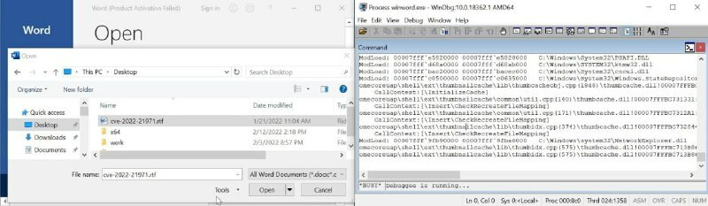</td>
</table></tr>
<table><tr>
<td>Quotes: <code>0</code></td>
<td>Replies: <code>0</code></td>
<td>Retweets: <code>0</code></td>
<td>Favorites: <code>0</code></td>
</tr></table>

---

# kmkz_security
**https://twitter.com/kmkz_security/status/1498032980786356224 _at 2022-02-27 20:31:09_**
<blockquote>
A good real exemple of JOP usage exploiting CVE-2013-4988 ln Windows 7 system 👌
"IcoFX 2.6 - '.ico' Buffer Overflow SEH + DEP Bypass using JOP"
xttps://www.exploit-db.com/exploits/49959
</blockquote>

<table><tr>
<td>Quotes: <code>1</code></td>
<td>Replies: <code>0</code></td>
<td>Retweets: <code>13</code></td>
<td>Favorites: <code>43</code></td>
</tr></table>

---

# ptracesecurity
**https://twitter.com/ptracesecurity/status/1497976208692334595 _at 2022-02-27 16:45:33_**
<blockquote>
PoC for CVE-2022-21971 "Windows Runtime Remote Code Execution Vulnerability" https://t.co/QtJ7xXtoKH #Pentesting #CVE #RCE #Windows #Vulnerability #Infosec https://t.co/uQhbym6v8j
</blockquote>

* https://github.com/0vercl0k/CVE-2022-21971

<table><tr>
<td>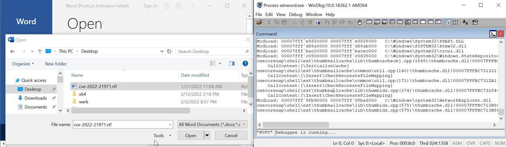</td>
</table></tr>
<table><tr>
<td>Quotes: <code>1</code></td>
<td>Replies: <code>0</code></td>
<td>Retweets: <code>36</code></td>
<td>Favorites: <code>92</code></td>
</tr></table>

---

# cyber_advising
**https://twitter.com/cyber_advising/status/1497367949883154434 _at 2022-02-26 00:28:33_**
<blockquote>
CVE-2022-24086: Adobe Commerce versions 2.4.3-p1 (and earlier) and 2.3.7-p2 (and earlier) are affected by an improper input validation vulnerability... this issue does not require user interaction and could result in arbitrary code execution.

PoC
https://t.co/RIq2Jliogw https://t.co/Sf99i8KdCj
</blockquote>

* https://github.com/Mr-xn/CVE-2022-24086

<table><tr>
<td>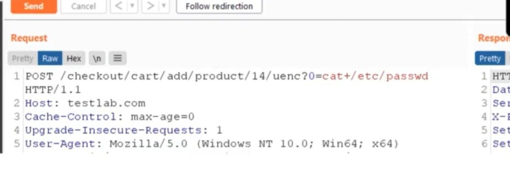</td>
</table></tr>
<table><tr>
<td>Quotes: <code>2</code></td>
<td>Replies: <code>4</code></td>
<td>Retweets: <code>44</code></td>
<td>Favorites: <code>130</code></td>
</tr></table>

---

# CyberWarship
**https://twitter.com/CyberWarship/status/1496100722575921155 _at 2022-02-22 12:33:03_**
<blockquote>
Unpacking CVE-2021-40444: A Deep Technical Analysis of an Office RCE Exploit 

#pentest #redteam #infosec

https://t.co/xx3a70mHaH https://t.co/YhV1qf26Jw
</blockquote>

* https://billdemirkapi.me/unpacking-cve-2021-40444-microsoft-office-rce/

<table><tr>
<td>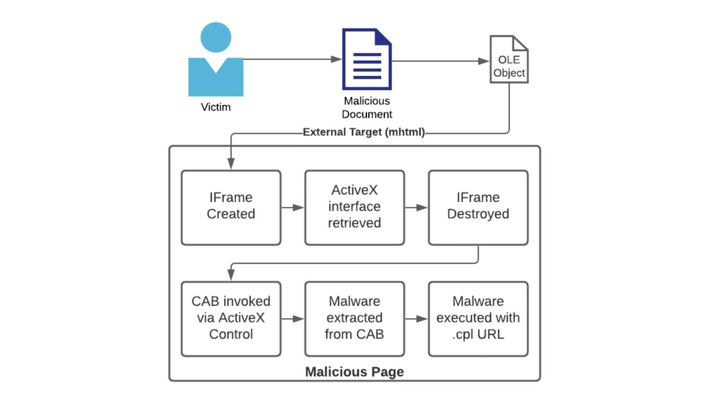</td>
<td>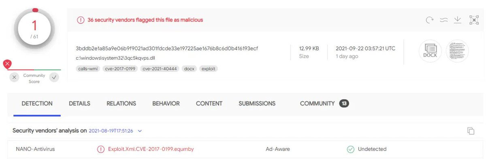</td>
<td>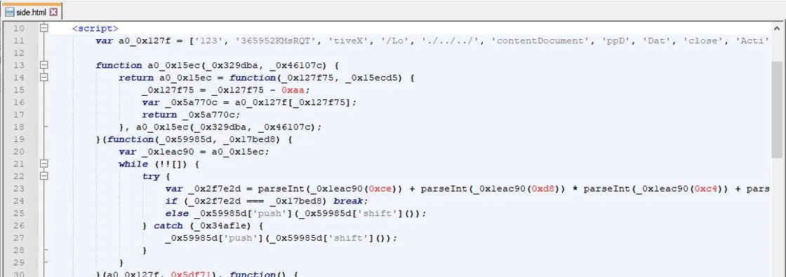</td>
</table></tr>
<table><tr>
<td>Quotes: <code>1</code></td>
<td>Replies: <code>0</code></td>
<td>Retweets: <code>71</code></td>
<td>Favorites: <code>150</code></td>
</tr></table>

---

# linkersec
**https://twitter.com/linkersec/status/1495918381932949516 _at 2022-02-22 00:28:29_**
<blockquote>
Linux kernel Use-After-Free (CVE-2021-23134) PoC

An article by @Awarau1 about exploiting a use-after-free in NFC sockets to leak /etc/shadow.

Amusingly, uses TeX formatting on web to explain the exploit.

https://t.co/ytJ3mogyre
</blockquote>

* https://ruia-ruia.github.io/NFC-UAF/

<table><tr>
<td>Quotes: <code>2</code></td>
<td>Replies: <code>1</code></td>
<td>Retweets: <code>64</code></td>
<td>Favorites: <code>183</code></td>
</tr></table>

---

# bad_packets
**https://twitter.com/bad_packets/status/1495837949631647744 _at 2022-02-21 19:08:53_**
<blockquote>
Recently published D-Link RCE vulnerability (https://t.co/AsUY3nGH4j) is now under active exploitation by threat actors.

Example payload:
http://195.133.18.119/beastmode/ddns.sh
/*.mips
https://t.co/tH7PTkxRof
(Mirai-like DDoS malware)

No CVE assigned.
#threatintel https://t.co/85hru32uki
</blockquote>

* https://github.com/doudoudedi/D-LINK_Command_Injection1/blob/main/D-LINK_Command_injection.md
* https://www.virustotal.com/gui/file/50594268957505130ed7c0dd6f87c563eaa0dd983e3aa74d0c911efcf208ac96/details

<table><tr>
<td>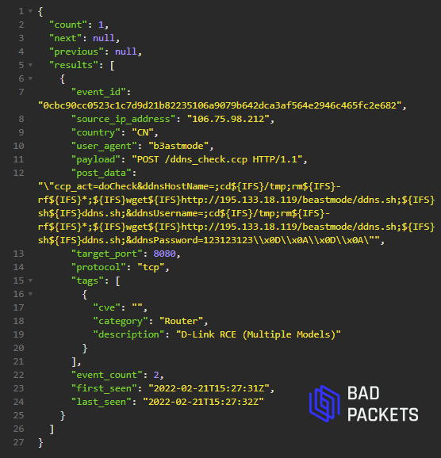</td>
</table></tr>
<table><tr>
<td>Quotes: <code>3</code></td>
<td>Replies: <code>2</code></td>
<td>Retweets: <code>57</code></td>
<td>Favorites: <code>102</code></td>
</tr></table>

---

# _r_netsec
**https://twitter.com/_r_netsec/status/1495646494845636609 _at 2022-02-21 06:28:06_**
<blockquote>
Linux kernel NFC Use-After-Free (CVE-2021-23134) PoC https://t.co/5EglcKxMed
</blockquote>

* https://ruia-ruia.github.io/NFC-UAF/

<table><tr>
<td>Quotes: <code>2</code></td>
<td>Replies: <code>0</code></td>
<td>Retweets: <code>42</code></td>
<td>Favorites: <code>124</code></td>
</tr></table>

---

# ptswarm
**https://twitter.com/ptswarm/status/1494240197915123713 _at 2022-02-17 09:19:59_**
<blockquote>
🔥 We have reproduced the fresh CVE-2022-24086 Improper Input Validation vulnerability in Magento Open Source and Adobe Commerce.

Successful exploitation could lead to RCE from an unauthenticated user. https://t.co/QFXd7M9VVO
</blockquote>

<table><tr>
<td>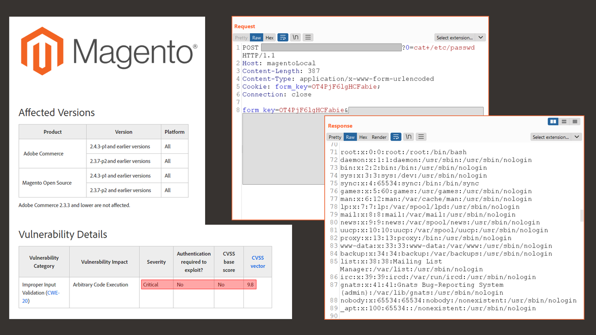</td>
</table></tr>
<table><tr>
<td>Quotes: <code>15</code></td>
<td>Replies: <code>9</code></td>
<td>Retweets: <code>126</code></td>
<td>Favorites: <code>358</code></td>
</tr></table>

---

# ShaneHuntley
**https://twitter.com/ShaneHuntley/status/1494075433326768129 _at 2022-02-16 22:25:16_**
<blockquote>
More 0Day in the wild found by TAG and quickly patched by Chrome.

CVE-2022-0609: Use after free in Animation. Reported by Adam Weidemann and Clément Lecigne of Google's Threat Analysis Group on 2022-02-10

https://t.co/WyFmzhTDQM
</blockquote>

* https://chromereleases.googleblog.com/2022/02/stable-channel-update-for-desktop_14.html

<table><tr>
<td>Quotes: <code>1</code></td>
<td>Replies: <code>1</code></td>
<td>Retweets: <code>16</code></td>
<td>Favorites: <code>43</code></td>
</tr></table>

---

# BleepinComputer
**https://twitter.com/BleepinComputer/status/1493370454467297280 _at 2022-02-14 23:43:56_**
<blockquote>
This is the first zero-day fixed in Google Chrome since the start of 2022.

Tracked as CVE-2022-0609, it is a "Use after free in Animation" bug with High severity and has been seen exploited in the wild.

In 2021, a total of 16 zero-day vulnerabilities was fixed in Google Chrome.
</blockquote>

<table><tr>
<td>Quotes: <code>3</code></td>
<td>Replies: <code>2</code></td>
<td>Retweets: <code>20</code></td>
<td>Favorites: <code>41</code></td>
</tr></table>

---

# r0ns3n
**https://twitter.com/r0ns3n/status/1493263407201624068 _at 2022-02-14 16:38:34_**
<blockquote>
Another #CVE-2021-42714 of mine just got published. #Splashtop Remote Business Client for #Microsoft #Windows contains a Local Privilege Escalation #vulnerability.

#Mandiant #MandiantVulnerabilityDisclosures #MYOW #LPE #EoP #LocalPrivilegeEscalation

https://t.co/TGk9qUPki4
</blockquote>

* https://github.com/mandiant/Vulnerability-Disclosures/blob/master/2022/MNDT-2022-0005/MNDT-2022-0005.md

<table><tr>
<td>Quotes: <code>0</code></td>
<td>Replies: <code>0</code></td>
<td>Retweets: <code>2</code></td>
<td>Favorites: <code>1</code></td>
</tr></table>

---

# othmanebenzina
**https://twitter.com/othmanebenzina/status/1492980368529670146 _at 2022-02-13 21:53:52_**
<blockquote>
- CVE-2022-21882 (Win32k LPE)
- A local, authenticated attacker could gain elevated local system or administrator privileges through a vulnerability in the Win32k.sys driver.
- Windows 10/11 and Windows Server
- PoC: https://t.co/injBGQA8a7
- Patch : https://t.co/n8brY0BKby https://t.co/xDidCf3XOk
</blockquote>

* https://github.com/KaLendsi/CVE-2022-21882
* https://msrc.microsoft.com/update-guide/vulnerability/CVE-2022-21882

<table><tr>
<td>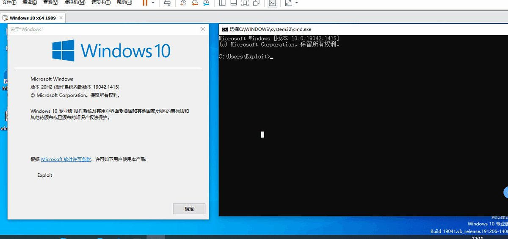</td>
</table></tr>
<table><tr>
<td>Quotes: <code>0</code></td>
<td>Replies: <code>0</code></td>
<td>Retweets: <code>2</code></td>
<td>Favorites: <code>1</code></td>
</tr></table>

---

# Vulnmachines
**https://twitter.com/Vulnmachines/status/1492724312695996419 _at 2022-02-13 04:56:24_**
<blockquote>
CVE-2021-40444 PoC

Malicious docx generator to exploit CVE-2021-40444 (Microsoft Office Word Remote Code Execution)

https://t.co/Li9XkvcBOR

#infosec #cybersecurity
</blockquote>

* https://github.com/lockedbyte/CVE-2021-40444

<table><tr>
<td>Quotes: <code>2</code></td>
<td>Replies: <code>0</code></td>
<td>Retweets: <code>3</code></td>
<td>Favorites: <code>5</code></td>
</tr></table>

---

# BushidoToken
**https://twitter.com/BushidoToken/status/1492109158883250180 _at 2022-02-11 12:12:00_**
<blockquote>
⚠ CVE-2022-22620 #0day in iOS, iPadOS, and macOS Monterey

"Processing maliciously crafted web content may lead to arbitrary code execution." 

"Apple is aware of a report that this issue may have been actively exploited." 👀

https://t.co/rxAMysSZsq
https://t.co/y61BVKsFB0 https://t.co/F1C4mhCSAH
</blockquote>

* https://support.apple.com/en-us/HT213093
* https://support.apple.com/en-us/HT213092

<table><tr>
<td>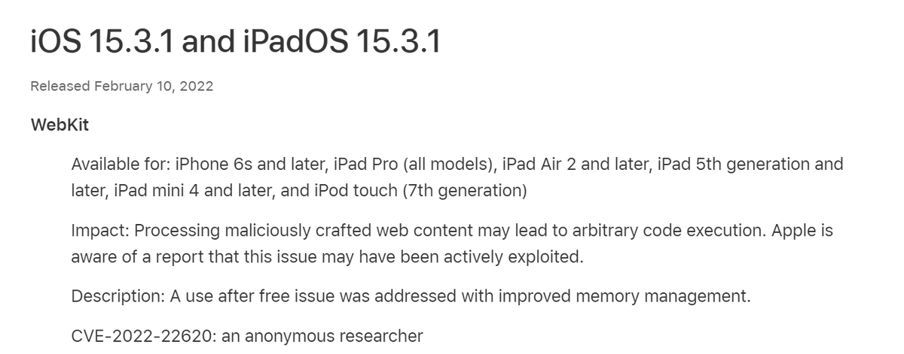</td>
<td>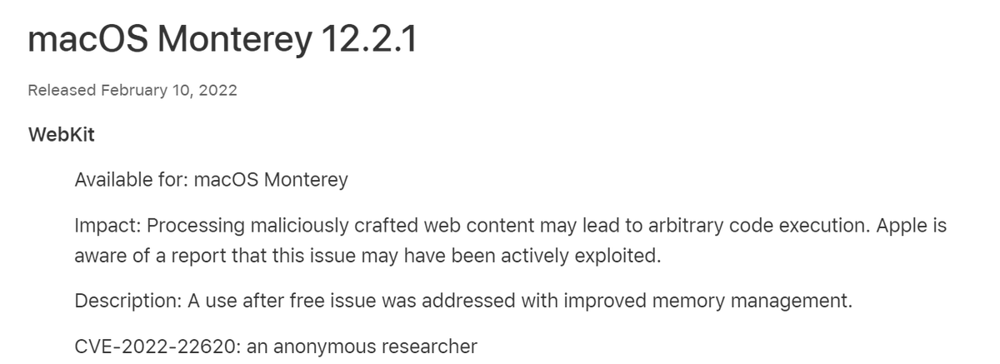</td>
</table></tr>
<table><tr>
<td>Quotes: <code>3</code></td>
<td>Replies: <code>1</code></td>
<td>Retweets: <code>35</code></td>
<td>Favorites: <code>38</code></td>
</tr></table>

---

# cyber_advising
**https://twitter.com/cyber_advising/status/1491764846903410701 _at 2022-02-10 13:23:49_**
<blockquote>
SpoolFool: Windows Print Spooler Privilege Escalation (CVE-2022-21999)

PoC
https://t.co/xz33zqm1hz https://t.co/go89Krsh24
</blockquote>

* https://research.ifcr.dk/spoolfool-windows-print-spooler-privilege-escalation-cve-2022-22718-bf7752b68d81

<table><tr>
<td>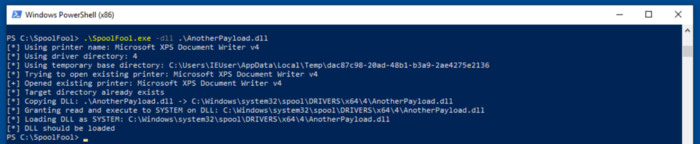</td>
</table></tr>
<table><tr>
<td>Quotes: <code>1</code></td>
<td>Replies: <code>0</code></td>
<td>Retweets: <code>45</code></td>
<td>Favorites: <code>85</code></td>
</tr></table>

---

# LinInfoSec
**https://twitter.com/LinInfoSec/status/1491487169994706944 _at 2022-02-09 19:00:26_**
<blockquote>
Php - CVE-2021-44912: https://t.co/aIlVc4c1Hx
</blockquote>

* https://github.com/xpressengine/xe-core/issues/2433

<table><tr>
<td>Quotes: <code>0</code></td>
<td>Replies: <code>0</code></td>
<td>Retweets: <code>0</code></td>
<td>Favorites: <code>0</code></td>
</tr></table>

---

# cKure7
**https://twitter.com/cKure7/status/1491319512247025667 _at 2022-02-09 07:54:13_**
<blockquote>
■■■■□ CVE-2022-22718 local privilege escalation exploit for Windows Printer Spooler  

https://t.co/y6iBXpDyMH
</blockquote>

* https://github.com/ly4k/SpoolFool

<table><tr>
<td>Quotes: <code>0</code></td>
<td>Replies: <code>0</code></td>
<td>Retweets: <code>1</code></td>
<td>Favorites: <code>0</code></td>
</tr></table>

---

# ptracesecurity
**https://twitter.com/ptracesecurity/status/1491268854777012224 _at 2022-02-09 04:32:56_**
<blockquote>
Exploit for CVE-2022–22718 - Windows Print Spooler Elevation of Privilege Vulnerability (LPE)  https://t.co/pGpfvcP9oD  #Pentesting #Windows #Vulnerability #EXploit #CVE #Infosec https://t.co/D5CrpjCJeM
</blockquote>

* https://github.com/ly4k/SpoolFool

<table><tr>
<td>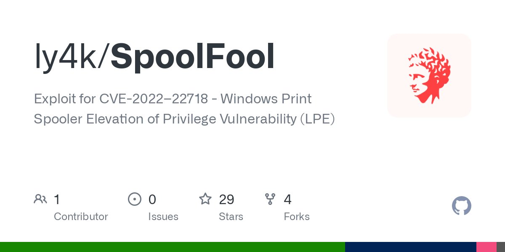</td>
<td>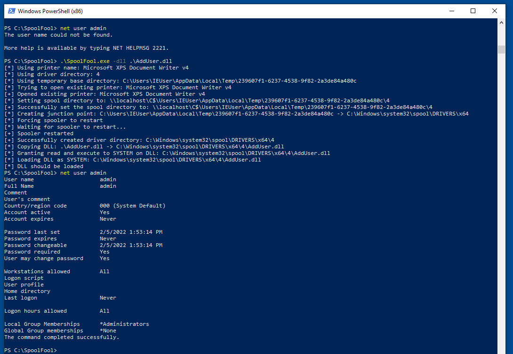</td>
</table></tr>
<table><tr>
<td>Quotes: <code>0</code></td>
<td>Replies: <code>0</code></td>
<td>Retweets: <code>31</code></td>
<td>Favorites: <code>54</code></td>
</tr></table>

---

# Big5_sec
**https://twitter.com/Big5_sec/status/1491191790602694656 _at 2022-02-08 23:26:42_**
<blockquote>
A bit late, but here is an analysis for fun of CVE-2022-21877 (storage spaces controller memory leak) found by @linhlhq of @starlabs_sg : https://t.co/qOJzQV0uAM
</blockquote>

* https://big5-sec.github.io/posts/an-analysis-of-cve-2022-21877/

<table><tr>
<td>Quotes: <code>3</code></td>
<td>Replies: <code>1</code></td>
<td>Retweets: <code>33</code></td>
<td>Favorites: <code>90</code></td>
</tr></table>

---

# l33d0hyun
**https://twitter.com/l33d0hyun/status/1491126152005820417 _at 2022-02-08 19:05:53_**
<blockquote>
CVE-2022-22004: Microsoft Office ClickToRun Remote Code Execution Vulnerability

Thanks! https://t.co/mMq8pCC2Zp
</blockquote>

<table><tr>
<td>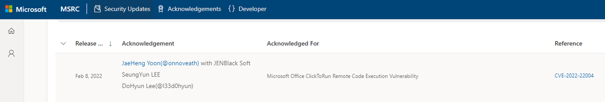</td>
</table></tr>
<table><tr>
<td>Quotes: <code>2</code></td>
<td>Replies: <code>4</code></td>
<td>Retweets: <code>41</code></td>
<td>Favorites: <code>210</code></td>
</tr></table>

---

# hack_git
**https://twitter.com/hack_git/status/1489578564379090944 _at 2022-02-04 12:36:19_**
<blockquote>
CVE-2022-21882

Win32k Elevation of Privilege Vulnerability

For Windows 10 21H2 Only

https://t.co/H2nR69W4m5

#cybersecurity #infosec #cve #pentesting #windows #redteam #hackers #0day #exploit

-

https://t.co/p1EamzhhMe https://t.co/kM95sKtF6p
</blockquote>

* https://github.com/L4ys/CVE-2022-21882
* https://t.me/hackgit/3127

<table><tr>
<td>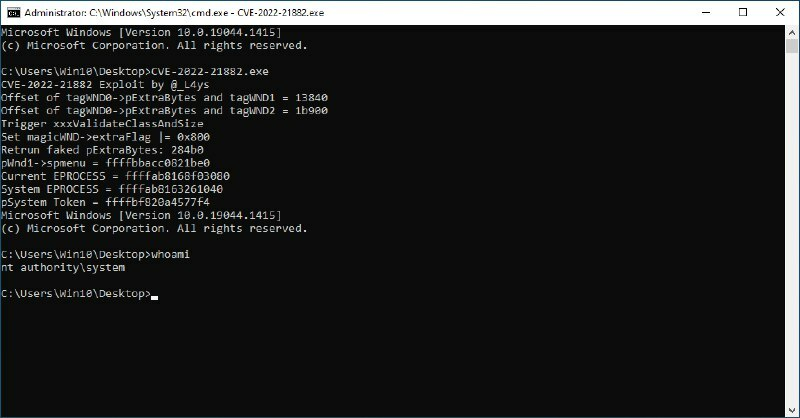</td>
</table></tr>
<table><tr>
<td>Quotes: <code>0</code></td>
<td>Replies: <code>0</code></td>
<td>Retweets: <code>8</code></td>
<td>Favorites: <code>3</code></td>
</tr></table>

---

# Ox_Web_Moroccan
**https://twitter.com/Ox_Web_Moroccan/status/1489416869673119744 _at 2022-02-04 01:53:48_**
<blockquote>
https://t.co/0RzCm8jhMu

PoC for PwnKit: Local Privilege Escalation Vulnerability in polkit’s pkexec (CVE-2021-4034)
</blockquote>

* https://github.com/OxWeb4/CVE-2021-4034-

<table><tr>
<td>Quotes: <code>0</code></td>
<td>Replies: <code>0</code></td>
<td>Retweets: <code>1</code></td>
<td>Favorites: <code>1</code></td>
</tr></table>

---

# Sidhartg3
**https://twitter.com/Sidhartg3/status/1489120468648923137 _at 2022-02-03 06:16:00_**
<blockquote>
CVE-2021-45897: SuiteCRM before 7.12.3 and 8.x before 8.0.2 allows remote code execution.

PoC
https://t.co/g4OPSfHIO8 https://t.co/pwkOjfQfdk
</blockquote>

* https://github.com/manuelz120/CVE-2021-45897

<table><tr>
<td>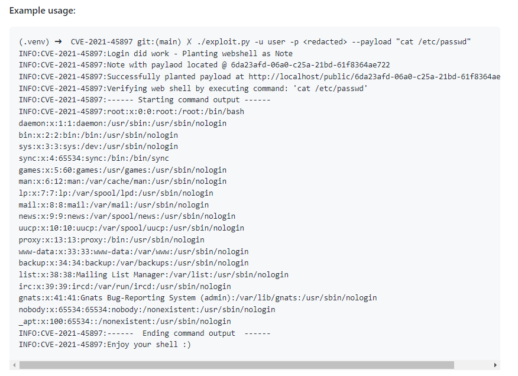</td>
</table></tr>
<table><tr>
<td>Quotes: <code>0</code></td>
<td>Replies: <code>0</code></td>
<td>Retweets: <code>1</code></td>
<td>Favorites: <code>0</code></td>
</tr></table>

---

# ptracesecurity
**https://twitter.com/ptracesecurity/status/1489025994199547909 _at 2022-02-03 00:00:36_**
<blockquote>
Moodle: Blind SQL Injection (CVE-2021-36393) and Broken Access Control (CVE-2021-36397)  https://t.co/AFHvT3aBR1  #Pentesting #SQLInjection #CVE #CyberSecurity #Infosec https://t.co/68mewHm4r1
</blockquote>

* https://0xkasper.com/articles/moodle-sql-injection-broken-access-control.html

<table><tr>
<td>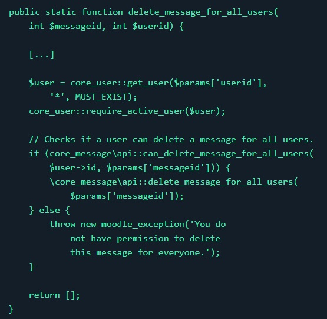</td>
</table></tr>
<table><tr>
<td>Quotes: <code>1</code></td>
<td>Replies: <code>0</code></td>
<td>Retweets: <code>36</code></td>
<td>Favorites: <code>64</code></td>
</tr></table>

---

# cyber_advising
**https://twitter.com/cyber_advising/status/1488860704211935233 _at 2022-02-02 13:03:48_**
<blockquote>
CVE-2021-45897: SuiteCRM before 7.12.3 and 8.x before 8.0.2 allows remote code execution.

PoC
https://t.co/wzz3otyqGX https://t.co/Ytp9BTjdSW
</blockquote>

* https://github.com/manuelz120/CVE-2021-45897

<table><tr>
<td></td>
</table></tr>
<table><tr>
<td>Quotes: <code>1</code></td>
<td>Replies: <code>0</code></td>
<td>Retweets: <code>28</code></td>
<td>Favorites: <code>56</code></td>
</tr></table>

---

# huntrHacktivity
**https://twitter.com/huntrHacktivity/status/1488648774083911681 _at 2022-02-01 23:01:40_**
<blockquote>
Unrestricted Upload of File with Dangerous Type in https://t.co/OTlIn6ceit (CVE-2022-0472) reported by @https://twitter.com/vudq16 - Patch: https://t.co/H2fl0HbYIs
https://t.co/oUruHmGIL4 #bugbounty #infosec #opensource
</blockquote>

* https://github.com/jsdecena/laracom
* https://github.com/jsdecena/laracom/commit/256026193ce994dc4c1365e02f414d8a0cd77ae8
* https://huntr.dev/bounties/cb5b8563-15cf-408c-9f79-4871ea0a8713/

<table><tr>
<td>Quotes: <code>0</code></td>
<td>Replies: <code>0</code></td>
<td>Retweets: <code>2</code></td>
<td>Favorites: <code>0</code></td>
</tr></table>

---

# thezdi
**https://twitter.com/thezdi/status/1488640366307950604 _at 2022-02-01 22:28:15_**
<blockquote>
CVE-2021-44142: Details on a #Samba remote code execution bug demonstrated at #Pwn2Own Austin. An OOB heap read/write vuln was present in versions prior to 4.13.17. Read all the details &amp; patch analysis at https://t.co/WparuqjSix
</blockquote>

* https://www.zerodayinitiative.com/blog/2022/2/1/cve-2021-44142-details-on-a-samba-code-execution-bug-demonstrated-at-pwn2own-austin

<table><tr>
<td>Quotes: <code>5</code></td>
<td>Replies: <code>0</code></td>
<td>Retweets: <code>129</code></td>
<td>Favorites: <code>267</code></td>
</tr></table>

---

# 0xkasper
**https://twitter.com/0xkasper/status/1488604015801815051 _at 2022-02-01 20:03:48_**
<blockquote>
My write-up of CVE-2021-36393 and CVE-2021-36397, SQL Injection and Broken Access Control in Moodle.

https://t.co/rdKDb8rVcF
</blockquote>

* https://0xkasper.com/articles/moodle-sql-injection-broken-access-control.html

<table><tr>
<td>Quotes: <code>1</code></td>
<td>Replies: <code>3</code></td>
<td>Retweets: <code>49</code></td>
<td>Favorites: <code>149</code></td>
</tr></table>

---

