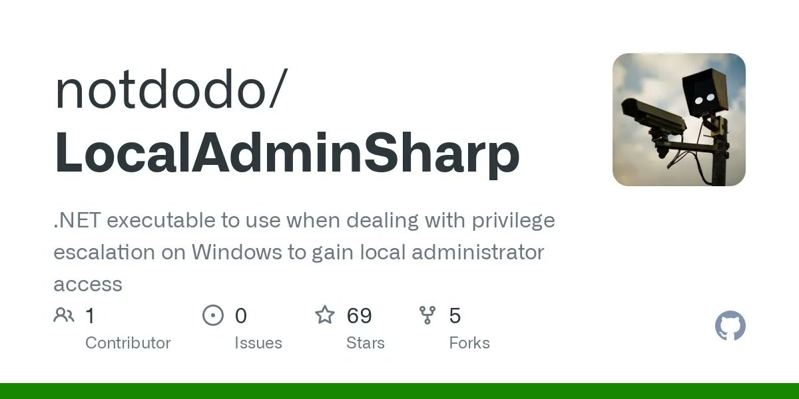

# MrTaherAmine
**https://twitter.com/MrTaherAmine/status/1509454138333184000 _at 2022-03-31 08:54:45_**
<blockquote>
Spring4Shell: CVE-2022-22963 - A new zero-day vulnerability in the Spring Core Java framework called 'Spring4Shell' has been publicly disclosed, allowing unauthenticated remote code execution on applications.

PoC: https://t.co/QOzSnQeEE2

Read more: https://t.co/Tfi98GByi2 https://t.co/SIkyhS48s4
</blockquote>

* https://github.com/dinosn/CVE-2022-22963
* https://www.cyberkendra.com/2022/03/springshell-rce-0-day-vulnerability.html

<table><tr>
<td></td>
</table></tr>
<table><tr>
<td>Quotes: <code>1</code></td>
<td>Replies: <code>1</code></td>
<td>Retweets: <code>3</code></td>
<td>Favorites: <code>6</code></td>
</tr></table>

---

# tbbhunter
**https://twitter.com/tbbhunter/status/1509448887945383938 _at 2022-03-31 08:33:53_**
<blockquote>
Spring RCE vulnerability reproduction environment https://t.co/8IherDKp8G
</blockquote>

* https://github.com/fengguangbin/spring-rce-war

<table><tr>
<td>Quotes: <code>0</code></td>
<td>Replies: <code>0</code></td>
<td>Retweets: <code>11</code></td>
<td>Favorites: <code>41</code></td>
</tr></table>

---

# TodayCyberNews
**https://twitter.com/TodayCyberNews/status/1509441657829093378 _at 2022-03-31 08:05:09_**
<blockquote>
#Spring4shell RCE
Some Resources related with Exploitation

•New Zero Day Vulnerability Out 
•java springcore RCE
•Spring cloud function SpEL RCE

https://t.co/hYUlawoyyE

https://t.co/rrUQSsFY6J

#bugbounty #zeroday #cybersecurity #Java #bugbountytips
</blockquote>

* https://github.com/chaosec2021/Spring-cloud-function-SpEL-RCE
* https://threatpost.com/critical-rce-bug-spring-log4shell/179173/

<table><tr>
<td>Quotes: <code>1</code></td>
<td>Replies: <code>1</code></td>
<td>Retweets: <code>33</code></td>
<td>Favorites: <code>63</code></td>
</tr></table>

---

# th3_protoCOL
**https://twitter.com/th3_protoCOL/status/1509345839134609408 _at 2022-03-31 01:44:24_**
<blockquote>
I was able to confirm that the #Spring4Shell exploit works against the "Handling Form Submission" tutorial from here: https://t.co/HCHBFy6JC0 😮

Methodology followed (thanks esell &amp; @BobTShoplifter)
https://t.co/MXNzEiH2JF https://t.co/cHisyIerGi
</blockquote>

* https://spring.io/guides/gs/handling-form-submission/
* https://gist.github.com/esell/c9731a7e2c5404af7716a6810dc33e1a

<table><tr>
<td></td>
</table></tr>
<table><tr>
<td>Quotes: <code>9</code></td>
<td>Replies: <code>4</code></td>
<td>Retweets: <code>118</code></td>
<td>Favorites: <code>337</code></td>
</tr></table>

---

# Alra3ees
**https://twitter.com/Alra3ees/status/1509334044823146502 _at 2022-03-31 00:57:33_**
<blockquote>
spring-cloud-function SpEL RCE, Vultarget &amp; Poc

https://t.co/SvRURVsQss
</blockquote>

* https://github.com/cckuailong/spring-cloud-function-SpEL-RCE

<table><tr>
<td>Quotes: <code>1</code></td>
<td>Replies: <code>0</code></td>
<td>Retweets: <code>19</code></td>
<td>Favorites: <code>54</code></td>
</tr></table>

---

# __Retrospect
**https://twitter.com/__Retrospect/status/1509271279311929344 _at 2022-03-30 20:48:08_**
<blockquote>
Java keeps me up at night… pushed a quick&amp;dirty repo to help you replicate the spring core rce that got published: https://t.co/jZxKiIzoc1 #spring4shell #springshell
</blockquote>

* https://github.com/Retrospected/spring-rce-poc

<table><tr>
<td>Quotes: <code>2</code></td>
<td>Replies: <code>4</code></td>
<td>Retweets: <code>34</code></td>
<td>Favorites: <code>112</code></td>
</tr></table>

---

# hrbrmstr
**https://twitter.com/hrbrmstr/status/1509263113966821377 _at 2022-03-30 20:15:41_**
<blockquote>
This is so daft.

The new no-CVE PoC for an unpatched RCE vulnerability in the Spring framework is really just a bypass for a not-exactly-fixed patch for CVE-2010-1622 … a *12 year old* weakness.

I really need to exit this industry at some point. No org seems to care.
</blockquote>

<table><tr>
<td>Quotes: <code>0</code></td>
<td>Replies: <code>4</code></td>
<td>Retweets: <code>1</code></td>
<td>Favorites: <code>33</code></td>
</tr></table>

---

# mertcangokgoz
**https://twitter.com/mertcangokgoz/status/1509235374165569537 _at 2022-03-30 18:25:28_**
<blockquote>
Header'a sadece "%&gt;" ekleyerek içeri girebildiğiniz, bir Java Springcore RCE 0day açığı sızdırıldı.

PoC kodları için
https://t.co/iOrdhVd2ro
</blockquote>

* https://github.com/craig/SpringCore0day

<table><tr>
<td>Quotes: <code>2</code></td>
<td>Replies: <code>0</code></td>
<td>Retweets: <code>7</code></td>
<td>Favorites: <code>117</code></td>
</tr></table>

---

# wdormann
**https://twitter.com/wdormann/status/1509225394561507333 _at 2022-03-30 17:45:48_**
<blockquote>
OK, where are we with Spring stuff?
1) CVE-2022-22963 is a thing, and it affects Spring Cloud Connector.  It's RCE, so the CVSS score of 5.4 seems way off.
2) Spring4Shell / SpringShell, invented by Cyber Kendra, isn't a Spring vulnerability at all.
Does that sound about right? https://t.co/OwPgA2BSIS
</blockquote>

<table><tr>
<td></td>
<td></td>
<td></td>
</table></tr>
<table><tr>
<td>Quotes: <code>12</code></td>
<td>Replies: <code>11</code></td>
<td>Retweets: <code>114</code></td>
<td>Favorites: <code>377</code></td>
</tr></table>

---

# Mohamed87Khayat
**https://twitter.com/Mohamed87Khayat/status/1509211171219558410 _at 2022-03-30 16:49:17_**
<blockquote>
RCE CVE-2022-22963 
Zero-Day

 Spring Cloud Function SPEL RCE

For scan use unclei temp 👇👇
https://t.co/oJz8rKMLmJ

POC 👇👇
https://t.co/Obqxt5N6tR

إصحوا الشغل بدأ 🏃🏃🏃
</blockquote>

* https://github.com/projectdiscovery/nuclei-templates/blob/master/cves/2022/CVE-2022-22963.yaml
* https://github.com/craig/SpringCore0day

<table><tr>
<td>Quotes: <code>0</code></td>
<td>Replies: <code>0</code></td>
<td>Retweets: <code>5</code></td>
<td>Favorites: <code>21</code></td>
</tr></table>

---

# Dinosn
**https://twitter.com/Dinosn/status/1509201762665873410 _at 2022-03-30 16:11:54_**
<blockquote>
The PoC for the spring boot core RCE as it was published before, https://t.co/dhnKhDR8WN unknown author.
</blockquote>

* https://github.com/dinosn/spring-core-rce

<table><tr>
<td>Quotes: <code>1</code></td>
<td>Replies: <code>2</code></td>
<td>Retweets: <code>63</code></td>
<td>Favorites: <code>183</code></td>
</tr></table>

---

# JFrogSecurity
**https://twitter.com/JFrogSecurity/status/1509175542205095940 _at 2022-03-30 14:27:43_**
<blockquote>
[1/5] 🚨 Some clarifications about CVE-2022-22963, a high-severity RCE in Spring Cloud Function. The vulnerability is remotely exploitable (with a published exploit) under the default configuration, when running a Spring Boot application that depends on Spring Cloud Function. 🧵
</blockquote>

<table><tr>
<td>Quotes: <code>10</code></td>
<td>Replies: <code>1</code></td>
<td>Retweets: <code>26</code></td>
<td>Favorites: <code>39</code></td>
</tr></table>

---

# terorie_dev
**https://twitter.com/terorie_dev/status/1509146657631387651 _at 2022-03-30 12:32:56_**
<blockquote>
CVE-2021-30551 in a nutshell (V8 type confusion allowing RCE). CVE-2022-1096 has same exploit strategy. PoC incoming.
pic credit Google Project Zero https://t.co/P9KdBEu7GN
</blockquote>

<table><tr>
<td></td>
</table></tr>
<table><tr>
<td>Quotes: <code>2</code></td>
<td>Replies: <code>4</code></td>
<td>Retweets: <code>26</code></td>
<td>Favorites: <code>89</code></td>
</tr></table>

---

# Yassineaboukir
**https://twitter.com/Yassineaboukir/status/1509038814739767299 _at 2022-03-30 05:24:24_**
<blockquote>
It couldn’t get any worse as some of the widely used firewall appliances are undergoing active exploitation nowadays 🤯

• Watchguard (CVE-2022-26318): Pre-Auth RCE.
• Sophos (CVE-2022-1040): Auth bypass to RCE.
• SonicWall (CVE-2022-22274): DoS/RCE.
</blockquote>

<table><tr>
<td>Quotes: <code>0</code></td>
<td>Replies: <code>0</code></td>
<td>Retweets: <code>12</code></td>
<td>Favorites: <code>67</code></td>
</tr></table>

---

# bytehx343
**https://twitter.com/bytehx343/status/1509034539330732033 _at 2022-03-30 05:07:25_**
<blockquote>
Spring Cloud Function Spel RCE aka CVE-2022-22963 POC.
payload
https://t.co/4Yb3FFRFoC.function.routing-expression: T(java.lang.Runtime).getRuntime().exec("xcalc") https://t.co/1loEZJrIX3
</blockquote>

* http://spring.cloud

<table><tr>
<td></td>
</table></tr>
<table><tr>
<td>Quotes: <code>21</code></td>
<td>Replies: <code>6</code></td>
<td>Retweets: <code>208</code></td>
<td>Favorites: <code>643</code></td>
</tr></table>

---

# Dinosn
**https://twitter.com/Dinosn/status/1509023890974064641 _at 2022-03-30 04:25:06_**
<blockquote>
RCE PoC of 0-day Vulnerability found in Spring Cloud (SPEL) https://t.co/FijaeMTGL7
</blockquote>

* https://github.com/chaosec2021/Spring-cloud-function-SpEL-RCE

<table><tr>
<td>Quotes: <code>0</code></td>
<td>Replies: <code>0</code></td>
<td>Retweets: <code>72</code></td>
<td>Favorites: <code>172</code></td>
</tr></table>

---

# ksg93rd
**https://twitter.com/ksg93rd/status/1509003642518573056 _at 2022-03-30 03:04:38_**
<blockquote>
#exploit
1. CVE-2022-0995:
Heap out-of-bounds write in the watch_queue Linux kernel component
https://t.co/GBMeKAzm9Z

2. Script for 2FA bypass that replay Citrix credentials
https://t.co/08l62cAzu2

3. ABC-Code Execution for Veeam (CVE-2022-26503 LPE)
https://t.co/8NEdZg0yGv
</blockquote>

* https://github.com/Bonfee/CVE-2022-0995
* https://github.com/post-cyberlabs/Offensive_tools/tree/main/Citrix
* https://www.mdsec.co.uk/2022/03/abc-code-execution-for-veeam

<table><tr>
<td>Quotes: <code>0</code></td>
<td>Replies: <code>0</code></td>
<td>Retweets: <code>1</code></td>
<td>Favorites: <code>0</code></td>
</tr></table>

---

# ksg93rd
**https://twitter.com/ksg93rd/status/1508828786707554310 _at 2022-03-29 15:29:50_**
<blockquote>
CVE-2022-27666 LPE exploit:
Exploit esp6 modules in Linux kernel
https://t.co/Nwkr90Qpqp
]-&gt; https://t.co/zEQChfTzx6
</blockquote>

* https://etenal.me/archives/1825
* https://github.com/plummm/CVE-2022-27666

<table><tr>
<td>Quotes: <code>0</code></td>
<td>Replies: <code>0</code></td>
<td>Retweets: <code>0</code></td>
<td>Favorites: <code>0</code></td>
</tr></table>

---

# SinSinology
**https://twitter.com/SinSinology/status/1508812050407034894 _at 2022-03-29 14:23:19_**
<blockquote>
🔥Our Technical Analysis for Veeam Agent local privilege escalation has been published: CVE-2022-26503
Thanks to @MDSecLabs https://t.co/eBcAjrcvdL
</blockquote>

<table><tr>
<td></td>
</table></tr>
<table><tr>
<td>Quotes: <code>1</code></td>
<td>Replies: <code>2</code></td>
<td>Retweets: <code>37</code></td>
<td>Favorites: <code>118</code></td>
</tr></table>

---

# IT_news_for_all
**https://twitter.com/IT_news_for_all/status/1508809101274460171 _at 2022-03-29 14:11:36_**
<blockquote>
CVE-2022-27666: Linux LPE ("this vulnerability affects the latest Ubuntu, Fedora, and Debian"

https://t.co/sfzACQOTd4

#git #exploit #pentest... https://t.co/wlHjPsnppK
</blockquote>

* https://github.com/plummm/CVE-2022-27666
* https://t.me/s/it_news_for_all/44127

<table><tr>
<td>Quotes: <code>0</code></td>
<td>Replies: <code>0</code></td>
<td>Retweets: <code>0</code></td>
<td>Favorites: <code>0</code></td>
</tr></table>

---

# TheHackersNews
**https://twitter.com/TheHackersNews/status/1508754081006833666 _at 2022-03-29 10:32:58_**
<blockquote>
A new critical authentication bypass #vulnerability (CVE-2022-1040) that allows remote code execution on Sophos #Firewall devices is being actively exploited in real-world attacks.

Read details: https://t.co/liH5EOvWpn

#infosec #cybersecurity #hackernews #hacking
</blockquote>

* https://thehackernews.com/2022/03/critical-sophos-firewall-rce.html

<table><tr>
<td>Quotes: <code>5</code></td>
<td>Replies: <code>1</code></td>
<td>Retweets: <code>99</code></td>
<td>Favorites: <code>146</code></td>
</tr></table>

---

# ov3rflow1
**https://twitter.com/ov3rflow1/status/1508610638603563020 _at 2022-03-29 01:02:59_**
<blockquote>
This is the #exploit for CVE-2022-27666, a vulnerability that achieves local privilege escalation (#LPE) on the latest #Ubuntu Desktop 21.10. https://t.co/6D35T0qaAG
</blockquote>

* https://github.com/plummm/CVE-2022-27666

<table><tr>
<td>Quotes: <code>0</code></td>
<td>Replies: <code>0</code></td>
<td>Retweets: <code>1</code></td>
<td>Favorites: <code>2</code></td>
</tr></table>

---

# cyber_advising
**https://twitter.com/cyber_advising/status/1508553656764973062 _at 2022-03-28 21:16:34_**
<blockquote>
CVE-2022-26318: RCE WatchGuard Firebox and XTM appliances, an unauthenticated user can execute arbitrary code, aka FBX-22786. This vulnerability impacts Fireware OS before 12.7.2_U2, 12.x before 12.1.3_U8, and 12.2.x through 12.5.x before 12.5.9_U2.
POC
https://t.co/fcOpGthd4w https://t.co/7nrCvZoS8V
</blockquote>

* https://github.com/Throns1956/watchguard_cve-2022-26318

<table><tr>
<td></td>
</table></tr>
<table><tr>
<td>Quotes: <code>0</code></td>
<td>Replies: <code>0</code></td>
<td>Retweets: <code>5</code></td>
<td>Favorites: <code>20</code></td>
</tr></table>

---

# _r_netsec
**https://twitter.com/_r_netsec/status/1508265900524580869 _at 2022-03-28 02:13:07_**
<blockquote>
Google Issues Urgent Chrome Update to Patch Actively Exploited Zero-Day Vulnerability. CVE-2022-1096 is the second zero-day vulnerability addressed by Google in Chrome since the start of the year. https://t.co/wAyVbj0k4o
</blockquote>

* https://cwe.mitre.org/data/definitions/843.html

<table><tr>
<td>Quotes: <code>1</code></td>
<td>Replies: <code>0</code></td>
<td>Retweets: <code>12</code></td>
<td>Favorites: <code>33</code></td>
</tr></table>

---

# piedpiper1616
**https://twitter.com/piedpiper1616/status/1508106160758730758 _at 2022-03-27 15:38:22_**
<blockquote>
GitHub - Throns1956/watchguard_cve-2022-26318: Watchguard RCE POC CVE-2022-26318 - https://t.co/b4MFbOTGaF
</blockquote>

* https://github.com/Throns1956/watchguard_cve-2022-26318

<table><tr>
<td>Quotes: <code>5</code></td>
<td>Replies: <code>1</code></td>
<td>Retweets: <code>76</code></td>
<td>Favorites: <code>165</code></td>
</tr></table>

---

# ptracesecurity
**https://twitter.com/ptracesecurity/status/1507613626412290048 _at 2022-03-26 07:01:13_**
<blockquote>
CVE-2019-0708 (BlueKeep) proof of concept allowing pre-auth RCE on Windows7 https://t.co/HbLdzcSHmw  #Pentesting #Windows #CVE #CyberSecurity #Infosec https://t.co/bwzjVFKtXM
</blockquote>

* https://github.com/RICSecLab/CVE-2019-0708

<table><tr>
<td></td>
<td></td>
<td></td>
<td></td>
</table></tr>
<table><tr>
<td>Quotes: <code>1</code></td>
<td>Replies: <code>0</code></td>
<td>Retweets: <code>32</code></td>
<td>Favorites: <code>85</code></td>
</tr></table>

---

# tekwizz123
**https://twitter.com/tekwizz123/status/1507416172358209546 _at 2022-03-25 17:56:36_**
<blockquote>
If anyone wants an interesting way to end their Friday, put up PR at https://t.co/0n5Jwt8JPc that exploits CVE-2022-26904, aka SuperProfile, an unpatched LPE vulnerability affecting Windows User Profile service. Bug has been reported to MS. Credit to @KLINIX5 for code n discovery
</blockquote>

* https://github.com/rapid7/metasploit-framework/pull/16382

<table><tr>
<td>Quotes: <code>1</code></td>
<td>Replies: <code>1</code></td>
<td>Retweets: <code>72</code></td>
<td>Favorites: <code>169</code></td>
</tr></table>

---

# bad_packets
**https://twitter.com/bad_packets/status/1507105314243428373 _at 2022-03-24 21:21:22_**
<blockquote>
⚠️ CVE-2018-13379 event detected ⚠️

Source IP:
179.60.147.11 (*)

Target:
Fortinet VPN servers vulnerable to unauthenticated arbitrary file read leading to disclosure of usernames and passwords in plaintext.
#threatintel
</blockquote>

<table><tr>
<td>Quotes: <code>2</code></td>
<td>Replies: <code>1</code></td>
<td>Retweets: <code>20</code></td>
<td>Favorites: <code>53</code></td>
</tr></table>

---

# hetmehtaa
**https://twitter.com/hetmehtaa/status/1506863374524567561 _at 2022-03-24 05:19:59_**
<blockquote>
From XSS to RCE (dompdf 0day)

https://t.co/Ww4aa4z27e

RCE exploit for dompdf:

https://t.co/DF9cL2Dg0T

#infosec #cybersecurity #100DaysOfCode #CyberAttack #bugbounty #IPL2022 #tech
</blockquote>

* https://positive.security/blog/dompdf-rce
* https://github.com/positive-security/dompdf-rce

<table><tr>
<td>Quotes: <code>1</code></td>
<td>Replies: <code>1</code></td>
<td>Retweets: <code>59</code></td>
<td>Favorites: <code>85</code></td>
</tr></table>

---

# ksg93rd
**https://twitter.com/ksg93rd/status/1506097246378602497 _at 2022-03-22 02:35:40_**
<blockquote>
#exploit
1. CVE-2022-24112:
Apache APISIX &lt; 2.12.1 RCE and Docker Lab
https://t.co/DJCfuwsyUr
https://t.co/LaM3H9KOC7
]-&gt; Check:
https://t.co/0irsog6Qj5

2. CVE-2022-0337:
System environment variables leak on Google Chrome, Microsoft Edge and Opera
https://t.co/55j8b774SG
</blockquote>

* https://github.com/twseptian/cve-2022-24112
* https://github.com/Mr-xn/CVE-2022-24112
* https://github.com/shakeman8/CVE-2022-24112
* https://github.com/Puliczek/CVE-2022-0337-PoC-Google-Chrome-Microsoft-Edge-Opera

<table><tr>
<td>Quotes: <code>0</code></td>
<td>Replies: <code>0</code></td>
<td>Retweets: <code>0</code></td>
<td>Favorites: <code>0</code></td>
</tr></table>

---

# ksg93rd
**https://twitter.com/ksg93rd/status/1505551292944592897 _at 2022-03-20 14:26:14_**
<blockquote>
#exploit
CVE-2022-27226:
CSRF to RCE in iRZ Mobile Routers through 2022-03-16
https://t.co/TPEcgjXmuW
]-&gt; PoC: https://t.co/buwq1aVkOm
</blockquote>

* https://johnjhacking.com/blog/cve-2022-27226
* https://github.com/SakuraSamuraii/ez-iRZ

<table><tr>
<td>Quotes: <code>0</code></td>
<td>Replies: <code>0</code></td>
<td>Retweets: <code>0</code></td>
<td>Favorites: <code>0</code></td>
</tr></table>

---

# Dinosn
**https://twitter.com/Dinosn/status/1505273954478530569 _at 2022-03-19 20:04:12_**
<blockquote>
It's always to be amongst @synack's channel. CVE-2021-44529 PoC (Ivanti Endpoint Manager RCE) was created amongst us today under 5 min, @duty_1g, @phyr3wall awesome work.  Cookie: ab=ab; c=aWQK; d=; e=; .  There is no other PoC available so far.
</blockquote>

<table><tr>
<td>Quotes: <code>2</code></td>
<td>Replies: <code>6</code></td>
<td>Retweets: <code>26</code></td>
<td>Favorites: <code>113</code></td>
</tr></table>

---

# Dinosn
**https://twitter.com/Dinosn/status/1504763145495134210 _at 2022-03-18 10:14:25_**
<blockquote>
RCE exploit for dompdf

https://t.co/OemzmtQFYw
</blockquote>

* https://github.com/positive-security/dompdf-rce

<table><tr>
<td>Quotes: <code>0</code></td>
<td>Replies: <code>1</code></td>
<td>Retweets: <code>36</code></td>
<td>Favorites: <code>114</code></td>
</tr></table>

---

# QutaibaM0
**https://twitter.com/QutaibaM0/status/1504755471575666689 _at 2022-03-18 09:43:56_**
<blockquote>
CVE-2022-22947 spring cloud gateway
https://t.co/2p4hntnzIE
PoC CVE-2022-24112 Apache APISIX RCE
https://t.co/Zkic2y3KKe
</blockquote>

* https://github.com/Wrin9/CVE-2022-22947
* https://github.com/M4xSec/Apache-APISIX-CVE-2022-24112

<table><tr>
<td>Quotes: <code>0</code></td>
<td>Replies: <code>0</code></td>
<td>Retweets: <code>0</code></td>
<td>Favorites: <code>0</code></td>
</tr></table>

---

# 780thC
**https://twitter.com/780thC/status/1504510872772915203 _at 2022-03-17 17:31:59_**
<blockquote>
Threat Analysis Group observed a financially motivated threat actor - EXOTIC LILY - exploiting a 0day in Microsoft MSHTML (CVE-2021-40444). IAB appears to be working with the Russian cyber crime gang known as UNC1878 / WIZARD SPIDER. https://t.co/kPrb5KM6xt @Google
</blockquote>

* https://blog.google/threat-analysis-group/exposing-initial-access-broker-ties-conti/

<table><tr>
<td>Quotes: <code>2</code></td>
<td>Replies: <code>2</code></td>
<td>Retweets: <code>20</code></td>
<td>Favorites: <code>33</code></td>
</tr></table>

---

# th3_protoCOL
**https://twitter.com/th3_protoCOL/status/1504507763300323363 _at 2022-03-17 17:19:37_**
<blockquote>
Ransomware access brokers these days:
 
▪️ Fake employee personas (social media, websites &amp; AI-generated pfp's)

▪️ Spear phishing w/ the pretext of a business proposal

▪️ Weaponized a twitter PoC in &lt; 1 month (cc @mrd0x)  

▪️ 0day exploits (CVE-2021-40444)

💥 #Conti &amp; #Diavol https://t.co/oo2fAOq9L1
</blockquote>

<table><tr>
<td></td>
<td></td>
</table></tr>
<table><tr>
<td>Quotes: <code>0</code></td>
<td>Replies: <code>1</code></td>
<td>Retweets: <code>14</code></td>
<td>Favorites: <code>49</code></td>
</tr></table>

---

# CyberWarship
**https://twitter.com/CyberWarship/status/1504404441428115470 _at 2022-03-17 10:29:03_**
<blockquote>
LocalAdminSharp: .NET executable to use when dealing with privilege escalation on Windows to gain local administrator access 

#pentest #redteam #infosec
https://t.co/vHtJAV9gL6 https://t.co/xTAA44ieLk
</blockquote>

* https://github.com/notdodo/LocalAdminSharp

<table><tr>
<td></td>
</table></tr>
<table><tr>
<td>Quotes: <code>0</code></td>
<td>Replies: <code>2</code></td>
<td>Retweets: <code>49</code></td>
<td>Favorites: <code>88</code></td>
</tr></table>

---

# Ksecureteamlab
**https://twitter.com/Ksecureteamlab/status/1504220984412446720 _at 2022-03-16 22:20:04_**
<blockquote>
Vulnerability (CVE-2022-26503) in Veeam Agent for Microsoft Windows allows local privilege escalation. An attacker who successfully exploited this vulnerability could run arbitrary code with LOCAL SYSTEM privileges.

https://t.co/ghHEKf5Fyv

#cybersecurity #infosec
</blockquote>

* https://github.com/sinsinology/CVE-2022-26503

<table><tr>
<td>Quotes: <code>0</code></td>
<td>Replies: <code>0</code></td>
<td>Retweets: <code>2</code></td>
<td>Favorites: <code>3</code></td>
</tr></table>

---

# RealTryHackMe
**https://twitter.com/RealTryHackMe/status/1503685718769651720 _at 2022-03-15 10:53:07_**
<blockquote>
A new FREE lab demonstrating the recent Dirty Pipe vulnerability (CVE-2022-0847) has been released on TryHackMe!

🔴 Understand the vulnerability
🔴 Practice exploiting it via a web-based lab

Dirty Pipe is a privilege escalation vulnerability in Linux 👉https://t.co/CNZyVanGtq https://t.co/GLhAdzZii7
</blockquote>

* https://tryhackme.com/room/dirtypipe

<table><tr>
<td></td>
</table></tr>
<table><tr>
<td>Quotes: <code>6</code></td>
<td>Replies: <code>5</code></td>
<td>Retweets: <code>66</code></td>
<td>Favorites: <code>308</code></td>
</tr></table>

---

# ptswarm
**https://twitter.com/ptswarm/status/1503360681978077185 _at 2022-03-14 13:21:32_**
<blockquote>
🔥 Veeam fixed an Unauth RCE (CVE-2022-26500, CVE-2022-26501) in Veeam Backup &amp; Replication and a Local Privilege Escalation (CVE-2022-26503) in Veeam Agent for Microsoft Windows found by our researcher @ultrayoba.

Advisory: https://t.co/tRYsKBn3HD https://t.co/0zMluR7Zki
</blockquote>

* https://www.veeam.com/kb4288

<table><tr>
<td></td>
</table></tr>
<table><tr>
<td>Quotes: <code>12</code></td>
<td>Replies: <code>8</code></td>
<td>Retweets: <code>191</code></td>
<td>Favorites: <code>473</code></td>
</tr></table>

---

# hack_git
**https://twitter.com/hack_git/status/1503288933014286337 _at 2022-03-14 08:36:26_**
<blockquote>
CVE-2022-0847
Linux Kernel Privilege Escalation Vulnerability

https://t.co/bZbFpNIik0

#redteam #hackers #exploit #inject #cve

-

https://t.co/vAamsAyrS0 https://t.co/k6b2VxMFtx
</blockquote>

* https://github.com/ahrixia/CVE_2022_0847
* https://t.me/hackgit/3531

<table><tr>
<td></td>
</table></tr>
<table><tr>
<td>Quotes: <code>0</code></td>
<td>Replies: <code>0</code></td>
<td>Retweets: <code>0</code></td>
<td>Favorites: <code>0</code></td>
</tr></table>

---

# Securityblog
**https://twitter.com/Securityblog/status/1503103998743793664 _at 2022-03-13 20:21:34_**
<blockquote>
GitHub - 0vercl0k/CVE-2022-21971: PoC for CVE-2022-21971 "Windows Runtime Remote Code Execution Vulnerability" https://t.co/DHSKYV6eY1
</blockquote>

* https://github.com/0vercl0k/CVE-2022-21971

<table><tr>
<td>Quotes: <code>3</code></td>
<td>Replies: <code>0</code></td>
<td>Retweets: <code>77</code></td>
<td>Favorites: <code>164</code></td>
</tr></table>

---

# campuscodi
**https://twitter.com/campuscodi/status/1502788500747440128 _at 2022-03-12 23:27:53_**
<blockquote>
Metasploit got a Dirty Pipe exploit

Let the fun begin, I guess

https://t.co/r4RkI4gIXv
</blockquote>

* https://github.com/rapid7/metasploit-framework/pull/16303

<table><tr>
<td>Quotes: <code>8</code></td>
<td>Replies: <code>4</code></td>
<td>Retweets: <code>81</code></td>
<td>Favorites: <code>238</code></td>
</tr></table>

---

# Viperian
**https://twitter.com/Viperian/status/1502748344514396167 _at 2022-03-12 20:48:19_**
<blockquote>
Vulnerability (CVE-2022-26503) in Veeam Agent for Microsoft Windows allows local privilege escalation. An attacker who successfully exploited this vulnerability could run arbitrary code with LOCAL SYSTEM privileges. #veeam https://t.co/Sla74zabkJ https://t.co/1yvp1Ag144
</blockquote>

* https://www.veeam.com/kb4289

<table><tr>
<td></td>
</table></tr>
<table><tr>
<td>Quotes: <code>6</code></td>
<td>Replies: <code>0</code></td>
<td>Retweets: <code>88</code></td>
<td>Favorites: <code>127</code></td>
</tr></table>

---

# r0ns3n
**https://twitter.com/r0ns3n/status/1502688570615676937 _at 2022-03-12 16:50:48_**
<blockquote>
Another #CVE-2022-23296 of mine just got published. #Microsoft #Windows Installer contains a local privilege escalation #vulnerability.
#Mandiant #MYOW  #UpdateNow #MandiantVulnerabilityDisclosure

https://t.co/Y4vfU3Cn2G
</blockquote>

* https://github.com/mandiant/Vulnerability-Disclosures/blob/master/2022/MNDT-2022-0017/MNDT-2022-0017.md

<table><tr>
<td>Quotes: <code>1</code></td>
<td>Replies: <code>0</code></td>
<td>Retweets: <code>8</code></td>
<td>Favorites: <code>17</code></td>
</tr></table>

---

# 0xInfection
**https://twitter.com/0xInfection/status/1502687968532000768 _at 2022-03-12 16:48:24_**
<blockquote>
We published a write-up on the recent "Dirty Pipe" Linux Kernel Privilege Escalation vulnerability (CVE-2022-0847). Blog includes a demo of how the exploit works in gaining privilege escalation. :)

https://t.co/NKjl5bk8fp https://t.co/d1a1lmQfFc
</blockquote>

* https://redhuntlabs.com/blog/the-dirty-pipe-vulnerability.html

<table><tr>
<td></td>
</table></tr>
<table><tr>
<td>Quotes: <code>3</code></td>
<td>Replies: <code>1</code></td>
<td>Retweets: <code>115</code></td>
<td>Favorites: <code>323</code></td>
</tr></table>

---

# akaclandestine
**https://twitter.com/akaclandestine/status/1502296456048304128 _at 2022-03-11 14:52:41_**
<blockquote>
#exploit
1. CVE-2022-22005:
Microsoft Sharepoint RCE
https://t.co/niBIQ3DOPw

2. CVE-2022-25636:
net/netfilter/nf_dup_netdev.c in the Linux kernel &lt;5.6.10 allows local users to gain privileges because of a heap out-of-bounds write
https://t.co/K5rRuAhfKR
</blockquote>

* https://hnd3884.github.io/posts/cve-2022-22005-microsoft-sharepoint-RCE
* https://github.com/Bonfee/CVE-2022-25636

<table><tr>
<td>Quotes: <code>0</code></td>
<td>Replies: <code>0</code></td>
<td>Retweets: <code>2</code></td>
<td>Favorites: <code>1</code></td>
</tr></table>

---

# 33y0re
**https://twitter.com/33y0re/status/1502029931227893770 _at 2022-03-10 21:13:36_**
<blockquote>
12 ROP chains later - from CVE-2019-0567 crash POC to code execution.

ASLR, DEP, &amp; CFG bypass + ACG bypass using (since-patched) CVE-2017-8637 to abuse the way Chakra-based Edge handled (pun intended) supplying a handle from the out-of-process JIT server to a content process. https://t.co/aAC7WBGa1P
</blockquote>

<table><tr>
<td></td>
</table></tr>
<table><tr>
<td>Quotes: <code>2</code></td>
<td>Replies: <code>5</code></td>
<td>Retweets: <code>90</code></td>
<td>Favorites: <code>426</code></td>
</tr></table>

---

# n0x08
**https://twitter.com/n0x08/status/1502023452236025865 _at 2022-03-10 20:47:51_**
<blockquote>
{cough}
~4yrs after the @orange_8361
spoke at BlackHat about path traversal
~3 yrs after CVE-2019-19781
~2 yrs after CVE-2020-5902

Path traversal strikes again!!! 

Seriously folks, this isn't a new attack surface. You've seen how this plays out. Do better. Please.
</blockquote>

<table><tr>
<td>Quotes: <code>2</code></td>
<td>Replies: <code>1</code></td>
<td>Retweets: <code>10</code></td>
<td>Favorites: <code>38</code></td>
</tr></table>

---

# phithon_xg
**https://twitter.com/phithon_xg/status/1501941198126075919 _at 2022-03-10 15:21:01_**
<blockquote>
#Vulhub Redis Lua Sandbox Escape &amp;&amp; RCE (CVE-2022-0543)
Awesome vulnerability, without any binary technique, just one Redis command.
So how to reproduce the vulnerability: https://t.co/rw6ocye1N2
Original vulnerability reference: https://t.co/Dt340JSelA https://t.co/jL9MDjT4EN
</blockquote>

* https://github.com/vulhub/vulhub/tree/master/redis/CVE-2022-0543
* https://www.ubercomp.com/posts/2022-01-20_redis_on_debian_rce

<table><tr>
<td></td>
</table></tr>
<table><tr>
<td>Quotes: <code>2</code></td>
<td>Replies: <code>1</code></td>
<td>Retweets: <code>75</code></td>
<td>Favorites: <code>234</code></td>
</tr></table>

---

# JohnTroony
**https://twitter.com/JohnTroony/status/1501794119865311236 _at 2022-03-10 05:36:34_**
<blockquote>
CVE-2022-0847: Linux Kernel LPE ("Dirty Pipe")

https://t.co/7eifpLrhvC
</blockquote>

* https://github.com/antx-code/CVE-2022-0847

<table><tr>
<td>Quotes: <code>0</code></td>
<td>Replies: <code>0</code></td>
<td>Retweets: <code>0</code></td>
<td>Favorites: <code>1</code></td>
</tr></table>

---

# 0xc7m
**https://twitter.com/0xc7m/status/1501321299162910725 _at 2022-03-08 22:17:45_**
<blockquote>
#CVE-2022-0847 'Dirty Pipe' #POC #Linux Kernel Local Privilege Escalation Vulnerability
https://t.co/sIejqQUEEV
#redteam #infosec
</blockquote>

* https://github.com/antx-code/CVE-2022-0847

<table><tr>
<td>Quotes: <code>0</code></td>
<td>Replies: <code>0</code></td>
<td>Retweets: <code>7</code></td>
<td>Favorites: <code>8</code></td>
</tr></table>

---

# hack_git
**https://twitter.com/hack_git/status/1501311018701578240 _at 2022-03-08 21:36:54_**
<blockquote>
CVE-2022-0847
POC for CVE-2022-0847: Linux Kernel Local Privilege Escalation Vulnerability.
create by antx at 2022-03-08.

https://t.co/fp8u7ZZQ0S

#redteam #hackers #exploit #inject #CVE

GitHub - antx-code/CVE-2022-0847: Linux Kernel Local Privilege E… https://t.co/a6tTu5Na3c https://t.co/8aVwU8kHiq
</blockquote>

* https://github.com/antx-code/CVE-2022-0847
* https://t.me/hackgit/3481

<table><tr>
<td></td>
</table></tr>
<table><tr>
<td>Quotes: <code>0</code></td>
<td>Replies: <code>0</code></td>
<td>Retweets: <code>0</code></td>
<td>Favorites: <code>1</code></td>
</tr></table>

---

# rufusmbrown
**https://twitter.com/rufusmbrown/status/1501211223521742855 _at 2022-03-08 15:00:21_**
<blockquote>
New Mandiant blog: APT41 🇨🇳🐉🐉 Targeting U.S. State Government Networks 

Check out our new blog detailing an ongoing months-long campaign, updated anti-analysis techniques, a new zero-day vulnerability (CVE-2021-44207), and more:
https://t.co/5qmOUBcEq5
</blockquote>

* https://www.mandiant.com/resources/apt41-us-state-governments

<table><tr>
<td>Quotes: <code>3</code></td>
<td>Replies: <code>3</code></td>
<td>Retweets: <code>63</code></td>
<td>Favorites: <code>107</code></td>
</tr></table>

---

# hosselot
**https://twitter.com/hosselot/status/1501195453228097539 _at 2022-03-08 13:57:41_**
<blockquote>
Mozilla just fixed a UAF RCE vulnerability I found in Firefox (ESR also affected):
CVE-2022-26381: Use-after-free in text reflows

Firefox:
https://t.co/lHa1YkssES

Firefox ESR:
https://t.co/2IQPKfnAum
</blockquote>

* https://www.mozilla.org/en-US/security/advisories/mfsa2022-10/#CVE-2022-26381
* https://www.mozilla.org/en-US/security/advisories/mfsa2022-11/#CVE-2022-26381

<table><tr>
<td>Quotes: <code>2</code></td>
<td>Replies: <code>2</code></td>
<td>Retweets: <code>23</code></td>
<td>Favorites: <code>70</code></td>
</tr></table>

---

# 0x1c3N
**https://twitter.com/0x1c3N/status/1500883793485484036 _at 2022-03-07 17:19:16_**
<blockquote>
Local Privilege Escalation with #DirtyPipe CVE-2022-0847

Just write into the /etc/passwd 
Full PoC -&gt; https://t.co/DvlIPSezIk https://t.co/8aoa5a9Mjr
</blockquote>

* https://dirtypipe.cm4all.com/

<table><tr>
<td></td>
</table></tr>
<table><tr>
<td>Quotes: <code>1</code></td>
<td>Replies: <code>0</code></td>
<td>Retweets: <code>4</code></td>
<td>Favorites: <code>44</code></td>
</tr></table>

---

# campuscodi
**https://twitter.com/campuscodi/status/1500847226083549186 _at 2022-03-07 14:53:57_**
<blockquote>
DirtyPipe (CVE-2022-0847) is a vulnerability in the Linux kernel since 5.8 which allows overwriting data in arbitrary read-only files.

This leads to privilege escalation. It is similar to CVE-2016-5195 “Dirty Cow” but is easier to exploit.

https://t.co/F540rO33Mq https://t.co/3y6B1Rb3UD
</blockquote>

* https://dirtypipe.cm4all.com/

<table><tr>
<td></td>
</table></tr>
<table><tr>
<td>Quotes: <code>18</code></td>
<td>Replies: <code>2</code></td>
<td>Retweets: <code>200</code></td>
<td>Favorites: <code>410</code></td>
</tr></table>

---

# vcslab
**https://twitter.com/vcslab/status/1500844769823494147 _at 2022-03-07 14:44:12_**
<blockquote>
🔥 Microsoft SharePoint RCE, CVE-2022-22005 detailed analysis from our researcher @hnd3884 👉https://t.co/wicJjYKnHH
</blockquote>

* https://hnd3884.github.io/posts/cve-2022-22005-microsoft-sharepoint-RCE/

<table><tr>
<td>Quotes: <code>3</code></td>
<td>Replies: <code>0</code></td>
<td>Retweets: <code>145</code></td>
<td>Favorites: <code>262</code></td>
</tr></table>

---

# Bonfee1
**https://twitter.com/Bonfee1/status/1500837241991618565 _at 2022-03-07 14:14:17_**
<blockquote>
CVE-2022-25636 exploit - LPE on Ubuntu 21.10, using the FUSE technique ( which i first saw from @cor_ctf ).
I also developed an exploit which is not using FUSE, but for now: https://t.co/dK1FowNcOG.
I'll soon publish a writeup with the exploitation details. https://t.co/TqnwM8ZTTt
</blockquote>

* https://github.com/Bonfee/CVE-2022-25636

<table><tr>
<td></td>
</table></tr>
<table><tr>
<td>Quotes: <code>2</code></td>
<td>Replies: <code>1</code></td>
<td>Retweets: <code>12</code></td>
<td>Favorites: <code>39</code></td>
</tr></table>

---

# yongdaek
**https://twitter.com/yongdaek/status/1500255150790754305 _at 2022-03-05 23:41:15_**
<blockquote>
* SVE-2021-23582 (CVE-2022-23425): LTE NAS Authentication Bypass
Eunsoo Kim, CheolJun Park of KAIST
Severity: Critical
Improper input validation in Exynos baseband prior to SMR Feb-2022 Release 1 allows attackers to send arbitrary NAS signaling messages with fake base station.
</blockquote>

<table><tr>
<td>Quotes: <code>2</code></td>
<td>Replies: <code>1</code></td>
<td>Retweets: <code>2</code></td>
<td>Favorites: <code>32</code></td>
</tr></table>

---

# TheHackersNews
**https://twitter.com/TheHackersNews/status/1499634111857655808 _at 2022-03-04 06:33:28_**
<blockquote>
A new #vulnerability (CVE-2021-4191) affects thousands of #GitLab instances that could allow a remote, unauthenticated attacker to access user-related information.

https://t.co/zMjdUHtwnc

Patched versions 14.8.2, 14.7.4, 14.6.5 issued for self-managed servers.

#cybersecurity
</blockquote>

* https://thehackernews.com/2022/03/new-security-vulnerability-affects.html

<table><tr>
<td>Quotes: <code>4</code></td>
<td>Replies: <code>2</code></td>
<td>Retweets: <code>120</code></td>
<td>Favorites: <code>169</code></td>
</tr></table>

---

# aaaddress1
**https://twitter.com/aaaddress1/status/1498972703961022464 _at 2022-03-02 10:45:16_**
<blockquote>
hey 👋 wanna UAC bypass without dll hijacking? 

check out that amazing trick with only 2 RPC requests by James Forshaw. I wrote a simple PoC for demo, basically rewritten from UACMe.

https://t.co/OoEA8rwHjC
</blockquote>

* https://github.com/aaaddress1/PR0CESS/tree/main/UACBypassJF_RpcALPC

<table><tr>
<td>Quotes: <code>2</code></td>
<td>Replies: <code>0</code></td>
<td>Retweets: <code>147</code></td>
<td>Favorites: <code>485</code></td>
</tr></table>

---

# wdahlenb
**https://twitter.com/wdahlenb/status/1498881801565130756 _at 2022-03-02 04:44:04_**
<blockquote>
Turns out it was an RCE the whole time (CVE-2022-22947)!

https://t.co/x0IJARsJKC

Full details here: https://t.co/hk9wtktAb7

#SpringGatewayActuator #CodeQL
</blockquote>

* https://tanzu.vmware.com/security/cve-2022-22947
* https://wya.pl/2022/02/26/cve-2022-22947-spel-casting-and-evil-beans/

<table><tr>
<td>Quotes: <code>2</code></td>
<td>Replies: <code>4</code></td>
<td>Retweets: <code>38</code></td>
<td>Favorites: <code>76</code></td>
</tr></table>

---

# hackthebox_eu
**https://twitter.com/hackthebox_eu/status/1498685759498424327 _at 2022-03-01 15:45:03_**
<blockquote>
CVE-2022-0185: A modern #Linux kernel heap overflow #0day POC. How @clubby789 and his team pwned #Linux kernel version 5.11.0-44. 😎
Read all about this amazing #PrivEsc here: https://t.co/WlH9hWtL5M

#HackTheBox #HTB #CyberSecurity https://t.co/Dx1JV1qoPJ
</blockquote>

* https://www.hackthebox.com/blog/CVE-2022-0185:_A_case_study

<table><tr>
<td></td>
</table></tr>
<table><tr>
<td>Quotes: <code>1</code></td>
<td>Replies: <code>0</code></td>
<td>Retweets: <code>82</code></td>
<td>Favorites: <code>202</code></td>
</tr></table>

---

# BTshell
**https://twitter.com/BTshell/status/1498603013749055489 _at 2022-03-01 10:16:15_**
<blockquote>
CVE-2022-21971: Uninitialized pointer free in prauthproviders https://t.co/4BMSxOv0kn
</blockquote>

* https://github.com/0vercl0k/CVE-2022-21971

<table><tr>
<td>Quotes: <code>0</code></td>
<td>Replies: <code>0</code></td>
<td>Retweets: <code>0</code></td>
<td>Favorites: <code>0</code></td>
</tr></table>

---

# vcslab
**https://twitter.com/vcslab/status/1498601420991332352 _at 2022-03-01 10:09:56_**
<blockquote>
Phew! Our researcher has done with CVE-2022-22005, a Microsoft Sharepoint RCE bug. Detailed analysis will be published on March 07 on our blog.
@hnd3884 
https://t.co/e4oLyDVeCD
</blockquote>

* https://www.youtube.com/watch?v=1Ckjh-uuNu4

<table><tr>
<td>Quotes: <code>1</code></td>
<td>Replies: <code>1</code></td>
<td>Retweets: <code>13</code></td>
<td>Favorites: <code>69</code></td>
</tr></table>

---

