# steventseeley
**https://twitter.com/steventseeley/status/1547641664088338432 _at 2022-07-14 17:58:21_**
<blockquote>
Here is a pre-authenticated RCE exploit for Inductive Automation Ignition that @mufinnnnnnn and I wrote for #Pwn2Own, enjoy! https://t.co/cF8KrpmwTK https://t.co/MOL2pbxu7D
</blockquote>

* https://github.com/sourceincite/randy

<table><tr>
<td>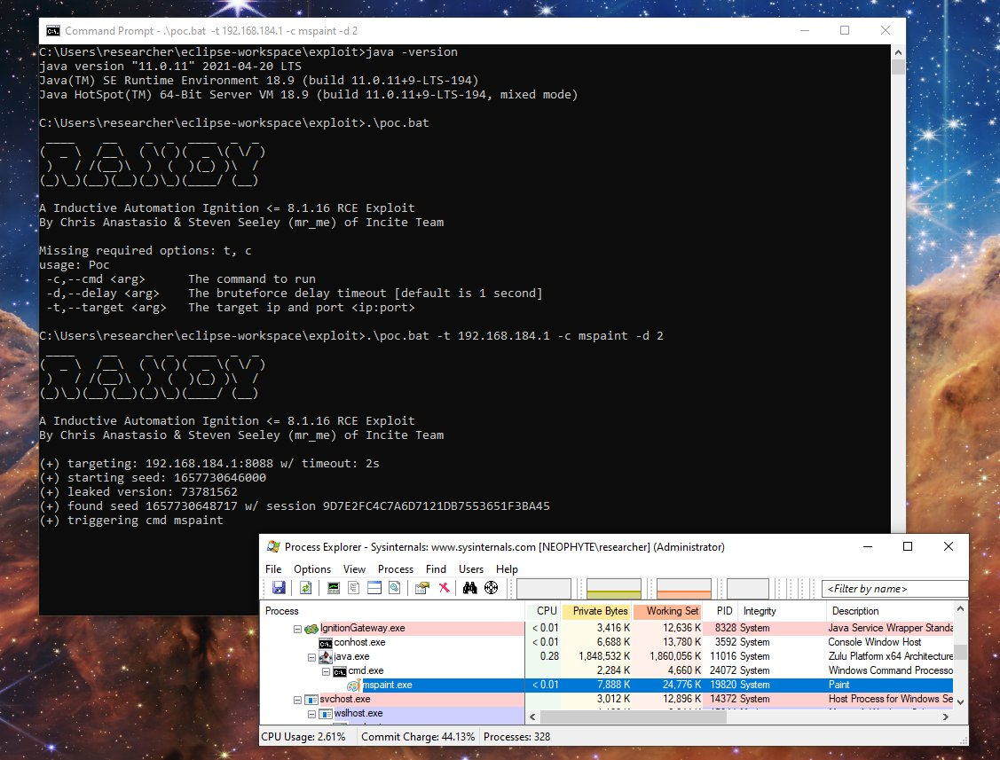</td>
</table></tr>
<table><tr>
<td>Quotes: <code>2</code></td>
<td>Replies: <code>3</code></td>
<td>Retweets: <code>47</code></td>
<td>Favorites: <code>144</code></td>
</tr></table>

---

# thezdi
**https://twitter.com/thezdi/status/1547617488552148992 _at 2022-07-14 16:22:17_**
<blockquote>
Following up from last month, the Trend Micro Research Team returns with details about CVE-2022-30136 - another remote, unauthenticated RCE (at SYSTEM) in #NFS. They cover the root cause and offer detection guidance. Read all the details at https://t.co/Pga8lJLjZ5
</blockquote>

* https://www.zerodayinitiative.com/blog/2022/7/13/cve-2022-30136-microsoft-windows-network-file-system-v4-remote-code-execution-vulnerability

<table><tr>
<td>Quotes: <code>3</code></td>
<td>Replies: <code>0</code></td>
<td>Retweets: <code>29</code></td>
<td>Favorites: <code>54</code></td>
</tr></table>

---

# TheHackersNews
**https://twitter.com/TheHackersNews/status/1547535206256885760 _at 2022-07-14 10:55:19_**
<blockquote>
#Microsoft has disclosed details of a now-patched #vulnerability (CVE-2022-26706) in #Apple operating systems — #iOS, iPadOS, #macOS, tvOS and watchOS — that could allow attackers to escalate privileges and deploy #malware.

Read: https://t.co/fbUhrppdKV

#infosec #cybersecurity
</blockquote>

* https://thehackernews.com/2022/07/microsoft-details-app-sandbox-escape.html

<table><tr>
<td>Quotes: <code>4</code></td>
<td>Replies: <code>4</code></td>
<td>Retweets: <code>79</code></td>
<td>Favorites: <code>124</code></td>
</tr></table>

---

# hackerfantastic
**https://twitter.com/hackerfantastic/status/1547412574404214784 _at 2022-07-14 02:48:01_**
<blockquote>
iscsicpl autoelevate DLL Search Order hijacking UAC Bypass 0day - Windows 7-11 x64 only https://t.co/iJCUp3fLdi
</blockquote>

* https://github.com/hackerhouse-opensource/iscsicpl_bypassUAC

<table><tr>
<td>Quotes: <code>2</code></td>
<td>Replies: <code>3</code></td>
<td>Retweets: <code>93</code></td>
<td>Favorites: <code>212</code></td>
</tr></table>

---

# Alra3ees
**https://twitter.com/Alra3ees/status/1547311532354183170 _at 2022-07-13 20:06:31_**
<blockquote>
ssrfscan:-

Burp Extender, automatically scans for ssrf vulnerabilities
https://t.co/QOhMDy7pHa
</blockquote>

* https://github.com/h4fan/ssrfscan

<table><tr>
<td>Quotes: <code>0</code></td>
<td>Replies: <code>0</code></td>
<td>Retweets: <code>16</code></td>
<td>Favorites: <code>37</code></td>
</tr></table>

---

# MsftSecIntel
**https://twitter.com/MsftSecIntel/status/1547252013192331266 _at 2022-07-13 16:10:01_**
<blockquote>
We uncovered a vulnerability that could allow specially crafted codes to escape the macOS App Sandbox and run unrestricted on the system. Apple patched this vulnerability (CVE-2022-26706) in May. This blog details our research that led to this discovery: https://t.co/7JUyb3q7Jm
</blockquote>

* https://msft.it/6015bN0sx

<table><tr>
<td>Quotes: <code>5</code></td>
<td>Replies: <code>4</code></td>
<td>Retweets: <code>75</code></td>
<td>Favorites: <code>128</code></td>
</tr></table>

---

# TheZDIBugs
**https://twitter.com/TheZDIBugs/status/1547217782130999297 _at 2022-07-13 13:53:59_**
<blockquote>
[ZDI-22-973|CVE-2022-22034] Microsoft Windows win32kfull UMPDDrvTransparentBlt Use-After-Free Local Privilege Escalation Vulnerability (CVSS 8.8) https://t.co/ep1EECJ8bV
</blockquote>

* https://www.zerodayinitiative.com/advisories/ZDI-22-973/

<table><tr>
<td>Quotes: <code>1</code></td>
<td>Replies: <code>1</code></td>
<td>Retweets: <code>18</code></td>
<td>Favorites: <code>47</code></td>
</tr></table>

---

# wugeej
**https://twitter.com/wugeej/status/1547052402742022146 _at 2022-07-13 02:56:50_**
<blockquote>
CVE-2022-26135 - Full-Read Server Side Request Forgery in Mobile Plugin for Jira Data Center and Server

POST /rest/nativemobile/1.0/batch HTTP/2
....
{"requests":[{"method":"GET","location":"@example.com"}]}

https://t.co/5bk4MchWtY https://t.co/VmH9duVS8I
</blockquote>

* https://github.com/assetnote/jira-mobile-ssrf-exploit?fbclid=IwAR0ggztq5PeEwaHFQbrN66DlDOtKoF-tnXwCGTG9aRmgyqNVwam4Re0aEQ4

<table><tr>
<td>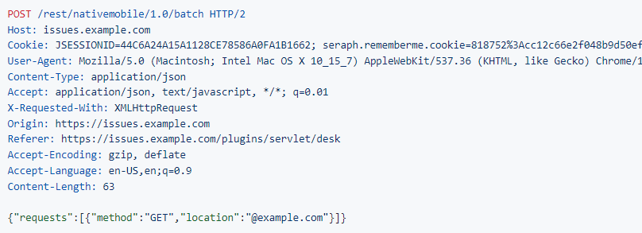</td>
</table></tr>
<table><tr>
<td>Quotes: <code>1</code></td>
<td>Replies: <code>0</code></td>
<td>Retweets: <code>10</code></td>
<td>Favorites: <code>23</code></td>
</tr></table>

---

# GossiTheDog
**https://twitter.com/GossiTheDog/status/1546916355772907525 _at 2022-07-12 17:56:14_**
<blockquote>
CVE-2022-30222 - Windows Shell Remote Code Execution Vulnerability

This will be a fun one to reverse engineer.  If you have Japanese language pack installed, you can use the IME to gain SYSTEM rights from the login screen it appears.  (Think the RDP login screen). Risky 4 japan.
</blockquote>

<table><tr>
<td>Quotes: <code>2</code></td>
<td>Replies: <code>1</code></td>
<td>Retweets: <code>11</code></td>
<td>Favorites: <code>47</code></td>
</tr></table>

---

# campuscodi
**https://twitter.com/campuscodi/status/1546913198569390080 _at 2022-07-12 17:43:41_**
<blockquote>
The Microsoft Patch Tuesday for July 2022 is out:

-86 vulnerabilities patched
-one actively exploited zero-day included (CVE-2022-22047)

[repost because I'm blind, didn't see the zero-day]

https://t.co/axtGSVFRf6 https://t.co/BHLg8e0X6j
</blockquote>

* https://rawcdn.githack.com/campuscodi/Microsoft-Patch-Tuesday-Security-Reports/ae0b10fc8bfefefb0cec726e6c30556508f4c32d/Reports/MSRC_CVEs2022-Jul.html

<table><tr>
<td>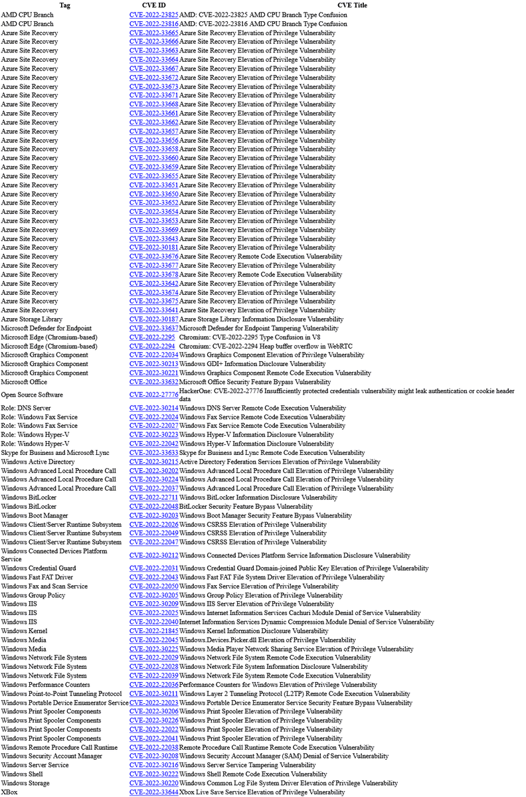</td>
</table></tr>
<table><tr>
<td>Quotes: <code>2</code></td>
<td>Replies: <code>0</code></td>
<td>Retweets: <code>14</code></td>
<td>Favorites: <code>46</code></td>
</tr></table>

---

# hack_git
**https://twitter.com/hack_git/status/1546799230207070209 _at 2022-07-12 10:10:49_**
<blockquote>
CVE-2022-31138

RCE and Domain Admin privilege escalation for Mailcow

https://t.co/I7ZSyMqEPO

#cve #poc

GitHub
GitHub - ly1g3/Mailcow-CVE-2022-31138: Mailcow CVE-2022-31138
Mailcow CVE-2022-31138. Contribute to ly1g3/Mailcow-CVE-2022-31138 developmen… https://t.co/ep0qqbceZy https://t.co/c2oGVNrrzQ
</blockquote>

* https://github.com/ly1g3/Mailcow-CVE-2022-31138
* https://t.me/HackGit/4972

<table><tr>
<td>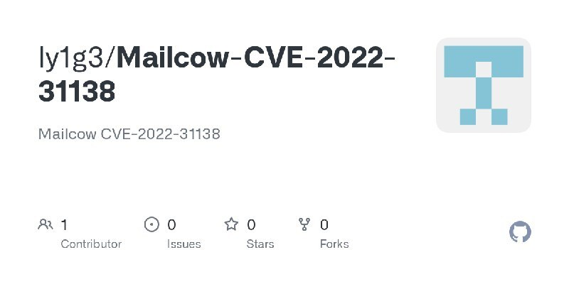</td>
</table></tr>
<table><tr>
<td>Quotes: <code>0</code></td>
<td>Replies: <code>0</code></td>
<td>Retweets: <code>0</code></td>
<td>Favorites: <code>0</code></td>
</tr></table>

---

# nullshock1
**https://twitter.com/nullshock1/status/1546712946801520640 _at 2022-07-12 04:27:57_**
<blockquote>
Check out my "Windows Privilege Escalation" notes,
link: https://t.co/t6nxgLa6Ge 
#cybersecurity #infosec #oscp #privilegeescalation #windows #informationsecurity #bugbounty
</blockquote>

* https://github.com/SaiSathvik1/Windows-Privilege-Escalation

<table><tr>
<td>Quotes: <code>1</code></td>
<td>Replies: <code>1</code></td>
<td>Retweets: <code>40</code></td>
<td>Favorites: <code>121</code></td>
</tr></table>

---

# ksg93rd
**https://twitter.com/ksg93rd/status/1546691486808477697 _at 2022-07-12 03:02:41_**
<blockquote>
#exploit
1. CVE-2022-24934:
wpsupdater.exe in Kingsoft WPS Office &lt; 11.2.0.10382 allows RCE by modifying HKEY_CURRENT_USER in the registry
https://t.co/rvgXp1HR3n

2. CVE-2022-31138:
RCE and Domain Admin privilege escalation for Mailcow
https://t.co/RtNXx9eStR
</blockquote>

* https://github.com/MagicPiperSec/WPS-CVE-2022-24934
* https://github.com/ly1g3/Mailcow-CVE-2022-31138

<table><tr>
<td>Quotes: <code>0</code></td>
<td>Replies: <code>0</code></td>
<td>Retweets: <code>1</code></td>
<td>Favorites: <code>1</code></td>
</tr></table>

---

# emgeekboy
**https://twitter.com/emgeekboy/status/1546441620781862913 _at 2022-07-11 10:29:48_**
<blockquote>
It's possible to generate IPs in multiple valid formats for given ip using the latest release of MapCIDR, useful for testing SSRF and other IP-based protections, and soon will be supported in nuclei as well.

MapCIDR - https://t.co/Wl4I9xKDF5

#hackwithautomation #security #ssrf https://t.co/H6wGSGAW1P
</blockquote>

* https://github.com/projectdiscovery/mapcidr

<table><tr>
<td>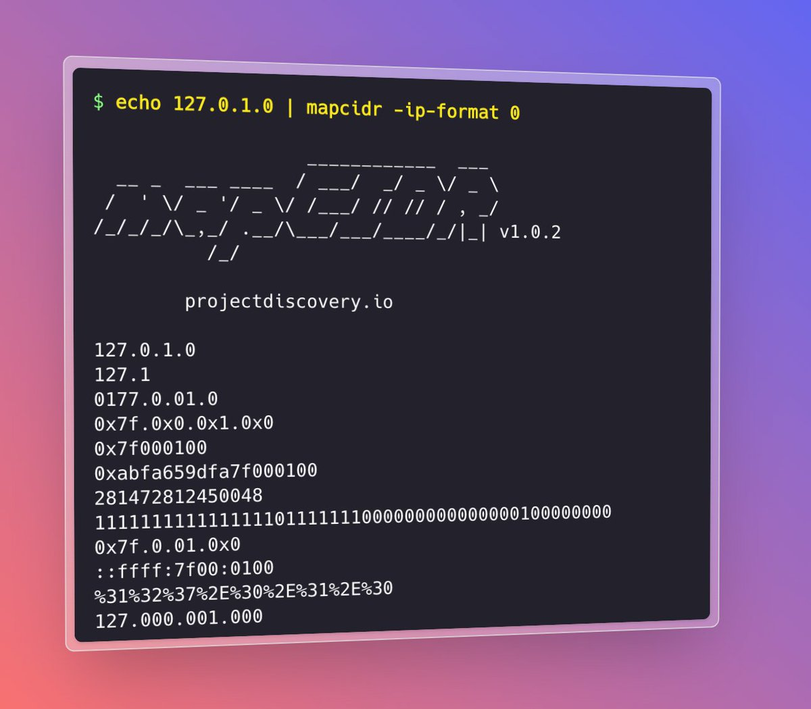</td>
</table></tr>
<table><tr>
<td>Quotes: <code>3</code></td>
<td>Replies: <code>10</code></td>
<td>Retweets: <code>153</code></td>
<td>Favorites: <code>619</code></td>
</tr></table>

---

# Securityblog
**https://twitter.com/Securityblog/status/1546400039349719040 _at 2022-07-11 07:44:34_**
<blockquote>
GitHub - Ziggy78/CVE-2022-26809-RCE: metasploit and python module for CVE-2022-26809 windows rpc rce via smb 445 https://t.co/1MMdlFwO8m
</blockquote>

* https://github.com/Ziggy78/CVE-2022-26809-RCE

<table><tr>
<td>Quotes: <code>0</code></td>
<td>Replies: <code>0</code></td>
<td>Retweets: <code>0</code></td>
<td>Favorites: <code>0</code></td>
</tr></table>

---

# Securityblog
**https://twitter.com/Securityblog/status/1546399739738034176 _at 2022-07-11 07:43:23_**
<blockquote>
GitHub - cheshireca7/CVE-2022-28117: Navigate CMS &lt;= 2.9.4 - Server-Side Request Forgery (Authenticated) https://t.co/pVj379EJ2N
</blockquote>

* https://github.com/cheshireca7/CVE-2022-28117

<table><tr>
<td>Quotes: <code>0</code></td>
<td>Replies: <code>0</code></td>
<td>Retweets: <code>1</code></td>
<td>Favorites: <code>0</code></td>
</tr></table>

---

# Securityblog
**https://twitter.com/Securityblog/status/1546399704652603392 _at 2022-07-11 07:43:14_**
<blockquote>
CVE-2022-28219: Unauthenticated XXE to RCE and Domain Compromise in ManageEngine ADAudit Plus – https://t.co/fIzSrTltVW https://t.co/QGDMHMagV2
</blockquote>

* http://Horizon3.ai
* https://www.horizon3.ai/red-team-blog-cve-2022-28219/

<table><tr>
<td>Quotes: <code>3</code></td>
<td>Replies: <code>2</code></td>
<td>Retweets: <code>84</code></td>
<td>Favorites: <code>280</code></td>
</tr></table>

---

# LinInfoSec
**https://twitter.com/LinInfoSec/status/1546283253769936897 _at 2022-07-11 00:00:30_**
<blockquote>
Php - CVE-2020-21784: https://t.co/4pxYHnS8XR
</blockquote>

* https://github.com/slackero/phpwcms/issues/286

<table><tr>
<td>Quotes: <code>0</code></td>
<td>Replies: <code>0</code></td>
<td>Retweets: <code>0</code></td>
<td>Favorites: <code>0</code></td>
</tr></table>

---

# LinInfoSec
**https://twitter.com/LinInfoSec/status/1546283237768568833 _at 2022-07-11 00:00:27_**
<blockquote>
Php - CVE-2020-20124: https://t.co/8LotQri617
</blockquote>

* https://github.com/wuzhicms/wuzhicms/issues/188

<table><tr>
<td>Quotes: <code>0</code></td>
<td>Replies: <code>0</code></td>
<td>Retweets: <code>0</code></td>
<td>Favorites: <code>0</code></td>
</tr></table>

---

# _bughunter
**https://twitter.com/_bughunter/status/1546263767901683713 _at 2022-07-10 22:43:05_**
<blockquote>
See-Surf 🔥🔥🔥
Python based scanner to find potential SSRF parameters  🔥🔥

https://t.co/Xrx8EJvEiZ
#bugbountytips #bugbountytip #bugbounty
</blockquote>

* https://github.com/In3tinct/See-SURF

<table><tr>
<td>Quotes: <code>0</code></td>
<td>Replies: <code>1</code></td>
<td>Retweets: <code>64</code></td>
<td>Favorites: <code>136</code></td>
</tr></table>

---

# raudsepplus
**https://twitter.com/raudsepplus/status/1545678369521557505 _at 2022-07-09 07:56:55_**
<blockquote>
WSO_2_RCE
CVE-2022-29464 

https://t.co/UpWMEaaiXL

#exploit #poc
</blockquote>

* https://github.com/Pasch0/WSO2RCE

<table><tr>
<td>Quotes: <code>0</code></td>
<td>Replies: <code>0</code></td>
<td>Retweets: <code>0</code></td>
<td>Favorites: <code>0</code></td>
</tr></table>

---

# aliyazdani67
**https://twitter.com/aliyazdani67/status/1545365949603250177 _at 2022-07-08 11:15:28_**
<blockquote>
PoC for CVE-2022-34265 - #Django #SQL_Injection
https://t.co/4DHFJjtKEy
</blockquote>

* https://github.com/aeyesec/CVE-2022-34265

<table><tr>
<td>Quotes: <code>0</code></td>
<td>Replies: <code>0</code></td>
<td>Retweets: <code>0</code></td>
<td>Favorites: <code>1</code></td>
</tr></table>

---

# cyber_advising
**https://twitter.com/cyber_advising/status/1545055784152625153 _at 2022-07-07 14:42:59_**
<blockquote>
CVE-2022-26135 - Full-Read Server Side Request Forgery in Mobile Plugin for Jira Data Center and Server...

PoC
https://t.co/SuuWk2ThBX https://t.co/AUC4fYucE4
</blockquote>

* https://github.com/assetnote/jira-mobile-ssrf-exploit

<table><tr>
<td>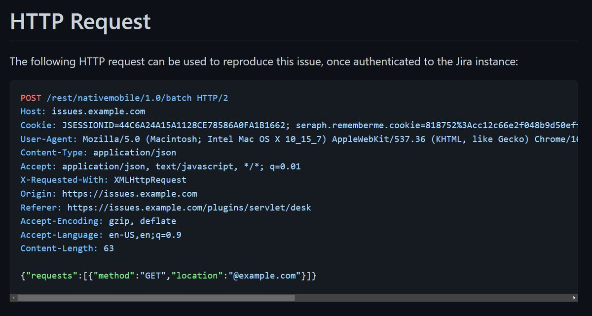</td>
</table></tr>
<table><tr>
<td>Quotes: <code>1</code></td>
<td>Replies: <code>0</code></td>
<td>Retweets: <code>33</code></td>
<td>Favorites: <code>79</code></td>
</tr></table>

---

# cyber_advising
**https://twitter.com/cyber_advising/status/1545055486029938692 _at 2022-07-07 14:41:48_**
<blockquote>
CVE-2022-34265: An issue was discovered in Django 3.2 before 3.2.14 and 4.0 before 4.0.6. The Trunc() and Extract() database functions are subject to SQL injection...

PoC
https://t.co/QeA8u67o5J https://t.co/bHGGVaEDbi
</blockquote>

* https://github.com/aeyesec/CVE-2022-34265

<table><tr>
<td>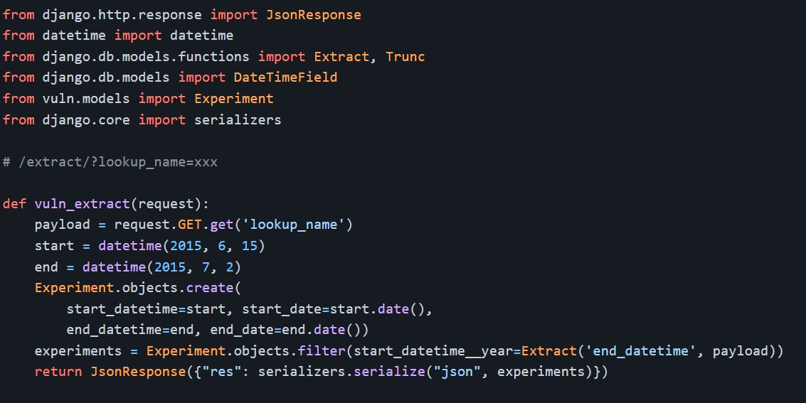</td>
</table></tr>
<table><tr>
<td>Quotes: <code>2</code></td>
<td>Replies: <code>0</code></td>
<td>Retweets: <code>61</code></td>
<td>Favorites: <code>157</code></td>
</tr></table>

---

# securestep9
**https://twitter.com/securestep9/status/1544947301998886914 _at 2022-07-07 07:31:55_**
<blockquote>
#Jira Data Center and Server
CVE-2022-26135 - Full-Read Server Side Request Forgery (#SSRF) in Mobile Plugin. Jira Core &amp; Jira Service Desk are vulnerable, patched versions released:

https://t.co/dBWyN4eUtP
</blockquote>

* https://github.com/assetnote/jira-mobile-ssrf-exploit

<table><tr>
<td>Quotes: <code>0</code></td>
<td>Replies: <code>0</code></td>
<td>Retweets: <code>2</code></td>
<td>Favorites: <code>5</code></td>
</tr></table>

---

# huntrHacktivity
**https://twitter.com/huntrHacktivity/status/1544887600552484866 _at 2022-07-07 03:34:41_**
<blockquote>
Server-Side Request Forgery (SSRF) in https://t.co/CjHBevUjq5 (CVE-2022-2339) reported by @eternyle - Patch: https://t.co/R3NXmO8cfR
https://t.co/RqIMwy90Xh #bugbounty #infosec #opensource
</blockquote>

* https://github.com/nocodb/nocodb
* https://github.com/nocodb/nocodb/commit/000ecd886738b965b5997cd905825e3244f48b95
* https://huntr.dev/bounties/fff06de8-2a82-49b1-8e81-968731e87eef/

<table><tr>
<td>Quotes: <code>0</code></td>
<td>Replies: <code>0</code></td>
<td>Retweets: <code>2</code></td>
<td>Favorites: <code>3</code></td>
</tr></table>

---

# CyberSamarth
**https://twitter.com/CyberSamarth/status/1544655987147038720 _at 2022-07-06 12:14:20_**
<blockquote>
Full-Read Server Side Request Forgery in Mobile Plugin for Jira Data Center and Server

CVE-2022-26135 :- https://t.co/8CNdhRUJNv

#bugbounty #bugbountytip #OpenSource #TodayCyberNews #infosec #cybersecurity #CVE #jira https://t.co/afG7JCpA3I
</blockquote>

* https://github.com/assetnote/jira-mobile-ssrf-exploit

<table><tr>
<td>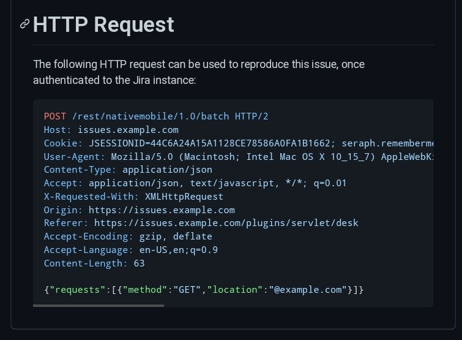</td>
</table></tr>
<table><tr>
<td>Quotes: <code>0</code></td>
<td>Replies: <code>0</code></td>
<td>Retweets: <code>2</code></td>
<td>Favorites: <code>0</code></td>
</tr></table>

---

# soheilhashemi_
**https://twitter.com/soheilhashemi_/status/1544564414749282305 _at 2022-07-06 06:10:27_**
<blockquote>
A CVE-2022-29464 affects some WSO2 products like WSO2 API Manager and WSO2 Open Banking, allowing arbitrary file upload and remote code execution.

https://t.co/wb6cK0mCmR
</blockquote>

* https://github.com/Pasch0/WSO2RCE

<table><tr>
<td>Quotes: <code>0</code></td>
<td>Replies: <code>0</code></td>
<td>Retweets: <code>0</code></td>
<td>Favorites: <code>1</code></td>
</tr></table>

---

# iagox86
**https://twitter.com/iagox86/status/1544444796072185856 _at 2022-07-05 22:15:08_**
<blockquote>
My analysis of CVE-2022-28219 - a ManageEngine ADAudit Plus RCE.

I learned a lot from @Horizon3Attack's writeup - I only had vague awareness of what you could do with XXE, this blew my mind! Props to them on their great exploit chain

https://t.co/lrBSLNmqs5
</blockquote>

* https://attackerkb.com/topics/Zx3qJlmRGY/cve-2022-28219/rapid7-analysis

<table><tr>
<td>Quotes: <code>2</code></td>
<td>Replies: <code>1</code></td>
<td>Retweets: <code>29</code></td>
<td>Favorites: <code>75</code></td>
</tr></table>

---

# infosec_au
**https://twitter.com/infosec_au/status/1544437538399862784 _at 2022-07-05 21:46:18_**
<blockquote>
The security research team at @assetnote discovered a high risk SSRF vulnerability in Jira Server and Datacenter - CVE-2022-26135. This SSRF allows attackers to make requests with any HTTP method, headers and body. You can read about it here: https://t.co/mUehIRuf17
</blockquote>

* https://blog.assetnote.io/2022/06/26/exploiting-ssrf-in-jira/

<table><tr>
<td>Quotes: <code>6</code></td>
<td>Replies: <code>8</code></td>
<td>Retweets: <code>155</code></td>
<td>Favorites: <code>503</code></td>
</tr></table>

---

# binitamshah
**https://twitter.com/binitamshah/status/1544333662959063040 _at 2022-07-05 14:53:32_**
<blockquote>
DDexec : A technique to run binaries filelessly and stealthily on Linux using dd to replace the shell with another process : https://t.co/4UiTSGoZps 

Ref : Pure In-Memory (Shell)Code Injection In Linux Userland : https://t.co/EVLydcli1t credits @SEKTOR7net
</blockquote>

* https://github.com/arget13/DDexec
* https://blog.sektor7.net/#!res/2018/pure-in-memory-linux.md

<table><tr>
<td>Quotes: <code>1</code></td>
<td>Replies: <code>0</code></td>
<td>Retweets: <code>43</code></td>
<td>Favorites: <code>87</code></td>
</tr></table>

---

# campuscodi
**https://twitter.com/campuscodi/status/1544289927877332995 _at 2022-07-05 11:59:44_**
<blockquote>
Google released Chrome v103.0.5060.114 for Windows users to patch an actively exploited zero-day (CVE-2022-2294).

The vulnerability was described as a heap buffer overflow in Chrome's WebRTC component and was found by Jan Vojtesek from security firm Avast last Friday. https://t.co/lZKHfi2ldQ
</blockquote>

<table><tr>
<td>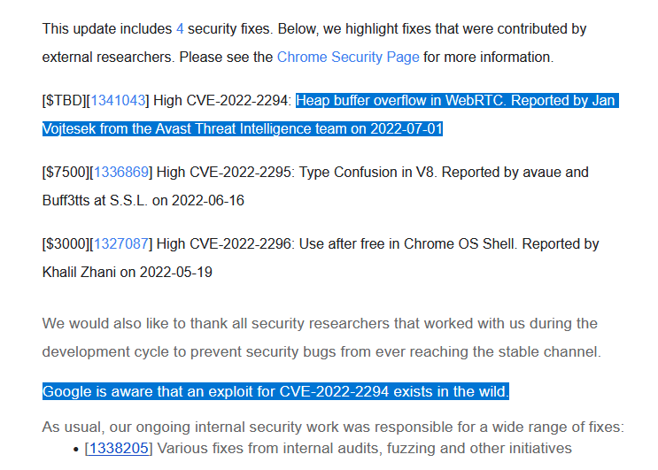</td>
</table></tr>
<table><tr>
<td>Quotes: <code>4</code></td>
<td>Replies: <code>1</code></td>
<td>Retweets: <code>48</code></td>
<td>Favorites: <code>92</code></td>
</tr></table>

---

# ksg93rd
**https://twitter.com/ksg93rd/status/1544275268042465281 _at 2022-07-05 11:01:29_**
<blockquote>
#exploit
1. An automated exploit to the xdebug 2.5.5 RCE vulnerability
https://t.co/UXt4JVqNaD

2. CVE-2022-1134:
The Chromium super (inline cache) type confusion
https://t.co/vghewGUELE

3. CVE-2022-30150:
Windows Defender Remote Credential
https://t.co/4ZsC983Gax
</blockquote>

* https://github.com/D3Ext/XDEBUG-Exploit
* https://github.blog/2022-06-29-the-chromium-super-inline-cache-type-confusion
* https://bugs.chromium.org/p/project-zero/issues/detail?id=2268

<table><tr>
<td>Quotes: <code>0</code></td>
<td>Replies: <code>0</code></td>
<td>Retweets: <code>1</code></td>
<td>Favorites: <code>1</code></td>
</tr></table>

---

# TheHackersNews
**https://twitter.com/TheHackersNews/status/1544153367189958656 _at 2022-07-05 02:57:06_**
<blockquote>
UPDATE your #Google Chrome browser for Windows, #macOS, #Linux and #Android devices to patch a newly discovered high-severity zero-day #vulnerability (CVE-2022-2294) that is being exploited in the wild.

Details: https://t.co/KWFVecr1d7

#infosec #cybersecurity #hacking #technews
</blockquote>

* https://thehackernews.com/2022/07/update-google-chrome-browser-to-patch.html

<table><tr>
<td>Quotes: <code>15</code></td>
<td>Replies: <code>7</code></td>
<td>Retweets: <code>206</code></td>
<td>Favorites: <code>244</code></td>
</tr></table>

---

# EricaZelic
**https://twitter.com/EricaZelic/status/1543646231427252236 _at 2022-07-03 17:21:55_**
<blockquote>
New UAC bypass credited to @filip_dragovic 
https://t.co/yVo7xnbWJj
</blockquote>

* https://github.com/Wh04m1001/IDiagnosticProfileUAC

<table><tr>
<td>Quotes: <code>2</code></td>
<td>Replies: <code>4</code></td>
<td>Retweets: <code>174</code></td>
<td>Favorites: <code>457</code></td>
</tr></table>

---

# Pethuraj
**https://twitter.com/Pethuraj/status/1543645358793707520 _at 2022-07-03 17:18:27_**
<blockquote>
Toolkit to detect and keep track on Blind XSS, XXE &amp; SSRF
https://t.co/gNKeeQRqst
</blockquote>

* https://github.com/SpiderMate/B-XSSRF

<table><tr>
<td>Quotes: <code>0</code></td>
<td>Replies: <code>1</code></td>
<td>Retweets: <code>42</code></td>
<td>Favorites: <code>98</code></td>
</tr></table>

---

# Alra3ees
**https://twitter.com/Alra3ees/status/1543626534518398976 _at 2022-07-03 16:03:39_**
<blockquote>
SVG SSRF Cheatsheet
Hosts that process SVG can potentially be vulnerable to SSRF, LFI, XSS, RCE because of the rich feature set of SVG.
https://t.co/a9b0nBKXnw
</blockquote>

* https://github.com/allanlw/svg-cheatsheet

<table><tr>
<td>Quotes: <code>0</code></td>
<td>Replies: <code>0</code></td>
<td>Retweets: <code>31</code></td>
<td>Favorites: <code>61</code></td>
</tr></table>

---

# nickvourd
**https://twitter.com/nickvourd/status/1543604892018905089 _at 2022-07-03 14:37:39_**
<blockquote>
just another UAC bypass by @filip_dragovic https://t.co/3rEsMaWTqz
</blockquote>

* https://github.com/Wh04m1001/IDiagnosticProfileUAC

<table><tr>
<td>Quotes: <code>0</code></td>
<td>Replies: <code>2</code></td>
<td>Retweets: <code>27</code></td>
<td>Favorites: <code>57</code></td>
</tr></table>

---

# ksg93rd
**https://twitter.com/ksg93rd/status/1543271811927908353 _at 2022-07-02 16:34:07_**
<blockquote>
#exploit
1. CVE-2022-28219:
Unauthenticated XXE to RCE and Domain Compromise in ManageEngine ADAudit Plus
https://t.co/dXwptK7WyO

2. CVE-2022-28117:
Navigate CMS &lt;= 2.9.4 - Server-Side Request Forgery (Authenticated)
https://t.co/EeJFsviNAK
</blockquote>

* https://www.horizon3.ai/red-team-blog-cve-2022-28219
* https://github.com/cheshireca7/CVE-2022-28117

<table><tr>
<td>Quotes: <code>0</code></td>
<td>Replies: <code>0</code></td>
<td>Retweets: <code>4</code></td>
<td>Favorites: <code>2</code></td>
</tr></table>

---

# 0xFalcons
**https://twitter.com/0xFalcons/status/1543233027463077888 _at 2022-07-02 14:00:00_**
<blockquote>
💠 مستودع GitHub يتضمن أكثر من 6600 استغلال لثغرات XSS

https://t.co/751c4tGp3D
</blockquote>

* https://github.com/payloadbox/xss-payload-list

<table><tr>
<td>Quotes: <code>0</code></td>
<td>Replies: <code>0</code></td>
<td>Retweets: <code>12</code></td>
<td>Favorites: <code>52</code></td>
</tr></table>

---

# hack_git
**https://twitter.com/hack_git/status/1543129904476262400 _at 2022-07-02 07:10:13_**
<blockquote>
CVE-2022-28117
 Navigate CMS &lt;= 2.9.4 - Server-Side Request Forgery (Authenticated)

https://t.co/vWCjXO1a5u

#cve #exploit

GitHub
GitHub - cheshireca7/CVE-2022-28117: Navigate CMS &lt;= 2.9.4 - Server-Side Request Forgery (Authenticated)
Navigate CMS &lt;= … https://t.co/skLOqnztFg https://t.co/ZtgenWKIOa
</blockquote>

* https://github.com/cheshireca7/CVE-2022-28117
* https://t.me/HackGit/4826

<table><tr>
<td>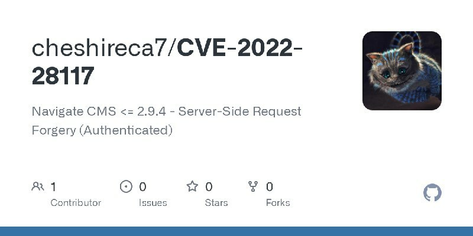</td>
</table></tr>
<table><tr>
<td>Quotes: <code>0</code></td>
<td>Replies: <code>0</code></td>
<td>Retweets: <code>0</code></td>
<td>Favorites: <code>1</code></td>
</tr></table>

---

# hackinparis
**https://twitter.com/hackinparis/status/1542825470550491137 _at 2022-07-01 11:00:31_**
<blockquote>
@egeblc showed us how to abuse #rsync tool functionality in order to achieve remote code execution (disclosed as CVE-2022-29154), this vulnerability allows to write/overwrite arbitrary files on clients and could lead to silent lateral movement within networks.

#CyberSecurity https://t.co/eLRtCV9Y3E
</blockquote>

<table><tr>
<td>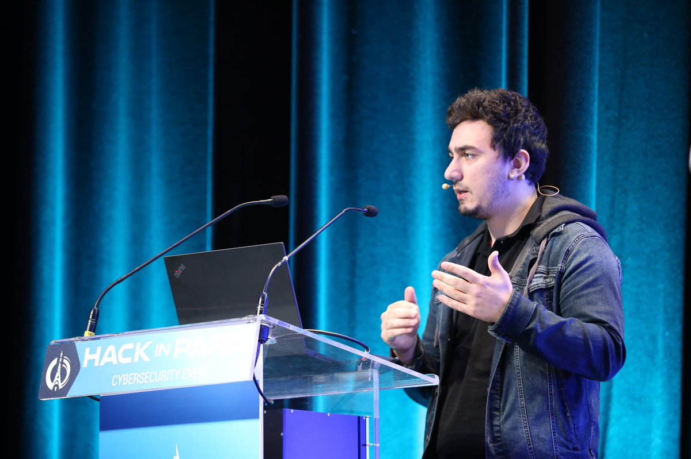</td>
<td>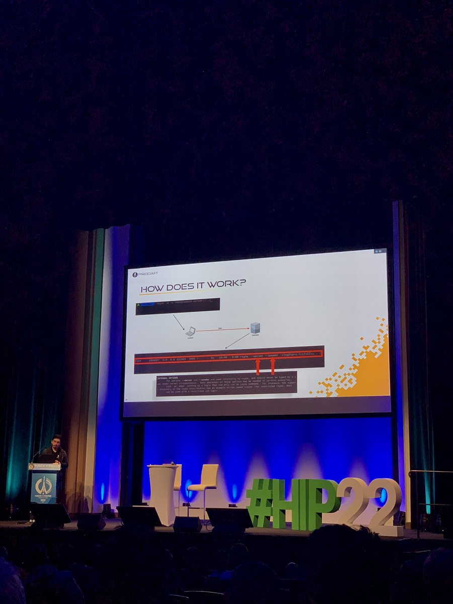</td>
<td></td>
<td>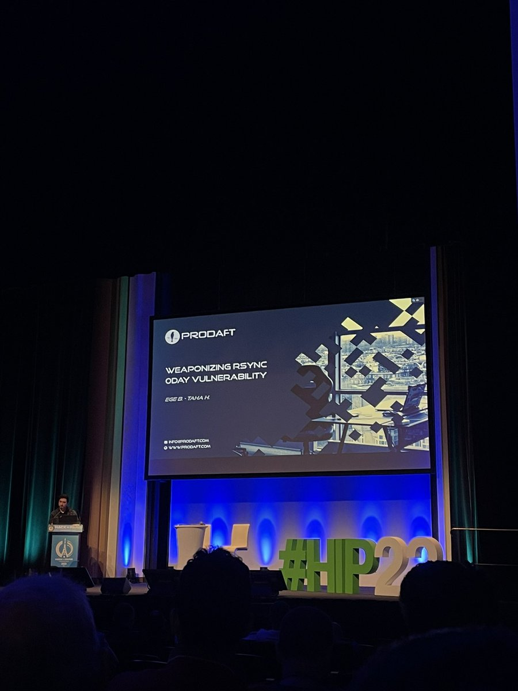</td>
</table></tr>
<table><tr>
<td>Quotes: <code>0</code></td>
<td>Replies: <code>1</code></td>
<td>Retweets: <code>7</code></td>
<td>Favorites: <code>59</code></td>
</tr></table>

---

