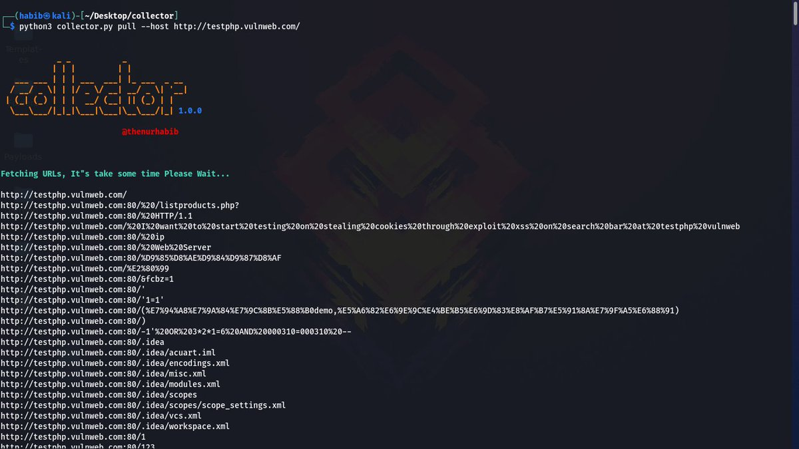
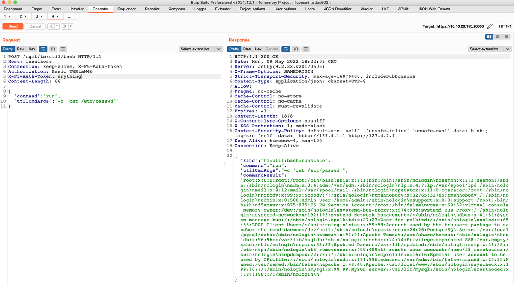

# LinInfoSec
**https://twitter.com/LinInfoSec/status/1553259594138505221 _at 2022-07-30 06:02:00_**
<blockquote>
Limesurvey - CVE-2020-11455: https://t.co/Ln0Q4zhImw
</blockquote>

* https://github.com/LimeSurvey/LimeSurvey/commit/daf50ebb16574badfb7ae0b8526ddc5871378f1b

<table><tr>
<td>Quotes: <code>0</code></td>
<td>Replies: <code>0</code></td>
<td>Retweets: <code>0</code></td>
<td>Favorites: <code>0</code></td>
</tr></table>

---

# Vulnmachines
**https://twitter.com/Vulnmachines/status/1552943813714255873 _at 2022-07-29 09:07:12_**
<blockquote>
CVE-2021-26084 : The OGNL injection vulnerability allows an unauthenticated user to execute arbitrary code on a Confluence Server or Data Center instance.
[PoC] : https://t.co/IWbGMQIMLK
Start your #pentesting Journey with us.
https://t.co/TKYo5q9VOB

#infosec #bugbountytips
</blockquote>

* https://youtu.be/RXLdWwAMjz8
* https://www.vulnmachines.com

<table><tr>
<td>Quotes: <code>2</code></td>
<td>Replies: <code>0</code></td>
<td>Retweets: <code>18</code></td>
<td>Favorites: <code>52</code></td>
</tr></table>

---

# snovvcrash
**https://twitter.com/snovvcrash/status/1552937059614363648 _at 2022-07-29 08:40:21_**
<blockquote>
🧵 (1/x) Reanimating ADCSPwn thread (in a simple way) ⏬

You all know this great tool by @_batsec_, but unfortunately Microsoft broke it with one of those anti-PetitPotam patches a while ago ⏬

https://t.co/LeYa5s5sfv

#lpe #adcs #petitpotam #webdav
</blockquote>

* https://github.com/bats3c/ADCSPwn/issues/3#issuecomment-901713533

<table><tr>
<td>Quotes: <code>4</code></td>
<td>Replies: <code>2</code></td>
<td>Retweets: <code>37</code></td>
<td>Favorites: <code>101</code></td>
</tr></table>

---

# starlabs_sg
**https://twitter.com/starlabs_sg/status/1552893294749057026 _at 2022-07-29 05:46:27_**
<blockquote>
Our team member, @testanull , just made the PoC for CVE-2022-2185 available.
https://t.co/M8EcvjKfAY
It's related to https://t.co/6XNBPPZQAc
</blockquote>

* https://github.com/star-sg/CVE/tree/master/CVE-2022-2185
* https://starlabs.sg/blog/2022/07-gitlab-project-import-rce-analysis-cve-2022-2185/

<table><tr>
<td>Quotes: <code>1</code></td>
<td>Replies: <code>1</code></td>
<td>Retweets: <code>43</code></td>
<td>Favorites: <code>141</code></td>
</tr></table>

---

# h1pmnh
**https://twitter.com/h1pmnh/status/1552613522500161536 _at 2022-07-28 11:14:44_**
<blockquote>
Awarded CVE-2022-36364 (https://t.co/yvSyEP2Lui), RCE in JDBC driver, on Apache Calcite Avatica project. Thanks to the Calcite PMC for working with me on responsible disclosure: https://t.co/ChmbAyoY47 - anyone exposing this driver to end users should upgrade.
</blockquote>

* https://cve.mitre.org/cgi-bin/cvename.cgi?name=CVE-2022-36364
* https://lists.apache.org/thread/5csdj8bv4h3hfgw27okm84jh1j2fyw0c

<table><tr>
<td>Quotes: <code>1</code></td>
<td>Replies: <code>2</code></td>
<td>Retweets: <code>12</code></td>
<td>Favorites: <code>43</code></td>
</tr></table>

---

# J3rge
**https://twitter.com/J3rge/status/1552566899917164544 _at 2022-07-28 08:09:28_**
<blockquote>
https://t.co/YKZLaXeMm8
</blockquote>

* https://gist.github.com/tothi/66290a42896a97920055e50128c9f040

<table><tr>
<td>Quotes: <code>0</code></td>
<td>Replies: <code>0</code></td>
<td>Retweets: <code>27</code></td>
<td>Favorites: <code>50</code></td>
</tr></table>

---

# momika233
**https://twitter.com/momika233/status/1552513036577292288 _at 2022-07-28 04:35:26_**
<blockquote>
Collect red team information by loading JavaScript script on the front end of the web page！
https://t.co/28XXatYdpP
</blockquote>

* https://github.com/fuckjsonp/FuckJsonp-RCE-CVE-2022-26809-SQL-XSS-FuckJsonp

<table><tr>
<td>Quotes: <code>2</code></td>
<td>Replies: <code>1</code></td>
<td>Retweets: <code>50</code></td>
<td>Favorites: <code>127</code></td>
</tr></table>

---

# payloadartist
**https://twitter.com/payloadartist/status/1552324122935435265 _at 2022-07-27 16:04:46_**
<blockquote>
⛓️ Awesome chain of bugs to exploit SQLi in WordPress Transposh plugin leading to $30k bounties

1⃣ Weak Default Configuration - CVE-2022-2461
2⃣ Unauthenticated XSS - CVE-2021-24911
3⃣ Blind SQL injection - CVE-2022-25811

https://t.co/FX0b646yJ7

#pentesting #BugBounty #hacking https://t.co/zhiU8QI4dd
</blockquote>

* https://www.rcesecurity.com/2022/07/WordPress-Transposh-Exploiting-a-Blind-SQL-Injection-via-XSS/

<table><tr>
<td></td>
</table></tr>
<table><tr>
<td>Quotes: <code>0</code></td>
<td>Replies: <code>1</code></td>
<td>Retweets: <code>27</code></td>
<td>Favorites: <code>71</code></td>
</tr></table>

---

# Pethuraj
**https://twitter.com/Pethuraj/status/1551992218629550086 _at 2022-07-26 18:05:54_**
<blockquote>
bane - This is a python module that contains functions and classes which are used to test the security of web applications. It can easily detect: XSS , RCE (RCE), SSTI, SSRF, CORS Misconfigurations, File Upload, CSRF, Path Traversal
https://t.co/utsDkKnXMg

 #bugbountytips
</blockquote>

* https://github.com/AlaBouali/bane

<table><tr>
<td>Quotes: <code>0</code></td>
<td>Replies: <code>0</code></td>
<td>Retweets: <code>23</code></td>
<td>Favorites: <code>70</code></td>
</tr></table>

---

# Pethuraj
**https://twitter.com/Pethuraj/status/1551987697706684417 _at 2022-07-26 17:47:56_**
<blockquote>
collector🪄 - Collect vulnerable #XSS parameters from the entire domain.
» https://t.co/hBdfvTP0jU

#cybersecurity #bugbountytips #Pentesting #infosec #bugbounty https://t.co/rOvpaWjQ0i
</blockquote>

* https://github.com/thenurhabib/collector

<table><tr>
<td></td>
<td></td>
</table></tr>
<table><tr>
<td>Quotes: <code>0</code></td>
<td>Replies: <code>9</code></td>
<td>Retweets: <code>79</code></td>
<td>Favorites: <code>228</code></td>
</tr></table>

---

# ksg93rd
**https://twitter.com/ksg93rd/status/1551777105662418944 _at 2022-07-26 03:51:07_**
<blockquote>
#exploit
1. CVE-2022-31245:
RCE and domain admin privilege escalation for Mailcow
CVE-2022-31245: RCE and domain admin privilege escalation

2. Authentication Bypass vulnerability in camp, a Raspberry Pi camera server
https://t.co/bWXMI8pl5X
]-&gt; https://t.co/RNr9RsBfUM
</blockquote>

* https://medium.com/@elias.hohl/authentication-bypass-vulnerability-in-camp-a-raspberry-pi-camera-server-477e5d270904
* https://github.com/ehtec/camp-exploit

<table><tr>
<td>Quotes: <code>0</code></td>
<td>Replies: <code>0</code></td>
<td>Retweets: <code>2</code></td>
<td>Favorites: <code>2</code></td>
</tr></table>

---

# catc0n
**https://twitter.com/catc0n/status/1551650510452793345 _at 2022-07-25 19:28:04_**
<blockquote>
Fantastic analysis of a command injection RCE (CVE-2022-2143) in Advantech iView courtesy of @SpaceySpacek 👀 https://t.co/9CA2ZmgHtN
</blockquote>

* https://attackerkb.com/assessments/43c07d86-44d8-4554-a895-bf40f9eb1a49?referrer=twttr

<table><tr>
<td>Quotes: <code>3</code></td>
<td>Replies: <code>0</code></td>
<td>Retweets: <code>21</code></td>
<td>Favorites: <code>64</code></td>
</tr></table>

---

# TheHackersNews
**https://twitter.com/TheHackersNews/status/1551175799340146688 _at 2022-07-24 12:01:44_**
<blockquote>
Researchers have identified an XXE #vulnerability (CVE-2022-34001) in Unit4's Enterprise Resource Planning (ERP), a well-known enterprise management suite that includes financial and project management tools.

https://t.co/l4nbnhoq8B

#cybersecurity https://t.co/nIplttgeXv
</blockquote>

* https://prisminfosec.com/cve-2022-34001/

<table><tr>
<td></td>
</table></tr>
<table><tr>
<td>Quotes: <code>3</code></td>
<td>Replies: <code>1</code></td>
<td>Retweets: <code>25</code></td>
<td>Favorites: <code>53</code></td>
</tr></table>

---

# Alra3ees
**https://twitter.com/Alra3ees/status/1551067789590515712 _at 2022-07-24 04:52:33_**
<blockquote>
XML Vulnerabilities and Attacks cheatsheet,XXE Payloads,Simplest Blind XXE Payload to test within HTML request.
https://t.co/xvZ6rdTqJ6
https://t.co/dSglwnGDAx
https://t.co/SYqNapVWq9
</blockquote>

* https://gist.github.com/mgeeky/4f726d3b374f0a34267d4f19c9004870
* https://gist.github.com/mgeeky/181c6836488e35fcbf70290a048cd51d
* https://gist.github.com/mgeeky/cf677de6e7fdc05803f6935de1ee0882

<table><tr>
<td>Quotes: <code>0</code></td>
<td>Replies: <code>1</code></td>
<td>Retweets: <code>33</code></td>
<td>Favorites: <code>76</code></td>
</tr></table>

---

# Alra3ees
**https://twitter.com/Alra3ees/status/1551057040344317952 _at 2022-07-24 04:09:50_**
<blockquote>
Pentesting-Exploitation Programs and Commands , Protocols Network / Ports

Recon
Vulnerability analysis
Privilege escalation
And more

https://t.co/KIbQ9xOt2e
</blockquote>

* https://gist.github.com/yezz123/52d2fc45c5de284ec89131c2a3dde389

<table><tr>
<td>Quotes: <code>0</code></td>
<td>Replies: <code>0</code></td>
<td>Retweets: <code>19</code></td>
<td>Favorites: <code>56</code></td>
</tr></table>

---

# gh_trending_
**https://twitter.com/gh_trending_/status/1550904374217564160 _at 2022-07-23 18:03:11_**
<blockquote>
📦 CVE-2022-34918-LPE-PoC
⭐ 103 (+23)
🗒 C
https://t.co/B1jGN9Z03s
</blockquote>

* https://github.com/randorisec/CVE-2022-34918-LPE-PoC

<table><tr>
<td>Quotes: <code>0</code></td>
<td>Replies: <code>0</code></td>
<td>Retweets: <code>0</code></td>
<td>Favorites: <code>0</code></td>
</tr></table>

---

# pdnuclei
**https://twitter.com/pdnuclei/status/1550889156301422592 _at 2022-07-23 17:02:43_**
<blockquote>
Scanning for recently being mass exploited file upload vulnerability - CVE-2021-24284 (WordPress Kaswara Modern VC Addons pluing - File Upload RCE) using nuclei template shared by @pussycat0x

Template: https://t.co/FsI7wxZEFG

Source:
https://t.co/mtOvFr6vZT

#hackwithautomation https://t.co/4MOOHaPIdL
</blockquote>

* https://github.com/projectdiscovery/nuclei-templates/pull/4869
* https://thehackernews.com/2022/07/experts-notice-sudden-surge-in.html

<table><tr>
<td></td>
</table></tr>
<table><tr>
<td>Quotes: <code>1</code></td>
<td>Replies: <code>0</code></td>
<td>Retweets: <code>22</code></td>
<td>Favorites: <code>89</code></td>
</tr></table>

---

# ksg93rd
**https://twitter.com/ksg93rd/status/1550514470308515849 _at 2022-07-22 16:13:51_**
<blockquote>
CVE-2022-34918: Linux Kernel LPE PoC

https://t.co/4h1TzWHt20

+ ресерч: https://t.co/THWs6GMeQw

#exploit #git
</blockquote>

* https://github.com/randorisec/CVE-2022-34918-LPE-PoC
* https://randorisec.fr/crack-linux-firewall/

<table><tr>
<td>Quotes: <code>0</code></td>
<td>Replies: <code>0</code></td>
<td>Retweets: <code>0</code></td>
<td>Favorites: <code>1</code></td>
</tr></table>

---

# akincibor1
**https://twitter.com/akincibor1/status/1550407150534549504 _at 2022-07-22 09:07:24_**
<blockquote>
I just posted a critical SSRF template, you can extract cloud metadata @pdnuclei 

https://t.co/1wN0zZKHoY
</blockquote>

* https://github.com/projectdiscovery/nuclei-templates/issues/4892

<table><tr>
<td>Quotes: <code>0</code></td>
<td>Replies: <code>0</code></td>
<td>Retweets: <code>24</code></td>
<td>Favorites: <code>83</code></td>
</tr></table>

---

# Hacker__News
**https://twitter.com/Hacker__News/status/1550378019499479040 _at 2022-07-22 07:11:39_**
<blockquote>
CVE-2022-31163: Arbitrary file execution in TZinfo (Ruby)

#traversal #reload #tzinfotimezoneget #relative #files #path #vulnerability #signed #arbitrary #session #refresh #window #load #tab #tzinfo

https://t.co/1qJjGa0pSr https://t.co/HCZDHwZFgw
</blockquote>

* https://github.com/tzinfo/tzinfo/security/advisories/GHSA-5cm2-9h8c-rvfx

<table><tr>
<td></td>
</table></tr>
<table><tr>
<td>Quotes: <code>0</code></td>
<td>Replies: <code>1</code></td>
<td>Retweets: <code>0</code></td>
<td>Favorites: <code>0</code></td>
</tr></table>

---

# Securityblog
**https://twitter.com/Securityblog/status/1550374784889937921 _at 2022-07-22 06:58:47_**
<blockquote>
GitHub - Cory65/CVE-2022-24086-POC: Verifed Proof of Concept on CVE-2022-24086 RCE https://t.co/5mmR0AbZDz
</blockquote>

* https://github.com/Cory65/CVE-2022-24086-POC

<table><tr>
<td>Quotes: <code>0</code></td>
<td>Replies: <code>0</code></td>
<td>Retweets: <code>1</code></td>
<td>Favorites: <code>0</code></td>
</tr></table>

---

# TheHackersNews
**https://twitter.com/TheHackersNews/status/1550370436747501568 _at 2022-07-22 06:41:31_**
<blockquote>
Spyware sold by Israeli company #Candiru has been caught exploiting a recently discovered zero-day #vulnerability in #Google Chrome (CVE-2022-2294) to attack journalists.

Read details: https://t.co/Odu2f0URkX

#infosec #cybersecurity #hacking #malware #privacy
</blockquote>

* https://thehackernews.com/2022/07/candiru-spyware-caught-exploiting.html

<table><tr>
<td>Quotes: <code>4</code></td>
<td>Replies: <code>8</code></td>
<td>Retweets: <code>89</code></td>
<td>Favorites: <code>136</code></td>
</tr></table>

---

# GeoffreyHuntley
**https://twitter.com/GeoffreyHuntley/status/1550287484549943296 _at 2022-07-22 01:11:53_**
<blockquote>
CVE-2022-244622: A local unauthenticated attacker within a @McDonalds could exploit this knowledge to pop calc.exe.

The default user on the terminals is Administrator and touch screen input is enabled. https://t.co/uG1pXG6iYb
</blockquote>

<table><tr>
<td></td>
</table></tr>
<table><tr>
<td>Quotes: <code>11</code></td>
<td>Replies: <code>12</code></td>
<td>Retweets: <code>38</code></td>
<td>Favorites: <code>137</code></td>
</tr></table>

---

# MCoetus
**https://twitter.com/MCoetus/status/1550216427189243906 _at 2022-07-21 20:29:32_**
<blockquote>
CVE-2022-34918: Linux Kernel LPE PoC
https://t.co/4AZ2cgH7rl
</blockquote>

* https://github.com/randorisec/CVE-2022-34918-LPE-PoC

<table><tr>
<td>Quotes: <code>0</code></td>
<td>Replies: <code>0</code></td>
<td>Retweets: <code>1</code></td>
<td>Favorites: <code>1</code></td>
</tr></table>

---

# shadowYEM
**https://twitter.com/shadowYEM/status/1550198582338281472 _at 2022-07-21 19:18:37_**
<blockquote>
LPE exploit for CVE-2022-34918 exploit kernel Linux ubuntu 5.15.0-39-generic
https://t.co/GFhXHWeNts
Proof-of-concept and write-up for the CVE-2022-32832 vulnerability patched in iOS 15.6
https://t.co/6SIRDCTftg
الباقي في التعليقات 👇🏻👇🏻
</blockquote>

* https://github.com/randorisec/CVE-2022-34918-LPE-PoC
* https://github.com/Muirey03/CVE-2022-32832

<table><tr>
<td>Quotes: <code>0</code></td>
<td>Replies: <code>1</code></td>
<td>Retweets: <code>0</code></td>
<td>Favorites: <code>1</code></td>
</tr></table>

---

# DahvidSchloss
**https://twitter.com/DahvidSchloss/status/1550181413353299971 _at 2022-07-21 18:10:24_**
<blockquote>
Just dropped my first CVE. CVE-2022-42069 A privilege escalation exists where an unauthenticated user can escalate to an authenticated user by sending a specially crafted email and gathering the user/pass of the recipient. #Hacking
</blockquote>

<table><tr>
<td>Quotes: <code>6</code></td>
<td>Replies: <code>46</code></td>
<td>Retweets: <code>73</code></td>
<td>Favorites: <code>812</code></td>
</tr></table>

---

# AvastThreatLabs
**https://twitter.com/AvastThreatLabs/status/1550136415559761922 _at 2022-07-21 15:11:36_**
<blockquote>
Candiru is back at it again, exploiting browser #0day in the Middle East. Read our latest blog post for more details about our discovery of CVE-2022-2294, a #vulnerability that affected Chrome, Edge, Safari, and others. https://t.co/JroEayxGY9
</blockquote>

* https://decoded.avast.io/janvojtesek/the-return-of-candiru-zero-days-in-the-middle-east/

<table><tr>
<td>Quotes: <code>4</code></td>
<td>Replies: <code>0</code></td>
<td>Retweets: <code>47</code></td>
<td>Favorites: <code>95</code></td>
</tr></table>

---

# sirifu4k1
**https://twitter.com/sirifu4k1/status/1550134309562249216 _at 2022-07-21 15:03:14_**
<blockquote>
CVE-2022-26134 Vulnerability analysis - Critical severity unauthenticated remote code execution vulnerability in Confluence Server and Data Center 
#CVE #POC #confluence  https://t.co/ZASNjRpb4V
</blockquote>

* https://www.secpulse.com/archives/181830.html

<table><tr>
<td>Quotes: <code>1</code></td>
<td>Replies: <code>1</code></td>
<td>Retweets: <code>15</code></td>
<td>Favorites: <code>33</code></td>
</tr></table>

---

# megabeets_
**https://twitter.com/megabeets_/status/1550121359761555460 _at 2022-07-21 14:11:46_**
<blockquote>
Two #0day exploits were used against targets in the Middle East, and led to the deployment of Candiru's #DevilsTongue spyware!

- Heap BOF in WebRTC, Chromium (CVE-2022-2294)
- LPE in a 3rd party driver

Great finding by the team @ @AvastThreatLabs!

https://t.co/03GtyS8Eno

&gt;&gt;
</blockquote>

* https://decoded.avast.io/janvojtesek/the-return-of-candiru-zero-days-in-the-middle-east/

<table><tr>
<td>Quotes: <code>4</code></td>
<td>Replies: <code>1</code></td>
<td>Retweets: <code>63</code></td>
<td>Favorites: <code>141</code></td>
</tr></table>

---

# starlabs_sg
**https://twitter.com/starlabs_sg/status/1550089927030755328 _at 2022-07-21 12:06:52_**
<blockquote>
It's time for another "Show &amp; Tell" session by Meme master @testanull - Gitlab Project Import RCE Analysis (CVE-2022-2185)
@_jsoo_ thinks it was full of images and a lengthy blog post :P
Grateful for our co-worker, Frances for editing it.😘
https://t.co/6XNBPQgTCc
</blockquote>

* https://starlabs.sg/blog/2022/07-gitlab-project-import-rce-analysis-cve-2022-2185/

<table><tr>
<td>Quotes: <code>3</code></td>
<td>Replies: <code>2</code></td>
<td>Retweets: <code>29</code></td>
<td>Favorites: <code>107</code></td>
</tr></table>

---

# testanull
**https://twitter.com/testanull/status/1550089562349015042 _at 2022-07-21 12:05:25_**
<blockquote>
Successfully reproduced the Gitlab Project Import RCE (CVE-2022-2185)
Got headache while reading Ruby for last 2 weeks, but it worth definitely digging in
Have good read!
https://t.co/MDWcIMfxTh
</blockquote>

* https://starlabs.sg/blog/2022/07-gitlab-project-import-rce-analysis-cve-2022-2185/

<table><tr>
<td>Quotes: <code>4</code></td>
<td>Replies: <code>5</code></td>
<td>Retweets: <code>116</code></td>
<td>Favorites: <code>309</code></td>
</tr></table>

---

# soheilhashemi_
**https://twitter.com/soheilhashemi_/status/1550065195896143873 _at 2022-07-21 10:28:36_**
<blockquote>
LPE exploit for CVE-2022-34918. This exploit has been written for the kernel Linux ubuntu 5.15.0-39-generic

Blog:

https://t.co/30PhGTjHWj

POC:

https://t.co/rGcsbuhzPE

#Linux #LPE
</blockquote>

* https://www.randorisec.fr/crack-linux-firewall/
* https://github.com/randorisec/CVE-2022-34918-LPE-PoC

<table><tr>
<td>Quotes: <code>3</code></td>
<td>Replies: <code>1</code></td>
<td>Retweets: <code>70</code></td>
<td>Favorites: <code>159</code></td>
</tr></table>

---

# TheHackersNews
**https://twitter.com/TheHackersNews/status/1550038562459947008 _at 2022-07-21 08:42:46_**
<blockquote>
#Atlassian has rolled out security patches to address a new critical hard-coded credentials #vulnerability (CVE-2022-26138) affecting the #Confluence app for Confluence Server and Confluence Data Center.

Details: https://t.co/YDUMVseBtZ

#infosec #cybersecurity #hacking
</blockquote>

* https://thehackernews.com/2022/07/atlassian-releases-patch-for-critical.html

<table><tr>
<td>Quotes: <code>4</code></td>
<td>Replies: <code>0</code></td>
<td>Retweets: <code>47</code></td>
<td>Favorites: <code>72</code></td>
</tr></table>

---

# 0xdea
**https://twitter.com/0xdea/status/1550015102966980610 _at 2022-07-21 07:09:33_**
<blockquote>
A prime example of the whack-a-mole game of sandbox escaping (and yet another way to abuse python 🐍)

Uncovering a macOS App Sandbox escape vulnerability: A deep dive into CVE-2022-26706

https://t.co/pr7eLeLCXY
</blockquote>

* https://www.microsoft.com/security/blog/2022/07/13/uncovering-a-macos-app-sandbox-escape-vulnerability-a-deep-dive-into-cve-2022-26706/

<table><tr>
<td>Quotes: <code>1</code></td>
<td>Replies: <code>1</code></td>
<td>Retweets: <code>17</code></td>
<td>Favorites: <code>53</code></td>
</tr></table>

---

# l33d0hyun
**https://twitter.com/l33d0hyun/status/1549938793557692416 _at 2022-07-21 02:06:19_**
<blockquote>
Apple Safari 2 Kill

CVE-2022-32787 : Apple Safari ICU Out-Of-Bounds Write Vulnerability
CVE-2022-32816 : Apple Safari UI Spoofing Vulnerability

https://t.co/jGEtUzXaJN https://t.co/MpH3qByben
</blockquote>

* https://support.apple.com/ko-kr/HT213346

<table><tr>
<td></td>
<td></td>
</table></tr>
<table><tr>
<td>Quotes: <code>1</code></td>
<td>Replies: <code>2</code></td>
<td>Retweets: <code>11</code></td>
<td>Favorites: <code>52</code></td>
</tr></table>

---

# three_cube
**https://twitter.com/three_cube/status/1549902099520991232 _at 2022-07-20 23:40:30_**
<blockquote>
13 of these F5 Big IP systems in Russia. 

Use this exploit to take them down!

#CVE-2022-1388 F5's BIG-IP Unauth RCE

Connection: keep-alive, X-F5-Auth-Token
Authorization: Basic YWRtaW46
X-F5-Auth-Token: anything

https://x.x.x.x:443/mgmt/tm/util/bash https://t.co/HPloQX1A2Y
</blockquote>

<table><tr>
<td></td>
</table></tr>
<table><tr>
<td>Quotes: <code>2</code></td>
<td>Replies: <code>1</code></td>
<td>Retweets: <code>11</code></td>
<td>Favorites: <code>47</code></td>
</tr></table>

---

# fluepke
**https://twitter.com/fluepke/status/1549892089181257729 _at 2022-07-20 23:00:44_**
<blockquote>
Discovered by a fried of mine:

CVE-2022-26138: A remote, unauthenticated attacker with knowledge of the hardcoded password could exploit this to log into Confluence and access all content accessible to users in the confluence-users group

The password is disabled1system1user6708 https://t.co/6D3g8ZFxTn
</blockquote>

<table><tr>
<td></td>
</table></tr>
<table><tr>
<td>Quotes: <code>87</code></td>
<td>Replies: <code>28</code></td>
<td>Retweets: <code>544</code></td>
<td>Favorites: <code>1682</code></td>
</tr></table>

---

# r0ns3n
**https://twitter.com/r0ns3n/status/1549809236330291202 _at 2022-07-20 17:31:30_**
<blockquote>
Another #CVE-2022-21558 of mine just got published. #Oracle Crystal Ball for #Windows contains a local privilege escalation #vulnerability. #Mandiant #MYOW #UpdateNow #MandiantVulnerabilityDisclosure

https://t.co/h0rOHysYtq
</blockquote>

* https://github.com/mandiant/Vulnerability-Disclosures/blob/master/2022/MNDT-2022-0031/MNDT-2022-0031.md

<table><tr>
<td>Quotes: <code>1</code></td>
<td>Replies: <code>0</code></td>
<td>Retweets: <code>2</code></td>
<td>Favorites: <code>14</code></td>
</tr></table>

---

# nas_bench
**https://twitter.com/nas_bench/status/1549417732910768132 _at 2022-07-19 15:35:48_**
<blockquote>
A new Sigma rule to detect this new UAC bypass technique and a generic one to detect DLL side loading were added to the public repo.

LINK - https://t.co/vgSayjp1Si https://t.co/sGrinFsIKU
</blockquote>

* https://github.com/SigmaHQ/sigma/blob/fd30a061125ac15966dbc8fe3c5bede88fae47bb/rules/windows/image_load/image_load_uac_bypass_iscsicpl.yml

<table><tr>
<td></td>
<td></td>
</table></tr>
<table><tr>
<td>Quotes: <code>0</code></td>
<td>Replies: <code>1</code></td>
<td>Retweets: <code>47</code></td>
<td>Favorites: <code>104</code></td>
</tr></table>

---

# hack_git
**https://twitter.com/hack_git/status/1549411362882846723 _at 2022-07-19 15:10:30_**
<blockquote>
CVE-2022-24500-RCE
 Windows SMB Remote Code Execution Vulnerability

https://t.co/eK9nE8xvFv

#cve #RCE

GitHub
GitHub - Daro1967/CVE-2022-24500-RCE: CVE-2022-24500 Windows SMB Remote Code Execution Vulnerability
CVE-2022-24500 Windows SMB Remote Code E… https://t.co/pBItxal1fg https://t.co/LbNO9NAVRs
</blockquote>

* https://github.com/Daro1967/CVE-2022-24500-RCE
* https://bit.ly/3ocP8jN

<table><tr>
<td></td>
</table></tr>
<table><tr>
<td>Quotes: <code>0</code></td>
<td>Replies: <code>0</code></td>
<td>Retweets: <code>1</code></td>
<td>Favorites: <code>0</code></td>
</tr></table>

---

# prok3z
**https://twitter.com/prok3z/status/1549372979775262730 _at 2022-07-19 12:37:58_**
<blockquote>
CVE-2022-33891 : Apache Spark shell (Command injection vulnerability via Spark UI)
#bugbounty #hacking #apache #RCE #vulnerability #spark 
https://t.co/ezKDFqdHZy
</blockquote>

* https://github.com/W01fh4cker/cve-2022-33891/blob/main/cve_2022_33891_poc.py

<table><tr>
<td>Quotes: <code>0</code></td>
<td>Replies: <code>0</code></td>
<td>Retweets: <code>0</code></td>
<td>Favorites: <code>3</code></td>
</tr></table>

---

# hack_git
**https://twitter.com/hack_git/status/1549320916391403520 _at 2022-07-19 09:11:06_**
<blockquote>
CVE-2022-33891
 Apache Spark shell command injection

https://t.co/aMwGh3uYzp

#apache #cve #spark #rce

GitHub
GitHub - W01fh4cker/cve-2022-33891: cve-2022-33891-poc
cve-2022-33891-poc. Contribute to W01fh4cker/cve-2022-33891 development by creating an… https://t.co/5y3CwpHhDr https://t.co/XnM0p6IcMA
</blockquote>

* https://github.com/W01fh4cker/cve-2022-33891
* https://bit.ly/3aRHPer

<table><tr>
<td></td>
</table></tr>
<table><tr>
<td>Quotes: <code>0</code></td>
<td>Replies: <code>0</code></td>
<td>Retweets: <code>0</code></td>
<td>Favorites: <code>1</code></td>
</tr></table>

---

# Securityblog
**https://twitter.com/Securityblog/status/1549285500682387456 _at 2022-07-19 06:50:22_**
<blockquote>
GitHub - Cory65/CVE-2022-24086-POC: Verifed Proof of Concept on CVE-2022-24086 RCE https://t.co/5mmR0AbZDz
</blockquote>

* https://github.com/Cory65/CVE-2022-24086-POC

<table><tr>
<td>Quotes: <code>0</code></td>
<td>Replies: <code>0</code></td>
<td>Retweets: <code>0</code></td>
<td>Favorites: <code>0</code></td>
</tr></table>

---

# hackersden_
**https://twitter.com/hackersden_/status/1549240196733886464 _at 2022-07-19 03:50:21_**
<blockquote>
Payload list 

SQL Injection Payload
https://t.co/0pDnMdaKfX

command-injection-payload
https://t.co/uBTg2eOK7Z

open-redirect-payload
https://t.co/SoSAIrMd3e

xxe-injection-payload
https://t.co/sCWJkd7kkI

1/n
#bugbounty #bugbountytips
</blockquote>

* https://github.com/payloadbox/sql-injection-payload-list
* https://github.com/payloadbox/command-injection-payload-list
* https://github.com/payloadbox/open-redirect-payload-list
* https://github.com/payloadbox/xxe-injection-payload-list

<table><tr>
<td>Quotes: <code>3</code></td>
<td>Replies: <code>7</code></td>
<td>Retweets: <code>135</code></td>
<td>Favorites: <code>265</code></td>
</tr></table>

---

# sirifu4k1
**https://twitter.com/sirifu4k1/status/1549213318354571264 _at 2022-07-19 02:03:32_**
<blockquote>
CVE-2022-33891 Apache Spark shell command injection #apache #CVE #Spark #RCE  https://t.co/Dmp52gFsm4
</blockquote>

* https://github.com/W01fh4cker/cve-2022-33891/blob/main/cve_2022_33891_poc.py

<table><tr>
<td>Quotes: <code>1</code></td>
<td>Replies: <code>1</code></td>
<td>Retweets: <code>58</code></td>
<td>Favorites: <code>105</code></td>
</tr></table>

---

# GrimFlash3
**https://twitter.com/GrimFlash3/status/1549063001977798657 _at 2022-07-18 16:06:14_**
<blockquote>
#BBCF Update on the RCE exploit for CF

A user by the name of ThingsNStuffYouKnow has created a temporary fix for the issue. I have compiled it and put it in a google drive you can download here:
https://t.co/GdRVygVLIM
[1/2]
</blockquote>

* https://drive.google.com/file/d/1By5baU12QLm3b25yA-ujwif7D2xQioTt/view?usp=sharing

<table><tr>
<td>Quotes: <code>7</code></td>
<td>Replies: <code>7</code></td>
<td>Retweets: <code>147</code></td>
<td>Favorites: <code>176</code></td>
</tr></table>

---

# ksg93rd
**https://twitter.com/ksg93rd/status/1548884486502469633 _at 2022-07-18 04:16:53_**
<blockquote>
#exploit
1. CVE-2022-32119:
Arox-Unrestricted-File-Upload
https://t.co/lPBUfpucGf

2. Android Penetration Tool (RAT for Android)
https://t.co/SHGG9iwRDy
</blockquote>

* https://github.com/JC175/CVE-2022-32119
* https://github.com/anirudhmalik/xhunter

<table><tr>
<td>Quotes: <code>0</code></td>
<td>Replies: <code>0</code></td>
<td>Retweets: <code>0</code></td>
<td>Favorites: <code>0</code></td>
</tr></table>

---

# Pethuraj
**https://twitter.com/Pethuraj/status/1548730966205612032 _at 2022-07-17 18:06:51_**
<blockquote>
Interactsh tool now supports static file hosting for testing online payloads for attacks such as XSS/XXE to test and detect out-of-band interactions. 
» https://t.co/nzEsmihTsb

#bugbountytips https://t.co/WIOwYjGfSy
</blockquote>

* https://github.com/projectdiscovery/interactsh

<table><tr>
<td></td>
<td></td>
</table></tr>
<table><tr>
<td>Quotes: <code>0</code></td>
<td>Replies: <code>2</code></td>
<td>Retweets: <code>34</code></td>
<td>Favorites: <code>98</code></td>
</tr></table>

---

# pdiscoveryio
**https://twitter.com/pdiscoveryio/status/1548651417094696963 _at 2022-07-17 12:50:45_**
<blockquote>
Customizable Index page along with static file hosting for frequently used online payloads for attacks such as XSS/XXE and more is now supported with self-hosted interactsh server 🎉🎉

Changelog: https://t.co/rrhOVJsnic

#hackwithautomation #oast #appsec #security https://t.co/c32srcV8xf
</blockquote>

* https://github.com/projectdiscovery/interactsh/releases/tag/v1.0.6

<table><tr>
<td></td>
</table></tr>
<table><tr>
<td>Quotes: <code>1</code></td>
<td>Replies: <code>6</code></td>
<td>Retweets: <code>50</code></td>
<td>Favorites: <code>186</code></td>
</tr></table>

---

# yamanoku
**https://twitter.com/yamanoku/status/1548106144312619008 _at 2022-07-16 00:44:01_**
<blockquote>
Reading… Svelte cross-site scripting prior to 3.49.0 due to when using objects during server-side rendering · CVE-2022-25875 · GitHub Advisory Database https://t.co/R2ifFyNhUr
</blockquote>

* https://github.com/advisories/GHSA-wv8q-r932-8hc7

<table><tr>
<td>Quotes: <code>0</code></td>
<td>Replies: <code>1</code></td>
<td>Retweets: <code>0</code></td>
<td>Favorites: <code>1</code></td>
</tr></table>

---

# JLLeitschuh
**https://twitter.com/JLLeitschuh/status/1548018780285964288 _at 2022-07-15 18:56:52_**
<blockquote>
That vulnerability in the AWS-sdk-java I found was just disclosed!

CVE-2022-31159: Partial Path Traversal vulnerability in the AWS-sdk-java TransferManager (downloads the contents of S3 buckets).

https://t.co/nSqpDLn9Sq
</blockquote>

* https://github.com/aws/aws-sdk-java/security/advisories/GHSA-c28r-hw5m-5gv3

<table><tr>
<td>Quotes: <code>0</code></td>
<td>Replies: <code>2</code></td>
<td>Retweets: <code>4</code></td>
<td>Favorites: <code>17</code></td>
</tr></table>

---

# Alra3ees
**https://twitter.com/Alra3ees/status/1547983577291567104 _at 2022-07-15 16:36:59_**
<blockquote>
CVE-2022-26135 - Full-Read Server Side Request Forgery in Mobile Plugin for Jira Data Center and Server
https://t.co/La2auEhpGN
</blockquote>

* https://github.com/assetnote/jira-mobile-ssrf-exploit

<table><tr>
<td>Quotes: <code>0</code></td>
<td>Replies: <code>3</code></td>
<td>Retweets: <code>10</code></td>
<td>Favorites: <code>49</code></td>
</tr></table>

---

# momika233
**https://twitter.com/momika233/status/1547809344200540160 _at 2022-07-15 05:04:39_**
<blockquote>
CVE-2022-32119 - Arox-Unrestricted-File-Upload
https://t.co/QjbTLocXSH https://t.co/90bSATsIrL
</blockquote>

* https://github.com/JC175/CVE-2022-32119

<table><tr>
<td></td>
</table></tr>
<table><tr>
<td>Quotes: <code>2</code></td>
<td>Replies: <code>3</code></td>
<td>Retweets: <code>54</code></td>
<td>Favorites: <code>140</code></td>
</tr></table>

---

# steventseeley
**https://twitter.com/steventseeley/status/1547641664088338432 _at 2022-07-14 17:58:21_**
<blockquote>
Here is a pre-authenticated RCE exploit for Inductive Automation Ignition that @mufinnnnnnn and I wrote for #Pwn2Own, enjoy! https://t.co/cF8KrpmwTK https://t.co/MOL2pbxu7D
</blockquote>

* https://github.com/sourceincite/randy

<table><tr>
<td></td>
</table></tr>
<table><tr>
<td>Quotes: <code>2</code></td>
<td>Replies: <code>4</code></td>
<td>Retweets: <code>128</code></td>
<td>Favorites: <code>355</code></td>
</tr></table>

---

# thezdi
**https://twitter.com/thezdi/status/1547617488552148992 _at 2022-07-14 16:22:17_**
<blockquote>
Following up from last month, the Trend Micro Research Team returns with details about CVE-2022-30136 - another remote, unauthenticated RCE (at SYSTEM) in #NFS. They cover the root cause and offer detection guidance. Read all the details at https://t.co/Pga8lJLjZ5
</blockquote>

* https://www.zerodayinitiative.com/blog/2022/7/13/cve-2022-30136-microsoft-windows-network-file-system-v4-remote-code-execution-vulnerability

<table><tr>
<td>Quotes: <code>3</code></td>
<td>Replies: <code>0</code></td>
<td>Retweets: <code>43</code></td>
<td>Favorites: <code>79</code></td>
</tr></table>

---

# TheHackersNews
**https://twitter.com/TheHackersNews/status/1547535206256885760 _at 2022-07-14 10:55:19_**
<blockquote>
#Microsoft has disclosed details of a now-patched #vulnerability (CVE-2022-26706) in #Apple operating systems — #iOS, iPadOS, #macOS, tvOS and watchOS — that could allow attackers to escalate privileges and deploy #malware.

Read: https://t.co/fbUhrppdKV

#infosec #cybersecurity
</blockquote>

* https://thehackernews.com/2022/07/microsoft-details-app-sandbox-escape.html

<table><tr>
<td>Quotes: <code>4</code></td>
<td>Replies: <code>4</code></td>
<td>Retweets: <code>79</code></td>
<td>Favorites: <code>124</code></td>
</tr></table>

---

# hackerfantastic
**https://twitter.com/hackerfantastic/status/1547412574404214784 _at 2022-07-14 02:48:01_**
<blockquote>
iscsicpl autoelevate DLL Search Order hijacking UAC Bypass 0day - Windows 7-11 x64 only https://t.co/iJCUp3fLdi
</blockquote>

* https://github.com/hackerhouse-opensource/iscsicpl_bypassUAC

<table><tr>
<td>Quotes: <code>4</code></td>
<td>Replies: <code>5</code></td>
<td>Retweets: <code>120</code></td>
<td>Favorites: <code>273</code></td>
</tr></table>

---

# Alra3ees
**https://twitter.com/Alra3ees/status/1547311532354183170 _at 2022-07-13 20:06:31_**
<blockquote>
ssrfscan:-

Burp Extender, automatically scans for ssrf vulnerabilities
https://t.co/QOhMDy7pHa
</blockquote>

* https://github.com/h4fan/ssrfscan

<table><tr>
<td>Quotes: <code>0</code></td>
<td>Replies: <code>1</code></td>
<td>Retweets: <code>30</code></td>
<td>Favorites: <code>83</code></td>
</tr></table>

---

# MsftSecIntel
**https://twitter.com/MsftSecIntel/status/1547252013192331266 _at 2022-07-13 16:10:01_**
<blockquote>
We uncovered a vulnerability that could allow specially crafted codes to escape the macOS App Sandbox and run unrestricted on the system. Apple patched this vulnerability (CVE-2022-26706) in May. This blog details our research that led to this discovery: https://t.co/7JUyb3q7Jm
</blockquote>

* https://msft.it/6015bN0sx

<table><tr>
<td>Quotes: <code>5</code></td>
<td>Replies: <code>4</code></td>
<td>Retweets: <code>78</code></td>
<td>Favorites: <code>130</code></td>
</tr></table>

---

# TheZDIBugs
**https://twitter.com/TheZDIBugs/status/1547217782130999297 _at 2022-07-13 13:53:59_**
<blockquote>
[ZDI-22-973|CVE-2022-22034] Microsoft Windows win32kfull UMPDDrvTransparentBlt Use-After-Free Local Privilege Escalation Vulnerability (CVSS 8.8) https://t.co/ep1EECJ8bV
</blockquote>

* https://www.zerodayinitiative.com/advisories/ZDI-22-973/

<table><tr>
<td>Quotes: <code>1</code></td>
<td>Replies: <code>1</code></td>
<td>Retweets: <code>18</code></td>
<td>Favorites: <code>47</code></td>
</tr></table>

---

# wugeej
**https://twitter.com/wugeej/status/1547052402742022146 _at 2022-07-13 02:56:50_**
<blockquote>
CVE-2022-26135 - Full-Read Server Side Request Forgery in Mobile Plugin for Jira Data Center and Server

POST /rest/nativemobile/1.0/batch HTTP/2
....
{"requests":[{"method":"GET","location":"@example.com"}]}

https://t.co/5bk4MchWtY https://t.co/VmH9duVS8I
</blockquote>

* https://github.com/assetnote/jira-mobile-ssrf-exploit?fbclid=IwAR0ggztq5PeEwaHFQbrN66DlDOtKoF-tnXwCGTG9aRmgyqNVwam4Re0aEQ4

<table><tr>
<td></td>
</table></tr>
<table><tr>
<td>Quotes: <code>1</code></td>
<td>Replies: <code>0</code></td>
<td>Retweets: <code>10</code></td>
<td>Favorites: <code>23</code></td>
</tr></table>

---

# GossiTheDog
**https://twitter.com/GossiTheDog/status/1546916355772907525 _at 2022-07-12 17:56:14_**
<blockquote>
CVE-2022-30222 - Windows Shell Remote Code Execution Vulnerability

This will be a fun one to reverse engineer.  If you have Japanese language pack installed, you can use the IME to gain SYSTEM rights from the login screen it appears.  (Think the RDP login screen). Risky 4 japan.
</blockquote>

<table><tr>
<td>Quotes: <code>2</code></td>
<td>Replies: <code>1</code></td>
<td>Retweets: <code>11</code></td>
<td>Favorites: <code>47</code></td>
</tr></table>

---

# campuscodi
**https://twitter.com/campuscodi/status/1546913198569390080 _at 2022-07-12 17:43:41_**
<blockquote>
The Microsoft Patch Tuesday for July 2022 is out:

-86 vulnerabilities patched
-one actively exploited zero-day included (CVE-2022-22047)

[repost because I'm blind, didn't see the zero-day]

https://t.co/axtGSVFRf6 https://t.co/BHLg8e0X6j
</blockquote>

* https://rawcdn.githack.com/campuscodi/Microsoft-Patch-Tuesday-Security-Reports/ae0b10fc8bfefefb0cec726e6c30556508f4c32d/Reports/MSRC_CVEs2022-Jul.html

<table><tr>
<td></td>
</table></tr>
<table><tr>
<td>Quotes: <code>2</code></td>
<td>Replies: <code>0</code></td>
<td>Retweets: <code>21</code></td>
<td>Favorites: <code>53</code></td>
</tr></table>

---

# hack_git
**https://twitter.com/hack_git/status/1546799230207070209 _at 2022-07-12 10:10:49_**
<blockquote>
CVE-2022-31138

RCE and Domain Admin privilege escalation for Mailcow

https://t.co/I7ZSyMqEPO

#cve #poc

GitHub
GitHub - ly1g3/Mailcow-CVE-2022-31138: Mailcow CVE-2022-31138
Mailcow CVE-2022-31138. Contribute to ly1g3/Mailcow-CVE-2022-31138 developmen… https://t.co/ep0qqbceZy https://t.co/c2oGVNrrzQ
</blockquote>

* https://github.com/ly1g3/Mailcow-CVE-2022-31138
* https://t.me/HackGit/4972

<table><tr>
<td></td>
</table></tr>
<table><tr>
<td>Quotes: <code>0</code></td>
<td>Replies: <code>0</code></td>
<td>Retweets: <code>0</code></td>
<td>Favorites: <code>0</code></td>
</tr></table>

---

# nullshock1
**https://twitter.com/nullshock1/status/1546712946801520640 _at 2022-07-12 04:27:57_**
<blockquote>
Check out my "Windows Privilege Escalation" notes,
link: https://t.co/t6nxgLa6Ge 
#cybersecurity #infosec #oscp #privilegeescalation #windows #informationsecurity #bugbounty
</blockquote>

* https://github.com/SaiSathvik1/Windows-Privilege-Escalation

<table><tr>
<td>Quotes: <code>1</code></td>
<td>Replies: <code>1</code></td>
<td>Retweets: <code>40</code></td>
<td>Favorites: <code>123</code></td>
</tr></table>

---

# ksg93rd
**https://twitter.com/ksg93rd/status/1546691486808477697 _at 2022-07-12 03:02:41_**
<blockquote>
#exploit
1. CVE-2022-24934:
wpsupdater.exe in Kingsoft WPS Office &lt; 11.2.0.10382 allows RCE by modifying HKEY_CURRENT_USER in the registry
https://t.co/rvgXp1HR3n

2. CVE-2022-31138:
RCE and Domain Admin privilege escalation for Mailcow
https://t.co/RtNXx9eStR
</blockquote>

* https://github.com/MagicPiperSec/WPS-CVE-2022-24934
* https://github.com/ly1g3/Mailcow-CVE-2022-31138

<table><tr>
<td>Quotes: <code>0</code></td>
<td>Replies: <code>0</code></td>
<td>Retweets: <code>1</code></td>
<td>Favorites: <code>1</code></td>
</tr></table>

---

# emgeekboy
**https://twitter.com/emgeekboy/status/1546441620781862913 _at 2022-07-11 10:29:48_**
<blockquote>
It's possible to generate IPs in multiple valid formats for given ip using the latest release of MapCIDR, useful for testing SSRF and other IP-based protections, and soon will be supported in nuclei as well.

MapCIDR - https://t.co/Wl4I9xKDF5

#hackwithautomation #security #ssrf https://t.co/H6wGSGAW1P
</blockquote>

* https://github.com/projectdiscovery/mapcidr

<table><tr>
<td></td>
</table></tr>
<table><tr>
<td>Quotes: <code>3</code></td>
<td>Replies: <code>12</code></td>
<td>Retweets: <code>158</code></td>
<td>Favorites: <code>633</code></td>
</tr></table>

---

# Securityblog
**https://twitter.com/Securityblog/status/1546400039349719040 _at 2022-07-11 07:44:34_**
<blockquote>
GitHub - Ziggy78/CVE-2022-26809-RCE: metasploit and python module for CVE-2022-26809 windows rpc rce via smb 445 https://t.co/1MMdlFwO8m
</blockquote>

* https://github.com/Ziggy78/CVE-2022-26809-RCE

<table><tr>
<td>Quotes: <code>0</code></td>
<td>Replies: <code>0</code></td>
<td>Retweets: <code>0</code></td>
<td>Favorites: <code>0</code></td>
</tr></table>

---

# Securityblog
**https://twitter.com/Securityblog/status/1546399739738034176 _at 2022-07-11 07:43:23_**
<blockquote>
GitHub - cheshireca7/CVE-2022-28117: Navigate CMS &lt;= 2.9.4 - Server-Side Request Forgery (Authenticated) https://t.co/pVj379EJ2N
</blockquote>

* https://github.com/cheshireca7/CVE-2022-28117

<table><tr>
<td>Quotes: <code>0</code></td>
<td>Replies: <code>0</code></td>
<td>Retweets: <code>1</code></td>
<td>Favorites: <code>0</code></td>
</tr></table>

---

# Securityblog
**https://twitter.com/Securityblog/status/1546399704652603392 _at 2022-07-11 07:43:14_**
<blockquote>
CVE-2022-28219: Unauthenticated XXE to RCE and Domain Compromise in ManageEngine ADAudit Plus – https://t.co/fIzSrTltVW https://t.co/QGDMHMagV2
</blockquote>

* http://Horizon3.ai
* https://www.horizon3.ai/red-team-blog-cve-2022-28219/

<table><tr>
<td>Quotes: <code>3</code></td>
<td>Replies: <code>2</code></td>
<td>Retweets: <code>85</code></td>
<td>Favorites: <code>281</code></td>
</tr></table>

---

# LinInfoSec
**https://twitter.com/LinInfoSec/status/1546283253769936897 _at 2022-07-11 00:00:30_**
<blockquote>
Php - CVE-2020-21784: https://t.co/4pxYHnS8XR
</blockquote>

* https://github.com/slackero/phpwcms/issues/286

<table><tr>
<td>Quotes: <code>0</code></td>
<td>Replies: <code>0</code></td>
<td>Retweets: <code>0</code></td>
<td>Favorites: <code>0</code></td>
</tr></table>

---

# LinInfoSec
**https://twitter.com/LinInfoSec/status/1546283237768568833 _at 2022-07-11 00:00:27_**
<blockquote>
Php - CVE-2020-20124: https://t.co/8LotQri617
</blockquote>

* https://github.com/wuzhicms/wuzhicms/issues/188

<table><tr>
<td>Quotes: <code>0</code></td>
<td>Replies: <code>0</code></td>
<td>Retweets: <code>0</code></td>
<td>Favorites: <code>0</code></td>
</tr></table>

---

# _bughunter
**https://twitter.com/_bughunter/status/1546263767901683713 _at 2022-07-10 22:43:05_**
<blockquote>
See-Surf 🔥🔥🔥
Python based scanner to find potential SSRF parameters  🔥🔥

https://t.co/Xrx8EJvEiZ
#bugbountytips #bugbountytip #bugbounty
</blockquote>

* https://github.com/In3tinct/See-SURF

<table><tr>
<td>Quotes: <code>0</code></td>
<td>Replies: <code>1</code></td>
<td>Retweets: <code>68</code></td>
<td>Favorites: <code>140</code></td>
</tr></table>

---

# raudsepplus
**https://twitter.com/raudsepplus/status/1545678369521557505 _at 2022-07-09 07:56:55_**
<blockquote>
WSO_2_RCE
CVE-2022-29464 

https://t.co/UpWMEaaiXL

#exploit #poc
</blockquote>

* https://github.com/Pasch0/WSO2RCE

<table><tr>
<td>Quotes: <code>0</code></td>
<td>Replies: <code>0</code></td>
<td>Retweets: <code>0</code></td>
<td>Favorites: <code>0</code></td>
</tr></table>

---

# aliyazdani67
**https://twitter.com/aliyazdani67/status/1545365949603250177 _at 2022-07-08 11:15:28_**
<blockquote>
PoC for CVE-2022-34265 - #Django #SQL_Injection
https://t.co/4DHFJjtKEy
</blockquote>

* https://github.com/aeyesec/CVE-2022-34265

<table><tr>
<td>Quotes: <code>0</code></td>
<td>Replies: <code>0</code></td>
<td>Retweets: <code>0</code></td>
<td>Favorites: <code>1</code></td>
</tr></table>

---

# cyber_advising
**https://twitter.com/cyber_advising/status/1545055784152625153 _at 2022-07-07 14:42:59_**
<blockquote>
CVE-2022-26135 - Full-Read Server Side Request Forgery in Mobile Plugin for Jira Data Center and Server...

PoC
https://t.co/SuuWk2ThBX https://t.co/AUC4fYucE4
</blockquote>

* https://github.com/assetnote/jira-mobile-ssrf-exploit

<table><tr>
<td></td>
</table></tr>
<table><tr>
<td>Quotes: <code>1</code></td>
<td>Replies: <code>0</code></td>
<td>Retweets: <code>41</code></td>
<td>Favorites: <code>101</code></td>
</tr></table>

---

# cyber_advising
**https://twitter.com/cyber_advising/status/1545055486029938692 _at 2022-07-07 14:41:48_**
<blockquote>
CVE-2022-34265: An issue was discovered in Django 3.2 before 3.2.14 and 4.0 before 4.0.6. The Trunc() and Extract() database functions are subject to SQL injection...

PoC
https://t.co/QeA8u67o5J https://t.co/bHGGVaEDbi
</blockquote>

* https://github.com/aeyesec/CVE-2022-34265

<table><tr>
<td></td>
</table></tr>
<table><tr>
<td>Quotes: <code>2</code></td>
<td>Replies: <code>0</code></td>
<td>Retweets: <code>61</code></td>
<td>Favorites: <code>157</code></td>
</tr></table>

---

# securestep9
**https://twitter.com/securestep9/status/1544947301998886914 _at 2022-07-07 07:31:55_**
<blockquote>
#Jira Data Center and Server
CVE-2022-26135 - Full-Read Server Side Request Forgery (#SSRF) in Mobile Plugin. Jira Core &amp; Jira Service Desk are vulnerable, patched versions released:

https://t.co/dBWyN4eUtP
</blockquote>

* https://github.com/assetnote/jira-mobile-ssrf-exploit

<table><tr>
<td>Quotes: <code>0</code></td>
<td>Replies: <code>0</code></td>
<td>Retweets: <code>2</code></td>
<td>Favorites: <code>5</code></td>
</tr></table>

---

# huntrHacktivity
**https://twitter.com/huntrHacktivity/status/1544887600552484866 _at 2022-07-07 03:34:41_**
<blockquote>
Server-Side Request Forgery (SSRF) in https://t.co/CjHBevUjq5 (CVE-2022-2339) reported by @eternyle - Patch: https://t.co/R3NXmO8cfR
https://t.co/RqIMwy90Xh #bugbounty #infosec #opensource
</blockquote>

* https://github.com/nocodb/nocodb
* https://github.com/nocodb/nocodb/commit/000ecd886738b965b5997cd905825e3244f48b95
* https://huntr.dev/bounties/fff06de8-2a82-49b1-8e81-968731e87eef/

<table><tr>
<td>Quotes: <code>0</code></td>
<td>Replies: <code>0</code></td>
<td>Retweets: <code>2</code></td>
<td>Favorites: <code>3</code></td>
</tr></table>

---

# CyberSamarth
**https://twitter.com/CyberSamarth/status/1544655987147038720 _at 2022-07-06 12:14:20_**
<blockquote>
Full-Read Server Side Request Forgery in Mobile Plugin for Jira Data Center and Server

CVE-2022-26135 :- https://t.co/8CNdhRUJNv

#bugbounty #bugbountytip #OpenSource #TodayCyberNews #infosec #cybersecurity #CVE #jira https://t.co/afG7JCpA3I
</blockquote>

* https://github.com/assetnote/jira-mobile-ssrf-exploit

<table><tr>
<td></td>
</table></tr>
<table><tr>
<td>Quotes: <code>0</code></td>
<td>Replies: <code>0</code></td>
<td>Retweets: <code>2</code></td>
<td>Favorites: <code>0</code></td>
</tr></table>

---

# soheilhashemi_
**https://twitter.com/soheilhashemi_/status/1544564414749282305 _at 2022-07-06 06:10:27_**
<blockquote>
A CVE-2022-29464 affects some WSO2 products like WSO2 API Manager and WSO2 Open Banking, allowing arbitrary file upload and remote code execution.

https://t.co/wb6cK0mCmR
</blockquote>

* https://github.com/Pasch0/WSO2RCE

<table><tr>
<td>Quotes: <code>0</code></td>
<td>Replies: <code>0</code></td>
<td>Retweets: <code>0</code></td>
<td>Favorites: <code>1</code></td>
</tr></table>

---

# iagox86
**https://twitter.com/iagox86/status/1544444796072185856 _at 2022-07-05 22:15:08_**
<blockquote>
My analysis of CVE-2022-28219 - a ManageEngine ADAudit Plus RCE.

I learned a lot from @Horizon3Attack's writeup - I only had vague awareness of what you could do with XXE, this blew my mind! Props to them on their great exploit chain

https://t.co/lrBSLNmqs5
</blockquote>

* https://attackerkb.com/topics/Zx3qJlmRGY/cve-2022-28219/rapid7-analysis

<table><tr>
<td>Quotes: <code>2</code></td>
<td>Replies: <code>1</code></td>
<td>Retweets: <code>29</code></td>
<td>Favorites: <code>75</code></td>
</tr></table>

---

# infosec_au
**https://twitter.com/infosec_au/status/1544437538399862784 _at 2022-07-05 21:46:18_**
<blockquote>
The security research team at @assetnote discovered a high risk SSRF vulnerability in Jira Server and Datacenter - CVE-2022-26135. This SSRF allows attackers to make requests with any HTTP method, headers and body. You can read about it here: https://t.co/mUehIRuf17
</blockquote>

* https://blog.assetnote.io/2022/06/26/exploiting-ssrf-in-jira/

<table><tr>
<td>Quotes: <code>6</code></td>
<td>Replies: <code>8</code></td>
<td>Retweets: <code>155</code></td>
<td>Favorites: <code>503</code></td>
</tr></table>

---

# binitamshah
**https://twitter.com/binitamshah/status/1544333662959063040 _at 2022-07-05 14:53:32_**
<blockquote>
DDexec : A technique to run binaries filelessly and stealthily on Linux using dd to replace the shell with another process : https://t.co/4UiTSGoZps 

Ref : Pure In-Memory (Shell)Code Injection In Linux Userland : https://t.co/EVLydcli1t credits @SEKTOR7net
</blockquote>

* https://github.com/arget13/DDexec
* https://blog.sektor7.net/#!res/2018/pure-in-memory-linux.md

<table><tr>
<td>Quotes: <code>1</code></td>
<td>Replies: <code>0</code></td>
<td>Retweets: <code>43</code></td>
<td>Favorites: <code>87</code></td>
</tr></table>

---

# campuscodi
**https://twitter.com/campuscodi/status/1544289927877332995 _at 2022-07-05 11:59:44_**
<blockquote>
Google released Chrome v103.0.5060.114 for Windows users to patch an actively exploited zero-day (CVE-2022-2294).

The vulnerability was described as a heap buffer overflow in Chrome's WebRTC component and was found by Jan Vojtesek from security firm Avast last Friday. https://t.co/lZKHfi2ldQ
</blockquote>

<table><tr>
<td></td>
</table></tr>
<table><tr>
<td>Quotes: <code>4</code></td>
<td>Replies: <code>1</code></td>
<td>Retweets: <code>48</code></td>
<td>Favorites: <code>92</code></td>
</tr></table>

---

# ksg93rd
**https://twitter.com/ksg93rd/status/1544275268042465281 _at 2022-07-05 11:01:29_**
<blockquote>
#exploit
1. An automated exploit to the xdebug 2.5.5 RCE vulnerability
https://t.co/UXt4JVqNaD

2. CVE-2022-1134:
The Chromium super (inline cache) type confusion
https://t.co/vghewGUELE

3. CVE-2022-30150:
Windows Defender Remote Credential
https://t.co/4ZsC983Gax
</blockquote>

* https://github.com/D3Ext/XDEBUG-Exploit
* https://github.blog/2022-06-29-the-chromium-super-inline-cache-type-confusion
* https://bugs.chromium.org/p/project-zero/issues/detail?id=2268

<table><tr>
<td>Quotes: <code>0</code></td>
<td>Replies: <code>0</code></td>
<td>Retweets: <code>1</code></td>
<td>Favorites: <code>1</code></td>
</tr></table>

---

# TheHackersNews
**https://twitter.com/TheHackersNews/status/1544153367189958656 _at 2022-07-05 02:57:06_**
<blockquote>
UPDATE your #Google Chrome browser for Windows, #macOS, #Linux and #Android devices to patch a newly discovered high-severity zero-day #vulnerability (CVE-2022-2294) that is being exploited in the wild.

Details: https://t.co/KWFVecr1d7

#infosec #cybersecurity #hacking #technews
</blockquote>

* https://thehackernews.com/2022/07/update-google-chrome-browser-to-patch.html

<table><tr>
<td>Quotes: <code>15</code></td>
<td>Replies: <code>7</code></td>
<td>Retweets: <code>205</code></td>
<td>Favorites: <code>244</code></td>
</tr></table>

---

# EricaZelic
**https://twitter.com/EricaZelic/status/1543646231427252236 _at 2022-07-03 17:21:55_**
<blockquote>
New UAC bypass credited to @filip_dragovic 
https://t.co/yVo7xnbWJj
</blockquote>

* https://github.com/Wh04m1001/IDiagnosticProfileUAC

<table><tr>
<td>Quotes: <code>2</code></td>
<td>Replies: <code>4</code></td>
<td>Retweets: <code>174</code></td>
<td>Favorites: <code>457</code></td>
</tr></table>

---

# Pethuraj
**https://twitter.com/Pethuraj/status/1543645358793707520 _at 2022-07-03 17:18:27_**
<blockquote>
Toolkit to detect and keep track on Blind XSS, XXE &amp; SSRF
https://t.co/gNKeeQRqst
</blockquote>

* https://github.com/SpiderMate/B-XSSRF

<table><tr>
<td>Quotes: <code>0</code></td>
<td>Replies: <code>1</code></td>
<td>Retweets: <code>42</code></td>
<td>Favorites: <code>98</code></td>
</tr></table>

---

# Alra3ees
**https://twitter.com/Alra3ees/status/1543626534518398976 _at 2022-07-03 16:03:39_**
<blockquote>
SVG SSRF Cheatsheet
Hosts that process SVG can potentially be vulnerable to SSRF, LFI, XSS, RCE because of the rich feature set of SVG.
https://t.co/a9b0nBKXnw
</blockquote>

* https://github.com/allanlw/svg-cheatsheet

<table><tr>
<td>Quotes: <code>0</code></td>
<td>Replies: <code>0</code></td>
<td>Retweets: <code>31</code></td>
<td>Favorites: <code>61</code></td>
</tr></table>

---

# nickvourd
**https://twitter.com/nickvourd/status/1543604892018905089 _at 2022-07-03 14:37:39_**
<blockquote>
just another UAC bypass by @filip_dragovic https://t.co/3rEsMaWTqz
</blockquote>

* https://github.com/Wh04m1001/IDiagnosticProfileUAC

<table><tr>
<td>Quotes: <code>0</code></td>
<td>Replies: <code>2</code></td>
<td>Retweets: <code>27</code></td>
<td>Favorites: <code>57</code></td>
</tr></table>

---

# ksg93rd
**https://twitter.com/ksg93rd/status/1543271811927908353 _at 2022-07-02 16:34:07_**
<blockquote>
#exploit
1. CVE-2022-28219:
Unauthenticated XXE to RCE and Domain Compromise in ManageEngine ADAudit Plus
https://t.co/dXwptK7WyO

2. CVE-2022-28117:
Navigate CMS &lt;= 2.9.4 - Server-Side Request Forgery (Authenticated)
https://t.co/EeJFsviNAK
</blockquote>

* https://www.horizon3.ai/red-team-blog-cve-2022-28219
* https://github.com/cheshireca7/CVE-2022-28117

<table><tr>
<td>Quotes: <code>0</code></td>
<td>Replies: <code>0</code></td>
<td>Retweets: <code>4</code></td>
<td>Favorites: <code>2</code></td>
</tr></table>

---

# 0xFalcons
**https://twitter.com/0xFalcons/status/1543233027463077888 _at 2022-07-02 14:00:00_**
<blockquote>
💠 مستودع GitHub يتضمن أكثر من 6600 استغلال لثغرات XSS

https://t.co/751c4tGp3D
</blockquote>

* https://github.com/payloadbox/xss-payload-list

<table><tr>
<td>Quotes: <code>0</code></td>
<td>Replies: <code>0</code></td>
<td>Retweets: <code>12</code></td>
<td>Favorites: <code>52</code></td>
</tr></table>

---

# hack_git
**https://twitter.com/hack_git/status/1543129904476262400 _at 2022-07-02 07:10:13_**
<blockquote>
CVE-2022-28117
 Navigate CMS &lt;= 2.9.4 - Server-Side Request Forgery (Authenticated)

https://t.co/vWCjXO1a5u

#cve #exploit

GitHub
GitHub - cheshireca7/CVE-2022-28117: Navigate CMS &lt;= 2.9.4 - Server-Side Request Forgery (Authenticated)
Navigate CMS &lt;= … https://t.co/skLOqnztFg https://t.co/ZtgenWKIOa
</blockquote>

* https://github.com/cheshireca7/CVE-2022-28117
* https://t.me/HackGit/4826

<table><tr>
<td></td>
</table></tr>
<table><tr>
<td>Quotes: <code>0</code></td>
<td>Replies: <code>0</code></td>
<td>Retweets: <code>0</code></td>
<td>Favorites: <code>1</code></td>
</tr></table>

---

# hackinparis
**https://twitter.com/hackinparis/status/1542825470550491137 _at 2022-07-01 11:00:31_**
<blockquote>
@egeblc showed us how to abuse #rsync tool functionality in order to achieve remote code execution (disclosed as CVE-2022-29154), this vulnerability allows to write/overwrite arbitrary files on clients and could lead to silent lateral movement within networks.

#CyberSecurity https://t.co/eLRtCV9Y3E
</blockquote>

<table><tr>
<td></td>
<td></td>
<td></td>
<td></td>
</table></tr>
<table><tr>
<td>Quotes: <code>0</code></td>
<td>Replies: <code>1</code></td>
<td>Retweets: <code>7</code></td>
<td>Favorites: <code>59</code></td>
</tr></table>

---

